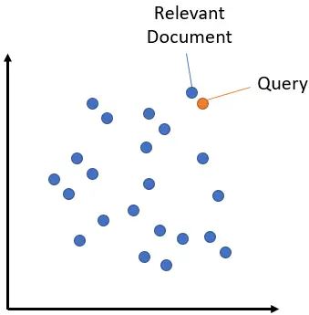
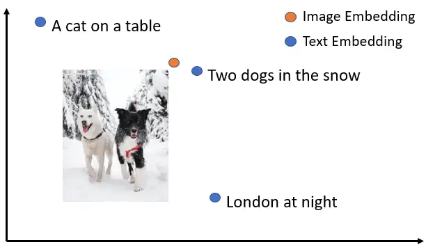
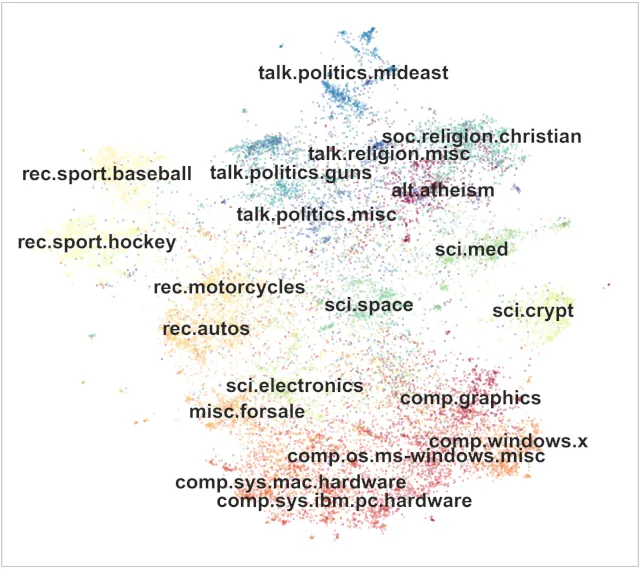

# SentenceTransformers 库介绍

SentenceTransformers 是一个可以用于句子、文本和图像嵌入的 Python 库。 可以为 100 多种语言计算文本的嵌入并且可以轻松地将它们用于语义文本相似性、语义搜索和同义词挖掘等常见任务。

该框架基于 PyTorch 和 Transformers，并提供了大量针对各种任务的预训练模型。 还可以很容易根据自己的模型进行微调。

阅读论文 Sentence-BERT: Sentence Embeddings using Siamese BERT-Networks，深入了解模型的训练方式。 在本文中，我们将看到该库的一些可能用例的代码示例。 模型训练将在后面的文章中介绍。

## 安装

在深入研究代码之前，使用 pip 安装 sentencetransformer 库。

pip install -U sentence-transformers

## 获得嵌入向量

第一个例子是如何获得句子嵌入。sentencetransformer 使它变得非常简单:只需要导入库、加载模型，并调用 encode 方法。

```python
from sentence_transformers import SentenceTransformer

# Download model
model = SentenceTransformer('paraphrase-MiniLM-L6-v2')

# The sentences we'd like to encode
sentences = ['Python is an interpreted high-level general-purpose programming language.',
    'Python is dynamically-typed and garbage-collected.',
    'The quick brown fox jumps over the lazy dog.']

# Get embeddings of sentences
embeddings = model.encode(sentences)

# Print the embeddings
for sentence, embedding in zip(sentences, embeddings):
    print("Sentence:", sentence)
    print("Embedding:", embedding)
    print("")
# Sentence: Python is an interpreted high-level general-purpose programming language.
# Embedding: [-1.17965914e-01 -4.57159936e-01 -5.87313235e-01 -2.72477478e-01 ...
# ...
```

## 语义文本相似度

一旦我们有了句子的嵌入，我们就可以使用 util 模块中的 cos_sim 函数来计算它们的余弦相似度。

```python
from sentence_transformers import SentenceTransformer, util

# Download model
model = SentenceTransformer('paraphrase-MiniLM-L6-v2')

# The sentences we'd like to compute similarity about
sentences = ['Python is an interpreted high-level general-purpose programming language.',
    'Python is dynamically-typed and garbage-collected.',
    'The quick brown fox jumps over the lazy dog.']

# Get embeddings of sentences
embeddings = model.encode(sentences)

# Compute similarities
sim = util.cos_sim(embeddings[0], embeddings[1])
print("{0:.4f}".format(sim.tolist()[0][0])) # 0.6445
sim = util.cos_sim(embeddings[0], embeddings[2])
print("{0:.4f}".format(sim.tolist()[0][0])) # 0.0365
```

## 语义搜索

语义搜索通过理解搜索查询的内容来提高搜索的准确性，而不是仅仅依赖于词汇匹配。这是利用嵌入之间的相似性完成的。

语义搜索是将语料库中的所有条目嵌入到向量空间中。在搜索时，查询也会被嵌入到相同的向量空间中，并从语料库中找到最接近的嵌入。



向量空间中语义搜索的例子。

语义搜索可以使用 util 模块的 semantic_search 函数来执行，该函数处理语料库中文档的嵌入和查询的嵌入。

```python
from sentence_transformers import SentenceTransformer, util

# Download model
model = SentenceTransformer('paraphrase-MiniLM-L6-v2')

# Corpus of documents and their embeddings
corpus = ['Python is an interpreted high-level general-purpose programming language.',
    'Python is dynamically-typed and garbage-collected.',
    'The quick brown fox jumps over the lazy dog.']
corpus_embeddings = model.encode(corpus)

# Queries and their embeddings
queries = ["What is Python?", "What did the fox do?"]
queries_embeddings = model.encode(queries)

# Find the top-2 corpus documents matching each query
hits = util.semantic_search(queries_embeddings, corpus_embeddings, top_k=2)

# Print results of first query
print(f"Query: {queries[0]}")
for hit in hits[0]:
    print(corpus[hit['corpus_id']], "(Score: {:.4f})".format(hit['score']))
# Query: What is Python?
# Python is an interpreted high-level general-purpose programming language. (Score: 0.6759)
# Python is dynamically-typed and garbage-collected. (Score: 0.6219)

# Print results of second query
print(f"Query: {queries[1]}")
for hit in hits[1]:
    print(corpus[hit['corpus_id']], "(Score: {:.4f})".format(hit['score']))
# Query: What did the fox do?
# The quick brown fox jumps over the lazy dog. (Score: 0.3816)
# Python is dynamically-typed and garbage-collected. (Score: 0.0713)
```

为了充分利用语义搜索，必须区分对称和非对称语义搜索，因为它会严重影响要使用的模型的选择。

## Paraphrase Mining

Paraphrase Mining 是在大量句子中寻找释义的任务，即具有非常相似含义的文本。

这可以使用 util 模块的 paraphrase_mining 函数来实现。

```python
from sentence_transformers import SentenceTransformer, util

# Download model
model = SentenceTransformer('all-MiniLM-L6-v2')

# List of sentences
sentences = ['The cat sits outside',
             'A man is playing guitar',
             'I love pasta',
             'The new movie is awesome',
             'The cat plays in the garden',
             'A woman watches TV',
             'The new movie is so great',
             'Do you like pizza?']

# Look for paraphrases
paraphrases = util.paraphrase_mining(model, sentences)

# Print paraphrases
print("Top 5 paraphrases")
for paraphrase in paraphrases[0:5]:
    score, i, j = paraphrase
    print("Score {:.4f} ---- {} ---- {}".format(score, sentences[i], sentences[j]))
# Top 5 paraphrases
# Score 0.8939 ---- The new movie is awesome ---- The new movie is so great
# Score 0.6788 ---- The cat sits outside ---- The cat plays in the garden
# Score 0.5096 ---- I love pasta ---- Do you like pizza?
# Score 0.2560 ---- I love pasta ---- The new movie is so great
# Score 0.2440 ---- I love pasta ---- The new movie is awesome
```

## 图片搜索

SentenceTransformers 提供允许将图像和文本嵌入到同一向量空间，通过这中模型可以找到相似的图像以及实现图像搜索，即使用文本搜索图像，反之亦然。



同一向量空间中的文本和图像示例。

要执行图像搜索，需要加载像 CLIP 这样的模型，并使用其 encode 方法对图像和文本进行编码。

```python
from sentence_transformers import SentenceTransformer, util
from PIL import Image

# Load CLIP model
model = SentenceTransformer('clip-ViT-B-32')

# Encode an image
img_emb = model.encode(Image.open('two_dogs_in_snow.jpg'))

# Encode text descriptions
text_emb = model.encode(['Two dogs in the snow', 'A cat on a table', 'A picture of London at night'])

# Compute cosine similarities
cos_scores = util.cos_sim(img_emb, text_emb)
print(cos_scores)
```

多模态模型获得的嵌入也允许执行图像相似性等任务。

## 其他任务

1、对于问答检索等复杂的搜索任务，可以通过使用 Retrieve & Re-Rank 显著改进语义搜索。


Retrieve & Re-Rank 架构

2、SentenceTransformers 可以以不同的方式用于对小或大的句子集进行聚类。



对文档进行主题建模示例

最后 SentenceTransformers 的官网：[https://www.sbert.net/](https://www.sbert.net/)

作者：Fabio Chiusano
