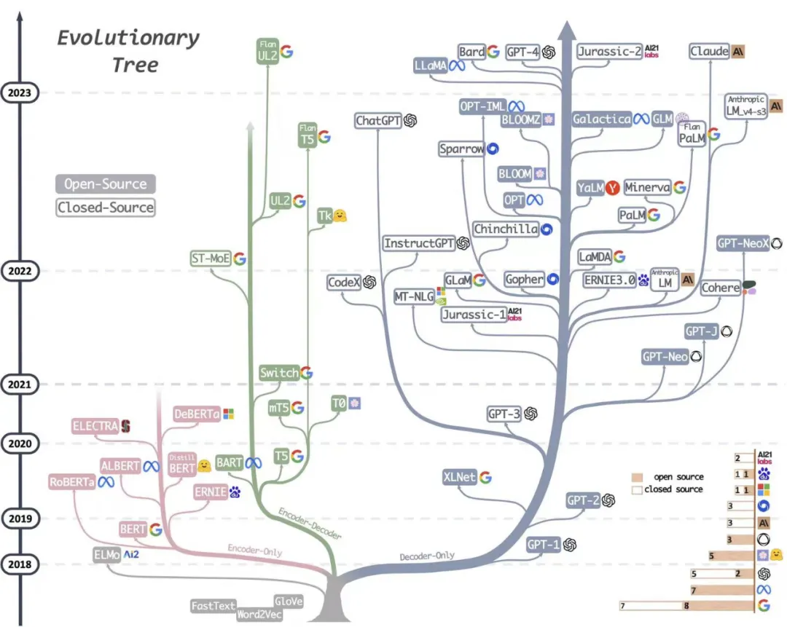
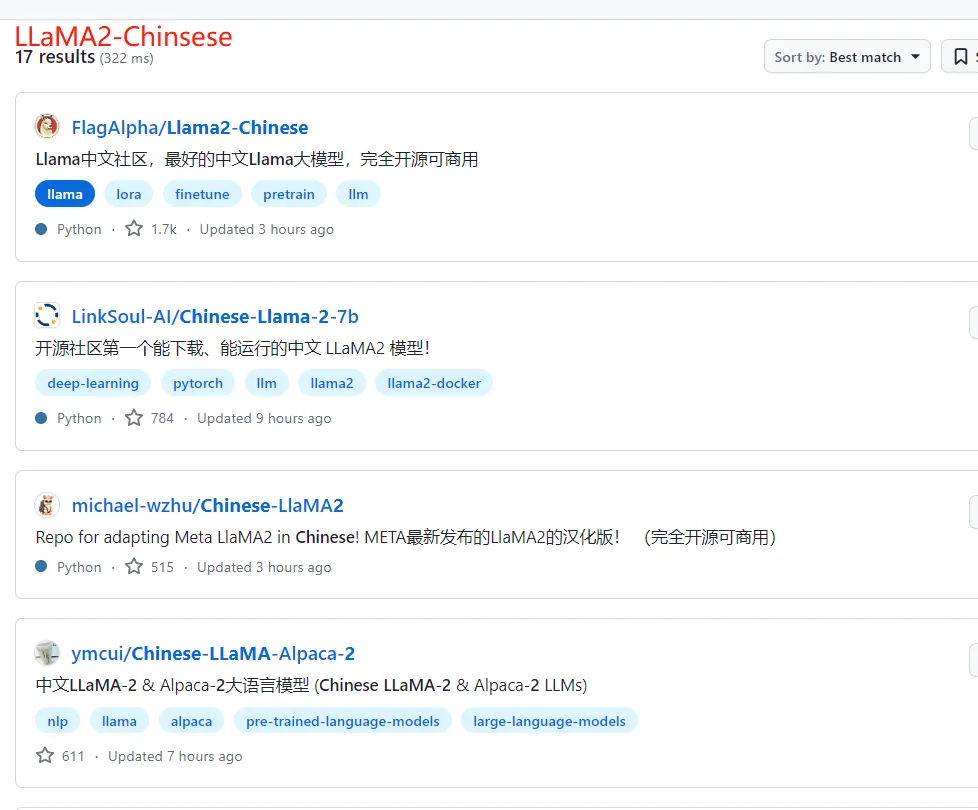
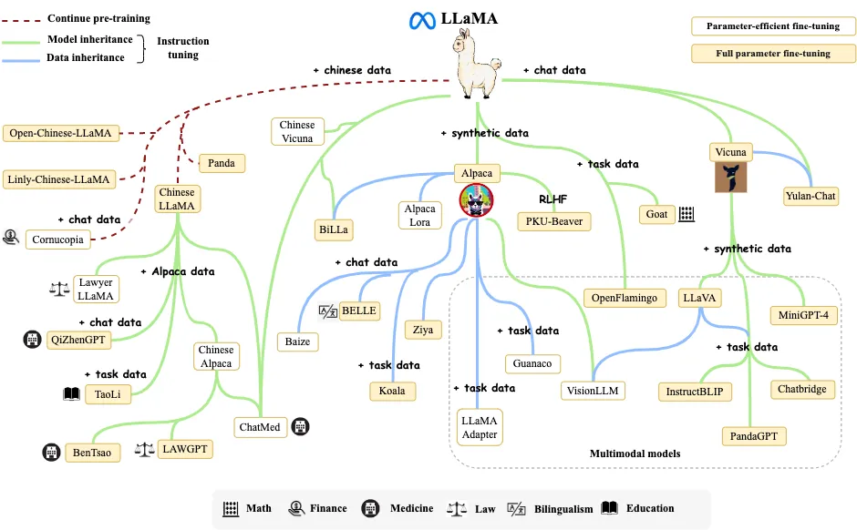
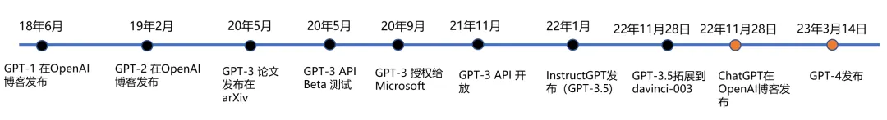
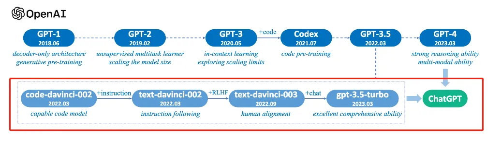

# 一文缕清所有大模型

---

夕小瑶科技说 原创  
  作者 | 王思若

最近，大型语言模型无疑是 AI 社区关注的焦点，各大科技公司和研究机构发布的大模型如同过江之鲫，层出不穷又眼花缭乱。

让笔者恍惚间似乎又回到了 2020 年国内大模型“军备竞赛”的元年，不过那时候大模型海量算力需求限制了这注定只是少数科技公司的赛场，如今用少量资源即可在基础模型上做指令微调、人类反馈以应用到某个垂直领域，**LLMs 领域当前呈现出‘吊诡’的繁荣，模型和数据集存储库 Hugging Face 中已经有近 16000 个文本生成模型，社区每周都会有数百个新的模型发布，Hugging Face 从 2022/12 到 2023/6 的六个月内就新增了 10 万个模型，一方面投资者鼓吹落地，似乎新的范式已到，另一方面，各色研究机构生怕赶不上潮流，都试图在大模型领域留下自己的一个身位。**

无论如何，舞台的聚光灯早已汇聚到大模型上，在这寸‘你方唱罢，我登场’的舞台上，笔者细捋一下大型语言模型的师承和脉络，略有偏颇，欢迎小伙伴在评论区留言补充~

**github 地址：**  
https://github.com/WangHuiNEU/llm

大模型可以分为基座模型和在基座模型上进行指令微调、人类反馈对齐等 instruction-tuning 之后的微调模型。但实际上，正如艾伦研究所的文章‘How Far Can Camels Go?’所指明的：不同的指令微调数据集可以释放或者增强特定的能力，但并没有一个数据集或者组合可以在所有的评估中提供最佳性能，因此，我们需要一个更大强大的基座模型。

**实际上，更简单的可以理解为，指令微调并不会为模型增加新的能力，基座模型本身奠定了应用的范畴，指令微调只是用极少量的数据快速激发出某个领域范畴的能力强弱。实际微调过一些大模型的小伙伴可能会对此感触颇深，因此，更加合理的大模型故事线是围绕基座模型。下面将针对 Google 系、Meta 系、OpenAI 系和其他科技公司的基座模型，和基于基座的一些微调模型进行详细展开。**

> 大模型的进化树

## 一、Google 系模型

Google 在大模型赛道一直是最受关注的存在，但尴尬的是，面对着 ChatGPT 的强势猛攻，占据搜索领域绝大部分份额的 Google 在新型的检索生成竞赛中不可能猛然转身去动其核心的搜索广告业务，但在大模型领域，Google 有着最为深厚的积累，例如，在 2017 年提出 Transformer 架构，2021 年提出的 Pathways 架构在笔者看来更是将工程优化推到了极致。

Google 原本分别有两个研究小组：Google Brain 和 Deepmind，但在今年 4 月合并为了 Google Deepmind，但这里依然分开去讲述。

## 1\. 基座模型

**Google Brain**

| 模型名称 | 时间    | 是否开源 | 参数规模 |
| -------- | ------- | -------- | -------- |
| T5       | 2019-10 | 是       | 13B      |
| LaMDA    | 2021-05 | 否       | 137B     |
| PaLM     | 2022-04 | 否       | 540B     |

有趣的是，LaMDA 是 Google 早在 2020 年就被开发和推出的对话式语言模型，但 Google 考虑安全问题拒绝对公众开放，**首席研究员 Daniel De Freitas 和 Noam Shazeer 因此沮丧地离开了公司【去年 9 月，这两位成立了基于 LLM 的聊天机器人网站 Character.AI，也算是一直坚持自己的目标了】，Google 在对话生成方向起了个大早，赶了个晚集，手动狗头~**

PaLM 是基于 Google 提出的高效模型训练的下一代 AI 架构 Pathways 构建的超大语言模型，5400 亿的参数量，是目前最大的稠密 Transformer 模型，也是目前综合性能最强大的基座语言模型。

**DeepMind**

| 模型名称   | 时间    | 是否开源 | 参数规模 |
| ---------- | ------- | -------- | -------- |
| Gopher     | 2021-12 | 否       | 280B     |
| Chinchilla | 2022-04 | 否       | 70B      |

Chinchilla 是 DeepMind 重新思考了大模型的 scaling laws(缩放定律)，实证研究分析得出数据规模和参数规模一样重要，因此，训练得到的 Chinchilla 用仅 Gopher1/4 参数量反而性能显著超越 Gopher，训练数据规模和训练参数一样重要！

**Google DeepMind**

| 模型名称 | 时间    | 是否开源 | 参数规模                |
| -------- | ------- | -------- | ----------------------- |
| PaLM 2   | 2023-05 | 否       | 340B(小道消息，未证实~) |

4 月，Google 决定集中力量办大事，Google Brain 和 DeepMind 合并为 Google DeepMind。5 月，谷歌 I/O 2023 大会，Google 提出了更为强大的 PaLM 2，合理的大模型缩放法则+多样化的数据集，PaLM 2 无疑是 Google 在这波浪潮中保持头部地位的底气所在。

## 2\. 指令微调模型

| 单位         | 模型名称                         | 基座模型                    | 是否开源 |
| ------------ | -------------------------------- | --------------------------- | -------- |
| Hugging Face | T0                               | T5                          | 是       |
| Google       | FLAN                             | T5                          | 否       |
| Google       | Flan-T5/Faln-PaLM                | T5/PaLM                     | 否       |
| Google       | **Bard(生成人工智能聊天机器人)** | 之前是 LaMDA，后面是 PaLM 2 | 否       |

基于基座模型，进行 instrucion-tuning 可赋予模型强大的对齐能力。这里有趣的是，**2 月 6 日，Google 宣布推出 Bard，这是一款由 LaMDA 提供支持的对话式生成人工智能聊天机器人，但刚开始推出时，相对于 ChatGPT 差劲的性能一度让 Google 的股价下跌了 8%，后续 Google 基于更强大的 LaMDA 做了改进，但无论内部和外部都质疑声不断，5 月，Google I/O 大会宣布基于 PaLM 2 模型对 Bard 做了更新。**

Bard 无疑是 Google 面对 ChatGPT 的回应，但检索广告占其总收入的 60%，Google 做不到像 Bing 一样直接将检索生成加入到浏览器结果中，。Google 在这里选择了不同的道路，将检索和 Bard 做成两款互补的产品，目前 Bard 也一直在 bard.google.com 这块小空间里圈地自萌，目前 Google 计划结合基于 AlpaGo 中使用的技术开发出更为强大的模型 Gemini。

## 二、Meta 系模型

Meta 可是所有巨头中最为拥抱开源的科技公司，Meta AI 基础人工智能研究院团队首席人工智能科学家 Yann LeCun 表示：让 AI 平台安全良善实用的唯一方法就是开源。当然，Meta 的开源模型也造福了国内绝大多数的大模型玩家们，再次手动狗头~

## 1\. 基座模型

| 模型名称 | 时间    | 是否开源 | 参数规模  |
| -------- | ------- | -------- | --------- |
| OPT      | 2022-05 | 是       | 125M-175B |
| LLaMA    | 2023-02 | 是       | 7B-65B    |

开源先行者 Meta 在 OpenAI 选择闭源 GPT-3 的情况下，对标 GPT-3，直接开源千亿参数的 OPT 模型，但 OPT 相对比 GPT-3 模型性能差一些。之后，启发于 DeepMind 发现的缩放法则，Meta 缩小了模型参数在更大的数据集上训练了 LLaMA(Large Language Model Meta AI)，130 亿参数的模型与 GPT-3 性能大致相当，650 亿参数的模型性能可以媲美 Chinchilla-70B 和 PaLM-540B，**大模型开启驼系（LLaMA）时代~**

## 2\. 指令微调模型

| 单位     | 模型名称 | 基座模型 | 是否开源 |
| -------- | -------- | -------- | -------- |
| Meta     | OPT-IML  | OPT-175B | 是       |
| Stanford | Alphaca  | LLaMA    | 是       |
| Stanford | Vicuna   | LLaMA    | 是       |

LLaMA 无疑最常被大家当做基座模型用来做指令微调适配到法律、医学等专业领域，特别是 7 月 19 日，Meta AI 发布可免费商用的开源模型 LLaMA 2, 包括 7B, 13B 和 70B 三种规模，动手快的已经用中文数据做了指令微调，例如，Llama2-chinese 几天时间 star 数飙升 1.7k，拼手速的时候到了~

> LLaMA 变体，图来源于《A Survey of Large Language Models

**LLaMA 的徒子徒孙们，有驼系（羊驼 Alpaca, 小羊驼 Vicuna），动物园系（考拉 Koala，山羊 Goat，熊猫 Panda），神话系（姜子牙 Ziya，白泽 Baize），逐渐从动物园走向了神话传说~**

## 三、OpenAI 系模型

## 1\. 基座模型

如果追溯 GPT 系列发展的时间线，我们会发现这是一项横跨五年的技术探索，从 GPT-2 到 GPT-3，其实也只是在几乎不改变模型框架的基础上从 15 亿的参数量迭代到 1750 亿，不同于 Google 推出 T5、Switch Transformer 和 PaLM 等一系列大模型的赛马机制，OpenAI‘矢志不渝’地坚持着 GPT 路线。

## 2\. 指令微调模型

2017 年 OpenAI 提出 RLHF(人类反馈强化学习，Reinforcement Learning from Human Feedback)技术；2022 年，OpenAI 将 RLHF 应用于 GPT-3 并开发出 InstructGPT，相对于 GPT-3 更善于遵循用户意图，虽然参数量只有 1.3B，比 175B GPT-3 模型参数少了 100 多倍，微调成本更是只有 GPT-3 的 2%。

**3 月 14 日，GPT-4 发布，OpenAI 给出了技术报告和 3 分钟的预告片。GPT-4 支持多模态，能够识图、生成歌词、做网站，并且刷爆了人类社会各个领域的考试，已经达到了哈佛、斯坦福等顶尖高校的水平。现已集成到微软 New Bing 和 ChatGPT Plus。**

**微软 Microsoft 365 全面引入生成式 AI 助手 Copilot，将 GPT-4 集成到了 Word、Excel、PowerPoint、Outlook 和 Teams 等应用中，用户可以提出问题并提示 AI 撰写草稿、制作演示文稿、编辑电子邮件、制作演示文稿、总结会议等。**

## 四、开源社区、研究院和一些科技公司构建的大模型

## 1\. 基座模型

为了打破 OpenAI 和微软对自然语言处理 AI 模型的垄断，前 OpenAI 研究副总裁 Dario Amodei 带领一批从 OpenAI 出走的员工创立了致力于提高 AI 安全和可解释性的人工智能安全和研究公司 Anthropic。

Connor Leahy、Leo Gao 和 Sid Black 创立了专注于人工智能对齐、扩展和开源人工智能研究的组织 EleutherAI。

之后 Hugging Face 社区带头成立了 BigScience 项目，这是一个包容、开放、协作共享的大型语言模型（LLM）社区，围绕研究和创建超大型语言模型的开放式协作研讨会，由 HuggingFace、GENCI 和 IDRIS 发起的开放式合作，汇集了全球 1000 多名研究人员。

**国内的包括北京智源人工智能研究院 BAAI、清华和百度等也都打造了自己的基座模型。**

| 组织                   | 模型名称           | 时间    | 是否开源 | 参数规模 |
| ---------------------- | ------------------ | ------- | -------- | -------- |
| Anthropic              | Anthropic-LM v4-s3 | 2021-12 | 否       | 52B      |
| 北京智源人工智能研究院 | 天鹰 Aquila        | 2023-06 | 是       | 7B/33B   |
| Baidu                  | ERNIE 3.0          | 2021-12 | 否       | 260B     |
| 清华                   | GLM                | 2022-8  | 是       | 130B     |
| EleutherAI             | GPT-Neo            | 2021-03 | 是       | 2.7B     |
| EleutherAI             | GPT-J              | 2021-06 | 是       | 6B       |
| EleutherAI             | GPT-NeoX           | 2022-04 | 是       | 20B      |
| BigScience             | BLOOM              | 2022-11 | 是       | 176B     |

## 2\. 指令微调模型

| 单位                   | 模型名称       | 基座模型           | 是否开源 |
| ---------------------- | -------------- | ------------------ | -------- |
| 北京智源人工智能研究院 | AquilaChat-7B  | Aquila-7B          | 是       |
| 北京智源人工智能研究院 | AquilaChat-33B | Aquila-33B         | 是       |
| BigScience             | BLOOMZ         | BLOOM              | 是       |
| EleutherAI             | GPT-NeoX       | GPT-Neo            | 是       |
| Baidu                  | 文心一言       | ERNIE 3.0          | 否       |
| Anthropic              | Claude  2      | Anthropic-LM v4-s3 | 否       |

## 总结

本文总结了主流的基座模型以及对应的指令微调模型，希望社区的小伙伴多多讨论，一起努力构建更为强大的中文社区的语言模型~
