# 初探 LLM 基座模型

---

## 开篇

大家好，我是小 A。今天给大家带来本系列的第二篇内容，主要介绍 LLM 基座模型里常见的 3 种 transformer 架构，encoder-only，encoder-decoder 和 decoder-only

## NLP 任务速览

在深入介绍 LLM 网络结构之前，我们先简单了解一下 NLP (Natural Language Processing)都包含了哪些任务。主要包含 3 大类任务

- 自然语言理解任务(NLU, Natural Language Understanding)。特点是能看到完整上下文信息，然后做广义分类任务，典型任务如文本情感分析，词性标注，信息检索等。
- 有条件自然语言生成任务(conditioned-NLG, Natural Language Generation)。特点是 seq2seq，典型任务例如机器翻译，自动摘要等。
- 无条件自然语言生成任务(unconditioned-NLG)。特点是开放性的句子生成，典型任务如问答系统(QA)、对话机器人(ChatBot)等。

一开始针对不同任务会使用不同的模型，后来发现 NLG 任务能通过 in-context learning + prompt 来完成 NLU 任务，于是逐渐收敛到了 NLG 任务。

## 评价指标

从上一篇可以知道，entropy-like 指标(如 cross-entropy 指标)常常运用在训练过程中，表征模型的收敛情况，同时也可以用于测试集的简单评估(如 Perplexity 指标等)。但对于丰富复杂的下游应用来说，这几个指标远远不能满足需求。

如果想从第一性原理出发推导出所有指标，这并不现实。下面参考 HELM 论文的中内容，简单列举了 NLP 中的指标，大家不必深究，有个简单印象即可。

- 正确性 Accuracy。

- 信息检索任务。NDCG@K 指标，核心衡量最相关文档是否排序足够靠前的指标。
- 摘要任务。一般用 ROUGE 指标，ROUGE 是个指标体系，有 4 个大类，其中最简单的为 2-gram 的方式，即 ROUGE-2。就是把两个 sequence 按 2-gram 的方式做切分做频次统计，然后计算 pred 和 gt 之间的召回率
- 文本生成任务。Bits-per-Byte，类似于 Perplexity 指标

- 不确定性 Calibration and Uncertainty。

- 针对二分类任务，一般用 ECE 指标(Expected Calibration Error)。核心是度量模型输出概率 p 的时候，最终正确率真的为 p 的一致性。

- 鲁棒性 Robustness。分为两种

- invariance。加入不改变语义的噪声，如果大小写变换，加入错别字 typo 等
- equivariance。利用 contrast set，做语义改变，例如修改关键单词和短语把一个正面的评论改成负面的评论

- 公平性 Fairness。看模型输出是否公平，例如把性别和人种等换一下，看输出是否有变化
- 偏见程度 Bias and stereotypes。看模型有没有偏见和刻板的印象，例如看模型对亚洲人是否存在“学习好并且会谈钢琴”的偏见
- 有毒性 Toxicity。看模型输出是否有毒。

对 NLP 有了基本认知后，下面祭出一个广为流传的图，这张图信息量比较大，其中最重要的观察就是分成了三支明显分叉，从左到右分别是

- 粉色分支，Encoder-only 框架(也叫 Auto-Encoder)，典型代表如 BERT 等
- 绿色分支，Encoder-decoder 框架，典型代表如 T5 和 GLM 等
- 蓝色分支，Decoder-only 框架(也叫 Auto-Regressive)，典型代表如 GPT 系列/LLaMa/PaLM 等

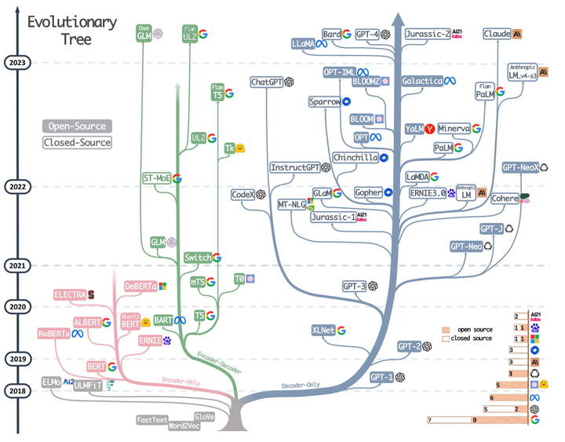

Harnessing the Power of LLMs in Practice

刚听这三种框架名称可能会有点懵逼，不用担心，先感性认识一下。如下所示

- 横轴代表了输入 token，纵轴代表相对应每个位置的输出 token
- 左图为 encoder-only，输出 token 都能看到所有输入 token。例如 y1 这一行可以看到 x1∼x5 输入
- 中图为 decoder-only，输出 token 只能看到历史的输入 token。例如 y3 这一行只能看到 x1∼x3 输入，x4 和 x5 并不能看到
- 右图为 encoder-decoder，前 k 个输出 token 可以看到所有 k 个输入 token，从 k+1 的输出 token 开始只能看到历史的输入 token。例如 y1 能看到 x1∼x3 输入(y3 也可以)，而 y4 开始只能看到 x1∼x4 输入

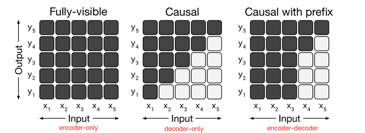

_PS: 这里为了方便理解，encoder-decoder 简化使用 causal with prefix 示意，具体详见 encoder-decoder 章节_

这三种结构不同的 LLM，往往擅长处理不同的任务，信息总结如下

|                      | NLU 任务                         | conditioned-NLG 任务 | unconditioned-NLG 任务 | 典型代表            |
| -------------------- | -------------------------------- | -------------------- | ---------------------- | ------------------- |
| Encoder-only 架构    | 效果最好                         |                      |                        | BERT                |
| Encoder-decoder 架构 |                                  | 效果最好             |                        | T5 和 GLM           |
| Decoder-only 架构    |                                  |                      | 效果最好               | GPT 系列/LLaMa/PaLM |
| 典型代表             | 文本情感分析，词性标注，信息检索 | 机器翻译，自动摘要   | QA，ChatBot            |                     |

## Encoder-only (BERT)

虽然 GPT1 出现的时间比 BERT 早，但 BERT 的影响力貌似更大一下，所以我们以 BERT 为引子介绍 transformer 的基本结构

### gemm-like 算子

宏观上看 BERT 的结构非常简单，Base 和 Large 模型分别由基础的 transformer block 重复 12 次和 24 次组成

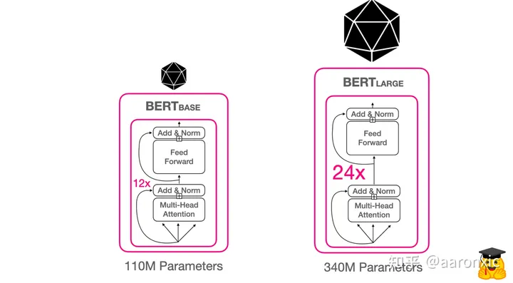

BERT-base 和 BERT-large

transformer block 详细结构网上资料很多，这里尝试从数据流角度进行介绍。如下所示，主要由三种结构组成

- MHA(Multi-Head Attention)，多头注意力模块，下图绿色部分。
- Add&Norm，归一化模块，下图蓝色部分。
- FFN，前馈网络模块，下图粉色部分

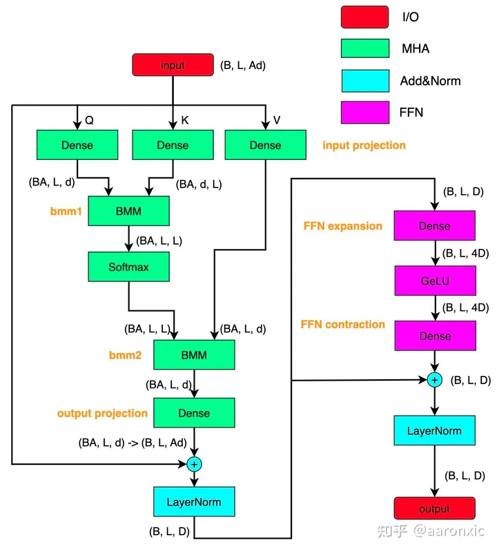

BERT transformer block

下面把 gemm-like 的算子的参数进行了汇总，其中 B 为 batch_size，L 是 seq 长度，A 是 head 数量，d 是每个 head 的 feature 维度，同时注意 D\=Ad

| 所属模块 | 名称              | 算子类型     | input shape | weight shape | output shape               | 其他说明                   |
| -------- | ----------------- | ------------ | ----------- | ------------ | -------------------------- | -------------------------- |
| MHA      | input projection  | dense        | (B, L, Ad)  | (Ad, 3Ad)    | (B, L, 3Ad) →(3, BA, L, d) | 输出会进行 transpose+split |
| MHA      | bmm1              | batch_matmul | (BA, L, d)  | (BA, d, L)   | (BA, L, L)                 | weight shape 做转置        |
| MHA      | bmm2              | batch_matmul | (BA, L, L)  | (BA, L, d)   | (BA, L, d) → (B, L, Ad)    | 输出会进行 transpose       |
| MHA      | output projection | dense        | (B, L, Ad)  | (Ad, Ad)     | (B, L, Ad)=(B, L, D)       |                            |
| FFN      | FFN expansion     | dense        | (B, L, D)   | (D, 4D)      | (B, L, 4D)                 | 维度扩增到 4D              |
| FFN      | FFN contraction   | dense        | (B, L, 4D)  | (4D, D)      | (B, L, D)                  | 维度缩减回 D               |

根据上表不难算出单个 transformer block 的参数量和计算量的公式

- 参数量：3D2+D2+4D2+4D2\=12D2 (注意只有 dense 算子才有参数)
- 计算量：12BLD2+2BDL2\=12LD2+2DL2 (假设 B=1)

可以发现参数量和计算量跟 head 数量无关，head 划分更多是通过特征子空间划分提高精度，而不是为了节省参数量或者计算量

当我们把具体 L 和 D 代入表达式，可以得到 BERT-base 和 BERT-large 的参数量 (单词本每个单词特征长度为 D)

|            | 特征维度 D | block 数量 L | 单词本大小 | 总参数量                          |
| ---------- | ---------- | ------------ | ---------- | --------------------------------- |
| BERT-base  | 768        | 12           | 30k        | 12\*768\*768\*12+30k\*768=108M    |
| BERT-large | 1024       | 24           | 30k        | 12\*1024\*1024\*24+30k\*1024=333M |

### LayerNorm

**Post-Norm 和 Pre-Norm**

BERT 当时使用的是 Post-Norm 的结构，同时期的 GP1 也是用该结构，后来的 GPT2 使用 Pre-Norm。

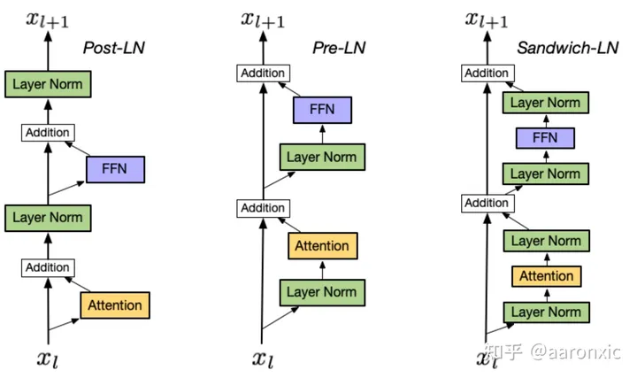

Post-LN vs. Pre-LN vs. Sandwich-LN

Pre-Norm 比 Post-Norm 参数更好调，但是最终模型精度要比 Post-Norm 略差。对于这一现象的解释，可以从下面问题开始思考

问题：对于 $x+F(x)$ 结构，应该在哪儿插入 normalization？

方法 1(Post-Norm)：朴素方法，在做完残差的时候 norm，即 $x_{t+1}=Norm(x_t+F(x_t))$

方法 2(Pre-Norm)：懒癌思维，在用到的时候再 norm，即 $x_{t+1}=x_t+F_t(\text{Norm}(x_t))$

递推式展开前，先熟悉一下 Norm 的计算公式，假设 $x$ 和 $y$ 是相互独立的均值为 0，方差为 1 的随机变量

$$
\text{Norm}(x + y) = \frac{x + y - \mathbb{E}(x + y)}{\sqrt{\text{Var}(x + y)}} = \frac{x + y - \mathbb{E}(x) - \mathbb{E}(y)}{\sqrt{\text{Var}(x) + \text{Var}(y)}} = \frac{x + y}{\sqrt{2}}
$$

将方法 1 的递推公式按上式化简，得到

$$
x_{t+1} = \frac{x_t + F_t(x_t)}{\sqrt{2}} = \frac{x_t}{\sqrt{2}} + \frac{F_t(x_t)}{\sqrt{2}}
$$

递归展开最终可以得到

$$
x_t =\frac{x_0}{2^{t/2}} +\frac{F_0(x_0)}{2^{t/2}} +\frac{F_1(x_1)}{2^{(t-1)/2}} +\frac{F_2(x_2)}{2^{(t-2)/2}} +\cdots +\frac{F_{t-1}(x_{t-1})}{2^{1/2}}
$$

可以看出底层远古的 feature 被衰减得很厉害，例如缩小了 2t/2 倍，这样导致残差这个通道名存实亡，网络比较难训练，因此解释了 Post-Norm 参数难调。

同理将方法 2 的递推公式展开，可以得到

$$x_t = x_0 + F_0(x_0) + F_1(x_1\sqrt{2}) + F_2(x_2\sqrt{3}) +\cdots + F_{t-1}(x_{t-1}/\sqrt{t})$$

可以看出

- 输出的方差会很大，因此需要在输出加个额外的 LayerNorm (GPT2 的设计)
- Pre-Norm 把网络的实际深度变浅了，并且增加了宽度
- Pre-Norm 的网络层数是有水分的，这个可能是导致模型最终精度不如 Post-Norm 的原因。

两种 Norm 的特点总结如下

- Post-Norm 会削弱残差的作用，深度保持，但是收敛和调参困难
- Pre-Norm 会将网络变成浅且宽的结构，收敛容易，但是精度会有一定损失

**Sandwich-Norm**

除了上述两种 Norm 的位置，还有一种 Sandwich-Norm，就是基于 Pre-Norm 再加一个

**Deep-Norm**

后来基于 Post-Norm 做了改进，出现了 Deep-Norm，能训练 1000 层的 Transformer。这里的 α 和 β 超参的选取，作者给了经验表格直接使用即可

```python
def deepnorm(x):
	return LayerNorm(x * alpha + f(x))

def deepnorm_init(w):
	if w is ['ffn', 'v_proj', 'out_proj']:
        nn.init.xavier_normal_(w, gain=β)
    elif w is ['q_proj', 'k_proj']:
        nn.init.xavier_normal_(w, gain=1)
```

除此之外，LayerNorm 有个容易使人困惑的就是具体计算过程

- 在 CV 里面，对于输入为 (B, C, H, W)的 feature，LayerNorm 是沿着 CHW 做 reduce，最后输出(B, 1, 1, 1)的 mean 和 std
- 在 CV 里面，对于输入为 (B, C, H, W)的 feature，InstanceNorm 是沿着 HW 做 reduce，最后输出(B, C, 1, 1)的 mean 和 std
- 在 NLP 里面，对于输入为(N, L, D)的 feature，LayerNorm 是沿着 D 做 reduce，最后输出(N, L, 1)的 mean 和 std。并且最后的 gamma 和 beta 是(1, 1, D)维度的。

由上可见，NLP 语境下的 LayerNorm，其实是 CV 里面的 InstanceNorm

据此我们已经了解

- 3 种 norm 的摆放位置，Post-Norm、Pre-Norm 和 Sandwich-Norm
- 2 种 norm 方法，LayerNorm 和 DeepNorm

### GeLU 激活函数

GeLU (Gaussian Error Linear Unit)大家应该比较熟悉了，中文名为高斯误差线性单元，出发点是受到了 RELU 和 dropout 的启发

- RELU 是激活小的时候乘以 0
- dropout 是随机乘以 0
- GeLU 就是概率性的乘以 0 (但是跟 dropout 不同，用确定性的表达式给出)

假设 $X$ 是服从标准高斯分布的随机变量，则

\[ GeLU(x) = x P(X \leq x) = x \Phi(x) = x \cdot \frac{1}{2} [1 + erf(x/\sqrt{2})] \]

其中

\[ erf(z) = \frac{2}{\sqrt{\pi}} \int\_{0}^{z} e^{-t^2} dt \]

这里 $P(X \leq x)$ 的意思就是把高斯概率密度函数积分到 $x$ ，如果 $x$ 越小，这个积分值就越小。

- 当 $x=-\infty$ 的时候 $P(X \leq x)=0$
- 当 $x=\infty$ 的时候 $P(X \leq x)=1$

函数形状如下左图所示，一般部署用 tanh 做逼近，如下右图所示

\[ x \Phi(x) \approx \frac{1}{2} x [1 + tanh(\sqrt{\frac{2}{\pi}} (x + 0.044715x^3))] \]

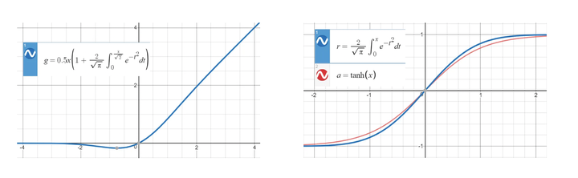

### Attention Softmax

MHA 的核心公式是两个 BMM 夹着 Softmax（简称三明治结构），如下所示

\[ \text{Attention}(Q, K, V) = \text{softmax}\left(\frac{QK^T}{\sqrt{d_k}}\right)V \]

这里有個比较有趣的操作是除以$\sqrt{d_k}$，也就是除以 feature dim 的平方根，其实这一步的重要性容易被低估，原因推导如下。

容易知道$QK^T$的每个元素是由$d_k$次乘累加得到的，假设 Q 和 K 本身每个元素已经是 0 均值和 1 差值的，那么 attention 矩阵每个元素的均值为 0，方差为$d_k$

\[ Var(QK^T) = Var(\sum_i^{d_k} q_i k_i) = \sum_i^{d_k} Var(q_i)Var(k_i) = d_k \]

由高斯分布的性质知道大部分能量在 3σ 之内，也就是$[-3\sqrt{d_k}, 3\sqrt{d_k}]$之间，如果$d_k=64$，则可以得到高斯分布的范围是$[-24, 24]$，这个在 softmax 作用下大小天差地别，贫富差距过大，例如$e^{-24}$和$e^{24}$，这不利于模型收敛。

为了为了让$QK^T$的输出方差在合理的区间内，需要除以$\sqrt{d_k}$

此外这个 bmm-softmax-bmm 三明治结构对于 transformer 的加速至关重要，相关工作也比较多，例如 FastTransform 和 FlashAttention 等，在后面 TVM 量化和部署章节会作更多的介绍

### Tokenization

分词，是 NLP 任务一切美好故事的开始，就像 CV 里面光子经过 ISP 成像变成像素值一样。但确定分词的颗粒度却不是一件容易的事情，早期有 word-base 和 character-base 两种，但是

- word-base，单词种类太多，单词本会太大
- character-base，序列太长，单词本字母没有语义

于是出现了 trade-off 的方法，就是 sub-word base，拆分成 sub-word 的原则是

- 把不频繁出现的单次拆成更加频繁出现的部分
- 不要把频繁的单词拆开成若干部分

Byte-Pair Encoding (BPE)是当前 SOTA 的 LM 模型常用的分词方法

- 从字母开始，统计频率，生成最初的单词表，并且把单词的结尾用分割开
- 统计两两字母，把出现频率最高的组成 pair 然后添加到词表中，同时更新原来单个字母的频率
- 依次类推，直到词表数量达到预设值
- 详细推导过程参见[这里](https://towardsdatascience.com/byte-pair-encoding-subword-based-tokenization-algorithm-77828a70bee0)

BERT 使用的是 Wordpiece，属于 BPE 的改进版，都是 sub-word 分词器，一般认为 $ 1 \text{ token } \approx 0.75 \text{ word} $

此外 BERT 使用了长度为 30k 的单词本，每个 token 是长度为 D 的可学习向量

### Position Encoding

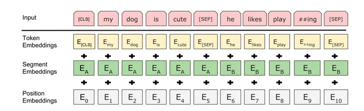

由于 transformer 的 attention 本身对 token 的位置是无感的，但是 LM 中的 token 是有序的，因此需要把位置信息植入 transformer 结构，这就是位置编码的作用。早期位置编码用的是绝对编码方案，就是对每个 token 位置赋予一个静态唯一的向量描述，例如三角式位置编码和可学习位置编码

原始 transformer(attention is all you need)里面用的是三角式位置编码

- 这有点傅里叶频谱变换的味道，希望用若干组 cosine 和 sine 函数来代表不同的特征维度(类比频率)
- 例如 BERT-base 里面 dim=768，就用 384 组三角函数来表述
- 每一组三角函数的频率，固定从$(2π, 10000·2^n]$的等比数列(注意左右开闭)，因此公比
  \[ q = 10000^{1/d} \]
- 第 k 组的频率$f_k = 2π·10000^{2k/d}$，其中$k = 1, \cdots, d/2$
- 第 k 组的角频率$w_k = 2π/f_k = \frac{1}{10000^{2k/d}}$
- 最终可以得到第 t 个 token 在 feature dim 的第 k 组的三角式位置编码为
  \[ f^i(t) =
  \begin{cases}
  sin(\frac{1}{10000^{2k/d}} t), & if i = 2k \\
  cos(\frac{1}{10000^{2k/d}} t), & if i = 2k + 1
  \end{cases}
  \]

想对三角式绝对编码有更深刻的理解可以参考博文

BERT 使用的是可学习的位置编码，预设的位置个数是 512，因此最大序列长度为 512

### BERT 训练

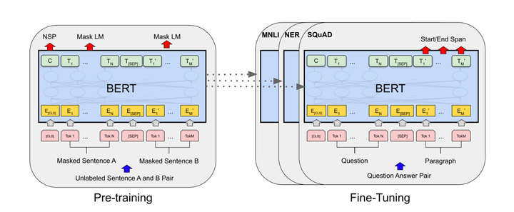

BERT Pre-training & Fine-Tuning

BERT 在无监督预训练的时候用了两种任务

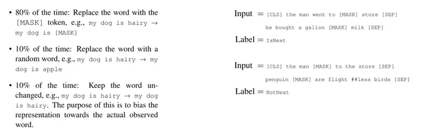

BERT Pre-training Tasks

- Masked LM 任务，遮住部分词，让网络看到上下文预测这个词。
- Next Sentence Prediction 任务，判断两个句子是否为紧挨着的两句话。

在 Finetune 阶段复用预训练的网络权重

- 分类的话可以用\[CLS\]的向量接 softmax 层做监督
- 更复杂的任务可以用对应单词输出的向量接 softmax 做监督

### BERT 短板

BERT 训练简单，但个人认为有以下两个短板

- 短板 1：对连续的 Mask Token 处理的不好
- 短板 2：没法直接用于做变长的文字生成的任务

后面我们会看到后面 encoder-decoder 架构如何基于这两个问题做改进的

## Encoder-Decoder

从 BERT 的介绍我们已经知道了 encoder-only 就是所有输出 token 都能看到过去和未来的所有输入 token，这个对于 NLU 任务天然友好，但是对于 seq2seq 任务，如机器翻译，这个结构就不是特别匹配，因为比较难直接用做翻译结果的生成

一种直接的办法就是加上 decoder 做预测生成，这就形成了 encoder-decoder 架构，如下所示

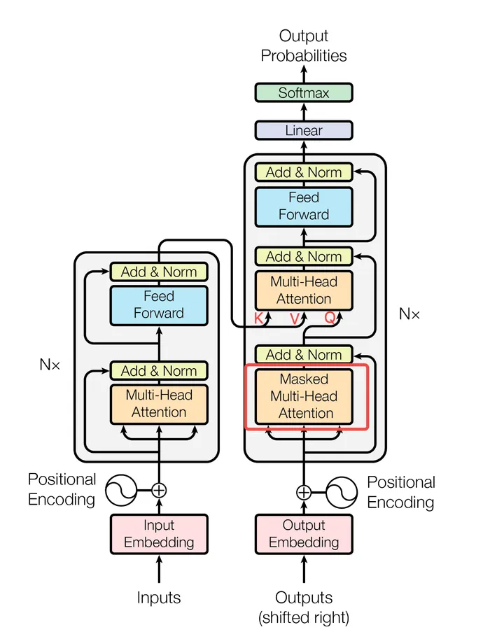

Classic Transformer Block

- decoder 第一个 MHA 变成 masked-MHA，使用的是前文 casual 的 attention mask 的方式，这样每个当前输出 token 只能看到过去生成的 token
- decoder 新增第二个 MHA，并且 K 和 V 来自于 encoder 的输出，这样就实现了看到原始输入的全文

至此我们可以梳理一下 encoder-decoder 的两种方式

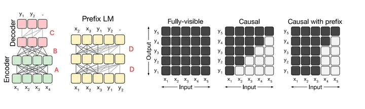

- 两者分离，标准的原始结构。其中 A 和 B 用的是 fully-visible 的 attention mask，C 是 casusal 的 attention mask
- 两者融合，前半部分是 fully-visible 的，后半部分是 casual 的。其中 D 就是 casual with prefix 的 attention mask。

### T5

T5(Text-to-Text Transfer Transformer) 是第一种 encoder-decoder 典型工作代表之一，出品方是 google，核心贡献有两个

- 把 4 种 NLP 任务都定义成了 text-to-text 问题，即输入 text，输出 text，包括了机器翻译，QA，摘要生成和文本分类
- 提出了 C4(Colossal Clean Crawled Corpus) 数据集，750G

整体使用如下所示

- 通过前置 prompt 指令的方式提示模型做相应的输出，其中 cola 和 stsb 都是 GLUE 里面的 9 个数据集中的一个。GLUE 数据集是经典的 NLU 数据集。

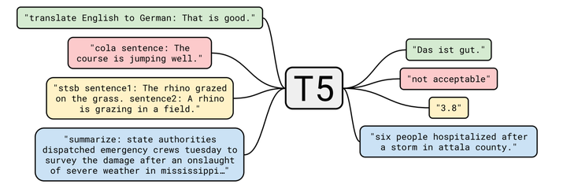

在网络结构上，相比于标准的 Transformer，做了几点改进

- 把 LayerNorm 和 FNN 的 dense 的 beta 去掉了，据说能使网络训练更稳定
- 把 LayerNorm 从残差结构外面挪到了里面，但是放在了 MHA 后面，而不是 pre-norm 一样放在 MHA 前面
- 用了简单的相对位置编码，最远 128 个 token

训练过程分为预训练和 finetune 两个阶段，如下所示

- 预训练借鉴了 SpanBERT 的方式，就是把若干连续的 token 给 mask 掉，替换成哨兵 token$\text{<M>}$，然后要求 decoder 对这些哨兵 token 的位置做预测
- finetune 阶段混合了多个任务，在原始训练样本前面打上任务 prefix 后直接训练

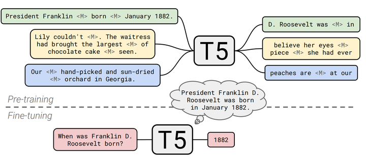

T5 Pre-training & Fine-tuning


### GLM-130B

GLM(General Language Model)是清华提出的基座模型，属于 Prefix LM 方式。作者说出发点是

- 希望能同时在 3 种 NLP 任务上达到最优
- 也不想引入原始 encoder-decoder 成倍的计算量代价

换个角度理解，我认为该论文出发点是改进 BERT，想解决 BERT 的两个短板

- 短板 1：对连续的 Mask Token 处理的不好 → 干脆把连续的 Mask Tokens 合并成一个 token $[M]$ token
- 短板 2：没法直接用于做变长的文字生成的任务 → 对$[M]$位置进行任意长度的展开

于是得到解体思路为，先用双向网络 encoder 对题干(prompt)审题，然后通过 decoder-only 的方式把题干中 $[M]$位置做展开作答。最终的网络形式很像权值共享版本的 encoder-decoder，这样计算量也降下来了。

具体做法如下所示，关键是构造 seq A 和 seq B

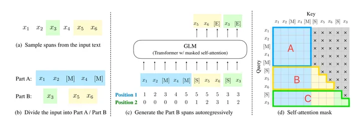

- 从 seq A 里面采样出若干组连续的 token，设置成 Mask 字符[$M$]。如下图所示，原始文本$x_1 x_2 x_3 x_4 x_5$中的$x_3$和$x_5 x_6$分别用[$M$]替换，变成$x_1 x_2 [$M$] x_4 [$M$]，这就是 seq A

- 把 seq A 中所有[$M$]位置的 token 顺序打乱，并且添加前缀[$S$]。例如$x_3$和$x_5 x_6$顺序交换，加上前缀最终得到新的序列[$S$] $x_5$ $x_6$ [$S$] $x_3$，这个就是 seq B

- 把 seq A 和 seq B 连接起来，seq A 内部 attention 是双向的，如上右图(d)的 A 部分。seq B 是单向的，能看到 seq A 的信息，但是看不到 seq B 后面的信息，如上图右图(d)的 B+C 部分。

正确的标签来自于原始文本里面的下一个 token，注意每组的结朿要求输出[$E$]字符，代表当前组终止

位置编码采用的是 2 层层次编码

- Position 1 代表字符在原始文本中的位置下标，注意同一个[$M$]组内的字符用[$M$]在 seq A 的下标表示

- Position 2 代表组内的相对偏移，对 seq A 而言默认是 0

此外根据 Mask token 的数量多少可以自由设置单词(MASK，句子(sMASK)，文档(gMASK)三种 MASK 方式

下游任务要 finetune 的时候，如下所示

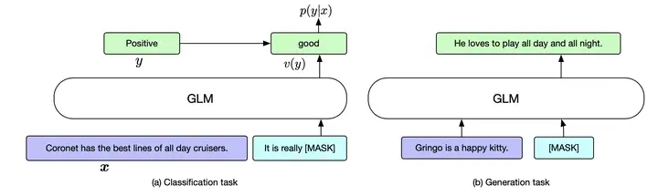

GLM fintune

- 如果是分类任务，那么添加模板句子，例如感情分类用 It is really [$M$]，seq B 对[$M$]位置做分类 token 预测

- 如果是生成任务，那么直接在 seq A 最后 pad 上[$M$]即可，seq B 对[$M$]位置做续写，达到生成文本的目的

GLM-130B 是比较晚出现的模型，用了比较新技术

- 使用了 Post-Deep-Norm 的归一化方法
- 使用了 GeGLU 的激活函数

**GeGLU 激活函数**

下面介绍一下 GeGLU 激活函数，由 GeLU 和 GLU 两部分组成。其中 GLU(Gated Linear Unit)是双线性函数，通用表达式为

\[ GLU(x,W,V,b,c) = \sigma(xW+b)\otimes(xV+c) \]

其中$\otimes$代表了逐元素乘法。可见第一个是 sigmoid 激活，第二个是线性，于是 GeGLU 就是把第一个 sigmoid 换成 GeLU

\[ GeGLU(x,W,V,b,c,\beta) = GeLU(xW+b)\otimes(xV+c) \]

### UL2

UL2(Unifying Language Learning Paradigms)是 T5 的改进型，同样属于 encoder-decoder

UL2 跟 GLM 有点相似，继续把 masked-span 的范式发扬光大和统一建模，抽象出了 3 个变量对 masked-span 进行参数化

span 长度，一种

- $\mu$ 为每个 span 的平均 token 个数
- span 个数，二选一
- $r$ 为出现 masked-span 的概率
- $n$ 为 masked-span 的个数

有了参数化后的 masked-span，作者又提出了 3 种 mask 方式，分为 R-Denosier，S-Denosier 和 X-Denosier，如下所示

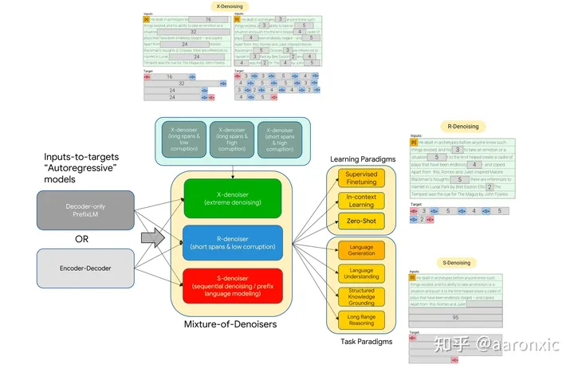

假如输入序列长度为 $L$， 上述 3 种 mask 情况参数化表达为

- R-Denosier。Regular Denoising，模拟 T5 的方式。span 长度 $\mu = 3 or 8$，span 发生概率是 $r = 0.15$
- S-Denosier。Sequential Denoising，模拟 decoder-only 的方式。span 长度 $\mu = L / 4$，span 个数 $n = 1$
- X-Denosier。Extreme Denoising，模拟受限信息下生成长序列，介于 R-Denosier 和 S-Denosier 之间。span 长度 $\mu = 3 or 8 or 64$，span 发生概率 $r = 0.5$

## Decoder-only

最后我们来看一下当今红得发紫紫得发黑的 decoder-only 家族，明显可以看到也是枝繁叶茂最为粗壮的一支。该家族的大模型种类非常多，本文更多是侧重是 LLM 基座模型相关的内容，所以指令微调、奖励模型(Reward Model)和 RLHF 相关的将在下一篇“ChatBot 是怎么炼成的?”中展开。

### GPT 系列

首先来看看来自 OpenAI 的扛把子模型 GPT 系列，这篇[文章](https://www.notion.so/GPT-3-5-360081d91ec245f29029d37b54573756%3Fpvs%3D21)很详细的梳理了 GPT 各个模型的关系，这里把关键路径用蓝色框标记出来。可见这都是 GPT3 之后的工作，这些调教过程一般称为 alignment，目的是让机器按照人的习惯来交流，逐渐从 LLM 模型基座变成 ChatBot。

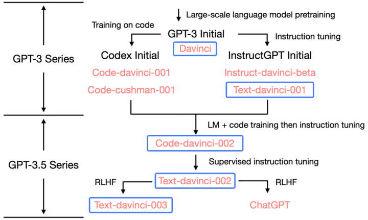

下面我们看看奠基性工作 GPT1/GPT2/GPT3 中的 transformer 结构有啥变化。很遗憾其实变化很少，主要就是从 Post-Norm 转到 Pre-Norm，最后加了一个 LayerNorm 输出。借用[这里](https://blog.csdn.net/weixin_36378508/article/details/121809595)的图。

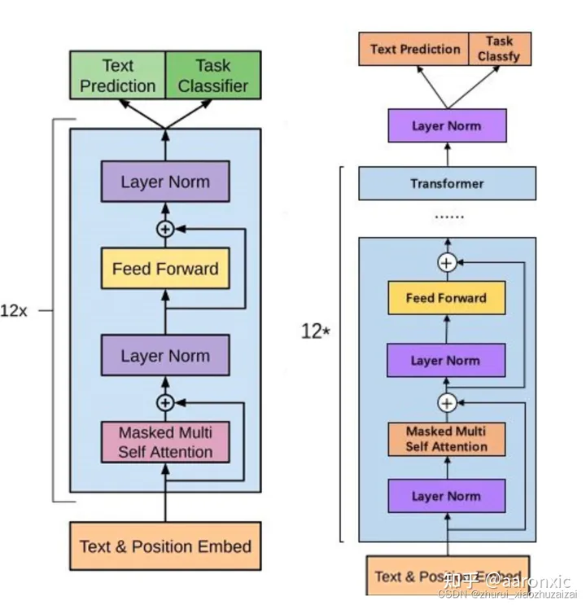

GPT1/2/3 更多探究的是如何更好的达到生成的效果。GPT2 尝试用 zero-shot 解决问题，但发现实在太难了，于是 GPT3 开始转向用 few-shot 来解决问题

decoder-only 有个值得说的特点是推理可以使用 KV-cache 技术，原因是 casual attention mask 可以让历史不可改变，只需要把 past 的 attention 矩阵存下来，新来 token 只需要计算新的一行，列直接填充-inf 即可。(当然这个也带了灾难性的低计算访存比，增加了部署加速难度)

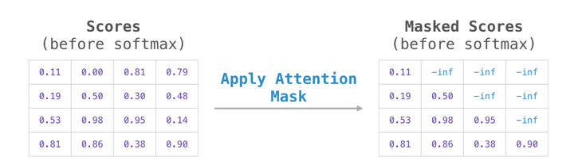

decoder-only attention mask

GPT 从 3.5 开始才真正的大放异彩，详情将在下一篇“ChatBot 是怎么炼成的?”中展开。

### LLaMA

Meta 可谓是 LLM 开源一哥，LLaMA 是其代表作，一共有 4 个模型尺寸，出发点如下

- 只使用公开的数据集，保证所有人在数据面前平等
- 用更多的数据训练更小网络，例如用 1T 的 token 训练 7B 的模型和 13B 模型，用 1.4T 的 token 训练 33B 和 65B 模型。这一点是参考了 Chinchilla 的结论。

网络结构也是 decoder-only 的方式，跟 GPT3 相比异同如下

- 使用了 SentencePiece 实现的 PBE 的编码方式
- 使用了 PreNorm，这样收敛稳定一些。同时用 RMSNorm，就是 LayerNorm 里面没有减均值项和 beta 项
- 使用 SwiGLU，即 swish 激活+GeLU 调制。由于 SwiGLU 引入了额外的参数矩阵，原始 FFN 需要做相应的砍小
- 用了苏剑林老师提出的 RoPE 旋转位置编码，核心思想是通过绝对位置编码的方式实现相对位置编码，理论推导见[原文](https://zhuanlan.zhihu.com/p/359502624)

**RMSNorm**

RMSNorm 是本文要介绍的第 3 种 norm，其中 RMS(root mean square)是均方根的含义

$\text{RMS}(x)=\sqrt{\frac{1}{d}\sum_{i=1}^d x_i^2}$

同时省去了 beta，则可以得到

$\text{RMSNorm}(x)=\frac{x}{\text{RMS}(x)} \cdot \gamma$

**SwiGLU 激活函数**

SwiGLU 和前面介绍的 GeGLU 非常相似，只是把 GeLU 激活换成了 Swish 激活，如下所示

$\text{SwiGLU}(x, W, V, b, c, beta)=\text{Swish}\_{\beta}(xW+b)\otimes (xV+c) $

其中$\otimes$代表了逐元素乘法，且

$\text{Swish}_{\beta}(x)=x\sigma(\beta x)$

对比原始的 FNN 第一个 dense 乘法

$\text{FFN}_{\text{expansion}}(x, W, b)=\text{GeLU}(xW+b)$

可以看出 SwiGLU 多了一个逐元素乘法项，因此为了跟原来的参数量和计算量持平，FNN 的 dense 需要相应砍小。具体来说，原来 expansion 是扩增 4 倍，现在改成 2.7 倍既可。

需要注意 Llama1/2 结构中的 SwiGLU 的 bias=False

此外由于 SWiGLU 多了一个 V 矩阵，因此 FFN 的参数量也增加了，LLama 各尺寸模型参数量计算如下

| LLama 模型 | HiddenSize(D) | IntermediateSize(T) | NumHead(A) | NumLayers(L) | VocabSize(V) |
| ---------- | ------------- | ------------------- | ---------- | ------------ | ------------ |
| 7B         | 4096          | 11008(2.7x)         | 32         | 32           | 32000        |
| 13B        | 5120          | 13824               | 40         | 40           | 32000        |
| 33B        | 6656          | 17920               | 52         | 60           | 32000        |
| 65B        | 8192          | 22016               | 64         | 80           | 32000        |

参数计算公式如下所示

$\#\text{Param}=(4D^2+3DT)\cdot L + 2VD$

从 LLaMA 开始，羊驼大军就源源不断，基本都是基于 LLaMA 做指令微调和 RLHF 训练，我们将在下一篇“ChatBot 是怎么炼成的?”中展开

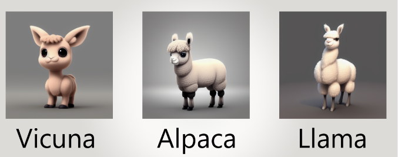

### **OPT**

- OPT 是 meta 更早一点的开源模型尝试，一共有 8 种尺寸模型，出发点就是为爱发电，尝试探索一条复现 GPT3 开源之路
- 模型配置跟 GPT3 基本一致，可学习的绝对位置编码，Pre-LayerNorm，激活函数用的是 ReLU
- 但是训练过程也非常艰难，在训练过程中频繁中断，修改 lr，优化器等。从下图训练曲线可见一斑
- 模型最终结果似乎也不是太好，出现了不能很好处理陈述性指令，输出 toxicity 比较严重，容易陷入重复循环等问题
- 更多细节参见[该视频](https://www.youtube.com/watch%3Fv%3Dp9IxoSkvZ-M)

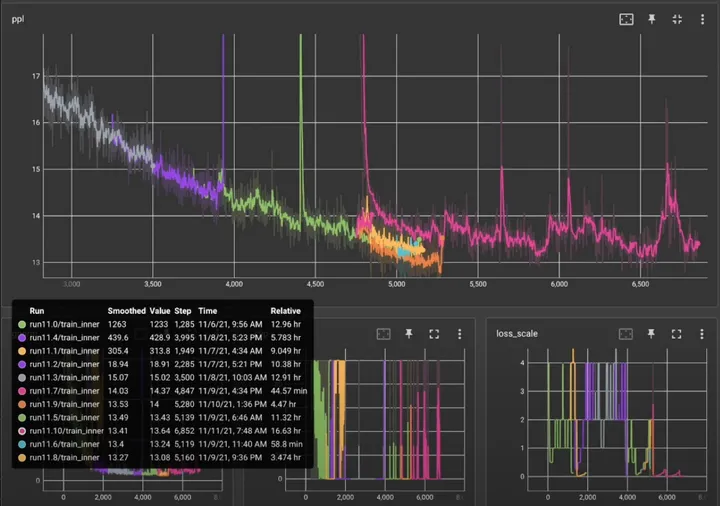

OPT training curve

### PaLM

Jeff Dean 出品，必属精品。PaLM 又一次体现了 google 强大的软硬体系能力。总结来说，PaLM 基于 Pathways 训练框架，使用了 6144 个 TPU，在 780B 的 tokens 上训练了 540B 的超大模型，并且达到了 50%左右的峰值使用率

模型部分的改进点如下

- 使用 SwiGLU 激活，这个在前面已经介绍过
- 结构并行化修改，把 MHA 的串行结构改成了并行。(这都行..)

串行

$y = x + \text{MLP}(\text{LayerNorm}(x +\text{Attention}(\text{LayerNorm}(x)))$

并行

$y = x + \text{MLP}(\text{LayerNorm}(x)) +\text{Attention}(\text{LayerNorm}(x))$

- 使用了 MQA(Muti Query Attention)加速方式。就是把 MHA 的 Key 和 Value 在不同 head 间共享，维度都变成了$[B\cdot1, L, d]$，Query 保留原始的$[BA, L, d]$维度。其中 A 是 head 数量。
- 位置编码选用 RoPE Embeddings 方式，这个在前面也介绍过
- 共享输入和输出的词向量的 embedding 矩阵
- 在 dense 和 layerNorm 中去除了 bias 学习，可以提高训练稳定性

最后说说 TPU 和 Pathways 训练框架

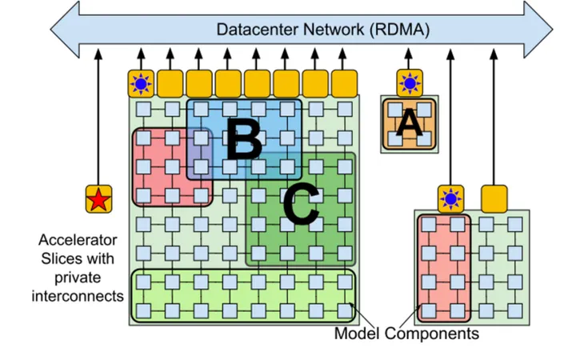

TPU Pod

- 一般把多个高速互联的硬件计算设备看成一个 island，例如在 GPU 里面用 NVLink 互联的单机 8 卡；或者 TPU 里面多达 1024 卡组成一个 island，如上中间方方正正的矩阵硬件阵列，也叫一个 Pod
- GPU 编程是 SIMT 的，多个 warp 可以在 SM 上并发切换执行，因此 GPU 是可抢占的
- TPU 更多的依赖编译器的编译和提前编排，所以只支持串行的 kernel，否则需要解决 Gang Scheduling 问题。就是多个关联程序在多个执行器上同时执行的时候，可能会有死锁问题
- 因此 Google 认为 multi-controller 的架构不适合未来 ML 系统的趋势，中心化 single-controller 才是王道，这里 multi-controller 暗指 GPU 的设计
- Pathways 里面解决了 JAX 只能在一个 pod 内调度的问题，扩展到了多个 pod，支撑了 PaLM 大语言模型跨 Pod 并行

### LaMDA

LaMDA 是 google 在 2021 开发者大会上公布的专门用于对话的大语言模型，具有 137B 的参数，除了预训练阶段，其实还包含了微调阶段

LaMDA 网络的细节论文里说的不多

- 位置编码跟 T5 一样是可学习的相对位置编码
- 使用 GeGLU 的激活函数

### Chinchilla

关乎人类 AGI 的大事儿，DeepMind 怎么能缺席。在 Gopher 之后，DeepMind 提出了一个参数量更少，但精度更高的 Chinchilla 模型。

DeepMind 在文中回答了大家关心的一个核心问题

Q: 在给定计算 FLOPs 的约束下，如何权衡模型规模大小和训练 tokens 数量？

A: 模型大小和 tokens 数量同等重要

最终以自家的 Gopher 模型为 baseline，用了 4 倍数量约 1.4T 的 tokens，训练一个四分之一大小约 70B 的模型，精度还比 Gopher 要好

模型结构沿用了 Gopher

- 归一化方法选择了 Pre-Layer-Norm
- 位置编码使用相对位置编码，借鉴了 Transformer-XL 的无需参数学习的 sinusoid 矩阵，因此是 fixed relative PE

### BLOOM

BigScience 是个研究型合作组织，参与方有 huggingface 和法国机构 GENCI 和 IDRIS。旗下出品的 BLOOM 模型使用了 IDRIS 下的 Jean Zay 超级计算机，基于 ROOTS 数据集，用了 384 张卡，使用 Megatron-DeepSpeed 框架，做了 DP+PP+TP 的 3D 并行训练。

BLOOM 的网络框架如下

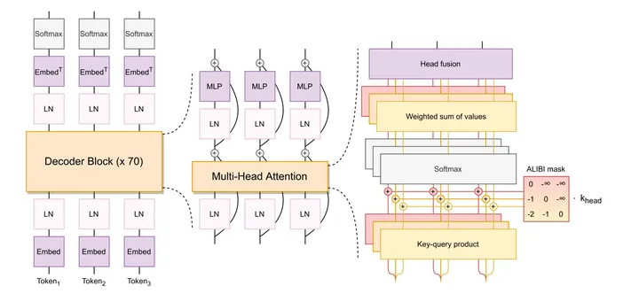

BLOOM architecture

- word embedding 之后加一个 LayerNorm，有助于收敛。启发来自于[bitstandbytes](https://github.com/facebookresearch/bitsandbytes)的 StableEmbedding 做法
- 用了 Pre-Layer-Norm 归一化方法和 GeLU 激活
- 位置编码用了 ALiBi 的方式

下面简单介绍一下 ALiBi(Attention with Linear Biases)的相对位置编码机制。

ALiBi 的出发点是希望能提升位置编码的外推能力，原因是在实际使用中的输入 token 长度可能会远远大于训练阶段使用的最大 token 限制。

方法非常朴素，就是对于 attention 矩阵的$q_i \cdot k_j$位置用 i-j 表示相对位置，乘以系数 m 后直接加在 attention 矩阵上

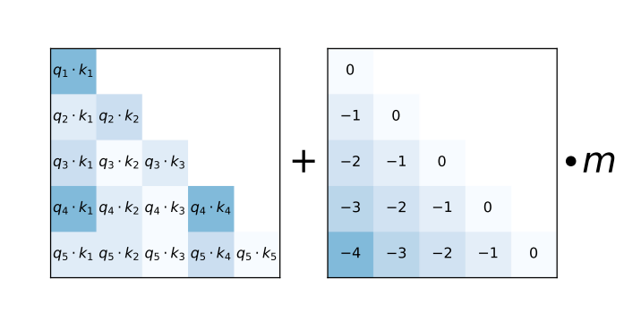

ALiBi

其中 m 的计算取决于 head 总数 n，第 t 个 head 的系数 m_t 为

$m_t=(\frac{1}{\sqrt[n]{2^8}})^t, t=1,\cdots,n$

例如

- head 数量为 8 的时候，为$\frac{1}{2^1},\frac{1}{2^2}, \cdots, \frac{1}{2^8}$
- head 数量为 16 的时候，为$\frac{1}{2^{0.5}},\frac{1}{2^1}, \frac{1}{2^{1.5}}\cdots, \frac{1}{2^8}$

作者说训练是前紧后松，一开始由于链路没有趟通，大家都很急。前期做了很多基建和准备工作，而当真正趟通之后，却出奇的顺利。

BLOOM 的另外一个亮点是系统展示了如何基于 Megatron-DeepSpeed 框架，做 DP+PP+TP 的 3D 并行训练，相关内容将会在本系列后续的“LLM 的分布式训练”篇详细介绍。

## 写在最后

最后把前面提到的三大家族的 LLM 基座模型做了个信息汇总，方便查阅。

由于篇幅所限，很多优秀的 LLM 模型并没有提及，更加完整的 LLM 模型信息收录参阅[这篇 Survey](https://arxiv.org/abs/2303.18223)

|                      | 模型名称   | 发布机构   | 发布时间 | 参数量 | token 数 | PE 方法          | Norm 位置 | Norm 方法 | 激活函数 |
| -------------------- | ---------- | ---------- | -------- | ------ | -------- | ---------------- | --------- | --------- | -------- |
| Encoder-only 架构    | BERT       | Google     | 2018.10  | 0.34B  | 3.3B?    | Learned Absolute | Post-Norm | LayerNorm | GeLU     |
| Encoder-decoder 架构 | T5         | Google     | 2019.10  | 11B    | 1T       | Learned Relative | Pre-Norm  | RMSNorm   | ReLU     |
|                      | GLM        | Tsinghua   | 2021.03  | 130B   | 400B     | RoPE             | Post-Norm | DeepNorm  | GeGLU    |
|                      | UL2        | Google     | 2022.05  | 20B    | 1T       | Learned Relative | Pre-Norm  | RMSNorm   | SwiGLU   |
| Decoder-only 架构    | GPT3       | OpenAI     | 2020.05  | 175B   | 300B     | Learned Absolute | Pre-Norm  | LayerNorm | GeLU     |
|                      | LLaMA      | Meta       | 2023.02  | 65B    | 1.4T     | RoPE             | Pre-Norm  | RMSNorm   | SwiGLU   |
|                      | OPT        | Meta       | 2022.05  | 175B   | 180B     | Learned Absolute | Pre-Norm  | LayerNorm | ReLU     |
|                      | PaLM       | Google     | 2022.04  | 540B   | 780B     | RoPE             | Pre-Norm  | LayerNorm | SwiGLU   |
|                      | LaMDA      | Google     | 2022.01  | 137B   | 768B     | Learned Relative | ?????     | ????      | GeGLU    |
|                      | Chinchilla | DeepMind   | 2022.03  | 70B    | 1.4T     | Fixed Relative   | Pre-Norm  | RMSNorm   | ?????    |
|                      | BLOOM      | BigScience | 2022.11  | 176B   | 366B     | ALiBi            | Pre-Norm  | LayerNorm | GeLU     |

总结一下，本文主要介绍了 LLM 基座模型里常见的 3 种 transformer 架构，encoder-only，encoder-decoder 和 decoder-only。提及的模型组件包括

- Norm 位置 3 种: Post-Norm，Pre-Norm 和 Sandwich-Norm
- Norm 方法 3 种: LayerNorm, DeepNorm 和 RMSNorm
- 激活函数 3 种: GeLU, GeGLU 和 SwiGLU
- PE 方法 6 种: Fixed Absolute, Learned Absolute, Fixed Relative, Learned Relative, RoPE, ALiBi

预告：计划下一篇为“ChatBot 是怎么炼成的?”，将重点介绍指令微调、奖励模型(Reward Model)和 RLHF 相关技术，敬请期待。

PS：由于笔者小 A 并没有亲手撸过上述内容的所有细节，大部分是通过研究代码和精读优秀文章的方式 bottom-up 总结而来，本质上是个拾人牙慧的知识搬运工，所以终究是纸上谈兵。因此希望各方有实际经验的大佬猛锤，思维碰撞才生火花，真理越辩越明。

**如果后续想了解 transformer 在 NLP/CV/多模态的算法知识，分布式训练的知识，以及如何在 TVM 上做 PTQ 量化和部署，可以关注 aaronxic 哦~**

## 系列文章导览

## 参考资料

[总结从 T5、GPT-3、Chinchilla、PaLM、LLaMA、Alpaca 等近 30 个最新模型\_zenRRan 的博客-CSDN 博客](https://blog.csdn.net/qq_27590277/article/details/130256877)

[LLM 大爆发，盘点近期令人兴奋的开源 LLM 和数据集](https://zhuanlan.zhihu.com/p/630052782)

[碾压 LLaMA，「猎鹰」彻底开源！400 亿参数，万亿 token 训练，霸榜 Hugging Face](https://zhuanlan.zhihu.com/p/634189977)

[NLP 综述（思维导图）](https://zhuanlan.zhihu.com/p/56802149)

[UL2 20B: An Open Source Unified Language Learner](https://ai.googleblog.com/2022/10/ul2-20b-open-source-unified-language.html)

[【论文】T5: Text-To-Text Transfer Transformer](https://zhuanlan.zhihu.com/p/88377084)

[LLaMA 及其子孙模型概述 - 掘金](https://juejin.cn/post/7220985690795851836)

[BERT 中的激活函数 GELU：高斯误差线性单元](https://zhuanlan.zhihu.com/p/349492378)

[为什么 Pre Norm 的效果不如 Post Norm？ - 科学空间|Scientific Spaces](https://spaces.ac.cn/archives/9009)

[A Survey of Large Language Models](https://arxiv.org/abs/2303.18223)

[PaLM 中使用的激活函数：SwiGLU - 西西嘛呦 - 博客园](https://www.cnblogs.com/xiximayou/p/17094922.html)

[\[NLP\] 相对位置编码(二) Relative Positional Encodings - Transformer-XL - listenviolet - 博客园](https://www.cnblogs.com/shiyublog/p/11236212.html)

[The Technology Behind BLOOM Training](https://huggingface.co/blog/bloom-megatron-deepspeed)
