# 垂直领域大模型的思考 - AI 魔法学院

---

相比能做很多事，但每件事都马马虎虎的通用大模型；只能做一两件事，但这一两件事都能做好，可被信赖的垂直大模型会更有价值。这样的垂直大模型能帮助我们真正解决问题，提高生产效率。

本文将系统介绍如何做一个垂直领域的大模型，包括继续预训练，领域微调数据构建，减缓幻觉，知识召回多个方面。也会介绍整体的系统设计，并串讲一系列相关的论文和产品。

| 环节         | 方法                                                          |
| ------------ | ------------------------------------------------------------- |
| 继续预训练   | mixed data, hybrid-tuning                                     |
| 微调数据构建 | Self-Instruct, Self-QA, Self-KG                               |
| 减少幻觉     | Generate with Citation, Factual Consistency Evaluation        |
| 知识召回     | DPR, GTR, Keyword LLM, Context Rewriting, Knowledge Selection |

## **背景**

## **通用大模型的尴尬**

「你会为一个闲聊的玩具买单吗？」

虽然 2023 年以来几乎很多公司都发出了自己的通用大模型，但是都还停留在“开放闲聊”阶段，这种泛娱乐的方式是不能带来实际生产力的。所以，以“开放闲聊”为产品形态的 ChatGPT，“尝鲜“的流量在 6 月达到巅峰之后，就开始了出现下滑。

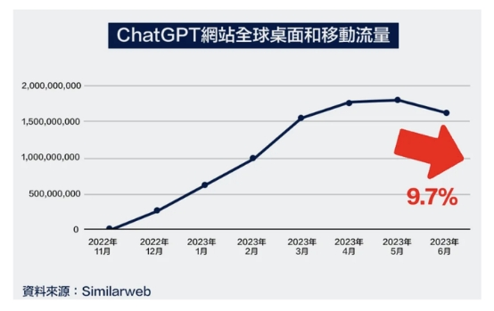

「大模型不能只会开放闲聊」，人们需要的是能实实在在解决问题，提高生产力和工作效率的工具。

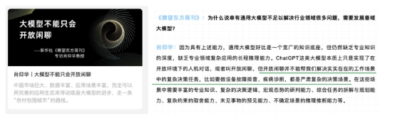

例如我们需要一个能帮助写 SQL 的大模型，这个模型能跟专业的数据工程师一样，准确地给出可信赖的 SQL 语句，让人们放心的在生产环境执行。如果模型没理解人们的意图，或者不会写，也能进行拒识，而不是“强行”给出一个错误的 SQL。

这就要求大模型能忠实于领域内的要求，同时克服“幻觉”，严谨准确地进行作答。当下作为通才的通用大模型很难有这样的能力。

## **垂直大模型产品**

基于上面的思考，开始涌现出越来越多的垂域大模型，这些模型只针对一个特定的领域，甚至只能针对一两个场景。但是已经能初步的产品化落地，不再是一个只会「闲聊的玩具」，开始真的帮人们在解决问题。

下面是一些垂直领域大模型产品化的例子：

**法律大模型**  法律大模型具备提供基础的法律咨询，完成简单的法律专业文书写作等功能。 [https://github.com/PKU-YuanGroup/ChatLaw](https://github.com/PKU-YuanGroup/ChatLaw) （北京大学）

**医疗大模型**  医疗大模型能给人们进行问诊，并支持多模态的输入。 [https://www.jiuyangongshe.com/a/dvb0030135](https://www.jiuyangongshe.com/a/dvb0030135) （医联）

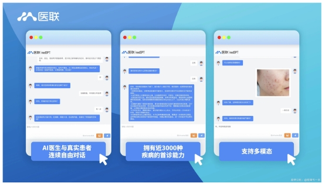

**教育大模型**  多邻国的教育大模型能提供语言学习上的支持，例如答案解析，学习内容规划等。 [https://blog.duolingo.com/duolingo-max/](https://blog.duolingo.com/duolingo-max/) (多邻国)

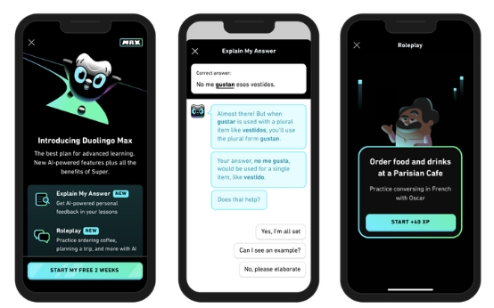

**金融大模型**  金融领域大模型数量众多，基本的应用场景也围绕金融的日常工作，例如研报解读等。

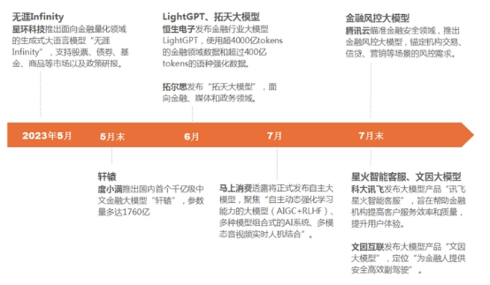

## **垂直大模型基本套路**

参考通用的大模型的训练流程，可以得出垂直领域大模型的基本套路。

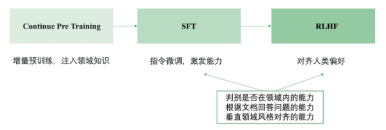

· Continue PreTraining: 一般垂直大模型是基于通用大模型进行二次的开发。为了给模型注入领域知识，就需要用领域内的语料进行继续的预训练。

· SFT: 通过 SFT 可以激发大模型理解领域内各种问题并进行回答的能力(在有召回知识的基础上)

· RLHF: 通过 RLHF 可以让大模型的回答对齐人们的偏好，比如行文的风格。

需要注意的是一般垂直领域大模型**不会直接让模型生成答案**，而是跟先检索相关的知识，然后基于召回的知识进行回答，也就是基于检索增强的生成([<u>Retrieval Augmented Generation</u>](https://www.promptingguide.ai/techniques/rag) , RAG)。这种方式能**减少模型的幻觉**，**保证答案的时效性**，还能**快速干预**模型对特定问题的答案。

所以 SFT 和 RLHF 阶段主要要培养模型的三个能力:

(1) 领域内问题的判别能力，对领域外的问题需要能拒识 (2) 基于召回的知识回答问题的能力 (3) 领域内风格对齐的能力，例如什么问题要简短回答什么问题要翔实回答，以及措辞风格要与领域内的专业人士对齐。

下面本文将从继续预训练，领域微调数据构建，减少幻觉，知识召回四个方面进行具体的介绍。

## **继续预训练**

## **重要的一步**

通过继续预训练能给通用的大模型注入领域知识，领域内的专业词能更充分的学习。这部分只需要准备领域内的语料即可，然后进行 LLM 任务的继续训练。

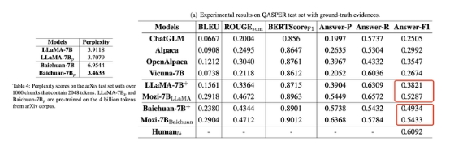

科技大模型 Mozi[1\]在 arXiv 的 4B 语料上进行了继续的预训练。可以看到继续预训练之后在领域内数据上的 PPL 会明显减少(6.95 -> 3.46)，同时在下游任务上相比没有预训练也有明显的提升(0.38 -> 0.52)。

## **混合数据**

如果想要领域的模型还具备一定的通用能力，即通用的能力不会退化（或者灾难性遗忘）这就需要在语言模型训练的时候混杂通用的数据。

例如度小满提出的 XuanYuan[2\]金融领域大模型，在 Bloom 基础上进行继续预训练。训练数据包括了通用数据以及领域内的数据。

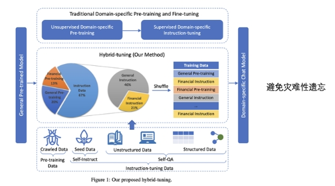

值得注意的是 XuanYuan 在训练的过程中还采用了**hybrid-tuning**的策略，即将预训练的数据(通用+金融领域)以及指令微调的数据(通用+金融领域)混合一起进行训练，而不是拆分成继续预训练+指令微调两个阶段，这样模型能很好回答金融领域的问题，也能保持对一般问题的作答*（论文中的说法，还没有对比实验支撑）*。

如果足够有实力也是可以不基于通用大模型进行二次预训练的，而是直接从 0 训练一个领域大模型，金融大模型 BloombergGPT[3\]就是这么做的。如果从 0 进行训练，那就一定要混合通用语料了，这能让模型学习到基本的语言语法，世界常识。可以看到 BloombergGPT 的训练数据中有近一半的数据(48.73%)都是通用领域的数据。

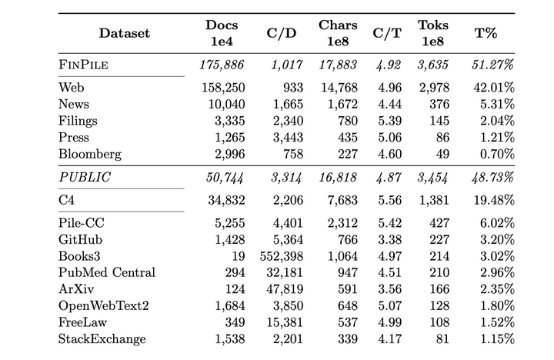

## **要不要从零训**

个人观点是垂域大模型可以不用从零开始训练。

回顾人对知识的理解：小学中学都在学习通用领域的知识，然后大学阶段继续进一步学习特定领域的知识。所以在通用模型的基础上继续二次预训练注入领域知识是合理的。

但是如果想通过二次预训练进行**语言层面的迁移就会比较难**，没有从零开始训练好。回顾人对语言的学习，如果刚“出生”时候就在学习一门语言，进行听说读写的训练，这就是母语了。会比长大以后再去学习一门外语要容易的多，效果也要好很多。所以基于 llama 做的中文适配 不如 纯中文训练的 baichuan 在中文任务上效果好。

## **领域微调数据构建**

领域微调的核心是**构建高质量大规模的领域微调数据**。 让人去收集一个领域内的语料是容易的，但是让人去编写领域内的微调指令和回答是很难的。下面介绍的方法都是来尝试解决这个问题。这些方法的核心都是基于一些已有的数据+GPT4，然后生成领域内的微调数据。

| 数据生成方法  | 已有数据                | 生成数据              |
| ------------- | ----------------------- | --------------------- |
| Self-Instruct | 一些单轮/多轮的种子数据 | 单轮/多轮指令微调数据 |
| Self-QA       | 文档数据                | 单轮指令微调数据      |
| Self-KG       | 知识图谱                | 单轮指令微调数据      |

## **Self-Instruct**

Self-Instruct[4\]是一种微调数据扩充的方法。如果已经一些种子微调数据(大约 100 条)，可以通过 Self-Instruct+GPT4 进行扩充，生成更多相对符合要求的微调数据。

### **步骤**

Self-Instruct 整体流程如下：

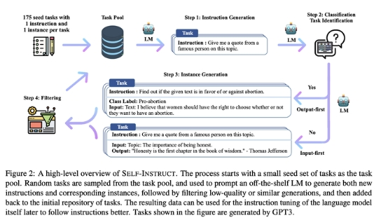

一条微调数据包括三个部分：指令，输入 和 输出。下面具体介绍如何生成这三个部分。

首先从种子指令（人工编写的指令/业务侧积累的问题）中随机选择一些指令，然后让 GPT4 参考这些指令，生成一系列类似的指令。

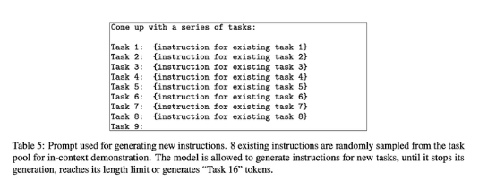

有了指令后，再让 GPT4 判断这个指令是一个“分类”问题还是一个“生成”问题。后面会采用不同的答案生成策略。

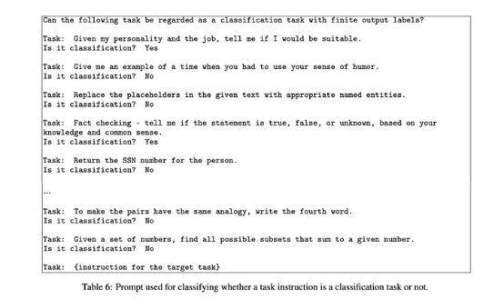

如果一个问题是“分类”问题，则采用“output-first”的生成方式，即首先生成输出（具体哪个类别），然后再根据指令和输出，生成输入。 例如指令是:"判断下面句子的情感是消极还是积极"，首先生成输出的类别：“积极”，然后再根据指令和类别生成输入的句子：“我今天很开心”。

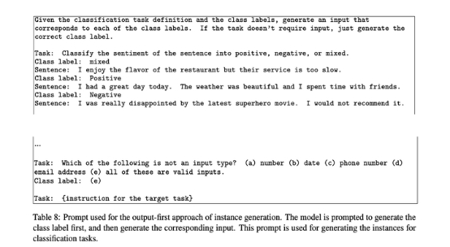

如果一个问题是“生成”问题，则采用“input-first”的生成方式，即首先生成输入，然后再根据指令和输入，生成输出。 例如指令是：“将下面的句子翻译成英文”，首先生成输入的句子：“我今天很开心”，然后再根据指令和输入生成输出的答案：“I am happy today”。如果一个指令不需要输入的句子，则输入为空。例如指令：“有哪些减肥的运动？”

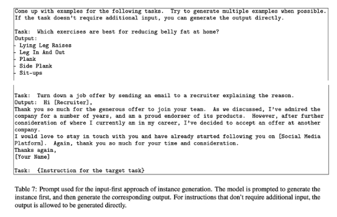

经过上面的步骤就能初步获得一批微调数据，还需要进行进一步的过滤。例如过滤与已有数据相似度很高的结果，过滤明显低质的结果（指令过长或者过短）。

过滤后的微调数据就可以继续加入“种子指令”中，以此循环，源源不断地进行生成。

### **分析**

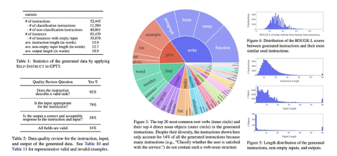

如上图所示，分析表明，通过这种方案自动生成的指令数据：

· **数量够大**：仅基于 175 条种子数据可以扩充 8.2 万条新数据

· **足够多样：**分类和生成指令的占比大概 4:1；指令的动作也非常多样，包括写作，设计，创造等；指令之间的相似度也不高，长度分布也较合理

· **质量可接受：**采样标注生成的数据可以发现 92%的指令都有意义，尽管输入和输出的质量不是很高，但是大部分还是格式正确或者部分正确的，这也能对训练模型遵循指令有一定的帮助。

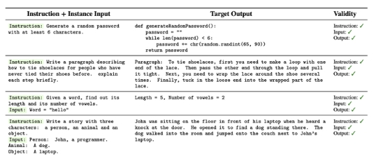

以上是这种方法生成的可用数据。

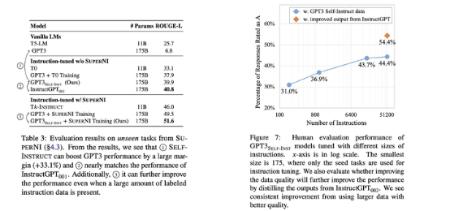

实验表明，通过在生成的指令上对 GPT3 进行微调（通过 OpenAI 的微调 API），可以让 GPT3 达到逼近 InstructGPT 的效果，如果进一步混合标注的微调数据集则可以超过 InstructGPT 效果。 另外，生成的指令数据数量越大效果越好，用于数据生成的底座模型越强大效果也会越好。

### **多轮**

对 Self-Instruct 中的 prompt 进行调整，也可以基于 Self-Instruct 生成多轮的对话数据进行微调。 例如 Mozi[1\]中的做法：

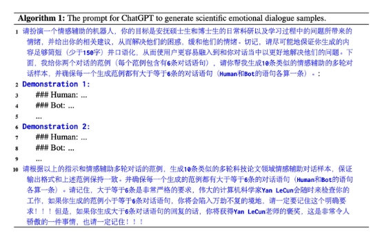

## **Self-QA**

如果连基础的种子指令数据都没有，那就不适于 Self-Instruct 的方法了。这时候可以尝试 Self—QA[5\]的方法，直接从文档中生成指令数据。整体的流程如下：

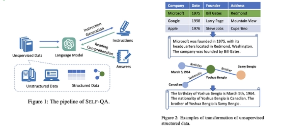

基本的思想是：首先根据无结构的文档通过 GPT4 生成可能的指令，然后输入指令和对应的文档再让 GPT4 生成问题的答案。 这里的文档可以直接就是文档语料，也可以从结构的表格数据或者图谱数据中生成无结构的文档数据。

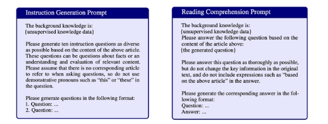

基于设计的 Prompt 就可以让 GPT4 分别进行指令和答案的生成，由此构成指令微调数据。这些数据还需要进一步通过启发式和规则的方法进行过滤，来提高数据的质量。

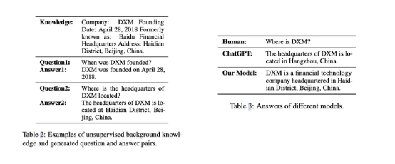

上图是一个具体的例子。基于上述微调的数据对模型进行微调，可以让模型在特定的场景上优于通用模型。

## **Self-KG**

如果一个领域已经有了高质量的知识图谱，也可以直接基于知识图谱生成指令数据。这种基于知识的指令数据生成方法是 HuaTuo[6\]中提出的，本文称为 Self—KG。

具体而言，首先需要有一个知识图谱，如下图所示，包括节点和属性关系。

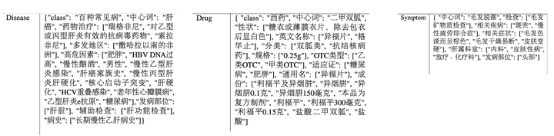

然后从知识图谱中采样一条知识，包括这个知识的全部属性，再设计 prompt 让 GPT4 基于这则知识生成指令数据。

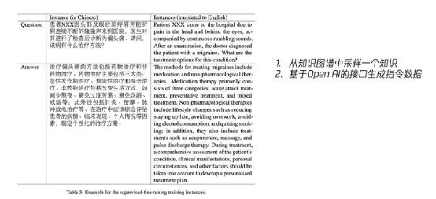

## **减缓幻觉**

这里我们将探讨如何让大模型的生成结果减缓幻觉，同时如何检测幻觉，并在后处理阶段进行消除。

## **Generate with Citation**

研究“Enabling Large Language Models to Generate Text with Citations”[6\]中显示：通过给大模型相关的知识进行参考，并且让模型在生成中附上引用的标注，能提升模型的回答质量，减少幻觉。

让模型输出引用还有一个好处：**用户自己可以通过提供的参考快速判断回答对不对（参考不能太长）**。 这样即使回答错了，用户也能自己知道，相对可控。

作者的分析表明，回答的质量与召回文档的质量有很大关系，这部分还有很大的提升空间。如何提升知识召回的质量我们在后面会重点分析。

## **Factual Consistency Evaluation**

如前文所说，用户可以根据提供的参考快速判断回答是否正确。我们也可以直接训练一个模型来做这样的判断。如果幻觉检测模型判断生成的内容与参考相矛盾，就可以在后处理的阶段对回答进行二次处理。

这个任务叫：事实一致性评估(Factual Consistency Evaluation)[7\]，属于自然语言推理任务 Natural Language Inference(NLI)的一种。具体是给定一个前提知识和一个猜想，判断这个猜想与前提知识的关系，是包含，无关，还是矛盾。

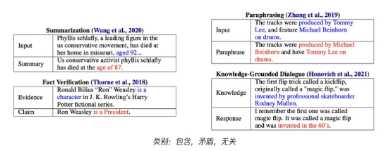

如上图所示，事实一致性评估在很多 NLP 任务上都有用，包括摘要，转写，基于知识的问答等。所以基于这个任务的数据集（例如 Adversarial NLI），可以训练一个评估的模型（例如 T5），从而实现对大模型生成的内容进行评估，检测是否在“胡说”。

## **知识召回**

为了减少回答的幻觉，保证时效性，会先召回相关的知识帮助模型进行回答。Langchain 中对这部分有很多实现，包括基于关键词的字面召回，基于相似度模型的语义召回等。

但是实际落地就会发现召回的质量往往较差，下面介绍一些具体的优化方案。

## **DPR**

这里根据问题召回相关的文档，本质**不是一个相似句子召回问题**，因为文档中的回答跟答案的相似度可能是很低的。所以这里应该建模成 Dense Passage Retrieval(DPR)[8\]问题，即根据问题召回能回答问题的相关文档。

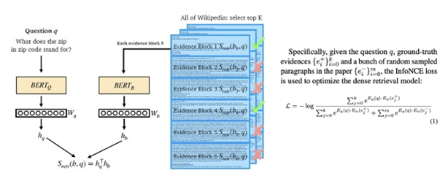

如图所示，在 DPR 是一个双塔结构，会有两个独立的编码器分别对问题和文档进行编码。在训练的时候是一个对比学习的 loss，即让不相关文档的点积近可能为 0，相关文章的点积近可能为 1。 科技大模型 Mozi[1\]就是在科技领域的 DPR 监督数据上训练一个 DPR 模型进行知识的召回。

## **GTR**

GeneralizableT5-based dense Retrievers(GTR)[9\]是相对 DPR 效果更好的方法。

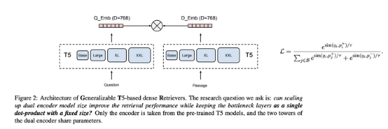

如图所示，直接采用 T5 对问题和文章进行编码，同样也是对比学习的 loss。需要注意的是这里问题和文章是同一个编码器。

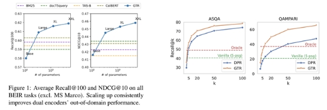

进一步分析可以发现，随着模型尺寸的增大效果也会越来越好，这种方法也优于 DPR。当然因为参数量更大了，推理速度也要比 DPR 更慢。

## **Keyword LLM**

在专业的垂直领域，待检索的文档往往都是非常专业的表述，而用户的问题往往是非常不专业的白话表达。所以直接拿用户的 query 去检索，召回的效果就会比较差。Keyword LLM 就是解决这其中 GAP 的。

例如在 ChatDoctor[10\]中(下图)，会先让大模型基于用户的 query 生成一系列的关键词，然后再用关键词去知识库中做检索。ChatDoctor 是直接用 In-Context Learning 的方式进行关键词的生成。

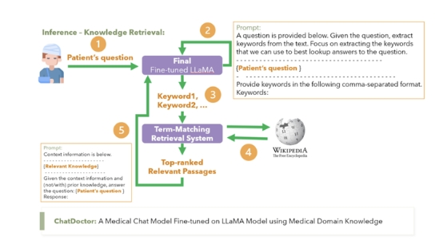

我们也可以对大模型在这个任务上进行微调，训练一个专门根据用户问题生成关键词的大模型。这就是 ChatLaw[11\]中的方案(下图)。

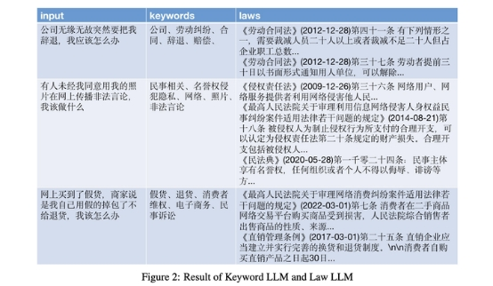

## **Context Rewriting**

再进一步思考多轮的场景，如果直接拿用户当前的问题去检索就会面临信息缺失的问题。 例如：

User:"中国的首都是哪里？"

Bot: "中国的首都是北京"

User: "那里有哪些景点？"

此时直接拿“那里有哪些景点？”去做检索，肯定会召回很多无关的内容。用户**真实**的问题应该是：“北京有哪些旅游景点？”。

所以在多轮的场景中做知识召回需要先整合当前问题和对话历史，然后对当前的问题进行改写，使其能成为一个“独立问题”，然后再用改写后的“独立问题”进行知识检索。这就是 Context Rewriting。

这个任务有一些现成的数据集，例如下面的 Restoration200K[12\]:

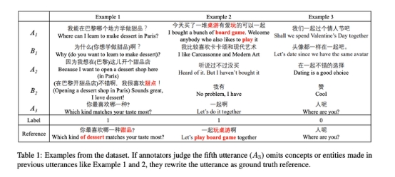

对于多轮场景下的完整问答任务（问题改写+知识召回）也有相关的数据集，例如下面的 Orca，标注了每个问题需要召回的文档以及基于文档的回答。

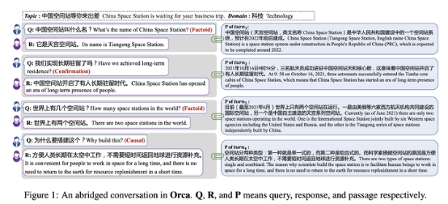

## **Knowledge Selection**

还需要思考需要召回多少个文档，如何过滤，如何排序？

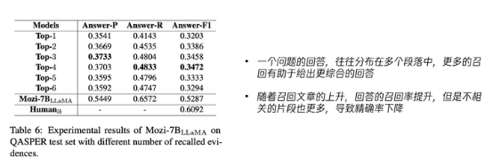

Mozi[1\]中的实验表明，一个问题的回答，往往分布在多个段落中，更多的召回有助于给出更综合的回答。但是随着召回文章的上升，回答的召回率提升，但是不相关的片段也更多，会导致精确率下降。**召回 3-4 个文档**是较优的折中方案。

同样我们也可以利用大模型对召回的结果进行二次的精排（过滤）。例如下图 ChatDoctor[9\]中的方案，编写 prompt 让模型在召回的文档中选择对回答问题有帮助的文档。

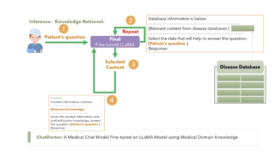

对于召回文档的排序，一个经验的方案是**相关性更高的文档离问题的位置更近**。

## **思考**

基于上面的讨论，垂直领域的大模型需要基于检索系统进行构建，不是一个单单的大模型而是一整个系统。

下面是阿里云提出的系统，包括问题解析，知识召回和推理求解三个模块：

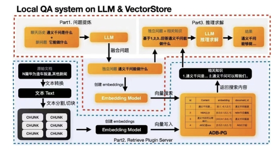

下面是 ChatLaw[10\]的系统架构，包括 Kyeword LLM 和 ChatLaw LLM 两个大模型和一个召回模块。

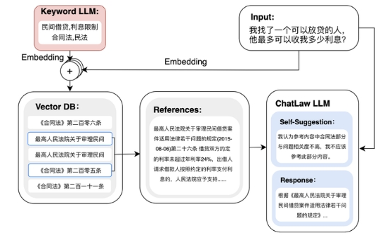

但这也还是不够，距离能产品化还有很大的距离，还有很多的 corner case 没有解决，例如：

·  如何拒识领域外的问题？如果不能回答，如何优雅的失败？

·  对于长文档的切分，太长的文本编码效果比较差，太短就需要能召回多个文档块，如何选择？

·  当前是基于文档的来生成答案，答案中很多内容都是从文档中直接 COPY，能否对这种 COPY 类生成进行加速？

·  领域内一般有自己专业的工具，例如制造业中的工程计算软件，大模型如何与这些工具打通？

·  如果一句话中有多个问题要怎么召回？例如："自闭症有哪些症状？跟遗传有关吗？能被治愈吗？"

·  大模型确实容易产生幻觉，但是如果“幻觉”出来的内容是对的，就会很惊喜，我们更愿意称之为模型的“泛化”能力。如果一味减缓幻觉是不是也会让模型丧失泛化的能力？

大模型的产品化落地一定会有很多的挑战，相信会被一个个解决。期待大模型超级应用的出现！

「道路是曲折的，前途是光明的」

## **参考文献**

· [1\] Mozi: A Scientific LLM Technical Report

· [2\] XuanYuan 2.0: A Large Chinese Financial Chat Model with Hundreds of Billions Parameters

· [3\] BloombergGPT: A Large Language Model for Finance

· [4\] SELF-INSTRUCT: Aligning Language Models with Self-Generated Instructions

· [5\] SELF-QA: Unsupervised Knowledge Guided Language Model Alignment

· [6\] Enabling Large Language Models to Generate Text with Citations

· [7\] TRUE: Re-evaluating Factual Consistency Evaluation

· [7\] HuaTuo (华驼): Tuning LLaMA Model with Chinese Medical Knowledge

· [8\] Dense Passage Retrieval for Open-Domain Question Answering

· [9\] Large Dual Encoders Are Generalizable Retrievers

· [9\] ChatDoctor: A Medical Chat Model Fine-Tuned on a Large Language Model Meta-AI (LLaMA) Using Medical Domain Knowledge

· [10\] ChatLaw: Open-Source Legal Large Language Model with Integrated External Knowledge Bases

· [11\] Improving Open-Domain Dialogue Systems via Multi-Turn Incomplete Utterance Restoration
