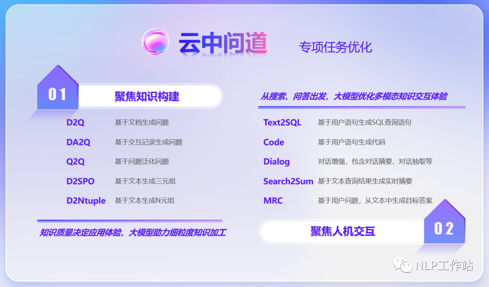

## 大模型系列｜垂直大模型的几种训练策略

---

## 1 目前垂直行业大模型的几种训练策略

参考：[大模型时代-行业落地的再思考](https://mp.weixin.qq.com/s/wSQSjO_0OmIg2kBZUuXA4Q)

- **重新训练**：使用通用数据和领域数据混合，from scratch（从头开始）训练了一个大模型，最典型的代表就是 BloombergGPT。
- **二次预训练**：在一个通用模型的基础上做 continue pretraining（继续预训练，二次预训练），像 LawGPT 就是做了二次预训练的。身边有很多人尝试过这个方案，但普遍反应效果一般（没有 SFT 来得直接），很有可能是数据配比的问题。
- **基础大模型微调**：在一个通用模型的基础上做 instruction tuning（sft），这也是现在开源社区最普遍的做法，有大量的工作比如 Huatuo，ChatLaw 等等。这种做法的优势是可以快速看到不错的结果，但会发现要提高上限比较困难。
- **通用大模型+向量知识库**：领域知识库加上通用大模型，针对通用大模型见过的知识比较少的问题，利用向量数据库等方式根据问题在领域知识库中找到相关内容，再利用通用大模型强大的 summarization 和 qa 的能力生成回复。
- **In context learning 类似微调**：直接用 in context learning 的方法，通过构造和领域相关的 prompt，由通用大模型直接生成回复。随着业界把 context window 越做越大，prompt 中可以放下越来越多的领域知识，直接用通用大模型也可以对领域问题有很好的回复。

以上对硬件资源+数据 的消耗也是不同的：

- 可以像【重新训练】一样几乎重新训练一遍模型，需要几百张卡
- 也可以像【基础大模型微调】一样用几百条数据做做 sft，可能几张卡就够了

目前很多没有技术团队的大模型解决方案，会以【基础大模型微调】+【向量知识库】为主。

以下是垂直领域可能会覆盖的任务：  


---

## 2 大模型训练的难度

如果选择【重新训练大模型】那要面临的资源需求变得异常苛刻：

- 数据要求
- 训练的硬件资源要求

### 2.1 数据要求

垂直领域最难的应该就是准备数据，现在基本上都是这样的指令数据结构：

```
{"instruction": instruction, "input": input, "output": output}
```

如果你只有 5k 数据，建议你在 Chat 模型上进行微调；  
如果你有 10w 数据，建议你在 Base 模型上进行微调。

同时在训练的时候，如果是 chat 需要保持与之前 chat 模型一致的数据结构

#### 2.1.1 配比的重要性

> 【重新训练的训练数据配比很重要】

BloombergerGPT，就会发现模型的能力其实很差，比通用大模型会差很多。这里面犯的最大的错误就是数据配比，他们应该是用 1:1 的比例混合通用数据和金融数据。  
首先，不知道他们对金融数据是如何清洗和保证数据质量的，个人觉得他们 500B 的金融数据质量可能是低于 500B 的通用数据的质量的，这个对模型最后能力的局限有比较大的影响，通用数据和金融数据必须是用同样的标准做了高质量清洗和质量控制的。  
其次，1:1 的数据比例大概率是一个很差的选择。对于复现 chatgpt3.5 来说，数据配比应该是 OpenAI 最核心的秘密和比别人领先最后的地方。和很多 OpenAI 的人员交流下来，他们在这块做了大量的实验并积累了大量的经验。

> 【二次预训练】领域数据比例要在 15%以下

对 continue pretraining 来说，如果要让模型不丢失通用能力，比如 summarization，qa 等，「领域数据的比例要在 15%以下」，一旦超过这个阈值，模型的通用能力会下降很明显。

和不少同行交流下来，感觉大家的范围都在 10%-15%左右。而且，该阈值和预训练模型的大小，预训练时原始数据的比例等条件都息息相关，需要在实践中反复修正（这个时候就能看出 scaling law 的重要性了）。  
这个结果其实和 ChatGPT 大概用不到 10%的中文数据就能得到一个很不错的中文模型的结果还挺相似的。

这个经验也告诉我们不要轻易用 continue pretraing 或者 from scratch pretraining 的方法做行业大模型，每 100B 的领域数据，需要配上 700B-1000B 的通用数据，这比直接训练通用大模型要困难多了。

> 【基础大模型微调】大概领域数据和通用数据比例在 1:1 的时候还是有不错的效果的

对 sft 来说，这个比例就可以提高不少，大概领域数据和通用数据比例在 1:1 的时候还是有不错的效果的。当然，如果 sft 的数据量少，混不混数据的差别就不太大了。所以说，做 pretraining 不仅耗资源，需要大量的卡和数据，还需要大量的实验去调数据配比。每次有人和我说通过 pretraining 的方法做了行业大模型的时候，我通常是不信的。做 sft 不是香多了吗？

> 领域数据训练后，往往通用能力会有所下降，需要混合通用数据以缓解模型遗忘通用能力。

如果仅用领域数据进行模型训练，模型很容易出现灾难性遗忘现象，通常在领域训练过程中加入通用数据。那么这个比例多少比较合适呢？目前还没有一个准确的答案，BloombergGPT（从头预训练）预训练金融和通用数据比例基本上为 1:1，ChatHome（继续预训练）发现领域：通用数据比例为 1:5 时最优。个人感觉应该跟领域数据量有关，当数据量没有那多时，一般数据比例在 1:5 到 1:10 之间是比较合适的。

#### 2.1.2 领域技术标准

现有大模型在预训练过程中都会加入书籍、论文等数据，那么在领域预训练时这两种数据其实也是必不可少的，主要是因为这些数据的数据质量较高、领域强相关、知识覆盖率（密度）大，可以让模型更适应考试。当然不是说其他数据不是关键，比如领域相关网站内容、新闻内容都是重要数据，只不过个人看来，在领域上的重要性或者知识密度不如书籍和技术标准。

### 2.2 硬件资源

大模型的训练成本，以 GPT-3 为例：GPT-3 需要 400-500 个 A100/年（用 400-500 张 A100 训 1 年），假设不买显卡，租公有云，现在 8 张 A100 包年的价格大概一年 80 万，一次性走量打五折 40 万，训练 GPT-3 的成本大概是 2500 万人民币。  
上面的讨论是按照 GPU 跑满 100%的使用率来计算，实际上 GPU 永远是有被浪费的时候，浪费的原因可能是：

- 显卡不稳定，可能会挂掉
- 由于显卡容易挂掉，需要做 checkpointing，而每次 checkpoint 的保存可能也需要分钟级别的时间成本
- CUDA core 大多数时候也是跑不满的，需要等显存带宽的 I/O、 IB 网络的 I/O 等等

### 2.3 模型炼丹技巧

- 上一条先在在小模型上做实验的方法，又会遇到在小模型上的实验挺好，但一到 100B 这个级别就会发现各种 loss 的不收敛/猛增/飞掉的问题。采用的策略可能是回退几步，或者扔掉这一部分数据，然后接着往前走。
- FP32/FP16/BF16 的选择问题：更倾向于 BF16，因为看起来更好收敛。
- 在硬件的选择上，尽可能用最先进的显卡进行训练，因为：第一，性能上的差异巨大，以 A800 和 H100 为例，算力差了六倍，然后通信带宽也差了两倍；第二，在落后的显卡上去训练，需要考虑更多的分布式问题，而将来迁移到高端显卡上的时候，在老显卡上累积的经验能直接用上的不多。
- 并行计算方案的选择：Megatron-DeepSpeed 是现在比较 SOTA 的一个方案。
- 团队组织上：算法研究员们更喜欢用 Pytorch 去反复调它的模型架构，但最后还需要工程人员把这些调整翻译到 Megatron 这套框架上，因此现阶段更倾向于算法人员和工程人员大家彼此知识是交融的，坐下来一起去讨论如何去实现。
- 通过人工标注，然后纯做 finetune，可以达到八成效果。但是想走的更远的话，那只能靠强化学习。
- 奖励模型（RM）训练叫做 reward hacking 的现象，开放的决策对于模拟打分环境来说难度太大了，对奖励模型的泛化程度有极其高的要求。最终大概率你的模型学习到了输出一堆没什么用的东西，但是 RM 分数很高。这就是 reward hacking（来自 【[大模型训练的一些坑点和判断](https://zhuanlan.zhihu.com/p/500333225)】 ）
- 评估的问题：同时模型的评估也是一个可能会有坑点的地方：  
  评估做不好 = 费钱费时；所以你做实验慢了，相当于比别人少了 GPU
- 过拟合的问题：只用领域数据非常容易过拟合到领域数据上，对 OOD 的处理会表现的非常差。对各个环节的数据配比要求会很高，最好是在原来规模程度的数据上，增加额外的场景数据，重新走部分流程。但是困难的是，原有数据保持分布的采样，你拿到的模型是个黑盒，别人并没有给你原始的数据分布，更何况海涉及到了惊细的清洗。有可能整体要付出的成本不下于重新塑造一个通用大模型。

### 2.3 模型训练的几种模式

[大模型 LLM 微调经验总结&项目更新](https://mp.weixin.qq.com/s?__biz=Mzg5MTU1NTE1OQ==&mid=2247486639&idx=1&sn=ce712cf3d28d9c2f73cfa2a6430a3c60&scene=21#wechat_redirect)

有这么三种大模型训练的方式：无参、少参数、全参数

无参数：

- In-Context Learning（ICL） （参考：[In-context Learning 学习笔记](https://zhuanlan.zhihu.com/p/625116295)）

全参方法

- 对大模型进行全量参数训练，主要借助 DeepSpeed-Zero3 方法，对模型参数进行多卡分割，并借助 Offload 方法，将优化器参数卸载到 CPU 上以解决显卡不足问题。

少参数：

- Freeze 方法，即参数冻结，对原始模型部分参数进行冻结操作，仅训练部分参数，以达到在单卡或多卡，不进行 TP 或 PP 操作就可以对大模型进行训练。
- PT 方法，即 P-Tuning 方法，参考 ChatGLM 官方代码 ，是一种针对于大模型的 soft-prompt 方法。
- Lora 方法，即在大型语言模型上对指定参数（权重矩阵）并行增加额外的低秩矩阵，并在模型训练过程中，仅训练额外增加的并行低秩矩阵的参数。当“秩值”远小于原始参数维度时，新增的低秩矩阵参数量也就很小

### 2.4 炼丹工程师

大模型训练团队的人员配置：

大模型项目团队和传统的大项目团队最大的不同在于：传统的大项目需要堆一大批人；而大模型的特点是极少量的 idea 要指挥的动极大的资源，因此团队必然精简，不可能使用人海战术。  
根据 BigScience 的经验，可以总结出几种类型的团队人员配置：

- 数据这块大概就是大数据工程师加少量的法务人员。大数据工程师可能偏数据工作，法务人员可能观察一下比如说数据的 license 是否合理。
- 不超过 10 个的 NLP 算法工程师，他们更关心模型架构以及训练过程中所有的超参的选型。
- 分布式训练系统的开发工程师，负责把训练框架给支起来，协调、运维和管理这么多机器。
- 可能还需要少量的前后端开发，例如一到两个人，负责做一些数据相关的工具。

---

## 3 参考文献

[【播客笔记】大模型是如何炼成的-训练篇](https://zhuanlan.zhihu.com/p/646838888)  
[大模型训练的一些坑点和判断](https://zhuanlan.zhihu.com/p/500333225)  
[垂直领域大模型的一些思考及开源模型汇总](https://zhuanlan.zhihu.com/p/642611747)  
[大模型 LLM 微调经验总结&项目更新](https://mp.weixin.qq.com/s?__biz=Mzg5MTU1NTE1OQ==&mid=2247486639&idx=1&sn=ce712cf3d28d9c2f73cfa2a6430a3c60&scene=21#wechat_redirect)  
[领域大模型-训练 Trick&落地思考](https://mp.weixin.qq.com/s/yhBMgmoJ2uzqc3JERrUhAw)
