# 天工Skywork-13B开源模型的炼成和思考 - 知乎

> ## Excerpt
> 前言笔者6月下旬加入到昆仑万维天工大模型团队负责大模型预训练，第一个参与的项目就是13B模型的预训练。在此期间社区不断开源了很多优秀的大模型，如Llama-2系列，ChatGLM系列，Baichuan系列，Qwen系列。但这些模…

---
## 前言

笔者6月下旬加入到昆仑万维天工大模型团队负责大模型预训练，第一个参与的项目就是13B模型的预训练。在此期间社区不断开源了很多优秀的大模型，如Llama-2系列，ChatGLM系列，Baichuan系列，Qwen系列。但这些模型大多是在Benchmark上跑跑分，秀一下肌肉，而对技术细节如：数据处理，数据配比，模型调优，评估方案则透露较少。社区正在从开放走向封闭，就Llama-1和Llama-2的tech report对比，Llama-2是更加封闭的，甚至连数据配比也没有透露。在笔者团队训练出一个还不错（可能是目前中文能力最强）的13B模型后，决定对我们的经验进行总结。一来希望启发社区，提升中文社区对预训练的认识，推动AGI在中国早日的实现。二来也是对我们自己的审视，通过开源收集反馈，帮助我们更好的完成之后的工作。三来我们认为目前的中文大模型社区可能在走一个弯路，就是太注重开源榜单的评分，这个弯路社区在BERT时代也走过，BERT时代过分看中CLUE，GLUE，SuperGLUE等榜单，正如目前过分看中MMLU，C-EVAL等榜单，而忽略对模型真实能力的测量。作为Skywork-13B项目的主要贡献者，笔者会在本文中对数据预处理，模型结构选择，数据配比研究，再到模型训练和模型评估做一个详细的梳理和解读。

-   **最有诚意**的开源协议，无需申请即可商用，不受行业，公司规模，用户数量的限制。
-   开源13B模型中文**效果最好**，**评估最全面**。在主流Benchmark评估中，整体指标超过Baichuan-2-13B和Llama2-13B。在中文多领域困惑度评估中**超过所有尺寸**的开源大模型，包括更大尺寸的Qwen-14B，InternLM-20B，Aquila-2-34B。
-   开源模型中**训练最多token数**，总计训练了3.2T个token的多语言和代码数据，更多更好的训练数据是能力强大的来源。
-   罕见的**开源了高质量预训练数据集**，我们将我们的训练数据Skywork-150B数据进行开源，该数据集对中文网页进行精心清洗和过滤，大约包含1500亿中文字符，硬盘大小约为600G，是目前最大的开源中文数据集。无论从质量上还是数量上都远高于之前最大中文数据集WuDao-Data。
-   **最坦诚**的technical report，技术信息毫无保留的进行分享。

以下我将对我们开源项目的数据，模型结构，评估方法进行详细介绍。

## 2\. 数据部分

我们构建了具有6万亿高质量token的多语言数据集Skypile，其中主要的来源是网页数据。LLama，Falcon等模型已经证明，预训练中大部分使用网页数据可以训练出非常不错的大模型。

### 2.1 数据清洗去重

这部分可以参考笔者的另外一篇文章 [盐梅：数据为王：大模型预训练中的数据处理及思考—The RefinedWeb Dataset for Falcon LLM论文解读](https://zhuanlan.zhihu.com/p/641013454)

以下对整个Pipeline做简单的介绍：

1.  低质量&重复URL过滤，去除黄暴有害网页的URL。
2.  重复数据清洗，绝对匹配和基于哈希的语义匹配进行去重。
3.  质量过滤，过滤出中英文网页数据，训练分类器，过滤掉低质量的内容。

### 2.2 Skypile-150B数据开源

中文社区苦高质量数据集久已！在英文社区不断开源了C4，RefinedWeb，ThePile，The Stack等高质量数据集，但中文社区之前最大的数据集仍是Wudao-data，首先量级上和英文数据集完全不对等，Wudao-data仅包含大约53B的 token，而C4则是超过100B，RefinedWeb、ThePile、The Stack等数据集则是在500B token的量级。其次是质量，尽管Wudao-data经过了严格的清洗过滤，但我们还是发现有很多格式错乱、重复、数据质量低的问题。针对这一痛点，我们开源了Skypile-150B数据集，我们对爬取的高质量网页进行精新清洗去重和过滤，并使用了FastText和BERT等模型移除了黄暴、低质量的内容。本次开源的数据总token数约为1500亿，硬盘大小为592G，是目前最大的中文开源数据集。我们的数据集下载地址[Skypile-150B](https://link.zhihu.com/?target=https%3A//huggingface.co/datasets/Skywork/SkyPile-150B)。

## 3\. 模型结构

### 3.1 为什么大体上沿用Llama的结构？

Llama结构主要有三个特点：1. 使用RMSNorm代替传统的Layernorm，使用pre normalization保持训练稳定性。2. 使用SwiGLU激活函数而非传统的ReLU。3. 使用相对位置编码（RoPE等）而非传统的绝对位置编码。在我们的前期实验中也验证了这一点，相比于GPT结构Llama结构可以收敛更快，收敛的效果也更好。

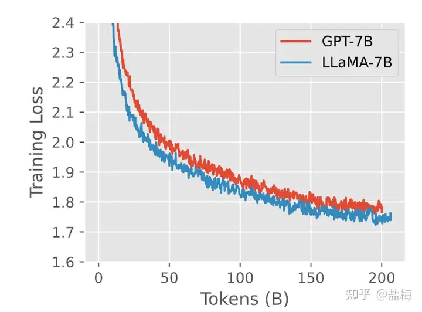

GPT-3结构和Llama结构训练对比

### 3.2 为什么模型结构设计的更加瘦长？

在我们的集群条件下，想要达到Llama2-13B的训练效率，即1750 tokens / per gpu / per second，那么就需要将global batch size 增大到Llama2-13B的四倍（我们集群带宽低于Llama2的训练集群，因此需要更多的梯度累计减少通讯）。根据我们的前期实验，在更大batch size的训练下，更加瘦长的网络具备更好的泛化性能。因此我们将层数增加到52层，同时缩减了隐藏层大小，使得总体参数量和Llama2-13B模型是相当的。因为模型训练的global batch size更大，我们将学习率设置为Llama2-13B的两倍，这样可以保证训练时梯度的方差是一致的。

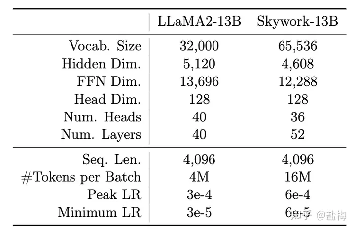

Skywork-13B和Llama2-13B结构对比

## 4\. 模型评估

在训练之前我们需要一套评估体系明白我们训练的模型：1. 目前模型效果怎么样是否还应该继续训练。2. 和其他开源模型比较差距还有多大，继续训练多久预期能超过。（可能是老板最关心的两个问题）

传统的评估主要看的是Training loss或者Benchmark上的指标。但我们认为着两种评估有以下问题：

1.  Training loss因为数据配比的原因是一个整体的指标，并且不同模型不能相互比较，比如A模型的代码占比20%，B模型的代码占比10%，那么A模型训练同样token数下训练Loss会显著低于B模型，因为代码数据中有很多可以预测的结构，因此loss相对更低。不同模型是无法直接比较Training loss来对比效果的。
2.  Training loss第二个问题是可能会选择出一个更加过拟合的模型，我们知道即使经过了精心的清洗，训练数据中还是不可避免的有很多重复信息，并且在训练过程中常见操作是上采样一些高质量数据，比如Llama1的训练中会上采样book来源的信息。而如果对这些重复信息&上采样信息过拟合，那么training loss会更低，但我们实际上是需要泛化性能更好的模型。
3.  Benchmark的问题就更加严重了，第一是因为benchmark是公开数据，非常容易针对，通过In-domain数据的训练即可增强对应benchmark上的效果，但模型的能力并不一定强。
4.  此外Benchmark评估一般是准确率，准确率是一个不连续的指标（对大模型涌现的解释），可能训练500B token，benchmark上的指标都没有任何变化，因此我们无法根据benckmark上的准确率推测持续当前训练模型会达到一个什么样的效果。
5.  Benckmark评估具有一定的波动性&可操作性，不同Prompt选择和答案提取方式会对结果产生很大的影响，

### 4.1 我们提出的方法：多领域数据损失评估方法

大语言模型本质上是让预测下一个词更加准确。我们认为评估基础大模型一个重要的方式是评估在各大领域（比如中英，金融，技术，政务，代码）上语言模型生成文档的概率。在语言模型建模中一般使用Cross Entropy损失函数，整体的损失函数为每个位置预测真实词损失的平均，则有：

loss\=−∑i\=1nlog(pi)/n\=−log(∏i\=1npi)/n

其中n是文档的长度，即token数， pi 是位置i上真实词的概率，我们知道中每一个位置上真实词的概率的联乘为生成该文档的概率，这样我们就将loss和生成文章的概率联系在了一起。而不同模型因为使用的分词器不同，具有不同的token数，因此对损失函数乘以token数目n就仅考虑生成文章的概率部分，不同模型也可以进行比较。

这一评估方法本质和似然（likelihoold）的定义是相似的，只不过我们是以我们Skywork模型分词token数为基准，对其他模型的loss进行了标准化，使得最终指标更像是一个大家可以直接比较的loss值。

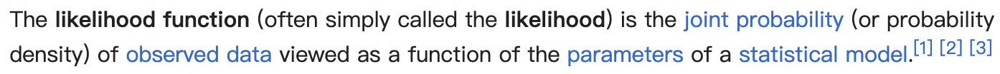

wikipedia上关于似然likelihood的定义

基于上述分析，我们构建了中文，英文，代码，arxiv文章等多个领域的验证集，这些验证集的构造方法是选取2023年7月份（项目开始的时间）发布的最新的高质量文章数据，一来是本质上是我们需要模型具备根据历史训练数据来预测最新数据的能力。二来是这些数据绝对不可能在我们的模型和其他模型的训练数据中出现，可以最公平的比较各个模型的能力。并且我们经过了仔细的人工校对，确保文本通畅，言之有物且来源多样。对于每个领域我们构建了大约选取了几百到一千篇文章的验证集。

NLP领域之前有使用验证集Loss来评估模型的效果，但大多只使用固定的，单一的集合进行评测。提出用多领域滚动更新数据评估的方法我们应该是首创。

使用多领域验证集监控模型训练效果有以下好处：

1.  **易于计算**。计算多个benckmark上的效果，完整进行一次评测至少需要3个小时以上，而即使是一千篇文章的损失计算，只需要几分钟就能算出来。
2.  **易于收集**。我们可以不断使用最新数据评估我们模型能力。数据收集Pipeline构建完成后，我们只需要花几个小时的时间即可构建高质量的评估集。并且我们关注什么下游指标就可以构建什么领域的验证集，评估会更加全面。
3.  **训练敏感**。loss是一个连续的指标。训练过程中可以持续观察变化，而不像评价准确率的指标需要等到模型grokking才能看到效果上的变化。
4.  **模型无关**。标准化后可以在不同模型之间进行比较。
5.  **可预测**。因为loss是平滑且连续的指标，我们可以根据验证损失进行绘图，预测还需要多少训练量可以达到预期的效果。
6.  **和最终综合指标高度相关。**下图是我们构建的英文验证集损失和常用benchmark指标的曲线。可以看到随着验证集loss的下降，benchmark上的平均指标几乎是线性提升的。

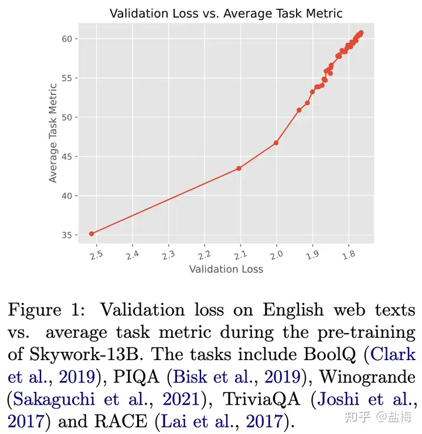

英文验证集损失和指标效果曲线

7\. **效果在时间维度稳定**。在预训练阶段我们是监控23年7月份最新文章的验证集损失指标，在模型训练结束后我们监控的是9月份-10月份新发布文章的验证集损失指标，两者的结果几乎完全一致。我们开源了评估脚本和评估数据。[23年9月评估数据下载地址](https://link.zhihu.com/?target=https%3A//huggingface.co/datasets/Skywork/ChineseDomainModelingEval)

8\. **可滚动更新不担心被针对**。如果有新模型发布了，我们只需要用最新数据验证集评估下模型的损失，就可以知道其效果如何，不用担心固定的benchmark被针对，导致效果失真。

## 5\. 模型训练

### 5.1 为什么我们要采用两阶段训练？

在训练数据收集中，我们发现存在两类数据，一类是相对量级较大的通用语料，存储一般以TB为单位，他们的来源于网页爬取，书籍数据，arxiv数据等，我们称之为Skypile-MAIN。另一部分则是相对少量的有监督数据，这些数据来源是某些特定的做题网站，数据形式一般是问题+答案，存储量级一般是MB到GB，因为这些数据大多STEM（数学，科学，工程，技术）相关的，我们称之为Skypile-STEM。在构建整个训练计划的时候，如果将两部分数据直接合并，那么STEM数据会被MAIN数据淹没，而如果通过上采样的方式提升STEM数据的比例进行训练，那么一是采样多少倍不太确定，二是这些数据会对普通任务是否会造成伤害也难以衡量。因此我们决定先用Skypile-MAIN数据让模型学习通用的能力，然后再给予Skypile-STEM数据提升模型的数学能力，逻辑推理能力，解题能力等。

### 5.2 第一阶段预训练

第一阶段预训练我们使用的数据配比如下英文占比52.2%，中文占比39.6%，代码占比8%，在兼顾中文和英文上的表现的同时，代码能力也能有保证。

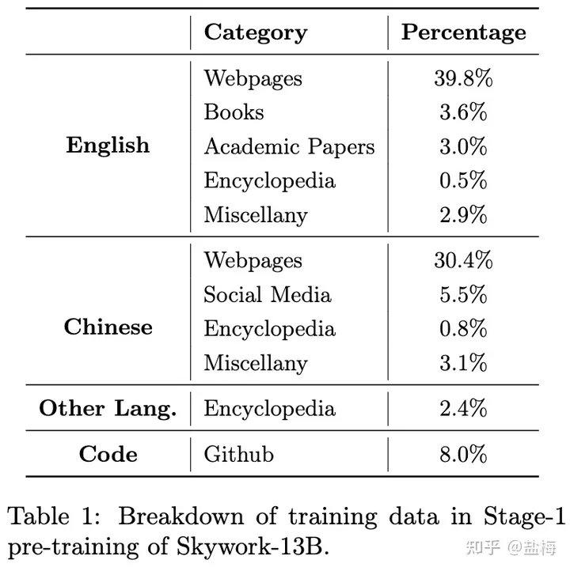

第一阶段数据配比

第一阶段预训练分为两个训练session，我们原本计划训练2T token，但训练完成后发现各项能力均没有饱和，同时我们又有新的高质量数据清洗完成，因此进行第二个session的训练，这一个session大约训练1.1T token。session-2数据配比大致和session-1相似，只不过数据源略有改动。第一阶段训练完成后模型训练了3.1T。我们将session-1训练完成的2T token的模型和session-2训练3.1T token的模型均开源。[Skywork-13B-Base-2T](https://link.zhihu.com/?target=https%3A//huggingface.co/Skywork/Skywork-13B-Base-3.1TB) [Skywork-13B-Base-3.1T](https://link.zhihu.com/?target=https%3A//huggingface.co/Skywork/Skywork-13B-Base-3.1TB)

下图是我们第一阶段预训练的各项指标曲线。可以看到，在session-1训练完成后模型各项指标还没有收敛，在session-2训练完成后，各项指标趋于饱和。

一排中间的图是我们的英文训练损失和其他模型的对比。一排右边的图是我们的中文训练损失和其他模型的对比。结果表明，英文综合能力LLama2-13B显著高于其他的的开源模型，而中文能力Skywork-13B则显著高于其他模型。

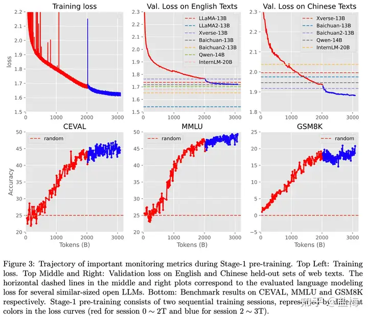

第一阶段预训练各项指标演化图示

### 5.3 第二阶段预训练

第二阶段预训练，我们将Skypile-STEM数据加入到预训练中，第二阶段训练了130B token，最终模型为我们的Skywork-13B-Base模型，总计训练3.2T token。Skypile-STEM中大量数据是数学，科学，工程等做题相关数据，而Benchmark中很多也是做题，因此我们也可以将Skypile-STEM视作In-domain数据，In-domain是和榜单评估高度相似的数据。

### 5.4 In-domain数据训练的收益和危害

为了验证In-domain数据训练对模型训练的影响，我们将训练500B token后的模型直接使用Skypile-STEM数据继续训练1B token，可以看到主流的benchmark上CEVAL和GSM8K得分均**大幅上涨**，但在中英领域验证损失上则出现了明显的上升。表明通过In-domain数据的训练，**模型做题能力和刷榜能力会大幅提升，但其通用能力是大幅下降的**。同时也说明，benchmark是一个相对容易针对和提升的指标，只需要在对应benchmark的In-domain数据上加大训练，就可以将各项能力本来很弱的模型提升到很高的水平，但这是以损失通用能力为代价的。我们将训练500B时模型存档进行开源[Skywork-13B-Base-500B](https://link.zhihu.com/?target=https%3A//huggingface.co/Skywork/Skywork-13B-Base-500B)。

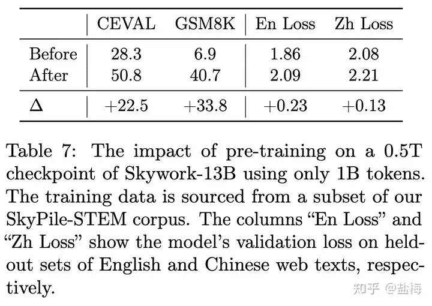

第一阶段训练500B后直接训练Skypile-STEM数据各项指标的变化

### 5.5 第二阶段数据配比

在第二阶段预训练中，我们仔细调整了数据配比，原因如上所述，我们希望赋予模型解题能力的同时，更小程度的破坏其通用能力上的效果。最终第二阶段预训练中20%来自Skypile-STEM，80%来自Skypile-MAIN避免灾难性遗忘。我们尝试了从10%到40%的Skypile-STEM数据权重，发现20%的占比可以维持验证集损失不上升的同时，benchmark指标能有提升。

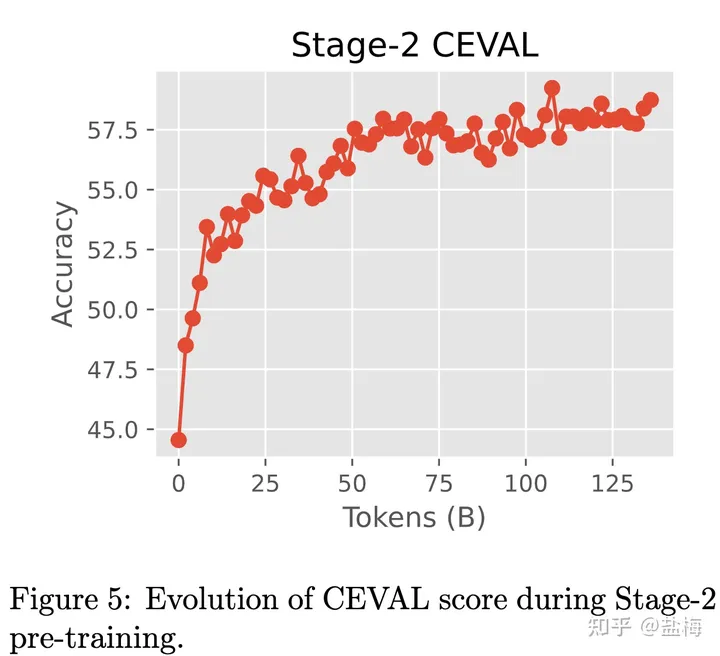

第二阶段训练模型CEVAL效果变化

## 6\. 最终效果

### 6.1 Benchmark评估效果

我们在一些主流Benchmark上评估了我们模型的效果，结果如下图所示，Skywork-13B模型在开源13B规模模型中综合能力排名第一。

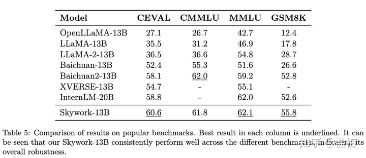

Benchmark评估效果

我们没有针对榜单做特别多的评测，但在模型开源三天后就有01万物的伙伴对我们模型进行了较为全面的评测，结果显示Skywork-13B在13B参数规模中处于领先。

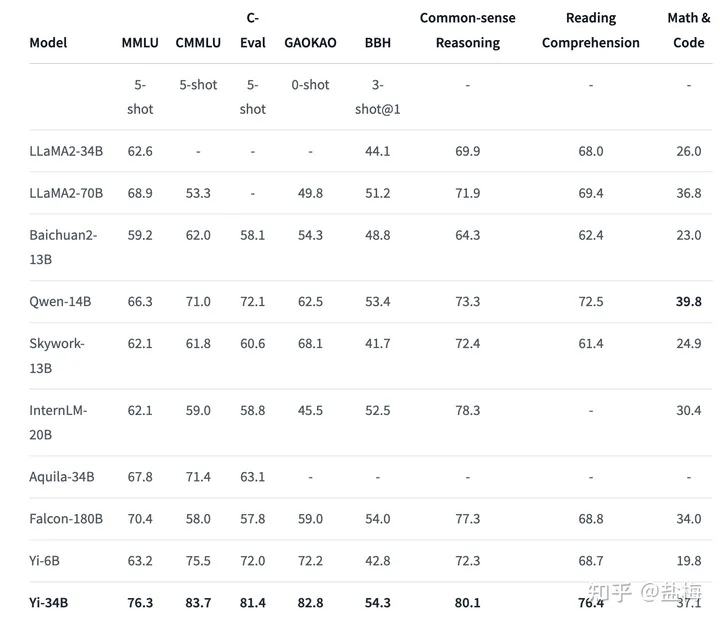

Yi-34B Hugging Face Homepage

### 6.2 领域验证集评估

我们对多个领域筛选出2023年9月份新发布的几百到上千篇高质量文章，并人工进行了核对。保证所有的测试数据不在天工模型以及其他所有模型的训练集中。下图列出了不同开源模型的困惑度，结果显示天工Skywork-13B-Base模型在技术，电影，政务，金融，通用等多个领域取得最优效果，证明了我们的Base模型的中文能力处于国内开源模型最强水平。标准化的领域验证集损失（loss）取指数即为困惑度（Perplexity），转换后可读性更强。

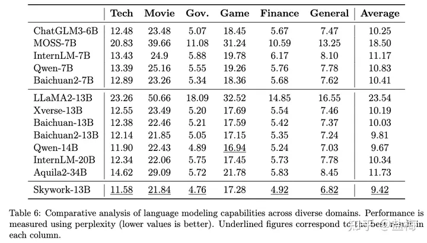

开源模型领域验证集PPL对比

## 7\. 如何看待大模型刷榜：榜单效果是否能代表真实效果？

为了验证各大模型的真实效果，我们针对GSM8K榜单使用GPT-4构建了一批验证集，并人工核对的正确性。在下面的实验中我们将模型在GSM8K训练集上的损失称为Ltrain，测试集上的损失称之为Ltest，在我们构造验证集上的损失称之为Lref。那么数学能力很强的大模型应该是 Ltest ， Ltrain 以及我们 Lref 同样的低，因为模型已经能在任何数据上进行很好的泛化了。 在Ltest低但Lref上高，说明模型可能有测试集污染的问题。如果在Ltrain上低但Lref上高则说明模型过分的在In-domain数据上进行了预训练，但模型的泛化性能不强。如果三者趋势一致，那么Lref可以作为模型数学能力评估的指标，越低代表模型的数学能力越强。选取GSM8K做测量是因为GSM8K是一个生成式任务，可以直接用题目和答案构建验证集测量loss，而其他的Benchmark比如MMLU，CEVAL等是选择题，模型只用回答ABCD，不是很适合测试损失函数。我们将构建的验证集进行了开源，下载地址[mock\_gsm8k\_test](https://link.zhihu.com/?target=https%3A//huggingface.co/datasets/Skywork/mock_gsm8k_test)。

下图Δ1 =Ltest\-Lref表明数据污染的程度，如果越低说明数据污染越严重。 Δ2 =Ltest\-Ltrain表明模型在In-domain数据上训练程度，越大表明在In-domain上进行了更多的训练，则过拟合风险也更大。 Lref在 Δ1 和 Δ2 均建康的情况下，越低表明模型泛化性能越强。下图表明，我们的模型在数学能力上的泛化性能是更优的。

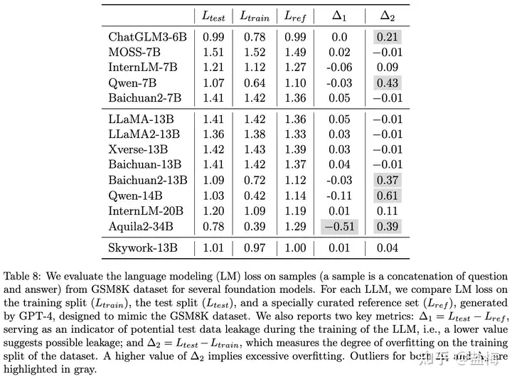

Mock-GSM8K验证集损失

## 写在后面

项目已经告一段落，也终于有时间能对过去几个月的工作进行一个总结。很高兴开源以后我们的工作得到了大家的认可。如果我们的工作对您有启发或者帮助的话，欢迎在Github上Star我们的项目，或者引用我们的论文。

1.  Skywork-13B Github开源项目地址，会持续更新更多更好的模型，包括对话模型，多模态模型等。

2\. 技术报告地址，如果您想了解更多内容请查阅我们的技术报告。如果您觉得我们的工作对您有帮助，欢迎引用。

3\. Hugging Face地址，包含所有模型参数，预训练数据，评测数据的下载地址。
