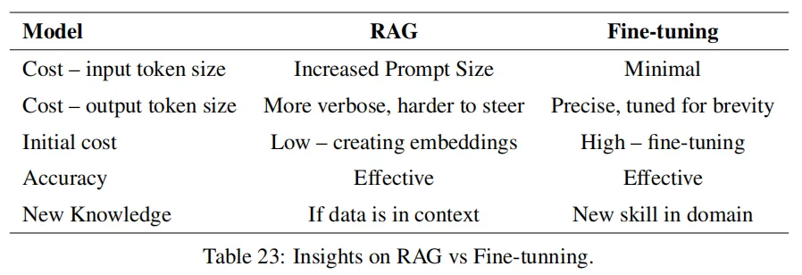

# 微调与 RAG 的优缺点分析

---

为什么用微调和 RAG 对比

开始可能有小伙伴会问我，为什么要拿微调和 RAG 进行对比，我自己的理解，主要是因为这个两个所代表的其实是在现实情况中对系统的调优方案，即调整模型内和调整模型外。

纵观整个算法领域，对模型内部调整，不外乎是那几种方案，特征变化带来的模型结构调整（特征可以是隐式的内部特征，也可以是输入端或输出端的显式调整），以及通过数据变化带来的内部参数更新。无论是哪种方案，都会很大程度地影响模型的预测效果，一般情况，会为以模型为中心的系统效果带来很大的影响。

模型外的调整，不外乎就是增加一些外部的组件，例如规则、检索模块等，从而让整个系统的效果带来一些变化，在全新版本大模型时代，大模型为我们提供了更灵活的输入接口，即我们可以用 prompt 的方式灵活指导模型输出，可以给参考材料、额外信息、提特别要求甚至是通过描述、样例的方式即可让大模型的输出符合我们预期。

而 RAG 的出现，一方面是因为大模型具有很强的指令生成能力，另一方面是模型内调整在现实应用情况一些局限性，从而形成了一个目前重要的应用思路，实践上最鲜明的两个特点，一个是内容批量的可控性和及时性，另一个是这种更新并不需要更新模型参数从而规避效果波动的风险。至于规则等的方案，某种程度上，其实就是 RAG 的一种特殊情况，例如什么情况需要触发什么回复策略的约束。

因此，我自己是认为，要去权衡 RAG，不得不把他和微调进行对比，探索两者各自的优势，进一步在方案选型的时候，从感性理解到理性对比判断。

## 微调和 RAG 的优劣势对比

这里我写我的分析调研总结过程吧，然后汇总结论。

### 论文讨论

首先是论文层面，有一篇论文对这方面进行了讨论：“Fine-Tuning or Retrieval?，Comparing Knowledge Injection in LLMs”，这又是一篇微软的论文（怎么最近老是无意间碰到微软的论文，频率很高），这篇论文本身是从信息注入的角度来进行讨论的，从文章的实验看来，微调的效果始终比不过 RAG 的效果，而究其原因，作者在前文中其实有提到具体的表现，摘录一下：

- 领域知识不足。对未接触过的内容，效果就会很差。
- 信息过时。知识的更新只取决于训练集的截止时间。
- 记忆力问题，对训练过程接触的知识，很大可能会忘记（说白了就是没学会），对已经学会的知识，也可能因为后续的训练而遗忘。
- 推理失败。对已有知识，可能也会因为使用失败而让回答出现问题。

另外还发现了一篇还不错的论文，RAG vs Fine-tuning: Pipelines, Tradeoffs, and a Case Study on Agriculture（嗯，这篇也是微软的），这里面也是做了比较多的实验和尝试，给出一些基于实验的分析，这篇更像是一篇调研报告，挺建议大家回头去精读的，我这里把比较重要的这张图摆出来。

这篇相比上面一篇，分析的维度更丰富了，有考虑成本等问题，但论文的分析还是有一定局限性，很多情况其实不会考虑到现实情况的很多问题，例如，数据数量和质量问题，实际业务需求等。

### 社区讨论

有关社区的讨论，一般是通过百度谷歌等渠道来检索类似的文章讨论，另外知乎、微信搜索也是不错的渠道。我找到的比较好的讨论，我都列举出来吧：

- 何时应微调 LLM？何时又该使用 RAG？：https://www.zhihu.com/question/638730387
- 如何选择最适合你的 LLM 优化方法：全面微调、PEFT、提示工程和 RAG 对比分析：https://zhuanlan.zhihu.com/p/661830285
- 大模型优化：RAG 还是微调？https://blog.csdn.net/qq\_41929396/article/details/132689632
- RAG 与微调—哪个是提升 LLM 性能的最佳工具？https://zhuanlan.zhihu.com/p/679528711
- 专补大模型短板的 RAG 有哪些新进展？这篇综述讲明白了：https://www.jiqizhixin.com/articles/2024-01-08-8

这里尽量不要读个一两篇就完事了，最好多读几篇，能理解的更加全面完整。

### 汇总结论

这里我分几个方面来进行对比吧。

首先是知识层面，这个应该是 RAG 使用者最关心的。

- RAG 对知识的更新时间和经济成本更低。不需要训练，只需要更新数据库即可。
- RAG 对知识的掌控力会更强，相比微调更不用担心学不到或者是遗忘的问题。
- 但是如果模型强缺乏某个领域的知识，足量数据的微调才能让模型对该领域有基本的概念，如果不具备领域知识基础，RAG 仍旧无法正确回答。

然后是具体任务效果的问题。

- RAG 相比微调能更容易获得更好的效果，突出的是稳定性、可解释性。
- （有点经验之谈了）对任务模式比较简单的任务，微调能触碰到更高的上限，但是对训练、数据等方面的要求会更苛刻。
- 幻觉方面，RAG 从各种实测来看，短板基本都在检索模块，只要检索不出大问题，整体效果还是 RAG 比较有优势的。

第三块来聊成本了，现实应用很难避开成本的问题。

- 训练角度，RAG 的成本就是更新数据库，但是微调就需要大量的显卡、时间资源。
- 推理角度，考虑到 RAG 本身需要检索，而且检索层为了确保检索准确，还需要很多额外工作，所以推理的耗时会比微调多，但具体多多少，就要看检索模块的复杂程度了，如果这里面还需要额外调大模型，那成本就会多很多，如果只是小模型之类的，那这个增加可以说是忽略不计。微调后的大模型直接使用，和原本模型的耗时一致。
- 系统拓展角度。随着项目的发展，大模型训练不一定能支撑多任务，而拿着大模型训好几个，对部署而言并不方便。

上面的内容所体现出来的，更多是 RAG 的优势，看起来似乎微调就没有什么好处了。但事实并非如此，RAG 还是有很多不适用的环境的。

- RAG 依赖知识库。如果不具备构造知识库的条件，那 RAG 无从谈起，例如没有具体的业务数据，或者是机器不支持支撑检索之类的。
- 业务需求并非对知识依赖。例如某些业务的话术生成，更多是对语言风格的约束，此时要么通过 prompt 解决，要么就是构造业务数据来进行训练即可，根本没有构造 RAG 的必要。
- 依赖实时信息而非固有信息。直接举例，对话摘要应该是大模型具有的比较强的能力，这种任务更多是依赖收到的对话记录，而非一些固有存储好的内容，此时通过工程手段直接把信息获取导入到模型即可，不需要把对应内容入库了。如果对对话摘要的内容不满意，则应该是通过 prompt 和微调来解决。当然有人可能会说通过 few-shot 的方式，可以用 RAG，这个当然是可以的，但就不是必须了。
- 指令不生效或者领域知识完全不具备。这个不多解释了，大模型此处是短板，那即使是 RAG，把答案摆在面前，也解决不了问题。
- 内容会受到检索结果局限。有些创造性的任务，本身是想通过大模型获取新的灵感，然而检索结果给到大模型后，大模型往往容易受到限制，这个限制在有些时候是好事，但并非所有时候。

## 技术方案分析案例

借助两个比较典型的案例，大家应该能体会这两者的区别了。

### 产品百科问答

电商场景下，客服都要具备一个能力，就是产品百科问答，用户会需要咨询某些商品的属性等细节消息，这是一个很具体的场景了。然而实际我们需要面对的，除了这个功能本身，还需要解决一个问题，即商品信息是需要更新和变化的，例如新商品上架、价格优惠修改等，这个信息是需要快速反映在问答系统中的，此时我们 RAG 非常有必要性。

- 商品信息的更新，不定期且频繁，这种更新通过微调来做，敏捷度不足，风险也比较高。
- 知识如果是结构化，本身用于微调训练并不方便，需要转化，但是数据库存储则比较方便。
- 商品型号很多很接近，容易混淆，大模型很容易出现“张冠李戴”现象。

### 日常工作工具

写周报、灵感、工作日志、修改一份材料、查错查重、话术推荐、会议纪要之类的，类似这些问题，我们更多的日常使用方式就是 prompt+大模型完成，我们做起来非常自然，可能顶多会根据自己的需求加一些例子，但往往不会优先考虑 RAG。

- 对固有信息要求不高，甚至没有需求。
- 供给检索的数据，如果不是因为产品本身的信息收集，一般情况下很难获取，对 RAG 而言可以说是无米之炊了。
- 类似灵感的任务，案例反而可能限制模型发挥。
- 要求的更多是指令的执行能力，这个如果不具备，很可能就要考虑通过微调来整了。

---

我是朋克又极客的 AI 算法小姐姐 rumor

北航本硕，NLP 算法工程师，谷歌开发者专家

欢迎关注我，带你学习带你肝

一起在人工智能时代旋转跳跃眨巴眼
