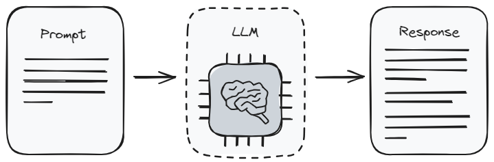
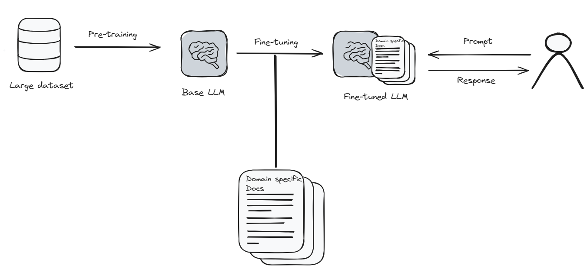
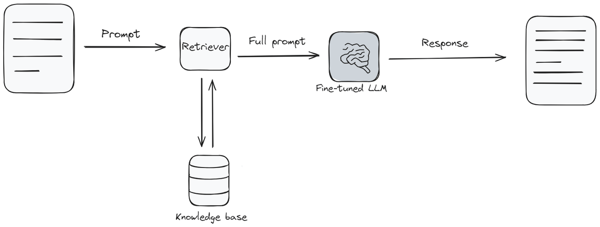
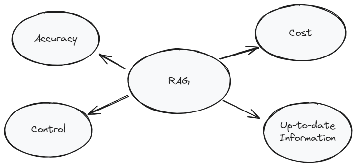

# 提示工程 vs 微调 vs RAG

---

自从大型语言模型（LLM）和先进的聊天模型发布以来，人们已经使用了各种技术来提取这些人工智能系统的期望输出。其中一些方法涉及改变模型的行为，以更好地与我们的期望相一致，而其他方法则侧重于增强我们查询 LLM 的能力，以提取更精确和相关的信息。

像[检索增强生成（RAG）](https://research.ibm.com/blog/retrieval-augmented-generation-RAG)、[提示工程](https://www.promptingguide.ai/introduction/basics)和[微调](https://www.turing.com/resources/finetuning-large-language-models)是最常用的技术。在 MyScale 上，我们已经详细讨论了[检索增强生成（RAG）](https://myscale.com/blog/zh/how-does-retrieval-augmented-generation-system-work/)和微调。在微调中，我们讨论了两种技术，[使用 openai 进行微调](https://myscale.com/blog/zh/finetuning-an-llm-using-openai/)和[使用 hugging face 进行微调](https://myscale.com/blog/zh/how-to-fine-tune-llm-from-huggingface/)。

注意：

如果您还没有阅读我们的 RAG 和微调博客，我们强烈建议您在开始本文之前先阅读它们。

今天的讨论有点不同。我们从探索转向比较。我们将看看每种技术的优缺点。这很重要，因为它将帮助您了解何时以及如何有效地使用这些技术。所以让我们开始比较，看看每种方法的独特之处。

## 提示工程

提示是与任何大型语言模型进行交互的最基本方式。这就像给出指示。当您使用[提示](https://www.techtarget.com/searchenterpriseai/definition/AI-prompt)时，您告诉模型您希望它给您提供什么样的信息。这也被称为提示工程。这有点像学习如何提出正确的问题以获得最佳答案。但是它有一定的局限性。这是因为模型只能返回它在[训练](https://www.run.ai/guides/machine-learning-engineering/llm-training)中已经了解的内容。

提示工程的好处在于它非常直观。您不需要成为技术专家才能做到这一点，这对大多数人来说非常好。但是，由于它在很大程度上依赖于模型的原始学习，它可能无法始终提供您所需的最新或最具体的信息。在处理一般主题或仅需要快速答案而不涉及太多细节时，这是最好的选择。

### 优点：

1.  **易于使用**：提示工程用户友好，不需要高级技术技能，适用于广泛的用户群体。
2.  **成本效益**：由于使用[预训练模型](https://encord.com/glossary/pre-trained-model-definition/)，与微调相比，计算成本较低。
3.  **灵活性**：可以快速调整提示以探索不同的输出，无需重新训练模型。

### 缺点：

1.  **不一致性**：模型的响应质量和相关性可能会根据提示的措辞而有很大差异。
2.  **定制能力有限**：定制模型的响应能力受限于创造有效提示的创造力和技巧。
3.  **依赖模型的知识**：输出仅限于模型在初始训练过程中学到的内容，对于高度专业化或最新信息，效果较差。

## 微调

微调是指对语言模型进行更新和特殊训练。可以将其视为更新手机上的应用程序以获得更好的功能。但在这种情况下，应用程序（模型）需要大量的新信息和时间来正确学习所有内容。这有点像模型回到学校。

由于微调需要大量的计算资源和时间，因此可能会很昂贵。但是，如果您需要语言模型非常了解特定主题，那么微调是值得的。这就像教模型成为您感兴趣的领域的专家。在微调之后，模型可以给出更准确、更接近您寻找的答案。

### 优点：

- **定制能力**：允许进行广泛的定制，使模型能够生成针对特定领域或风格的响应。
- **提高准确性**：通过在专门的数据集上进行训练，模型可以生成更准确和相关的响应。
- **适应性**：微调的模型可以更好地处理特定领域或原始训练中未涵盖的最新信息。

### 缺点：

- **成本**：微调需要大量的计算资源，比提示更昂贵。
- **技术技能**：这种方法需要对[机器学习](https://en.wikipedia.org/wiki/Machine_learning)和[语言模型架构](https://kdb.ai/learning-hub/articles/large-language-model-architecture/)有更深入的了解。
- **数据要求**：有效的微调需要大量且精心策划的数据集，这可能很具有挑战性。

**相关文章**：[如何构建推荐系统](https://myscale.com/blog/zh/build-a-recommendation-system-with-openai-and-myscale/)

检索增强生成（RAG）将常规语言模型与类似[知识库](https://www.zendesk.com/blog/knowledge-base/)的东西混合在一起。当模型需要回答问题时，它首先从知识库中查找并收集相关信息，然后根据该信息回答问题。这就像模型快速检查信息库以确保给出最佳答案。

RAG 在需要最新信息或涉及比模型最初学习的主题范围更广的答案时特别有用。在设置和成本方面，它介于两者之间。它非常好，因为它帮助语言模型给出新鲜且更详细的答案。但是，与微调一样，它需要额外的工具和信息才能发挥良好的效果。

RAG 系统的成本、速度和响应质量严重依赖于向量数据库，这使其成为 RAG 系统的非常重要的一部分。[MyScale](https://myscale.com/)就是这样一个向量数据库，它不仅收费几乎是其他向量数据库的一半，而且性能提高了 3 倍。您可以在这里查看[基准测试](https://myscale.github.io/benchmark/#/benchmark)。最重要的是，您无需学习任何外部工具或语言即可访问 MyScale，您可以通过简单的 SQL 语法访问它，这使其成为开发人员的理想选择。

### 优点：

- **动态信息**：通过利用外部数据源，RAG 可以提供最新和高度相关的信息。
- **平衡**：在提示的易用性和微调的定制性之间提供了一个折中方案。
- **上下文相关性**：通过额外的上下文增强模型的响应，从而产生更具见解和细致的输出。

### 缺点：

- **复杂性**：实施 RAG 可能很复杂，需要在语言模型和检索系统之间进行集成。
- **资源密集型**：虽然比完全微调要求的资源少，但 RAG 仍需要相当大的计算能力。
- **数据依赖性**：输出的质量严重依赖于检索到的信息的相关性和准确性。

## 提示工程 vs 微调 vs RAG

现在让我们对比一下提示工程、微调和检索增强生成（RAG）。这个表格将帮助您了解它们之间的区别，并决定哪种方法可能最适合您的需求。

| 特征             | 提示工程                                             | 微调                                                 | 检索增强生成（RAG）                                    |
| ---------------- | ---------------------------------------------------- | ---------------------------------------------------- | ------------------------------------------------------ |
| **所需技能水平** | 低：需要基本了解如何构建提示。                       | 中等到高：需要了解机器学习原理和模型架构。           | 中等：需要了解机器学习和信息检索系统。                 |
| **定价和资源**   | 低：使用现有模型，计算成本较低。                     | 高：训练需要大量计算资源。                           | 中等：需要检索系统和模型交互的资源，但比微调少。       |
| **定制能力**     | 低：受限于模型的预训练知识和用户构建有效提示的能力。 | 高：允许进行广泛的定制，以适应特定领域或风格。       | 中等：通过外部数据源进行定制，但取决于其质量和相关性。 |
| **数据要求**     | 无：利用预训练模型而无需额外数据。                   | 高：需要大量相关的数据集以进行有效的微调。           | 中等：需要访问相关的外部数据库或信息源。               |
| **更新频率**     | 低：取决于基础模型的重新训练。                       | 可变：取决于模型何时使用新数据进行重新训练。         | 高：可以整合最新信息。                                 |
| **质量**         | 可变：高度依赖于构建提示的技巧。                     | 高：针对特定数据集进行定制，产生更相关和准确的响应。 | 高：通过上下文相关的外部信息增强响应。                 |
| **使用案例**     | 一般查询、广泛主题、教育目的。                       | 专业应用、行业特定需求、定制任务。                   | 需要最新信息和涉及上下文的复杂查询的情况。             |
| **实施的便利性** | 高：使用现有工具和界面非常简单。                     | 低：需要深入的设置和训练过程。                       | 中等：涉及将语言模型与检索系统集成。                   |

该表格详细介绍了提示工程、微调和 RAG 的关键要点。它应该帮助您了解在不同情况下哪种方法可能最适合您。我们希望这个比较能帮助您选择适合您下一个任务的正确工具。

相关文章：[RAG 的工作原理](https://myscale.com/blog/zh/how-does-retrieval-augmented-generation-system-work/)

## RAG - 提升您的 AI 应用的最佳选择

RAG 是一种独特的方法，将传统语言模型的能力与外部知识库的精确性相结合。这种方法有几个突出的优点，使其在特定情境下特别有优势，相比仅仅使用提示工程或微调。

首先，RAG 通过实时检索外部数据，确保提供的信息是最新和相关的。这对于需要最新信息的应用非常重要，例如新闻相关查询或快速发展的领域。

其次，RAG 在定制和资源需求方面提供了一个平衡的方法。与完全微调相比，它不需要大量的计算资源，可以进行更灵活和资源高效的操作，使更多的用户和开发人员能够使用。

最后，RAG 的混合性质弥合了 LLM 的广泛生成能力和知识库中可用的特定详细信息之间的差距。这导致的输出不仅相关和详细，而且具有上下文丰富性。

优化的、可扩展的、具有成本效益的向量数据库解决方案可以极大地提高您的 RAG 应用的性能和功能。这就是为什么您需要[MyScale](https://myscale.com/)，一个基于 SQL 的向量数据库，它可以与主要的 AI 框架和语言模型平台（如 OpenAI、Langchain、Langchain JS/TS 和 LlamaIndex）进行平滑集成。使用 MyScale，RAG 变得更加[快速和准确](https://myscale.com/blog/zh/filtered-vector-search-in-myscale/)，这对于寻求最佳结果的用户非常有帮助。

## 结论

总之，您选择提示工程、微调还是检索增强生成（RAG）将取决于您项目的具体要求、可用资源和期望的结果。每种方法都有其独特的优势和局限性。提示工程易于使用和成本效益，但定制能力有限。微调以更高的成本和复杂性提供详细的定制。RAG 在提供最新和特定领域信息方面具有平衡性和中等复杂性。
