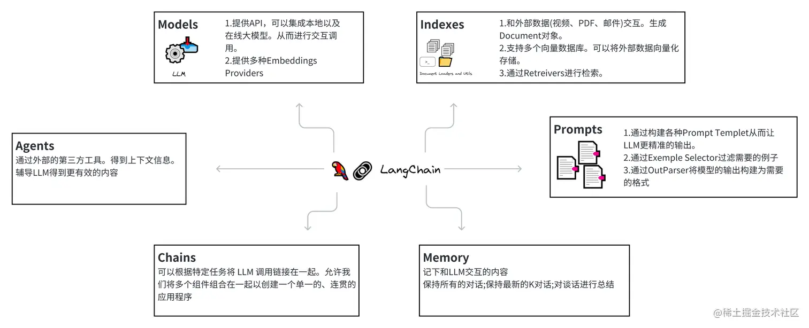
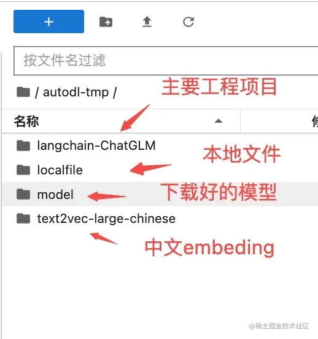
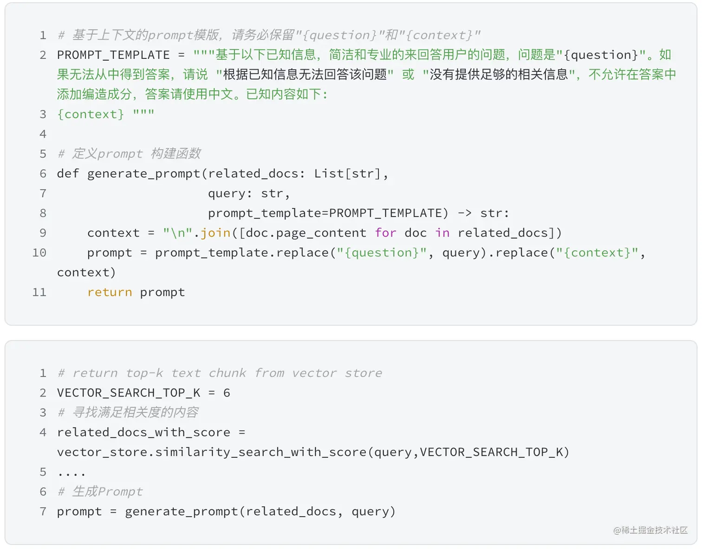

# 通过 LangChain+GLM 实现基于本地知识库的问答应用案例

---

## LangChain 是什么？起到什么作用？

LLM 模型本身已经掌握了一定的知识。但是如果想让模型对一些“它”不了解的内容进行回复时。我们需要先要告知模型一些“额外”的内容（当然也可以通过预训练和 finetunin 的方式对 LLM 进行微调、这个可以再另一篇文章做说明）。这些“额外”的内容可能是一份 PDF 文档、或者是某个视频。这些就是“外部知识库”。我们期望 LLM 可以帮我们对这些“外部知识库”进行的问答、总结。这个时候就可以用到 LangChain。

简单说 LangChain 的作用如下：

1.  可以将 LLM 模型与外部数据源进行连接
2.  提供一些组件可以更高效的和 LLM 模型进行交互。比如对向量数据库的支持。

## LangChain 包含的组件

#### 组件说明



本文并不会对 LangChain 所包含的组件进行详细的说明。本次主要涉及**Models**、**Indexes**、**Prompts** 3 个组件(其他组件另开章节再说，也可以参考可以参考 [LangChain Doc 文档 - Pyhton](https://python.langchain.com/en/latest/index.html))。Models 主要负责和本地以及在线 LLM 的交互。Indexe 主要负责和外部数据源以及向量数据库打交道。Prompts 是给 LLM 更精准的输入信息以及输出格式。

#### **简单举例介绍-爬取网页并输出 JSON 数据**

LLMRequestsChain 是 LangChain 提供的一个 API。可以直接取得访问 URL 的 Html 内容并进行解解析。参考链接：[LangChain-LLMRequestsChain](https://python.langchain.com/en/latest/modules/chains/examples/llm_requests.html)

```py
from langchain.prompts import PromptTemplate
from langchain.llms import OpenAI
from langchain.chains import LLMRequestsChain, LLMChain

# 和OpenAI的GPT 模型进行交互。
llm = OpenAI(model_name="gpt-3.5-turbo", temperature=0)

# 构造Prompt 模版
template = """在 >>> 和 <<< 之间是网页的返回的HTML内容。
网页是新浪财经A股上市公司的公司简介。
请抽取参数请求的信息。

>>> {requests_result} <<<
请使用如下的JSON格式返回数据
{{
  "company_name":"a",
  "company_english_name":"b",
  "issue_price":"c",
  "date_of_establishment":"d",
  "registered_capital":"e",
  "office_address":"f",
  "Company_profile":"g"

}}
Extracted:"""

prompt = PromptTemplate(
    input_variables=["requests_result"],
    template=template
)

# 利用LLMRequestsChain 访问Url
chain = LLMRequestsChain(llm_chain=LLMChain(llm=llm, prompt=prompt))
inputs = {
  "url": "https://vip.stock.finance.sina.com.cn/corp/go.php/vCI_CorpInfo/stockid/600519.phtml"
}

response = chain(inputs)
print(response['output'])


# 返回结果
{
  "company_name":"贵州茅台酒股份有限公司",
  "company_english_name":"Kweichow Moutai Co.,Ltd.",
  "issue_price":"31.39",
  "date_of_establishment":"1999-11-20",
  "registered_capital":"125620万元(CNY)",
  "office_address":"贵州省仁怀市茅台镇",
  "Company_profile":"公司是根据贵州省人民政府黔府函〔1999〕291号文,由中国贵州茅台酒厂有限责任公司作为主发起人,联合贵州茅台酒厂技术开发公司、贵州省轻纺集体工业联社、深圳清华大学研究院、中国食品发酵工业研究院、北京市糖业烟酒公司、江苏省糖烟酒总公司、上海捷强烟草糖酒(集团)有限公司于1999年11月20日共同发起设立的股份有限公司。经中国证监会证监发行字[2001]41号文核准并按照财政部企[2001]56号文件的批复,公司于2001年7月31日在上海证券交易所公开发行7,150万(其中,国有股存量发行650万股)A股股票。主营业务：贵州茅台酒系列产品的生产与销售,饮料、食品、包装材料的生产与销售,防伪技术开发;信息产业相关产品的研制和开发等。"
}

```

## 案例-基于本地知识库的问答应用

本案例参考[基于本地知识库的 ChatGLM 等大语言模型应用实现](https://github.com/imClumsyPanda/langchain-ChatGLM 'https://github.com/imClumsyPanda/langchain-ChatGLM')。利用 [langchain](https://github.com/hwchase17/langchain 'https://github.com/hwchase17/langchain') 实现的基于本地知识库的问答应用。通过 ChatGLM 对一份本地的文档进行解析。并根据解析内容对用户输入的问题进行回答。

#### 项目工程结构



#### 加载 ChatGlm 模型

由于 LangChain 没有对 ChatGLM 的支持，需要用自定义 LLM Wrapper 的方式封装 ChatGLM 模型。官方的实现参考：[How to write a custom LLM wrapper](https://python.langchain.com/en/latest/modules/models/llms/examples/custom_llm.html)。 同时借鉴在 huggingface 上的实现。加载本地 ChatGLM 模型。

相关代码

```py
model_name_or_path: str = "/root/autodl-tmp/model/chatglm-6b"
...
self.tokenizer = AutoTokenizer.from_pretrained(model_name_or_path,trust_remote_code=True)
model_config = AutoConfig.from_pretrained(model_name_or_path, trust_remote_code=True)
```

这里可以引申一个知识点，如何将 ChatGLM 进行本地化部署并通过本地 Api 对外提供服务。

#### 加载外部数据并进行检索

1.  通过 Unstructured File Loader 将从指定源进行数据的加载并生成 Document 对象并进行文本分割。具体可以参考 LangChain 官方文档[Unstructured File Document Loader](https://python.langchain.com/en/latest/modules/indexes/document_loaders/examples/unstructured_file.html) 。

    1.1 Document 对象说明。Document 对象主要包含了 page_content，以及 meta_content 两部分内容。

    ```py
    [Document    (page_content='LayoutParser : A Unified Toolkit for Deep Learning Based Document Image Analysis',      lookup_str='',      metadata={'source': '../../layout-parser-paper.pdf'},      lookup_index=0)]
    ```

    1.2 文本分割说明。需要文本分割的原因是每次不管是做把文本当作 prompt 发给 LLM，还是还是使用 embedding 功能都是有字符限制的。

2.  将外部数据向量化存储，并利用向量数据库进行检索。

    2.1 数据向量化并存储

    数据向量化可以简单理解为用一组浮点数据来表示一个实体对象。这个实体对象可以是视频、图片、文本。同时向量之间的距离衡量实体对象的相关性。小距离表示高相关性，大距离表示低相关性。在本例中是把一段文本内容转化成向量。选取的 Embeding Model 是[text2vec-large-chinese](https://huggingface.co/GanymedeNil/text2vec-large-chinese/tree/main)。但是 LangChain 本身并不支持这个 Model。可以通 HuggingFace 提供的 API 下载和加载 Model，并通过模型计算输入文本的 Embedding。

    LangChain 已经集成了很多向量数据库 Chroma / ElasticSearch / FAISS / Milvus / Pinecone 。我们可以直接使用这些向量 ��� 据库进行数据的存储和查询。在本案例中我们使用的是 FAISS 向量数据库。更多了解可参考[LangChain - Vectorstores](https://python.langchain.com/en/latest/modules/indexes/vectorstores.html)

    相关代码

    ```py
        # 通过HuggingFace来生成中文Sentence Embedding
        embedding = HuggingFaceEmbeddings(model_name='shibing624/text2vec-base-chinese')
        ...
        # 加载分割好的文本内容
        vector_store = FAISS.load_local(vs_path, self.embeddings)
    ```

    2.2 通过向量数据库进行相似性查找并构造 Prompt

    我们知道通过向 LLM 输入更多的上下文信息。LLM 可以输出更加精准的内容。所以通过 FAISS 提供的 similarity_search_with_score 接口函数。我们可以得到跟 query 相关的内容。从而构建更有效的 Prompt。

    相关代码
    

3.  和 LLM 交互得到输出结果

    相关代码

    ```py
    self.llm._call(prompt=prompt, history=chat_history):
    ```

延展内容

- 不同向量数据库的相似度检索方案对比
- 不同向量数据库的常用接口

## 参考文章

[Sentence Embeddings For Chinese & English](https://zhuanlan.zhihu.com/p/622017658 'https://zhuanlan.zhihu.com/p/622017658')

[LangChain Python Doc](https://python.langchain.com/en/latest/index.html 'https://python.langchain.com/en/latest/index.html')

[基于本地知识库的 ChatGLM 等大语言模型应用实现](https://github.com/imClumsyPanda/langchain-ChatGLM 'https://github.com/imClumsyPanda/langchain-ChatGLM')
