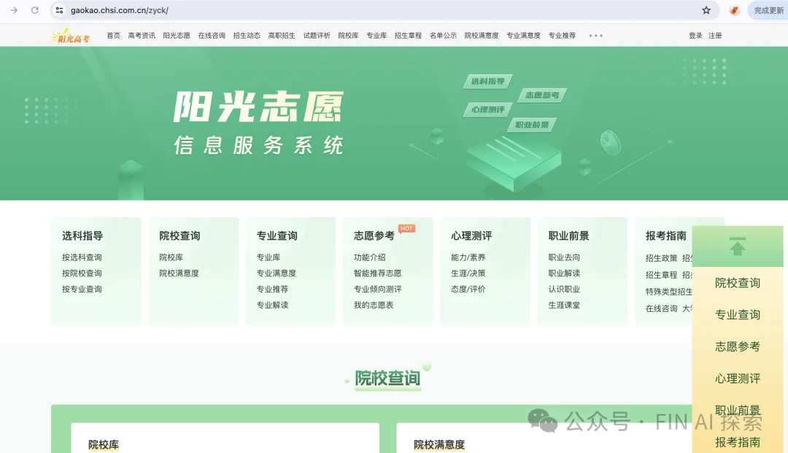

# 打造高考志愿规划 AIAgent(附代码)

---

研究志愿规划 AIAgent 初衷研究领域 AIAgent 方案. 多刷了刷抖音张雪峰老师直播录屏那些高赞视频, 还看了人民日报点评张雪峰说:科学填报志愿, 切莫被就业焦虑, 赚钱所绑架, 所有专业都有存在的意义... 然后就是满屏的一边倒支持张雪峰老师的评论. 就在去年 ChatGPT 问世前, 谁又能想到智力劳动就这么被替代了. 当初设计的专业分类. 定是没有预料到大模型带来的变革. 但也是同意人民日报说的, 高考志愿填报的信息差, 不能靠网红来补. 毕竟张雪峰老师机构的志愿填报太贵也太抢手. 更广大的考生还是要靠老师、家长、小红书、百度去填报志愿.  现在多加一个高考志愿规划 AIAgent.

**一、高考志愿规划 AIAgent 方案**

**领域 AIAgent 方案**

构建领域 AIAgent 是大模型在领域应用的途径之一. 该系列文章试图通过开源框架与数据手搓一个高考志愿填报 AIAgent 探讨以下问题:

- 1 大模型在 AIAgent 方案中的作用. 期望其是核心, 负责问题拆解、计划等功能  .
- 2 AIAgent 与领域模型、系统的协同.
- 3   领域数据准确性问题, 研究搜索引擎与领域知识库的结合.

**背景:张雪峰老师 3 小时到账 3 个多亿热搜**

张雪峰老师的峰学蔚来为 2024 年的考生推出了价值 17999 元的圆梦卡，该服务包含四次专业填报咨询、志愿规划视频等内容。尽管价格并不算低，但焦虑的家长们热情依旧不减, 2 万个名额已售空, 3 小时到账 3 个多亿, 太火爆了.百度查高考填报, 转到掌上高考. 对比张雪峰的志愿规划, 缺少的当前社会各行各业情况, 以及结合个人情况的分析.

张雪峰的直播关于院校选择、专业分析、备考方法等内容的输出.如告知想学气象专业的同学,清华气象专业和南京某非 985、211 院校气象专业单位基本上是一样的. 普通家庭的孩子更要优先选择一个可以让自己过得好的专业比所谓理想实际的多, 要选有专业壁垒的专业等等.  再加上风趣幽默的说话风格, 这波流量变现，合情合理。

接下来我们看看如何手搓一个高考志愿 AIAgent, 口号:让每一位考生都能享受到免费、个性化、精准的高考志愿规划服务！

**高考志愿 AIAgent 应该有的能力：**

**对标张雪峰老师.** 张雪峰老师的价值不在告知预估多少分能考什么学校.而是对社会各行业学校与就业的关系理解. 在学生想学法律, 又考不上五院四系, 张老师会建议期望就业地域的法学院好于外地一般 211 法学院.

1  预估的分数找到那些学校可以报考，这是基操, 也是当前在线志愿填报干的事.

2 四年后的行业前景

报考志愿需要的是四年后的就业前景. 通常用当前的行业前景. 但 19、20 年的考生, 当时房地产还在后高峰期, 选了建筑系, 可就亏了.

3 当前的行业就业情况

专业对口就业率, 刷张雪峰老师的视频看到这个专业名词, 又是个关键却难以获得的数据.

4 专业、行业潜规则

类似清华气象专业和南京某非 985、211 院校气象专业单位基本上是一样的. 大模型当然也不会知道这些, 因为他难以准确从噪音中区分事实. 这才是张雪峰老师的核心能力. 构建潜规则知识库并作为 AI Agent 的一个环节是需要重点探讨的问题.

5 基于学生、家庭、大学城市、产业间的关系提供建议.

如果将高考志愿 AIAgent 对标行业最优的方案提供者.  这里我们就能看到领域 AIAgent 的困难: **领域服务最核心的数据、规则**很可能**不可公开收集.**

接下来就开始我们手搓高考志愿 AIAgent 了.

**AIAgent 框架选择**

国外的 AIAgent 框架都先 Pass, 试用了下 MetaGPT 和 AutoGPT, 主要他们都是基于 OpenAI 大模型配置的,  改用国内的大模型有些麻烦.

字节的 Coze(coze.cn),  可以通过配置实现 AIAgent, 已有好些高考志愿的字节叫 Bot 的 AIAgent. 试用了下, 应该 Prompt 结合大模型实现的, 有个还连了搜索引擎.  但搜索引擎无法查询准确的高考分数线.  字节的 Coze 功能挺多,  有工作流, Action 等等. 可惜 API 还没发布.

选了蚂蚁金服的**AgentUniverse**, 简单测了下就跑通了测试用例, 关键他们还有个群可以直接问.

**搜索引擎用 KFind**

阿里的道哥出来创业, 道哥出品, 必是精品.  https://kmind.com 可以申请试用. 也可以后台发消息, 我之前已申请可以发邀请码.

**数据**

1   高考各省市的投档线，以及各校的投档线

2023 年高考各省市的投档线有, 但只找到 211 的 100 多所高校 2023 年的投档线数据,先用这个。

本来是希望搜索引擎做的, KFind 查高考分数效果不好, 天工 AI 搜索效果不错.

2 行业营业额与利润

AKShare(https://akshare.akfamily.xyz/data/index.html) 是基于 Python 的开源财经数据接口库，其中有行业指数行情数据, 但股票有跌有跌, 不足以代表行业当前前景。于是使用行业上市公司营业额与利润的汇总值代表行业当前.

3 行业就业情况

Boss 直聘等网站有行业收入、人员报告, 但要收集全行业信息并整理不容易. 公司年报中也有公司人数,  工资支出, 但 AKShare 中没有提供相关数据.

既然是做研究, 本着有啥用啥的原则, 太麻烦的事自然不做. 打算先用搜索看看效果.

4  专业、行业潜规则

这最关键的核心数据也是无法收集. 先将张雪峰老师的金句放到知识库, 再用大模型查询.

**初步方案:  
**

就是先设计个简单流程,  全要素问题能跑出个结果, 能将以上的数据都用上,重点测试下:

1 张雪峰老师的金句知识库泛化效果待观察.

2 大模型能做 AIAgent 的计划部分吗?

3 关键数据知道去搜索和查知识库.  有些 Text2SQL 的意思.

**二、 代码实现**

**例子：手工调用大模型&搜索引擎 KFind 回答填报志愿问题**

**提问：**

上海考生，预估 450 分。想离开上海，去其他一二线城市，之后希望在一二线城市工作，偏好技术与艺术结合的专业，如何填报志愿。

**回答：**

```

### 高考专业申报建议
在当今社会，随着科技与文化的深度融合，艺术设计领域展现出前所未有的活力与潜力，尤其在数字媒体、交互设计、视觉传达等方向，为有志于艺术创新与技术应用结合的青年学子提供了广阔的发展舞台。根据当前就业市场趋势及地域特色，以下是一份精心准备的专业申报建议，旨在帮助您做出更符合未来职业规划的选择。

#### 专业方向推荐
1. **数字媒体艺术**：结合艺术创意与数字技术，探索多媒体内容创作的新边界。
2. **交互设计**：聚焦用户体验，设计人与产品间的高效互动方式。
3. **视觉传达设计**：通过图形、文字等视觉元素，传达信息与理念，广泛应用于广告、包装等领域。
4. **游戏设计**：融合创意故事讲述、美术设计与软件开发，创造引人入胜的游戏体验。

#### 推荐申请院校（按城市）：
- **北京**：北京师范大学、北京工业大学，这两所高校在艺术与科技领域有着深厚的教学资源和研究基础。
- **广州**：暨南大学，其艺术设计学院在数字媒体与视觉传达方面享有良好声誉。
- **杭州**：虽然浙江中医药大学主攻医学领域，但在杭州这座城市，其周边的艺术氛围和技术环境对设计类学生亦有积极影响。
- **成都**：成都虽以成都中医药大学著称，但该市作为西南文化中心，艺术设计类实习与就业机会不容忽视。
- **南京**：南京理工大学，工程技术与艺术设计的交叉融合为学生提供独特视角。
- **武汉**：武汉大学，综合型大学背景下的艺术设计教育，有利于学生跨学科学习。
- **青岛**：青岛大学，地处海滨，艺术设计专业结合地域特色，发展潜力大。
- **苏州**：苏州大学，其艺术学院在传统与现代设计的结合上独具特色。

#### 就业展望
一二线城市，尤其是北京、深圳、上海等地，对数字媒体艺术、交互设计、视觉传达设计及游戏设计等专业的毕业生需求旺盛。
这些领域的应届生起薪可观，如北京平均月薪可达13283元，深圳和上海分别为12783元和12317元，反映出市场对高质量艺术设计人才的高度认可。

总之，在选择专业与目标院校时，建议结合个人兴趣、职业愿景及地域发展优势综合考虑，充分利用各城市的教育资源与产业环境，为未来职业生涯奠定坚实基础。
```

所谓手工就是人工拆解问题，提取关键信息，再构建问题发给大模型或搜索引擎。过程在下表中：


**AIAgent 复现**

上文写过期望大模型在方案中是核心, 负责问题拆解、计划等功能  . 这是后话，先将上面手工版本上在 AgentUniverse 框架中复现。

步骤 1：修改 agent 配置文件

```
sample_standard_app\app\core\agent\peer_agent_case\demo_executing_agent.yaml
```

sample_standard_app 是 AgentUniverse 提供的示例代码，我们就在其中修改。将大模型改为千问，搜索为 KFind，因为我们要用张雪峰老师金句作为核心规划一部分，所以还需要 AgentUniverse 中 Knowledge 功能。

```
info:
  name: 'demo_executing_agent'
  description: 'demo executing agent'
profile:
  prompt_version: demo_executing_agent.cn
  llm_model:
    name: 'qwen_llm'
    model_name: 'qwen-max'
    temperature: 0.4
plan:
  planner:
    name: 'executing_planner'
memory:
  name: ''
action:
  knowledge:
    - 'demo_knowledge'
  tool:
    - 'kfind_search_tool'
#mock_search_tool
metadata:
  type: 'AGENT'
  module: 'agentuniverse.agent.default.executing_agent.executing_agent'
  class: 'ExecutingAgent'
```

步骤 2：KFind 搜索调用

```
sample_standard_app\app\core\tool\kfind_search_tool.py
```

密钥，https://kmind.com 可以申请试用. 也可以后台发消息, 我之前已申请可以发邀请码.  代码如下：

```py

import requests
import json

from agentuniverse.agent.action.tool.tool import Tool, ToolInput
from agentuniverse.base.util.env_util import get_from_env

url = 'https://hikos.cn/kmind/api/act'

headers = {
    'Content-Type': 'application/json'
}

ACCESS_KEY = get_from_env("ACCESS_KEY")
ACCESS_SECRET_KEY = get_from_env("ACCESS_SECRET_KEY")

BASE_DATA = {
    "actCode": "searchAndAnswer",
    "accessKey": ACCESS_KEY,
    "accessSecretKey": ACCESS_SECRET_KEY,
    "actExecType": "sync",
    "isStreaming": False,
    "apiRequest": {
        "input": ""
    }
}


class KfindSearchTool(Tool):
    """The mock search tool.

    In this tool, we mocked the search engine's answers to search for information about BYD and Warren Buffett.

    Note:
        The tool is only suitable for users searching for Buffett or BYD related queries.
        We recommend that you configure your `SERPER_API_KEY` and use google_search_tool to get information.
    """

    def execute(self, tool_input: ToolInput):
        """Demonstrates the execute method of the Tool class."""
        new_data = BASE_DATA
        query_str = "{\"query\":\"{query_key}\",\"searchSource\":\"INTERNET\",\"searchMode\":\"SIMPLE\"}".replace('{query_key}', tool_input.input)
        new_data["apiRequest"]["input"] = query_str

        response = requests.post(url, headers=headers, data=json.dumps(new_data))
        res_json = response.json()

        act_api_result_string = res_json['data']['actApiResultString']

        # 解析包含answer的字符串，获取answer字段
        answer_dict = json.loads(act_api_result_string)

        # 将answer字段转换为字符串
        answer_str = str(answer_dict['answer'])

        #print('###############', answer_str)
        return answer_str
```

经过这两步，其实我们就已经可以通过 AIAgent 复现之前手工的示例。

步骤 3：将张雪峰老师金句存入 Knowledge

AgentUniverse 当前版本是 GPT4 的 embedding. 就找他们要了千问的，当天就发我了，后续也会在新版本更新。必须赞下。

```
agentuniverse\agent\action\knowledge\embeddingqwen_embeding.py
```

```py
from typing import List, Optional

import dashscope
from langchain_community.embeddings import DashScopeEmbeddings
from pydantic import Field

from agentuniverse.agent.action.knowledge.embedding.embedding import Embedding
from agentuniverse.base.util.env_util import get_from_env


class QwenEmbedding(Embedding):
    dashscope_api_key: Optional[str] = Field(default_factory=lambda: get_from_env("DASHSCOPE_API_KEY"))
    """The DashScope client."""
    model: Optional[str] = "text-embedding-v1"

    def get_embeddings(self, texts: List[str]) -> List[List[float]]:
        """Get the embeddings.

        Note:
            The `embedding_model_name` parameter of the openai embedding class must be provided.
            The `dimensions` parameter of the openai embedding class is optional.

         Args:
             texts (List[str]): A list of texts that need to be embedded.

         Returns:
             List[List[float]]: Each text gets a float list, and the result is a list of the results for each text.

         Raises:
             ValueError: If texts exceed the embedding model token limit or missing some required parameters.
         """
        result = []
        resp = dashscope.TextEmbedding.call(
            model=self.model,
            input=texts,
            api_key=self.dashscope_api_key
        )
        if resp.status_code == 200:
            result = [item['embedding'] for item in resp.output.get('embeddings')]
        elif resp.status_code in [400, 401]:
            raise ValueError(
                f"status_code: {resp.status_code} \n "
                f"code: {resp.code} \n message: {resp.message}"
            )
        else:
            raise Exception(f"status_code: {resp.status_code} \n code: {resp.code} \n message: {resp.message}")
        return result

    async def async_get_embeddings(self, texts: List[str]) -> List[List[float]]:
        """Asynchronously get the embeddings.

        Note:
            The `embedding_model_name` parameter of the openai embedding class must be provided.
            The `dimensions` parameter of the openai embedding class is optional.

         Args:
             texts (List[str]): A list of texts that need to be embedded.

         Returns:
             List[List[float]]: Each text gets a float list, and the result is a list of the results for each text.
         Raises:
             ValueError: If texts exceed the embedding model token limit or missing some required parameters.
         """
        raise NotImplementedError

    def as_langchain(self) -> DashScopeEmbeddings:
        """Convert the agentUniverse(aU) openai embedding class to the langchain embedding class."""
        return DashScopeEmbeddings(
            model=self.model,
            dashscope_api_key=self.dashscope_api_key,
        )
```

当前版本没支持 txt 的文件读取，而且我下载的张雪峰老师金句是每行就是一个观点，每行作为一个 Document 比 AgentUniverse 中按长度生拆的好。

```py
from pathlib import Path
from typing import List, Optional, Dict

from agentuniverse.agent.action.knowledge.reader.reader import Reader
from agentuniverse.agent.action.knowledge.store.document import Document


class LineTxtReader(Reader):


    def load_data(self, fpath: Path, ext_info: Optional[Dict] = None) -> List[Document]:
        dlist = []

        with open(fpath, 'r', encoding='utf-8') as file:

            metadata = {"file_name": file.name}
            if ext_info is not None:
                metadata.update(ext_info)

            for line in file:
                dlist.append(Document(text=line, metadata=metadata or {}))

        return dlist


class TxtReader(Reader):
    """Txt reader."""

    def load_data(self, fpath: Path, ext_info: Optional[Dict] = None) -> List[Document]:

        with open(fpath, 'r', encoding='utf-8') as file:

            metadata = {"file_name": file.name}
            if ext_info is not None:
                metadata.update(ext_info)

            txt = file.read()

        return [Document(text=txt, metadata=metadata or {})]
```

然并没有啥用, embedding 的 query 查不到,  因为收集的张雪峰老师金句没有覆盖当前问题的.又试了下用大模型提取张雪峰老师金句主题词, 再提取问题主题词, 用主题词匹配的方式, 找到问题相关观点.

步骤 4：大模型拆解问题

之前的例子是手工拆解问题,也测试用大模型拆, AgentUniverse 也提供了拆解的例子. 试了都还达不到人工拆解的效果. 也看到 Chain of Thought(CoT)的一些方案, 后续还将继续研究下其他方案.  但也不用太深究, 毕竟 GPT5 不久也就面世.

```py

zero_shot_template_decomposition = """
    introduction: 你是高考志愿填报专家。
    instruction:
        需要遵守下面的规则：
        1.去除重复的信息。
        2.去除对回答原始问题没有帮助的信息。
        3.简要拆解问题，重点突出。
        4.拆解问题中不要重复，一个问题只出现一次。
        5.尽量多的使用数值类信息。
        6.提问需要高度注意信息的时效性。

    Task:
    将给定的问题分解成更易于回答的简单子问题。
    注意：只能返回分解后的问题。不要回答它们中的任何一个，包括原始问题。.

    原始问题: {question}
    分解后的问题:
    """
```

**三 、改进&总结:**

**价值判断**

智谱清言出了 2024 高考志愿填报助手, 其中调用一些 Action 查询具体上线分数等. 算是目前看到比较好的考志愿规划 AIAgent. 但完全没有张雪峰老师那些经验和判断, 也就没啥特别价值. **没有价值判断的 AIAgent 是不值钱的.**


**而光靠当前的大模型难以提供价值判断, 这应该是 AIAgent 方案附加值之一.** 之前我们尝试用张雪峰老师的金句提供价值判断, 同样的, 我们还可以用大模型提取巴菲特关于大学专业的意见.

乔布斯生前一次访谈中提到”我认为展望未来 50 至 100 年，如果我们真能开发出一款设备，它可以捕捉潜在精神，或者一套潜在的原则，或者是潜在的看待世界的方式，这样当下一个亚里士多德出现的时候……也许他可以随身携带这款设备，将所有东西都输入其中。这样当这个人死后，我们就可以问这款设备‘喂，对此亚里士多德会怎么说？’，我们得到的答案或许是错误的，或许是正确。但是想到此我就已经很激动了。”  借助与大模型的能力, 这是可以实现的. 在未有强人工智能之前, 通过大模型、 AIAgent 将领域专家、先哲们的观点应用到具体的场景下, 为普通人决策提供建议值得探索.

**领域事实**



阳光志愿是官方提供的院校专业信息(gaokao.chsi.com.cn/zyck).在规划之初, 我们就提到高考填报志愿不只是分数能上什么院校专业的问题. 张雪峰老师的价值更多是在行业就业、行业潜规则的了解. 本案例中, 我们用 KFind 作为查询事实的接口, 算是对搜索引擎提出过高的要求.

关于行业发展, 上文提到通过 AkShare 获取行业营收以及过去几年的增长率.  就如申万半导体子行业 2024 年一季度度营收同比增长 20.81%, 利润 4%, 再结合国家的扶持, 当然是欣欣向荣的行业领域.  当能力、兴趣匹配, 必须无脑肉身入股.

对于一些相对成熟的行业,法律、医生等, 完全无法靠行业营收确认其中就业情况.  这些行业的实际就业情况, 就业潜规则, 只有从业者比较情况. 这就难以收集了.

人生是旷野, 高考填报志愿就是旷野中一个重要的选择.  后续还将继续研究, 欢迎探讨:

1 大模型、AIAgent 问题拆解.

2 事实&真相识别.

3 价值判断.

作者简介

袁峻峰，《人工智能为金融投资带来了什么》作者，复旦大学金融学硕士，FRM 金融风险管理师，之前在蚂蚁金服人工智能部四年,目前就职于国内头部券商，**本文仅代表个人观点,不可作为投资依据。**

笔者关注于金融投资领域数字化、智能化，以及 ChatGPT 等新技术带来的经济、社会影响等，欢迎探讨。微信:ia_fin_yuan

欢迎各行业朋友共同研究.  建个领域 AIAgent 群, 感兴趣的朋友、想动动手的朋友加我微信.
