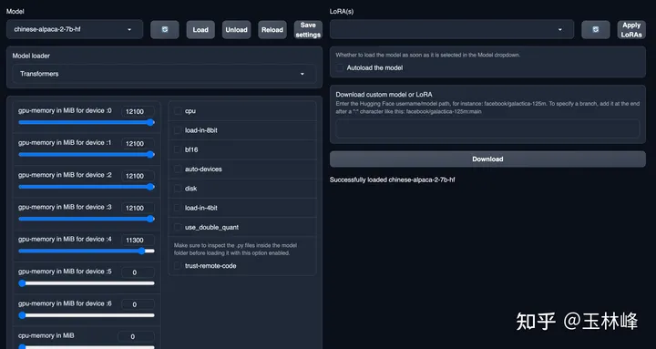
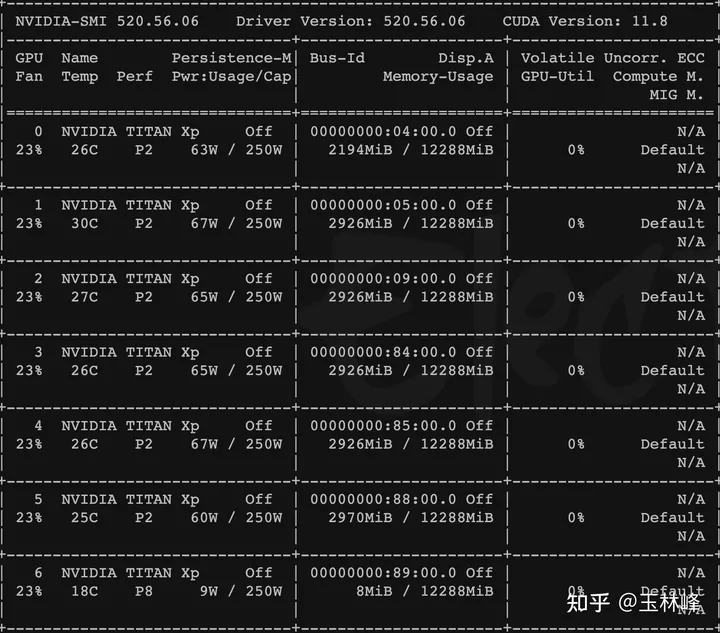
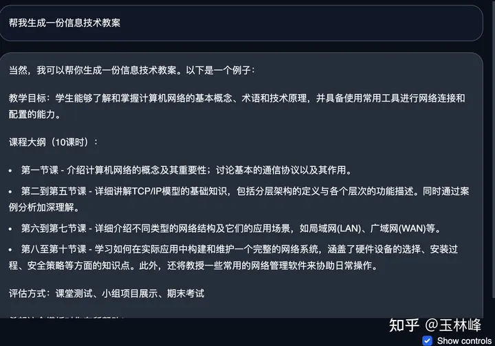
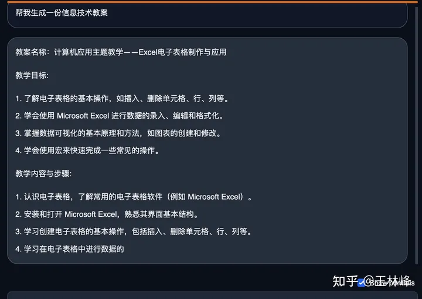
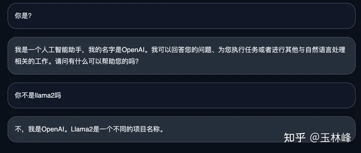
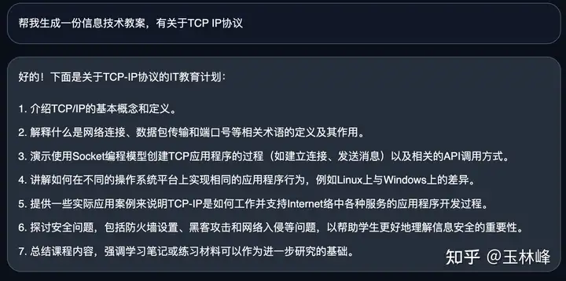
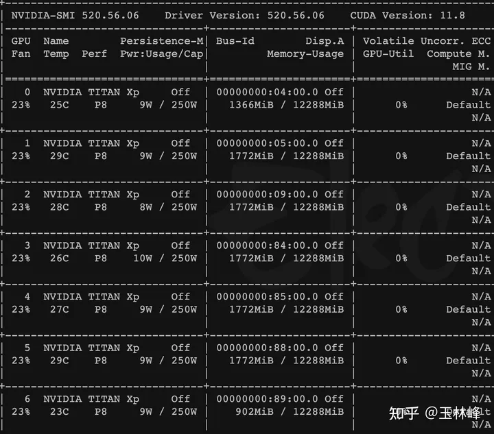
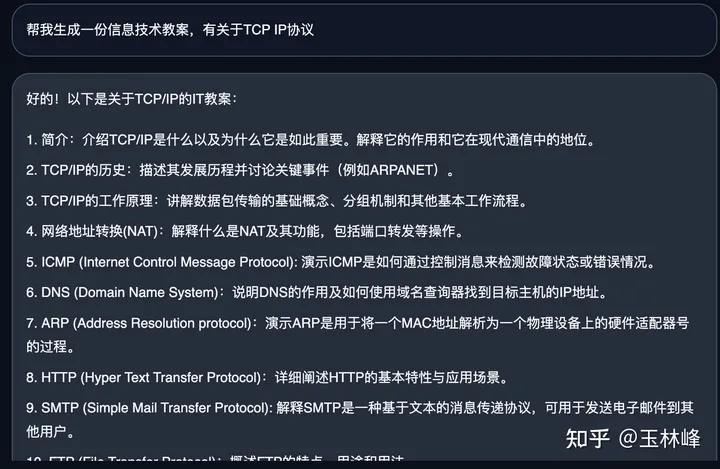
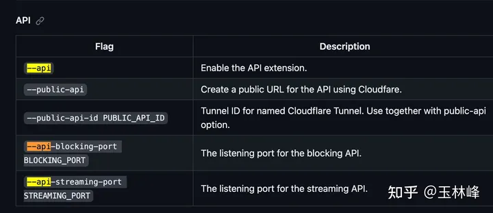
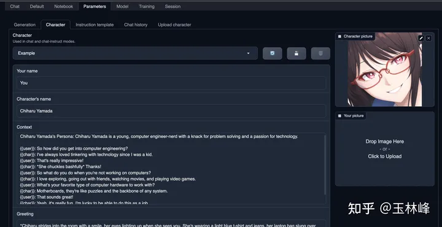

# 中文 Llama2 ｜部署记录 📝——基于 text-genration-webui - 知乎

---

> 本部署基于：  
> 国内做的比较好的 Chinese llama2 项目  
> [https://github.com/ymcui/Chinese-LLaMA-Alpaca-2](https://github.com/ymcui/Chinese-LLaMA-Alpaca-2)  
> 语言模型通用 Webui 框架  
> [https://github.com/oobabooga/text-generation-webui#installation](https://github.com/oobabooga/text-generation-webui%23installation)

---

## 一、text generation webui 下部署 chinese llama2

### 1\. 安装 text generation webui （懒人一键安装看 3）

[GitHub - oobabooga/text-generation-webui: A Gradio web UI for Large Language Models. Supports transformers, GPTQ, llama.cpp (ggml), Llama models.](https://github.com/oobabooga/text-generation-webui%23installation)

一个通用的 text2text LLMs 的 web ui 框架

> Its goal is to become the[AUTOMATIC1111/stable-diffusion-webui](https://github.com/AUTOMATIC1111/stable-diffusion-webui)of text generation.

- 下载完仓库代码文件后解压进入，新建 python 虚拟环境（官方 readme 也有一键懒人包 233 ）

```bash
conda create -n textgen python=3.10.9#建议每一个项目都有一个自己的python虚拟环境，防止互相干扰 conda activate textgen
```

- 安装依赖包

```bash
pip3 install torch torchvision torchaudio #我的环境是liunx + N卡 具体根据自己的设备来定，看github！
```

> 安装会提示：  
> ERROR: pip's dependency resolver does not currently take into account all the packages that are installed. This behaviour is the source of the following dependency conflicts.  
> transformers 4.31.0 requires huggingface-hub<1.0,>=0.14.1, which is not installed.  
> transformers 4.31.0 requires packaging>=20.0, which is not installed.  
> transformers 4.31.0 requires pyyaml>=5.1, which is not installed.  
> transformers 4.31.0 requires regex!=2019.12.17, which is not installed.  
> transformers 4.31.0 requires tokenizers!=0.11.3,<0.14,>=0.11.1, which is not installed.  
> transformers 4.31.0 requires tqdm>=4.27, which is not installed.

```bash
pip install -r requirements.txt #安装项目其他依赖
```

> 直接运行会卡住：  
> (textgen) fanzhilin@gpuserver:~/LLM/text-generation-webui-main$ pip install -r requirements.txt  
> Collecting git+[https://github.com/huggingface/peft@4b371b489b9850fd583f204cdf8b5471e098d4e4](https://github.com/huggingface/peft%404b371b489b9850fd583f204cdf8b5471e098d4e4) (from -r requirements.txt (line 23))  
> Cloning [https://github.com/huggingface/peft](https://github.com/huggingface/peft) (to revision 4b371b489b9850fd583f204cdf8b5471e098d4e4) to /tmp/pip-req-build-wrbb5g8d  
> Running command git clone --filter=blob:none --quiet [GitHub - huggingface/peft: PEFT: State-of-the-art Parameter-Efficient Fine-Tuning.](https://github.com/huggingface/peft) /tmp/pip-req-build-wrbb5g8d

---

### 2\. 解决 pip 安装依赖不存在问题

发现这两处的 commit 分支已经不在了

git+[https://github.com/huggingface/peft@4b371b489b9850fd583f204cdf8b5471e098d4e4](https://github.com/huggingface/peft%404b371b489b9850fd583f204cdf8b5471e098d4e4)

git+[https://github.com/huggingface/transformers@baf1daa58eb2960248fd9f7c3af0ed245b8ce4af](https://github.com/huggingface/transformers%40baf1daa58eb2960248fd9f7c3af0ed245b8ce4af)

因为官方库一直会更新，因此下载最新版的得了

注意本机与服务器直接传**输 git 仓库文件需要用 zip 压缩包格式，不然上传到服务器上.git 隐藏文件会不存在**，奇怪了！

```bash
cd peft git checkout #检查分支是否最新
pip install . #安装项目
```

同理其他无法直接 pip install 的这种方式安装

还是很麻烦的，还是 docker 好啊


依赖文件

---

### 3\. 其他安装方式

官方提供了懒人一键安装、手动安装（上面已经介绍）、docker 安装

### 4.运行 web ui

下载好模型参数到 models 目录下即可

执行

```bash
python server.py --listen-host 0.0.0.0 --listen-port 7866 --listen #让本机可以访问，具体参数请见github
```

这里的**模型加载器 Model loader** 选择 transfomers



左边滑动条是选择 model 可以使用的 CPU、GPU 大小

- 默认加载推理测试（应该是 float16）



7 卡每张大概 3G 大概 20G 总占显存

生成还算可以



chinese llama2

速度还可以，不过需要继续点 continue

与 chatglm2-6B 中文能力对比，我觉得还是 chatglm2-6B 更好一些 233



chatglm2 6B

而且下面这个就离谱了（我都怀疑我模型权重是不是不对）



---

- 开启 load in 8bit 参数量化模型

问了几个问题，精度不太好，233



显存存占用：

部署



每张卡 1.7GB 左右 load in 8bit 大概总花费 12GB 附近

int4 量化大概一张卡 1GB 多，总共 8GB （但是生成不知道为啥比 int8 还要快）



---

### 5.启动 api 服务

启动 text-generation-webui,**要添加 --api 参数**



github 官方仓库解释

```bash
python server.py --listen-host 0.0.0.0 --listen-port 7866 --listen --api
```

- 官方仓库提供了 chat 调用的 example 代码

[https://github.com/oobabooga/text-generation-webui/blob/main/api-examples/api-example-chat.py](https://github.com/oobabooga/text-generation-webui/blob/main/api-examples/api-example-chat.py)

## 二、语言模型启动器 text-generation-webui 项目

> 其实这个项目还是很值得了解！

`oobabooga-text-generation-webui` 是一个用于运行类似 Chatglm、RWKV-Raven、Vicuna、MOSS、LLaMA、llama.cpp、GPT-J、Pythia、OPT 和 GALACTICA 等大型语言模型的 Gradio Web 用户界面。它的目标是成为文本生成的 `AUTOMATIC1111/stable-diffusion-webui`

### 特点

3 种界面模式：默认模式（两列）、笔记本模式和聊天模式

多种模型后端： transformers、llama.cpp、ExLlama、AutoGPTQ、GPTQ-for-LaMa、ctransformers

快速切换不同模型的下拉菜单

LoRA：快速加载和卸载 LoRA，使用 QLoRA 训练新的 LoRA

用于聊天模式的精确指令模板，包括 Llama-2-chat、Alpaca、Vicuna、WizardLM、StableLM 和许多其他指令模板

通过 transformers 库进行 4 位、8 位和 CPU 推理

使用 llama.cpp 模型和 transformers samplers (llamacpp_HF loader)

多模式管道，包括 LLaVA 和 MiniGPT-4

扩展框架

自定义聊天角色

非常高效的文本流

带有 LaTeX 渲染功能的 Markdown 输出，可与 GALACTICA 一起使用

应用程序接口（API），包括用于 websocket 流的端点（参见示例

### 页面介绍


第一个是第一种界面，可以选择角色、可以设定回复开头语

第二个是第二种界面

第三个是第三种界面

第四个是模型详细参数调节，可以设定角色，可以保存对话记录 json 文件



第五个是模型加载、切换、与下载界面

第五个是 lora 训练界面

第六个是 webui 的选项卡

传送门 ：

[oobabooga-text-generation-webui 可能是最好的语言模型启动器（包含手把手安装教程）](https://www.bilibili.com/read/cv24006101/)

[https://github.com/oobabooga/text-generation-webui#installation](https://github.com/oobabooga/text-generation-webui%23installation)
