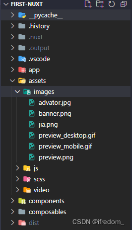

# Nuxt3 与 Vue3 的 Server api 全栈开发之路

---

## Nuxt Server Api

> 阅读时长：15 分钟
>
> 本文内容： 国内关于 Nuxt3 的资料太少了，而 Nuxt3 又发布了没有多久，导致资料太少。
>
> 本文目的：AI 蓬勃发展，对于 AI 需求的网站，使用 Nuxt 开发是优选。
>
> 本文浓缩讲解了，对于前端开发，上手使用 Nuxt3，并一个人承担前后端开发的所有须知内容

环境要求:

- node : v16 +
- redis : v6 +

```bash
export default defineEventHandler(async (event) => { })
```

- [Nuxt3.js 官方文档](https://nuxt.com/)
- [Tailwindcss 文档](https://tailwindcss.com/docs/responsive-design#targeting-a-single-breakpoint)
- [Antdesign Vue 文档](https://antdv.com/components/icon)


### 起步

1.  首先要把官方文档`关于目录的解释`看一遍: [nuxt3 目录](https://nuxt.com/docs/guide/directory-structure/nuxt)
2.  前端页面的开发，只需聚焦目录 `pages`，所有写法与传统 Vue3 一模一样.
3.  后端接口的开发，只需聚焦目录 `server`, 重点讲解服务端

### 目录

#### 1\. 目录 layout

- Nuxt 会自动异步导入该目录下文件
- 通常你至少有 2 种布局时才会用到这个目录，否则直接使用根目录下的 app.vue 即可
- 一旦在该目录下创建了布局文件，例如 **page.vue**，那么此组件将自动加载，页面 Html 结构将被分为三部分： header，content，footer

> 例如：：**layout/page.vue**

```html
<template>
  <div class="overflow-x-hidden">
    <LayoutPageNavbar class="h-[64px] max-h-[64px]" />
    <LayoutPageContent>
      <slot />
    </LayoutPageContent>
    <LayoutPageFooter class="h-[52px] md:h-[42px]" />
  </div>
</template>
```

类似于 ElementPlus 框架的三部分：

```html
<el-container>
  <el-header>Header</el-header>
  <el-main>Main</el-main>
  <el-footer>Footer</el-footer>
</el-container>
```

#### 2\. 目录 composables

- Nuxt 只扫描 composables/ 目录的顶层文件
- 目录 composables 通常放置全局方法，比如统一地 Api 接口，常量。

> 例如：**composables/index.ts**

```typescript
import request from '@/utils/request'
/**
 * get请求示例
 * @param params
 * @returns
 */
export function httpGetResponse(params: any) {
  return request.get('/user-center/getUser', params)
}
/**
 * post请求示例
 * @param data
 * @returns
 */
export function httpPostResponse(data: any) {
  return request.post('/user-center/updateUser', data)
}

// 合成百度语音，示例传递 blob 格式数据
export function getBaiduVoice(data: any): any {
  return request.post('/speech/baidu', data, { responseType: 'blob' })
}
```

- 对于业务组件，放在第二层目录即可，不会自动全局导入

> 例如：**composables/business/myTabs.vue** 例如 **composables/business/myTabsUtil.ts**

#### 3\. 目录 plugins

- 只有在 plugins/ 目录顶层(或任何子目录中文件名为 `index` 的文件)才会被注册为插件
- 这个目录放置第三方插件文件。一旦文件创建并导出 **defineNuxtPlugin** 函数，那么会被 Nuxt 自动判定为插件，并加载

> 例如流行的 UI 库： **plugins/antDesignVue.ts**

```typescript
// 1. 引入组件
import Antd from 'ant-design-vue'
// 2. 引入组件样式
import 'ant-design-vue/dist/antd.css'

export default defineNuxtPlugin((nuxt) => {
  nuxt.vueApp.use(Antd)
})
```

> 例如： **plugins/axios.ts**

```typescript
import axios from 'axios'
export default defineNuxtPlugin((nuxtApp) => {
  return {
    provide: {
      axios,
    },
  }
})
```

- 可以通过文件名添加后缀`.server`或`.client`来确保只有客户端或者服务端加载

> 例如 UI 库显然只有前端使用，服务端用不着： **plugins/antDesignVue.client.ts**

```typescript
// 1. 引入组件
import Antd from 'ant-design-vue'
// 2. 引入组件样式
import 'ant-design-vue/dist/antd.css'

export default defineNuxtPlugin((nuxt) => {
  nuxt.vueApp.use(Antd)
})
```

#### 4\. 目录 store

- 这个目录显然是存储数据的，使用的 **pinia**

> 例如： **store/modules/useExample.ts**

```typescript
export interface ICounterState {
  count: number
}

export const useExample = definePiniaStore('example', {
  state: (): ICounterState => ({
    count: 0,
  }),
  actions: {
    increment() {
      this.count++
    },
    decrement() {
      this.count--
    },
    reset() {
      this.count = 0
    },
    increment2x() {
      this.count *= 2
    },
  },
})
```

```typescript
<script lang="ts" setup>
  import {useExample} from "@/store/modules/useExample"; // 获取 const
  exampleStore = useExample(); let count = exampleStore.count;
  console.log(count) exampleStore.increment(); console.log(exampleStore.count)
</script>
```

#### 5\. 目录 assets

这个目录用于存放静态文件: image，js, css, 视频，音频,字体  


#### 6\. 目录 public

- 存放不会变动的公共文件。例如：robots.txt，favicon.ico

#### 7\. 目录 utils

- 存放工具类

> 例如**utils/request.ts**

```typescript
/*
 * @Date: 2023-06-18 00:16:29
 * @LastEditors: ifredom ifredomvip@gmail.com
 * @LastEditTime: 2023-08-29 13:46:46
 * @FilePath: \first-nuxt\utils\request.ts
 */
import { UseFetchOptions } from 'nuxt/app'
import { AjaxResult, Methods } from '../types'

class HttpService {
  request<T = any>(
    url: string,
    method: Methods,
    data: any,
    options?: UseFetchOptions<T>
  ) {
    const $config = useRuntimeConfig()
    const requestUrl =
      url.includes('https') || url.includes('http')
        ? url
        : $config.app.BASE_URL + url

    const newOptions: UseFetchOptions<T> = {
      baseURL: requestUrl,
      method,
      ...options,
    }

    if (method === 'GET' || method === 'DELETE') {
      newOptions.params = data
    }

    if (method === 'POST' || method === 'PUT') {
      newOptions.body = data
    }

    return new Promise((resolve, reject) => {
      useFetch(requestUrl, newOptions)
        .then((response) => {
          const { data, error } = response
          if (error && error.value) {
            console.log('toast 网络错误')
            const errorMessage = JSON.stringify(error.value)
            message.error(errorMessage)
            reject(error.value)
            return
          }

          if (newOptions.responseType === 'blob') {
            resolve(response.data.value)
            return
          }

          const res = data.value as AjaxResult

          if (res && res.code === 0) {
            resolve(res.data)
          } else if (res && res.msg) {
            if (res.code === 40000) {
              // 会话过期跳登录
              setTimeout(() => {
                navigateTo('/login')
              }, 1000)
              return
            }
            reject(res.data)
          }

          resolve(res)
        })
        .catch((error) => {
          reject(error)
        })
    })
  }

  get<T = any>(url: string, params?: any, options?: UseFetchOptions<T>) {
    return this.request(url, 'GET', params, options)
  }

  post<T = any>(url: string, data?: any, options?: UseFetchOptions<T>) {
    return this.request(url, 'POST', data, options)
  }

  put<T = any>(url: string, data: any, options?: UseFetchOptions<T>) {
    return this.request(url, 'PUT', data, options)
  }

  delete<T = any>(url: string, params: any, options?: UseFetchOptions<T>) {
    return this.request(url, 'DELETE', params, options)
  }
}
const httpRequest = new HttpService()

export default httpRequest
```

```typescript
import request from '@/utils/request'
/**
 * get请求示例
 * @param params
 * @returns
 */
export function httpGetResponse(params: any) {
  return request.get('/user-center/getUser', params)
}
/**
 * post请求示例
 * @param data
 * @returns
 */
export function httpPostResponse(data: any) {
  return request.post('/user-center/updateUser', data)
}
```

#### 8 错误 error.vue

- Vue 渲染生命周期中的错误(SSR + SPA)
- API 或 Nitro 服务器生命周期中的错误
- 服务器和客户端启动错误(SSR + SPA)

> 例如，定义全局错误抓取，将错误上传至服务器 plugins/errorlog.ts

```typescript
export default defineNuxtPlugin((nuxt) => {
  nuxt.vueApp.config.errorHandler = (error, context) => {
    // 抓取全局错误，上传至服务器
    const message = error + context
    $http.post('erroor-log', message)
  }
})
```

---

目录 `server` 比较复杂，单独讲解

### 目录：server

- 服务端 Server Api [设置(H3)](https://github.com/unjs/h3#utilities)
- Nuxt3 的服务端使用 Nitro 构建，与 **H3** 这个库紧密结合，你甚至可以认为服务端的接口都使用 H3 来编写

```bash
# 安装
pnpm add h3
```

#### 1\. 设置 Http 状态

```ts
import { H3Event } from "h3"
export default defineEventHandler(async (event: H3Event) => {
  setResponseStatus(event, 204)
  return {
    data: '',
    code: 0,
    msg: 'success'
  }
}
```

#### 2\. 设置 Cookie

```ts
const AUTH_COOKIE_NAME = '__session'
const AUTH_COOKIE_MAX_AGE = 60 * 60 * 24 * 5 * 1_000

export default defineEventHandler(async (event: H3Event) => {

  const cookie = 'ffkeifpoeapoifm321654'

  setCookie(event, AUTH_COOKIE_NAME, cookie, {
    maxAge: AUTH_COOKIE_MAX_AGE,
    secure: true,
    httpOnly: true,
    path: '/',
    sameSite: 'lax',
  })

  return {
    data: '',
    code: 0,
    msg: 'success'
  }
}
```

#### 3\. 存储

```ts
interface Query {
  region?:
    | 'zh-CN'
    | 'en-US'
    | 'ja-JP'
    | 'en-AU'
    | 'en-UK'
    | 'de-DE'
    | 'en-NZ'
    | 'en-CA'
}

export default defineEventHandler(async (event) => {
  const { type = 'img', region = 'zh-CN' } = getQuery<Query>(event)

  if (type === 'img') {
    const cache = await useStorage('cache').getItem('bing-wallpaper')
    if (cache) return await sendRedirect(event, cache, 302)
  }

  // https://github.com/zkeq/Bing-Wallpaper-Action
  const data = await (
    await fetch(
      `https://raw.onmicrosoft.cn/Bing-Wallpaper-Action/main/data/${region}_all.json`
    )
  ).json()

  if (type === 'img') {
    const url = `https://bing.com${data.data[0].url}`
    useStorage('cache').setItem('cache:bing-wallpaper', url, {
      ttl: getTodayRemainMillisecond(),
    })

    return await sendRedirect(event, url, 302)

    // event.node.res.setHeader('Content-Type', 'image/png;charset=utf-8')
    // return Buffer.from(await (await fetch(url)).arrayBuffer())
  } else {
    event.context.cache = { ttl: TimeUnitMap.hour }
    return data
  }
})
```

#### 4\. 验证

```ts
import { z, useValidatedBody } from 'h3-zod'
export default defineEventHandler(async (event) => {
  const body = await useValidatedBody(
    event,
    z.object({
      userId: z.string(),
    })
  )
})
```

#### 5\. 返回 Error

```ts
export default defineEventHandler(async (event) => {
  try {
    const cookie = getCookie(event, 'refresh_token') as Token
    await deleteRefreshToken(cookie)

    return {
      cookie,
    }
  } catch (error) {
    sendError(
      event,
      createError({
        statusCode: 400,
        statusMessage: 'username or password is invalid',
      })
    )
  }

  sendRefreshToken(event, '')

  return {
    message: 'Logout successful',
  }
})
```

#### 6\. 设置返回数据类型

##### 1\. 返回 `audio` 类型数据

> 服务端设置 header

```ts
// server/api/speech.ts
export default defineEventHandler(async (event: H3Event) => {
  try {
    // 获取音频数据
    const audioBlob = await fetch_to_audio()

    let size = 0
    if (audioBlob instanceof Blob) {
      size = audioBlob.size
    }
    setResponseHeader(event, 'Accept-Ranges', 'bytes')
    setResponseHeader(event, 'Content-Type', 'audio/wav')
    setResponseHeader(event, 'Content-Length', size)

    return audioBlob
  } catch (error) {
    sendError(
      event,
      createError({
        statusCode: 400,
        statusMessage: 'username or password is invalid',
      })
    )
  }
})
```

> 前端(客户端)设置数据返回类型为 blob

```html
<script lang="ts" setup>
  const createAudio = async () => {
    const response: any = await axios({
      url: '/api/speech',
      method: 'POST',
      data: {
        content: '123456',
      },
      responseType: 'blob',
    })
    const { data: arrayBuffer } = response

    console.log('------收到服务端数据------', response)

    const box = document.querySelector('#audio-box') as HTMLElement
    const audioElement = document.createElement('audio') //创建标签
    audioElement.autoplay = true
    audioElement.controls = true
    audioElement.src = URL.createObjectURL(arrayBuffer) // 指定链接
    box.appendChild(audioElement)
  }
</script>
<template>
  <div>
    <figure id="audio-box">
      <figcaption>音频:</figcaption>
    </figure>
  </div>
</template>
```

##### 2\. 返回 `image` 图片类型数据

> 服务端设置 header

```ts
// server/api/image.ts
export default defineEventHandler(async (event: H3Event) => {
  try {
    // 获取图片
    const image = await fetch_to_image()

    let size = 0
    if (audioBlob instanceof Blob) {
      size = audioBlob.size
    }
    setHeader(e, 'Content-Type', 'image/png')

    return image
  } catch (error) {
    sendError(
      event,
      createError({
        statusCode: 400,
        statusMessage: 'username or password is invalid',
      })
    )
  }
})
```

##### 3\. 返回 `File` 图片类型数据

> 以文件上传为例

> 前端页面： **pages/login.vue**

```html
<script lang="ts" setup>
  const $config = useRuntimeConfig()

  const axios = useNuxtApp().$axios

  const BaseUrl: string = 'http://127.0.0.1:9000/api/v1/login'

  const testServerApi = async () => {
    // 图片： File格式
    const imageFile = imageFiles.value as File
    // 音频：Blob格式
    const audioFileBlob = audioBlob.value as Blob

    //  音频Blob转file
    const newAudioFileBlob = new Blob([audioFileBlob], { type: 'audio/wav' })
    const audioFile = new File(
      [newAudioFileBlob],
      new Date().getTime() + '.wav'
    )

    if (!imageFile) {
      return
    }

    // 创建formData
    const formData = new FormData()
    formData.append('image', imageFile)
    formData.append('audio', audioFile)

    // 方式一：使用 useFetch() 推荐 (文末有完整封装)
    const res: any = await useFetch($config.BaseUrl, formData)

    // 方式二：使用 axios
    // const response = await axios({
    //   method: 'POST',
    //   url: 'http://127.0.0.1:9000/api/v1/login',
    //   data: formData,
    //   headers,
    // })

    console.log(res)
  }
</script>

<template>
  <div>
    <div @click="testServerApi">点击</div>
  </div>
</template>
```

> 服务端接口： **server/api/user/login.ts**

```typescript
import { H3Event, MultiPartData } from 'h3'
import { FormData } from 'node-fetch-native'
import { AjaxResult } from '../../../types'

export default defineEventHandler(
  async (event: H3Event): Promise<AjaxResult> => {
    const response = await send_image_audio_to_remote(event)

    return {
      data: response,
      code: 0,
      msg: 'success',
    }
  }
)

const send_image_audio_to_remote = async (event: H3Event) => {
  // 重点！！！前端传输的文件使用此方法获取
  const form = await readMultipartFormData(event)

  try {
    if (form) {
      const imageMultiPartData: MultiPartData = form[0]
      const audioMultiPartData: MultiPartData = form[1]

      // 服务端，也可以继续发起请求，比如百度云的语音服务
      const formData = new FormData()
      formData.append('image', new Blob([imageMultiPartData.data]))
      formData.append('audio', new Blob([audioMultiPartData.data]))

      const responseData: any = await create_access_token()

      console.log('=========responseData==============')
      console.log(responseData)

      // 返回
      return true
    }

    return ''
  } catch (error) {
    sendError(
      event,
      createError({
        statusCode: 400,
        statusMessage: 'server is invalid',
      })
    )
  }
}

/**
 * 百度云语音服务
 */
const create_access_token = async () => {
  const { awesome } = useAppConfig()
  const client_id = awesome.baiduTTS.client_id
  const client_secret = awesome.baiduTTS.client_secret

  const url = `https://aip.baidubce.com/oauth/2.0/token?grant_type=client_credentials&client_id=${client_id}&client_secret=${client_secret}`

  const option = {
    grant_type: 'client_credentials',
    client_id,
    client_secret,
  }
  const headers = {
    'Content-Type': 'application/json',
    Accept: 'application/json',
  }
  const res: BaiduTTSAccessToken = await $fetch(url, {
    method: 'POST',
    headers,
    body: option,
  })

  if (res.error_code) {
    return res.error_code + ''
  }
  return res.access_token
}
```

```typescript
export interface AjaxResult {
  data?: any
  code: number
  msg: string
}
```

### SQL 使用

##### 1\. postgres 数据库

```ts
import { createPool, sql } from '@vercel/postgres'

async function seed() {
  const createTable = await sql`
    CREATE TABLE IF NOT EXISTS users (
      id SERIAL PRIMARY KEY,
      name VARCHAR(255) NOT NULL,
      email VARCHAR(255) UNIQUE NOT NULL,
      image VARCHAR(255),
      "createdAt" TIMESTAMP WITH TIME ZONE DEFAULT CURRENT_TIMESTAMP
    );
    `

  console.log(`Created "users" table`)

  const users = await Promise.all([
    sql`
          INSERT INTO users (name, email, image)
          VALUES ('Guillermo Rauch', 'rauchg@vercel.com', 'https://pbs.twimg.com/profile_images/1576257734810312704/ucxb4lHy_400x400.jpg')
          ON CONFLICT (email) DO NOTHING;
      `,
    sql`
          INSERT INTO users (name, email, image)
          VALUES ('Lee Robinson', 'lee@vercel.com', 'https://pbs.twimg.com/profile_images/1587647097670467584/adWRdqQ6_400x400.jpg')
          ON CONFLICT (email) DO NOTHING;
      `,
    sql`
          INSERT INTO users (name, email, image)
          VALUES ('Steven Tey', 'stey@vercel.com', 'https://pbs.twimg.com/profile_images/1506792347840888834/dS-r50Je_400x400.jpg')
          ON CONFLICT (email) DO NOTHING;
      `,
  ])
  console.log(`Seeded ${users.length} users`)

  return {
    createTable,
    users,
  }
}
export default defineEventHandler(async () => {
  const startTime = Date.now()
  const db = createPool()
  try {
    const { rows: users } = await db.query('SELECT * FROM users')
    const duration = Date.now() - startTime
    return {
      users: users,
      duration: duration,
    }
  } catch (error) {
    // @ts-ignore
    if (error?.message === `relation "users" does not exist`) {
      console.log(
        'Table does not exist, creating and seeding it with dummy data now...'
      )
      // Table is not created yet
      await seed()
      const { rows: users } = await db.query('SELECT * FROM users')
      const duration = Date.now() - startTime
      return {
        users: users,
        duration: duration,
      }
    } else {
      throw error
    }
  }
})
```

##### 2\. [mysql2](https://www.npmjs.com/search?q=mysql2)

### 安装 Antdesign Vue 两种方式

#### 方式一，模块方式

```bash
# Using pnpm
pnpm add -D @ant-design-vue/nuxt
```

> nuxt.config.ts

```typescript
export default defineNuxtConfig({
  modules: ['@ant-design-vue/nuxt'],
  antd: {
    // Options
  },
})
```

> 使用

```html
<script lang="ts" setup>
  const handleMessage = () => {
    message.info('This is a normal message')
  }
</script>
<template>
  <a-button @click="handleMessage"> button </a-button>
</template>
```

#### 方式二，插件方式

```bash
# Using pnpm
pnpm add -D ant-design-vue
```

> 在 plugins 文件中新建 `awesome.ts`

```typescript
// 1. 引入组件
import Antd from 'ant-design-vue'
// 2. 引入组件样式
import 'ant-design-vue/dist/antd.css'

export default defineNuxtPlugin((nuxt) => {
  nuxt.vueApp.use(Antd)
})
```

> 使用

```html
<script lang="ts" setup>
  const handleMessage = () => {
    message.info('This is a normal message')
  }
</script>
<template>
  <a-button @click="handleMessage"> button </a-button>
</template>
```

### [Server Storage 服务端存储](https://nuxt.com/docs/guide/directory-structure/server)

Nuxt 的服务端通常只作为转发/代理中间层，因此数据存储使用轻量的 Redis 存储

1.  操作系统安装 Redis
2.  Redis 集成有两种方式

#### 方式一：通过手写代码集成

> server/plugins/storage.ts

```typescript
import redisDriver from 'unstorage/drivers/redis'
export default defineNitroPlugin(() => {
  const storage = useStorage()
  // Dynamically pass in credentials from runtime configuration, or other sources
  const driver = redisDriver({
    base: 'redis',
    host: useRuntimeConfig().redis.host,
    port: useRuntimeConfig().redis.port,
    /* other redis connector options */
  })
  // Mount driver
  storage.mount('redis', driver)
})
```

> nuxt.config.ts

```typescript
export default defineNuxtConfig({
  runtimeConfig: {
    redis: {
      // Default values
      host: '',
      port: 0,
      /* other redis connector options */
    },
  },
})
```

#### 方式二：通过 nuxt.内置的 nitro 服务,`nitro.storage`

> nuxt.config.ts

```typescript
export default defineNuxtConfig({
  nitro: {
    storage: {
      redis: {
        driver: 'redis',
        /* redis connector options */
        port: 6379, // Redis port
        host: '127.0.0.1', // Redis host
        username: '', // needs Redis >= 6
        password: '',
        db: 0, // Defaults to 0
        tls: {}, // tls/ssl
      },
    },
  },
})
```

集成后使用：

> /server/api/test/setStorage.ts 存数据

```typescript
export default defineEventHandler(async (event): Promise<AjaxResult> => {
  const redis = useStorage('first')
  redis.setItem('redis:test', 'Nuxt is Awesome!')
  console.log('======save success======')
  return {
    data: body,
    code: 0,
    msg: 'success',
  }
})
```

> /server/api/test/getStorage.ts 取数据

```typescript
export default defineEventHandler(async (event): Promise<AjaxResult> => {
  const redis = useStorage('first')
  const data = await redis.getItem('redis:test')

  console.log('======get success======', data)

  return {
    data,
    code: 0,
    msg: 'success',
  }
})
```

### 其他

- [谷歌&github 登录](https://github.com/KeJunMao/ai-anything/blob/527fef15465164cea780cbea07412ae1f4575826/server/api/auth/%5B...%5D.ts#L23)

```ts
import { NuxtAuthHandler } from '#auth'
import GithubProvider from 'next-auth/providers/github'
import GoogleProvider from 'next-auth/providers/google'

const nuxtAuthHandler = NuxtAuthHandler({
  secret: useRuntimeConfig().authSecret,
  providers: [
    // @ts-ignore
    GithubProvider.default({
      clientId: useRuntimeConfig().githubClientId,
      clientSecret: useRuntimeConfig().githubClientSecret,
      httpOptions: {
        timeout: 10000,
      },
    }),
    // @ts-ignore
    GoogleProvider.default({
      clientId: useRuntimeConfig().googleClientId,
      clientSecret: useRuntimeConfig().googleClientSecret,
    }),
  ],
})
export default defineEventHandler(async (event) => {
  const result = await nuxtAuthHandler(event)
  const headerCookies = event.node.res.getHeader('set-cookie')
  if (headerCookies && typeof headerCookies === 'string') {
    const sessionToken = headerCookies
      .split(/,(?!\s)/)
      .find((v) => v.includes('session-token'))
    if (sessionToken) {
      event.node.res.removeHeader('set-cookie')
      event.node.res.setHeader('set-cookie', sessionToken)
    }
  }
  return result
})
```

#### 服务端请求封装$useFetch

```typescript
import { UseFetchOptions } from 'nuxt/app'
import { AjaxResult, Methods } from '../types'

/*
 * @Date: 2023-08-18 00:16:29
 * @LastEditors: ifredom ifredomvip@gmail.com
 * @LastEditTime: 2023-08-29 13:46:46
 * @FilePath: \first-nuxt\utils\request.ts
 */

class HttpService {
  request<T = any>(
    url: string,
    method: Methods,
    data: any,
    options?: UseFetchOptions<T>
  ) {
    const $config = useRuntimeConfig()
    const requestUrl =
      url.includes('https') || url.includes('http')
        ? url
        : $config.app.BASE_URL + url

    const newOptions: UseFetchOptions<T> = {
      baseURL: requestUrl,
      method,
      ...options,
    }

    if (method === 'GET' || method === 'DELETE') {
      newOptions.params = data
    }

    if (method === 'POST' || method === 'PUT') {
      newOptions.body = data
    }

    return new Promise((resolve, reject) => {
      useFetch(requestUrl, newOptions)
        .then((response) => {
          const { data, error } = response
          if (error && error.value) {
            console.log('toast 网络错误')
            reject(error.value)
            return
          }

          if (newOptions.responseType === 'blob') {
            resolve(response.data.value)
            return
          }

          const res = data.value as AjaxResult

          if (res && res.code === 0) {
            resolve(res.data)
          } else if (res && res.msg) {
            if (res.code === 40000) {
              // 会话过期跳登录
              setTimeout(() => {
                navigateTo('/login')
              }, 1000)
              return
            }
            reject(res.data)
          }

          resolve(res)
        })
        .catch((error) => {
          reject(error)
        })
    })
  }

  get<T = any>(url: string, params?: any, options?: UseFetchOptions<T>) {
    return this.request(url, 'GET', params, options)
  }

  post<T = any>(url: string, data?: any, options?: UseFetchOptions<T>) {
    return this.request(url, 'POST', data, options)
  }

  put<T = any>(url: string, data: any, options?: UseFetchOptions<T>) {
    return this.request(url, 'PUT', data, options)
  }

  delete<T = any>(url: string, params: any, options?: UseFetchOptions<T>) {
    return this.request(url, 'DELETE', params, options)
  }
}
const httpRequest = new HttpService()

export default httpRequest
```

> types.ts 类型文件

```typescript
export type Methods = 'GET' | 'POST' | 'DELETE' | 'PUT'

export interface AjaxResult {
  data?: any
  code: number
  msg: string
}
```

使用示例：

```typescript
/**
 * get请求示例
 * @param params
 * @returns
 */
export function httpGetResponse(params: any) {
  return request.get('/user-center/getUser', params)
}
/**
 * post请求示例
 * @param data
 * @returns
 */
export function httpPostResponse(data: any) {
  return request.post('/user-center/updateUser', data)
}
/**
 * post请求: 携带请求头
 * @param data
 * @returns
 */
export function httpPostWithHeader(data: any): any {
  return request.post('/user-center/update_Avator', data, {
    responseType: 'blob',
  })
}
```

#### 参考文档

> 参考 API

1.  [H3 API document](https://www.jsdocs.io/package/h3#sendStream)
2.  [H3 github](https://github.com/unjs/h3#utilities)
3.  [H3 1.8 API latest intro](https://unjs.io/blog/2023-08-15-h3-towards-the-edge-of-the-web)

> 参考例子

1.  [例子](https://stackoverflow.com/questions/75812420/nuxt3-server-api-params-cause-500-error-on-production)
2.  [About 基于 Nuxt3 + Vite3 + Vue3 + UnoCSS 搭建的 API 接口服务网站](https://github.com/kuizuo/api-service)
3.  [参考项目](https://github.com/gabrielcaiana/boilerplate-nuxt3-authentication)
4.  [audio 返回数据](https://github.com/barelyhuman/music/blob/44599a100f46c0731d1b5ae3833140995a4771ef/server/routes/api/play.ts#L5)
5.  [Base64 、Blob、File 之间的相互转换](https://juejin.cn/post/7065856653429571615#heading-4)
6.  [NUXT3 server/api params cause 500 error on production](https://stackoverflow.com/questions/75812420/nuxt3-server-api-params-cause-500-error-on-production))
7.  [How to create an AudioBuffer from a Blob](https://itecnote.com/tecnote/how-to-create-an-audiobuffer-from-a-blob/)
8.  [How to return image with server api](https://github.com/harlan-zw/nuxt-og-image/blob/a745be206ceae75558f84f5c544c4eb5c1e796ad/src/runtime/nitro/middleware/og.png.ts#L2)
9.  [How to return audio data with server api](https://github.com/barelyhuman/music/blob/44599a100f46c0731d1b5ae3833140995a4771ef/server/routes/api/play.ts#L5)
