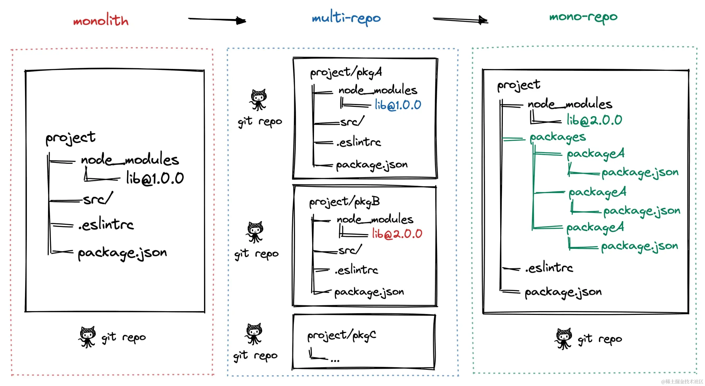
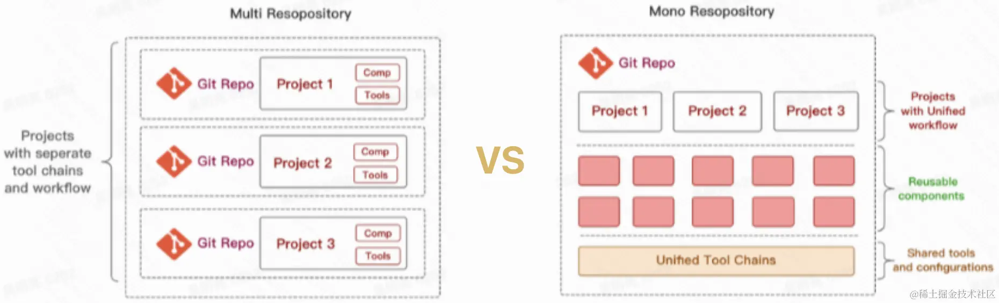
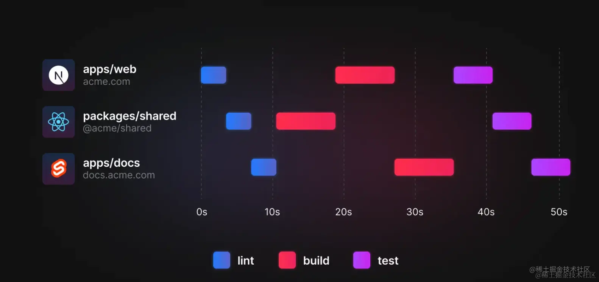
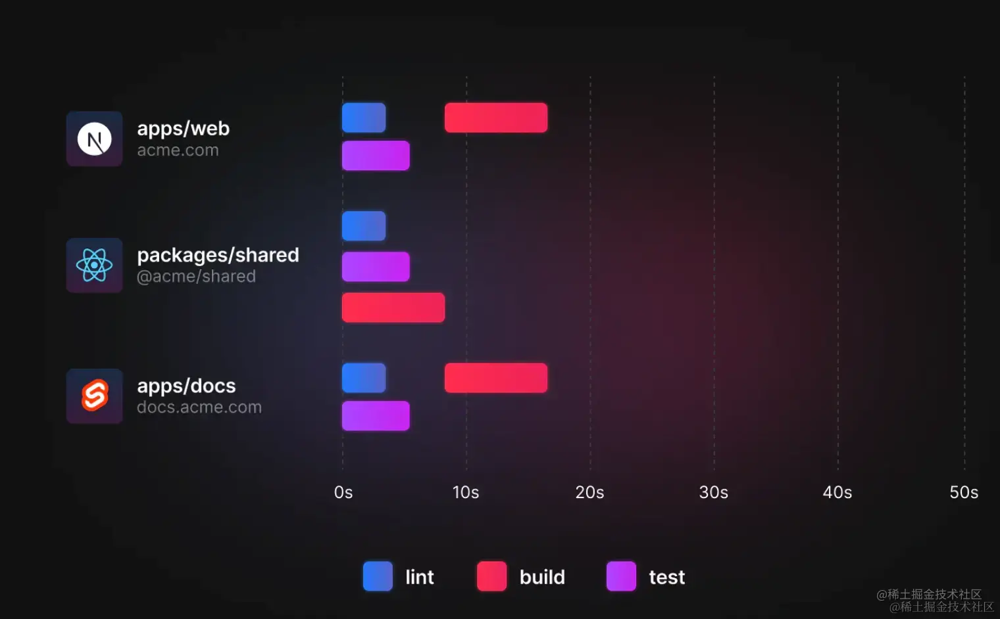
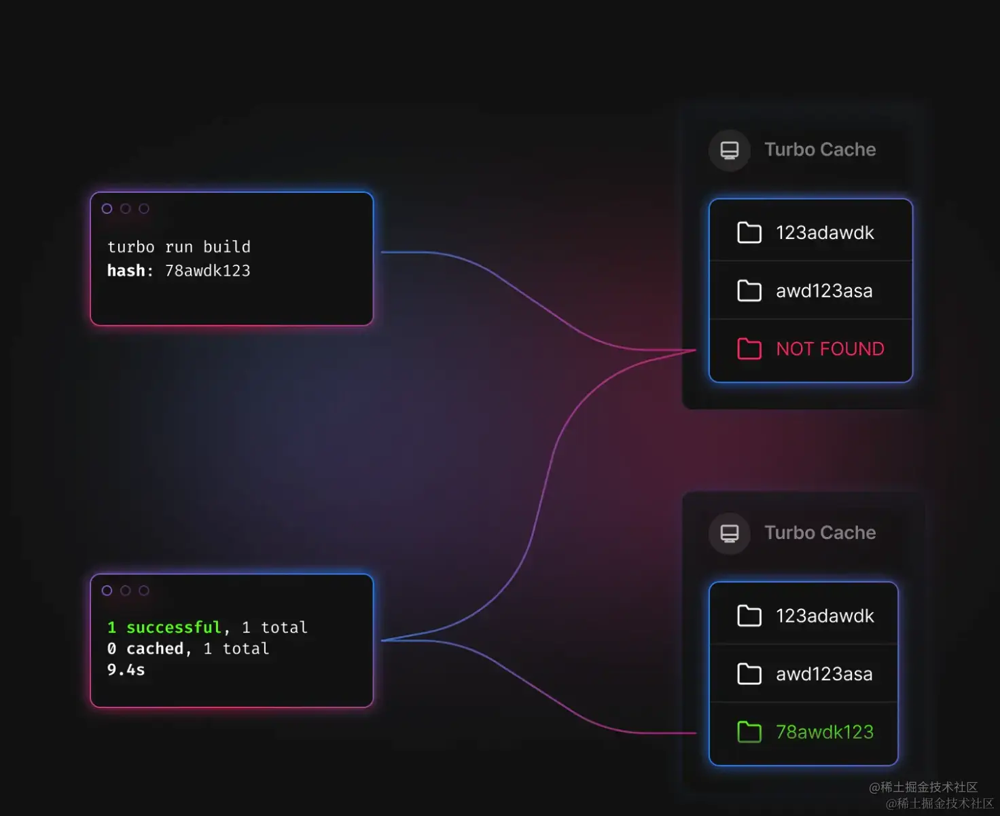
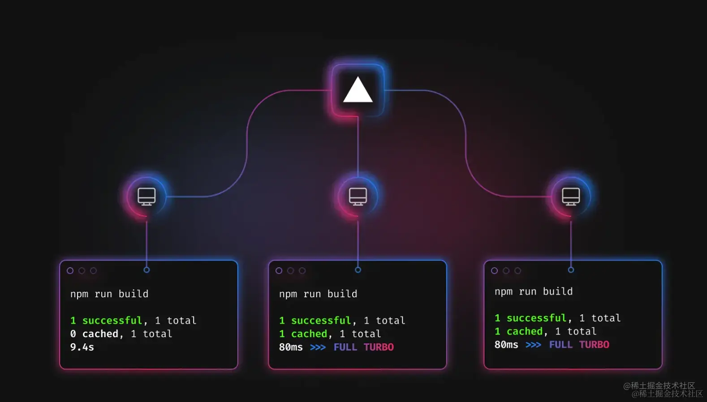
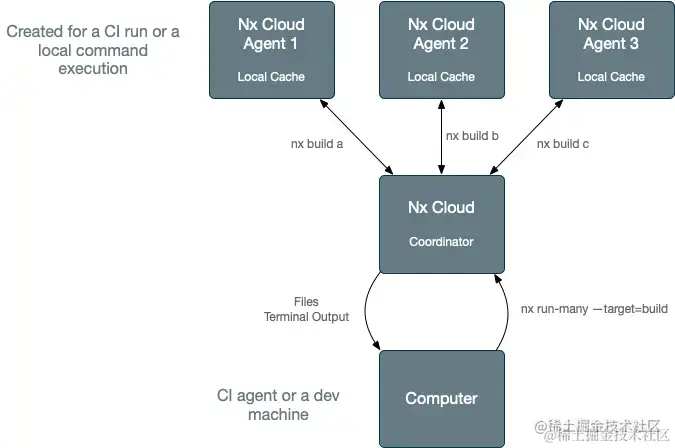
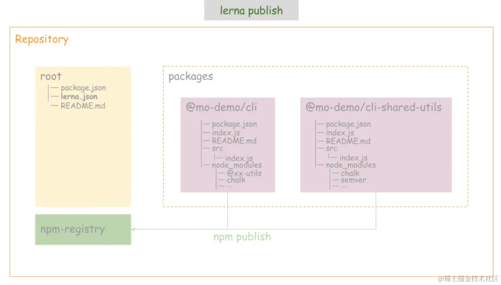
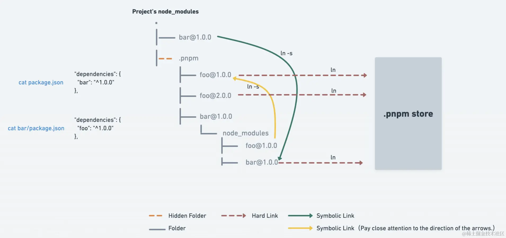
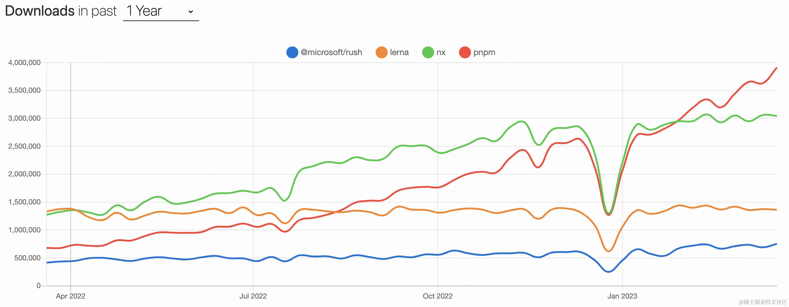

# 了解更全面的 Monorepo

---

## 一、Monorepo 介绍

Monorepo 是一种项目代码管理方式，指单个仓库中管理多个项目，有助于简化代码共享、版本控制、构建和部署等方面的复杂性，并提供更好的可重用性和协作性。Monorepo 提倡了开放、透明、共享的组织文化，这种方法已经被很多大型公司广泛使用，如 Google、Facebook 和 Microsoft 等。

## 二、Monorepo 演进

**阶段一：单仓库巨石应用，** 一个 Git 仓库维护着项目代码，随着迭代业务复杂度的提升，项目代码会变得越来越多，越来越复杂，大量代码构建效率也会降低，最终导致了单体巨石应用，这种代码管理方式称之为 Monolith。

**阶段二：多仓库多模块应用**，于是将项目拆解成多个业务模块，并在多个 Git 仓库管理，模块解耦，降低了巨石应用的复杂度，每个模块都可以独立编码、测试、发版，代码管理变得简化，构建效率也得以提升，这种代码管理方式称之为 MultiRepo。

**阶段三：单仓库多模块应用**，随着业务复杂度的提升，模块仓库越来越多，MultiRepo 这种方式虽然从业务上解耦了，但增加了项目工程管理的难度，随着模块仓库达到一定数量级，会有几个问题：跨仓库代码难共享；分散在单仓库的模块依赖管理复杂（底层模块升级后，其他上层依赖需要及时更新，否则有问题）；增加了构建耗时。于是将多个项目集成到一个仓库下，共享工程配置，同时又快捷地共享模块代码，成为趋势，这种代码管理方式称之为 MonoRepo。



## 三、Monorepo 优劣



| **场景**                                                                   | **MultiRepo**                                                                   | **MonoRepo**                                                                              |
| -------------------------------------------------------------------------- | ------------------------------------------------------------------------------- | ----------------------------------------------------------------------------------------- |
| 代码可见性                                                                 | ✅ 代码隔离，研发者只需关注自己负责的仓库                                       |
| ❌ 包管理按照各自 owner 划分，当出现问题时，需要到依赖包中进行判断并解决。 | ✅ 一个仓库中多个相关项目，很容易看到整个代码库的变化趋势，更好的团队协作。     |
| ❌ 增加了非 owner 改动代码的风险                                           |
| 依赖管理                                                                   | ❌ 多个仓库都有自己的 node_modules，存在依赖重复安装情况，占用磁盘内存大。      | ✅ 多项目代码都在一个仓库中，相同版本依赖提升到顶层只安装一次，节省磁盘内存，             |
| 代码权限                                                                   | ✅ 各项目单独仓库，不会出现代码被误改的情况，单个项目出现问题不会影响其他项目。 | ❌ 多个项目代码都在一个仓库中，没有项目粒度的权限管控，一个项目出问题，可能影响所有项目。 |
| 开发迭代                                                                   | ✅ 仓库体积小，模块划分清晰，可维护性强。                                       |

❌ 多仓库来回切换（编辑器及命令行），项目多的话效率很低。多仓库见存在依赖时，需要手动 `npm link`，操作繁琐。  
❌ 依赖管理不便，多个依赖可能在多个仓库中存在不同版本，重复安装，npm link 时不同项目的依赖会存在冲突。 | ✅ 多个项目都在一个仓库中，可看到相关项目全貌，编码非常方便。  
✅ 代码复用高，方便进行代码重构。  
❌ 多项目在一个仓库中，代码体积多大几个 G，`git clone`时间较长。  
✅ 依赖调试方便，依赖包迭代场景下，借助工具自动 npm link，直接使用最新版本依赖，简化了操作流程。 |
| 工程配置 | ❌ 各项目构建、打包、代码校验都各自维护，不一致时会导致代码差异或构建差异。 | ✅ 多项目在一个仓库，工程配置一致，代码质量标准及风格也很容易一致。 |
| 构建部署 | ❌ 多个项目间存在依赖，部署时需要手动到不同的仓库根据先后顺序去修改版本及进行部署，操作繁琐效率低。 | ✅ 构建性 Monorepo 工具可以配置依赖项目的构建优先级，可以实现一次命令完成所有的部署。 |

## 四、Monorepo 场景

综合如上 Monorepo VS MultiRepo，**中大型项目，多模块项目**，更适合用 MonoRepo 方式管理代码，在开发、协作效率、代码一致性方面都能受益。

## 五、Monorepo 踩坑

## 5.1、幽灵依赖

**问题**：npm/yarn 安装依赖时，存在依赖提升，某个项目使用的依赖，并没有在其 package.json 中声明，也可以直接使用，这种现象称之为 “幽灵依赖”；随着项目迭代，这个依赖不再被其他项目使用，不再被安装，使用幽灵依赖的项目，会因为无法找到依赖而报错。

**方案**：基于 npm/yarn 的 Monorepo 方案，依然存在 “幽灵依赖” 问题，我们可以通过 pnpm 彻底解决这个问题

## 5.2、依赖安装耗时长

**问题**：MonoRepo 中每个项目都有自己的 package.json 依赖列表，随着 MonoRepo 中依赖总数的增长，每次 `install` 时，耗时会较长。

**方案**：相同版本依赖提升到 Monorepo 根目录下，减少冗余依赖安装；使用 pnpm 按需安装及依赖缓存。

## 5.3、构建打包耗时长

**问题**：多个项目构建任务存在依赖时，往往是串行构建 或 全量构建，导致构建时间较长

**方案**：增量构建，而非全量构建；也可以将串行构建，优化成并行构建。

## 六、Monorepo 选型

## 6.1、构建型 Monorepo 方案

此类工具，主要解决大仓库 Monorepo 构建效率低的问题。项目代码仓库越来越庞大，工作流（int、构建、单元测试、集成测试）也会越来越慢；这类工具，是专门针对这样的场景进行极致的性能优化。适用于包非常多、代码体积非常大的 Monorepo 项目。

### 6.1.1、Turborepo

[**Turborepo**](https://turbo.build) 是 Vercel 团队开源的高性能构建代码仓库系统，允许开发者使用不同的构建系统。

**构建加速思路**：

- **Multiple Running Task**：构建任务并行进行，构建顺序交给开发者配置
- **Cache、Remote Cache**：通过缓存 及 远程缓存，减少构建时间

**举例 Multiple Running Task**：我们现在有一个 Monorepo 的项目，有以下几个 package：

- apps/web，依赖 shared
- apps/docs，依赖 shared
- package/shared，被 web 和 docs 依赖

```arduino
# 当我们使用正常的 yarn workspace 去管理 monorepo 的工作流任务时，例如执行以下命令：
yarn workspaces run lint
yarn workspaces run test
yarn workspaces run build

```

**传统的 yarn workspace 问题**：串行构建，性能差



**Turborepo Multiple Running Task**：允许用户在 `turbo.json` 中声明 task 之间依赖关系，优化后构建如下



**举例 Local Cache**：第一次`trubo run build`后，会生成缓存存放在 `node_modules/.cache/turbo/`



（第一次构建示意图）


（第二次构建示意图）

**举例 Remote Cache**：想要在 CI/CD 或团队中共享打包缓存，把缓存保存到了云端，构建时被拉取



（远程缓存构建示意图）

### 6.1.2、Rush

[Rush](https://rushstack.io) 是微软开发的可扩展的 Monorepo 工具及解决方案。**早期，只提供了 Rush 作为构建调取器**，其余事项交给用户灵活的选择任意构建工具链，由于过于灵活带来了很大的选型及维护成本，后来成立了 Rush Stack 来提供了**一套可复用的解决方案，涵盖多项目的构建、测试、打包和发布**，实现了更强大的工作流。有如下工具：

- [Rush](https://rushjs.io): 可扩展的 monorepo 构建编排工具
- [Heft](https://rushstack.io): 可以与 Rush 交互的可扩展构建系统
- [API Extractor](https://api-extractor.com): 为工具库审阅 API 并生成 .d.ts 文件
- [API Documenter](https://api-extractor.com): 生成你的 API 文档站
- [@rushstack/eslint-config](https://www.npmjs.com/package/%40rushstack/eslint-config): 专门为大型 TypeScript monorepo 仓库设计的 ESLint 规则集
- [@rushstack/eslint-plugin-packlets](https://www.npmjs.com/package/%40rushstack/eslint-plugin-packlets): 可用于在单个项目内来组织代码，NPM 发包的一个轻量级解决方案
- [Rundown](https://www.npmjs.com/package/@rushstack/rundown): 用于优化 Node.js 启动时间的工具

**Rush 功能列举**

- **解决了幽灵依赖**：将项目所有依赖都安装到 Repo 根目录的 common/temp 下，通过**软链接**到各项目，保证了 node_modules 下依赖与 package.json 一致
- **并行构建**：Rush 支持并行构建多个项目，提高了构建效率
- **插件系统**：Rush 提供了丰富的插件系统，可以扩展其功能，满足不同的需求，[具体参考](https://rushstack.io/zh-cn/pages/heft/core_plugins/)

- **项目发布，ChangeLog 支持友好**：自动修改项目版本号，自动生成 ChangeLog

### 6.1.3、Nx

Nx 是 [Nrwl](https://nx.app/company) 团队开发的，同时在维护 Lerna，目前 Nx 可以与 Learn 5.1 及以上集成使用

**构建加速思路**（比 Turborepo 更丰富）

- **缓存：** 通过缓存 及 远程缓存，减少构建时间（远程缓存：Nx 公开了一个公共 API，它允许您提供自己的远程缓存实现，Turborepo 必须使用内置的远程缓存）
- **增量构建：** 最小范围构建，非全量构建
- **并行构建：** Nx 自动分析项目的关联关系，对这些任务进行排序以最大化并行性
- **分布式构建：** 结合 Nx Cloud，您的任务将自动分布在 CI 代理中（多台远程构建机器），同时考虑构建顺序、最大化并行化和代理利用率



（分布式构建示意图）

**用 Nx 强大的任务调度器加速 Lerna**：Lerna 擅长管理依赖关系和发布，但扩展基于 Lerna 的 Monorepos 很快就会变得很痛苦，因为 Lerna 很慢。这就是 Nx 的闪光点，也是它可以真正加速你的 monorepo 的地方。

## 6.2、轻量化 Monorepo 方案

### 6.2.1、Lerna（全面讲解）

[Lerna](https://lerna.js.org) **是什么？**

- Lerna 是 Babel 为实现 Monorepo 开发的工具；最擅长管理依赖关系和发布
- Lerna 优化了多包工作流，解决了**多包依赖**、**发版手动维护版本**等问题
- Lerna 不提供构建、测试等任务，工程能力较弱，项目中往往需要基于它进行顶层能力的封装

**Lerna 主要做三件事**

- 为单个包或多个包运行命令 (lerna run)
- 管理依赖项 (lerna bootstrap)
- 发布依赖包，处理版本管理，并生成变更日志 (lerna publish)

**Lerna 能解决了什么问题？**

- **代码共享，调试便捷：** 一个依赖包更新，其他依赖此包的包/项目无需安装最新版本，因为 Lerna 自动 Link
- **安装依赖，减少冗余**：多个包都使用相同版本的依赖包时，Lerna 优先将依赖包安装在根目录
- **规范版本管理：** Lerna 通过 Git 检测代码变动，自动发版、更新版本号；两种模式管理多个依赖包的版本号
- **自动生成发版日志**：使用插件，根据 Git Commit 记录，自动生成 ChangeLog

**Lerna 自动检测发布，判断逻辑**

1.  校验本地是否有没有被 `commit` 内容？
2.  判断当前的分支是否正常？
3.  判断当前分支是否在 `remote` 存在？
4.  判断当前分支是否在 `lerna.json` 允许的 `allowBranch` 设置之中？
5.  判断当前分支提交是否落后于 remote

**Lerna 工作模式**

Lerna 允许您使用两种模式来管理您的项目：固定模式(Fixed)、独立模式(Independent)

**① 固定模式（Locked mode）**

- Lerna 把多个软件包当做一个整体工程，每次发布所有软件包版本号统一升级（版本一致），无论是否修改
- 项目初始化时，`lerna init` 默认是 **Locked mode**

```json
{ "version": "0.0.0" }
```

**② 独立模式（Independent mode）**

- Lerna 单独管理每个软件包的版本号，每次执行发布指令，Git 检查文件变动，只发版升级有调整的软件包
- 项目初始化时，`lerna init --independent`

```json
{ "version": "independent" }
```

**Lerna 常用指令**

**① 初始化：init**

```csharp
lerna init
```

执行成功后，目录下将会生成这样的目录结构

```scss
- packages(目录) - lerna.json(配置文件) - package.json(工程描述文件)
```

```json
{ "version": "0.0.0", "useWorkspaces": true, "packages": ["packages/*"] }
```

需要在项目根目录下的 `package.json`中设置 `"private": true`

```json
{
  "name": "xxxx",
  "version": "0.0.1",
  "description": "",
  "main": "index.js",
  "private": true,
  "scripts": {
    "test": "echo "Error: no test specified" && exit 1"
  },
  "keywords": [],
  "author": "",
  "license": "ISC",
  "devDependencies": {
    "lerna": "^6.4.1"
  },
  "workspaces": [
    "packages/*"
  ]
}
```

**② 创建 package：create**

```lua
lerna create <name> [location]

lerna create package1
```

执行 `lerna init` 后，默认的 lerna workspace 是 `packages/*`，需要手动修改 `package.json` 中的 `workspaces`，再执行指令生成特定目录下的 package

```bash
# 在 packages/pwd1 目录下，生成 package2 依赖包
lerna create package2 packages/pwd1

```

**③ 给 package 添加依赖：add**

安装的依赖，如果是本地包，Lerna 会自动 `npm link` 到本地包

```sql
# 给所有包安装依赖，默认作为 dependencies
lerna add module-1
lerna add module-1 --dev	# 作为 devDependencies
lerna add module-1 --peer	# 作为 peerDependencies
lerna add module-1[@version] --exact  # 安装准确版本的依赖

lerna add module-1 --scope=module-2		# 给指定包安装依赖
lerna add module-1 packages/prefix-* 	# 给前缀为 xxx 的包，安装依赖

```

**④ 给所有 package 安装依赖：bootstrap**

```bash
# 项目根目录下执行，将安装所有依赖
lerna bootstrap

```

**执行** `lerna bootstrap` **指令**：会自动为每个依赖包进行 `npm install` 和 `npm link` 操作

**关于冗余依赖的安装**：

- npm 场景下 `lerna bootstrap` 会安装冗余依赖（多个 package 共用依赖，每个目录都会安装）
- yarn 会自动 hosit 依赖包（相同版本的依赖，安装在根目录），无需关心

**npm 场景下冗余依赖解决方案：**

- **方案一：** `lerna bootstrap --hoist`
- **方案二**：配置 `lerna.json/command.bootsrap.hoist = true`

**⑤ 给 package 执行 shell 指令：exec**

```bash
# 删除所有包内的 lib 目录
lerna exec -- rm -rf lib

# 给xxx软件包，删除依赖
lerna exec --scope=xxx -- yarn remove yyy

```

**⑥ 给 package 执行 scripts 指令：run**

```ini
# 所有依赖执行 package.json 文件 scripts 中的指令 xxx
lerna run xxx

# 指定依赖执行 package.json 文件 scripts 中的指令 xxx
lerna run --scope=my-component xxx

```

**⑦ 清除所有 package 下的依赖：clean**

清楚所有依赖包下的 node_modules，根目录下不会删除

```
lerna clean

```

**⑧ 发布软件包，自动检测：publish**

```
lerna publish
```

`lerna publish` 做那些事儿

- 运行 lerna updated 来决定哪一个包需要被 publish
- 如果有必要，将会更新 lerna.json 中的 version
- 将所有更新过的的包中的 package.json 的 version 字段更新
- 将所有更新过的包中的依赖更新
- 为新版本创建一个 git commit 或 tag
- 将包 publish 到 npm 上



**⑨ 查看自上次发布的变更：diff、changed**

```bash
# 查看自上次relase tag以来有修改的包的差异
lerna diff

# 查看自上次relase tag以来有修改的包名
lerna changed

```

**⑩ 导入已有包：import**

```arduino
lerna import [npm 包所在本地路径]

```

**⑪** **列出所有包：list**

```
lerna list

```

### 6.2.2、yarn/npm + workspace

yarn 1.x 及以上版本，新增 workspace 能力，不借助 Lerna，也可以提供原生的 Monorepo 支持，需要在根目录下 `package.json` 中，声明 `workspace`

```json
{
  "private": true, // 必须是私有项目
  "workspaces": ["project1", "project2/*"]
}
```

**yarn workspace VS Lerna**

- **yarn workspace 更突出对依赖的管理：** 依赖提升到根目录的 `node_modules` 下，安装更快，体积更小
- **Lerna 更突出工作流方面**：使用 Lerna 命令来优化多个包的管理，如：依赖发包、版本管理，批量执行脚本

**能力及性能对比**

| **命令**                                  | **能力**                  | **Lerna(NPM)**                                 | **NPM Workspace**                                        | **Yarn Workspace**                                                   |
| ----------------------------------------- | ------------------------- | ---------------------------------------------- | -------------------------------------------------------- | -------------------------------------------------------------------- |
| 依赖管理                                  | 依赖初始化和提升          | lerna bootstrap                                | npm install                                              | yarn                                                                 |
| 安装依赖                                  | lerna add xxx --scope=pkg | npm install xxx -w pkg                         | yarn workspace pkg add xxx                               |                                                                      |
| 移除依赖                                  | 无                        | npm uninstall xxx -w pkg                       | yarn workspace pkg remove xxx                            |                                                                      |
| 依赖发布                                  | 全局执行 scipts 指令      | lerna run xxx --scope=pkg                      | npm run xxx -w pkg                                       | yarn workspace pkg run xxx                                           |
| 统一执行 scipts 指令                      | lerna run xxx             | npm run xxx --ws                               | yarn workspaces run xxx                                  |                                                                      |
| 在每个包下动态执行指令                    | lerna exec -- command     | npm exec -c 'command' --ws                     | yarn workspaces foreach command（需插件支持）            |                                                                      |
| 统一发布配置、changelog、tag 和 commit 等 | lerna.json/lerna publish  | 无                                             | 无                                                       |                                                                      |
| 依赖初始化耗时                            | /                         | 65.6626s、61.8620s、62.9221s                   | 72.9516s、83.0750s、86.5041s                             | 51.9236s、59.0584s、58.1938s                                         |
| 相对缺点                                  | /                         | 1\. 无法一次安装多个依赖 2. 未提供依赖移除能力 | 1\. 未提供更为精细的发布控制配置 2. 依赖安装耗时相对较长 | 1\. 未提供更为精细的发布控制配置 2. 不原生支持在每个包下动态执行指令 |

**更佳方案：** **yarn workspace + Lerna**

如上 VS 可以看出，yarn workspace 和 Lerna 各有所长，yarn workspace + Lerna 是更好的 Monorepo 方案，执行命令 `yarn`（相当于执行 `lerna bootstrap`），即可安装所有依赖，指令过渡更平滑，自动依赖提升，减少依赖安装。

**能力分工**：Lerna 将依赖管理交给 yarn workspace；Lerna 承担依赖发布能力。

**操作步骤：**

1.  **配置 Lerna 使用 Yarn 管理依赖**：`learn.json` 中配置 `"npmClient": "yarn"`
2.  **配置 Lerna 启用 Yarn Workspaces：**

3.  1.  配置 `lerna.json/useWorkspaces = true`
    2.  配置根目录 `package.json/workspaces = ["pacages/*"]` , 此时 lerna.json 中的 packages 配置项将不再使用
    3.  配置根目录 `package.json/private = true`

```scss
说明： 上面三个配置项需同时开启, 只开启一个 lerna 会报错 此时执行 lerna bootstrap 相当于执行yarn install，等同于执行 lerna bootstrap --npm-client yarn --use-workspaces 由于 yarn 会自动 hosit 依赖包, 无需再 lerna bootstrap 时增加参数 --hoist (加了参数 lerna 也会报错)
```

3.  不需要发包的项目，配置 `package.json/private = true`

### 6.2.3、Lerna + pnpm + workspace

pnpm 是新一代 Node 包管理器，它由 npm/yarn 衍生而来，解决了 npm/yarn 内部潜在的风险，并且极大提升依赖安装速度。pnpm 内部使用**基于内容寻址的文件系统**，来管理磁盘上依赖，减少依赖安装；`node_modules/.pnmp`为**虚拟存储**目录，该目录通过`<package-name>@<version>`来实现相同模块不同版本之间隔离和复用，由于它只会根据项目中的依赖生成，并不存在提升。

**CAS 内容寻址存储**，是一种存储信息的方式，根据内容而不是位置进行检索信息的存储方式。

**Virtual store 虚拟存储**，指向存储的链接的目录，所有直接和间接依赖项都**链接**到此目录中，项目当中的.pnpm 目录

pnpm 相比于 npm、yarn 的包管理器，优势如下，同理是 Lerna + yarn + workspace 优势：

- **装包速度极快：** 缓存中有的依赖，直接硬链接到项目的 node_module 中；减少了 copy 的大量 IO 操作
- **磁盘利用率极高：** 软/硬链接方式，同一版本的依赖共用一个磁盘空间；不同版本依赖，只额外存储 diff 内容
- **解决了幽灵依赖：** node_modules 目录结构 与 package.json 依赖列表一致

**补充：pnpm 原理**

1.  **存储中心 Store 集中管理依赖**：不同项目，相同版本依赖安装只进行硬链接；不同版本依赖，只增加 Diff 文件
2.  项目 `package.json` 依赖列表，和`node_modules/.pnpm`目录结构一致
3.  相同依赖安装时，将 Store 中的依赖**硬链接**到项目的 `node_modules/.pnpm` 下，而不是复制，速度快
4.  项目`node_modules`中已有依赖重复安装时，会被**软链接**到指定目录下



## 6.4、小结：如何选择

### 6.4.1、工具对比

| 工具     | **Turborepo** | **Rush** | **Nx** | **Lerna** | **Pnpm Workspace** |
| -------- | ------------- | -------- | ------ | --------- | ------------------ |
| 依赖管理 | ❌            | ✅       | ❌     | ❌        | ✅                 |
| 版本管理 | ❌            | ✅       | ❌     | ✅        | ❌                 |
| 增量构建 | ✅            | ✅       | ✅     | ❌        | ❌                 |
| 插件扩展 | ✅            | ✅       | ✅     | ❌        | ❌                 |
| 云端缓存 | ✅            | ✅       | ✅     | ❌        | ❌                 |
| Stars    | 20.4K         | 4.9K     | 17K    | 34.3K     | 22.7K              |



详细对比：

- [Nx and Turborepo](https://nx.dev/more-concepts/turbo-and-nx)
- [lerna-vs-turbopack-rush](https://byteofdev.com%/posts/lerna-vs-turbopack-rush)

### 6.4.2、选型建议

- 建议采用渐进式架构方案，即对于轻量级 Monorepo 项目，我们初期可以选择 Lerna + pnpm workspace + lerna-changelog，解决了依赖管理、发版管理等问题，为开发者带来便利；随着后续项目迭代，代码变多或多个项目间依赖关系复杂，可以很平滑的接入 Nx 来提升构建打包效率。
