# 聊聊一个优雅的软件资源下载站是怎么诞生的～

## **开始**

作为一个忠实的 Mac 用户、一个全栈开发者兼设计师，使用 MacOS 已经很多年了。对于不打游戏的我来说（好吧只打群星和星际和玩 PS5），MacBook Pro 无疑是最好的选择。但是在很多年前就有这样一个问题，软件资源散乱，虽然有 AppStore，但还是有很多应用不在上面，并且很多软件需要付费（当然在这里还是支持软件开发者），但是很多应用不是高频使用（所以购买和装个学习版还是有区别的），所以就存在了很多下载站，然而下载站虽然解决了付费的问题，但是很多站点下载破解软件还需要走一遍【注册-登陆-开会员-下载】这样一个流程，甚至还需要开个网盘会员（这我就不乐意了），刚好趁我有空，那就开始吧～

## **介绍**

步入正题，先看看成品：

> [**OnMac AppStore - 最新 Mac 软件，精彩尽在咫尺**](https://onmac.app)
>
> ONMAC AppStore 是一个 Mac 应用程序共享站点，在这里你可以免费下载任何你想下载的应用。所有软件均来源于网络，为您提供优质的 mac 软件，并为大家带来更好的下载体验。

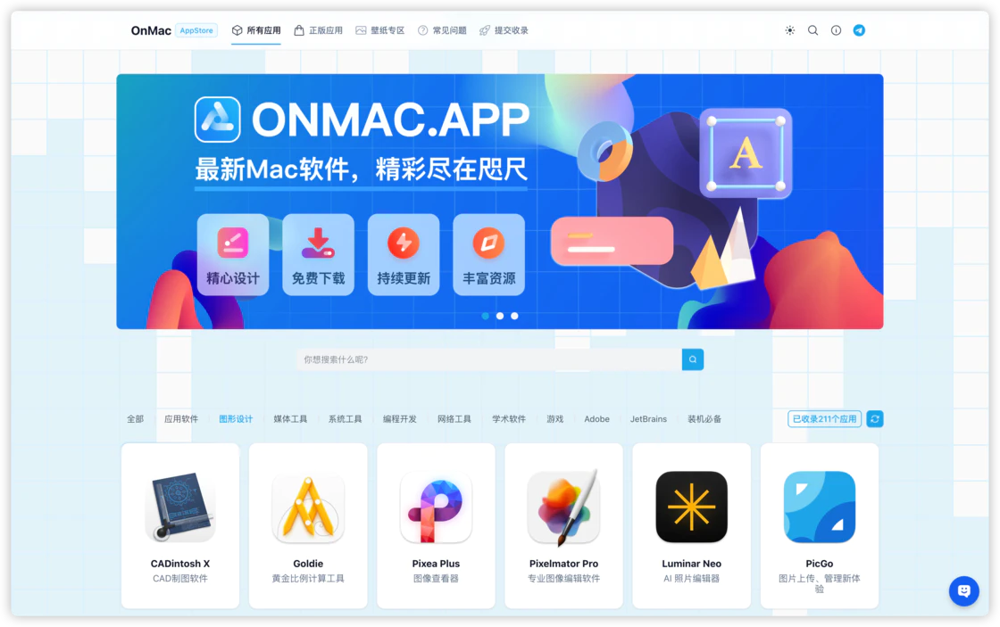
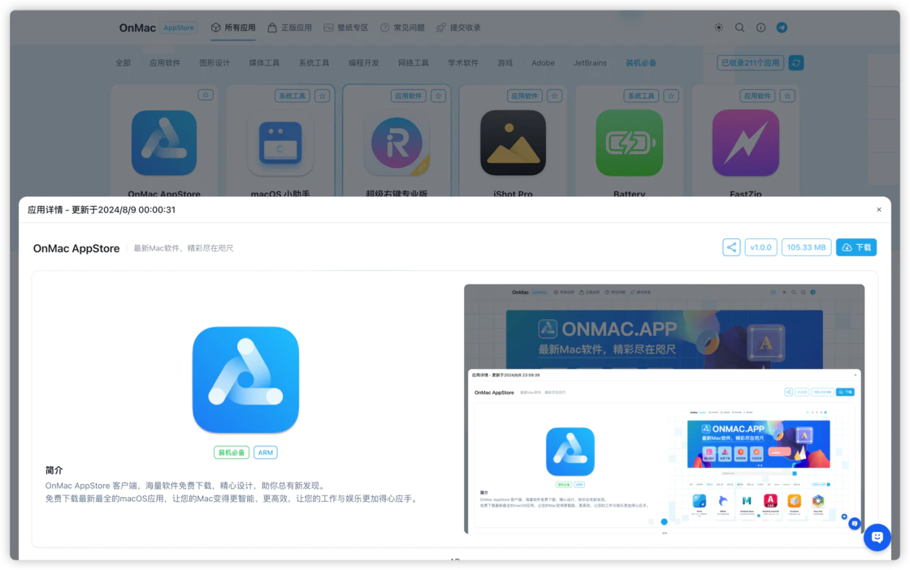

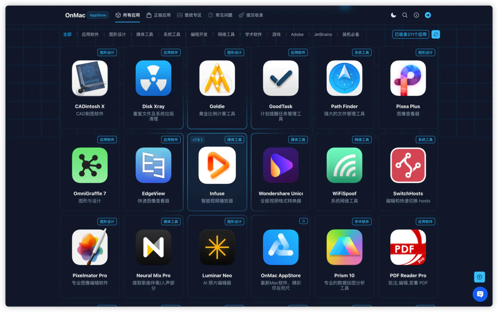
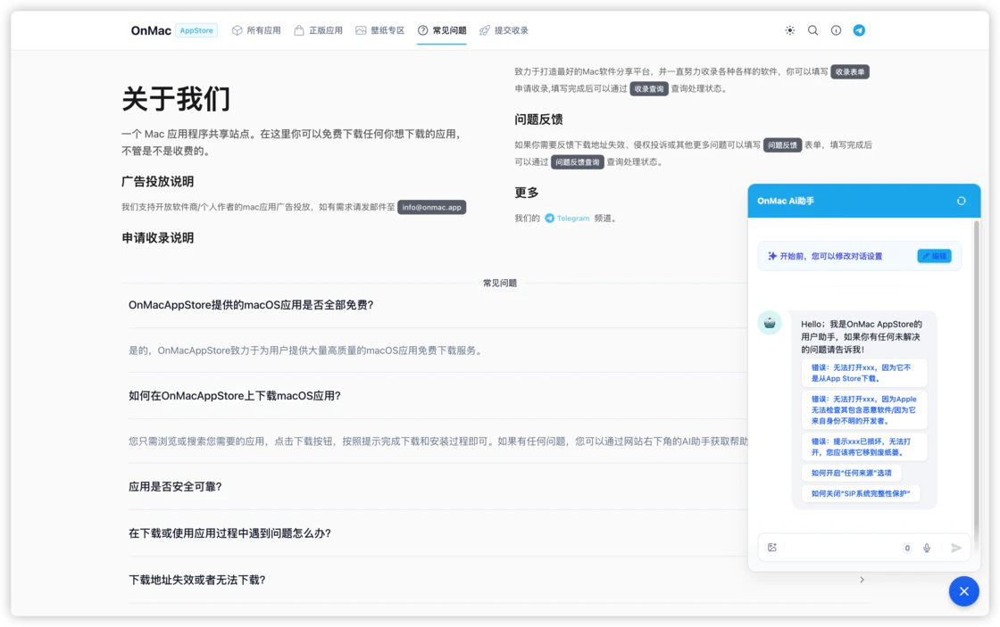

## **开发历程**

### **技术栈**

首先我们要确定使用什么技术栈，考虑到要做的是一个静态的资源下载站，没有会员体系不需要登陆也不需要评论区，就不需要考虑用户管理和其他多余的交互，只需要做内容就好。

那么前端只需要方便开发，并且支持静态打包，所以我们选择 **VUE3+TypeScript** 就行，创建项目很简单，也有现成的 UI 框架、组件等；接下来确定数据库，首选肯定是 MySQL，但是有没有更简单的呢，毕竟只需要为数不多的几个表（**资源内容、轮播图广告位、正版资源内容、通知及公告、可能还需要一个友链**），只需要满足**增删改查**就足够了。

### **数据库**

答案是当然有，还很多，比如 Notion（对没错，Notion 也满足做数据库的需求，具体可以查看[**NotionAPI**](https://developers.notion.com/reference/create-a-database)文档），然后发散一下思维，Notion 在国内访问速度相对较慢，那就把目光转向国内类 Notion 服务如[**Wolai**](https://www.wolai.com/wolai/7FB9PLeqZ1ni9FfD11WuUi)，可惜 Flowus 不支持 API 调用，Wolai 的 API 文档也不够详细。

那么再发散一下思维——**多维表格**，先看看我们最熟悉的[**飞书多维表格**](https://open.feishu.cn/document/server-docs/docs/bitable-v1/bitable-overview)，很不错，API 文档也很完善，但总觉得差点什么，让我们把目光投向另一家多维表格服务商：[**vika 维格云**](https://vika.cn/?home=1)，在阅读了[开发文档](https://developers.vika.cn/api/introduction/)之后，发现很好上手，操作简单，那就直接开始吧，注册登录创建空间站一气呵成～


接下来我们要确定怎么设计数据表结构，只需要像 Excel 一样对数据类型分列就好，无非就是应用名、简介、描述、图标地址、版本号、大小、分类、兼容性、下载地址等等，同理，友链表也只需要标题、描述、图标地址、跳转地址即可，轮播图只需要图片地址、标题、副标题等，公告就更简单了，标题、内容和通知类型。

需要注意的是我们需要尽可能少的去创建表，尽可能多的复用某些数据，比如我的轮播图数据表，通过勾选不同的选项框实现前端接收响应数据后进行筛选展示。

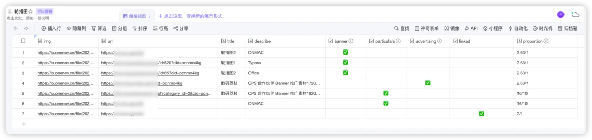

让我惊喜的是在表格侧边栏还贴心的附加了 API 示例面板：

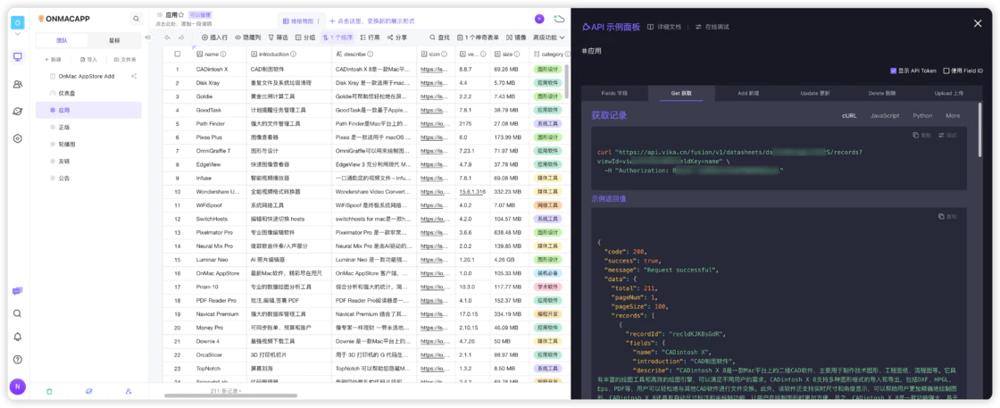

很快啊，我们的数据表就创建好了，当然有很多细节需要调整，先测试一下能不能请求，看起来没问题，前端开干吧～

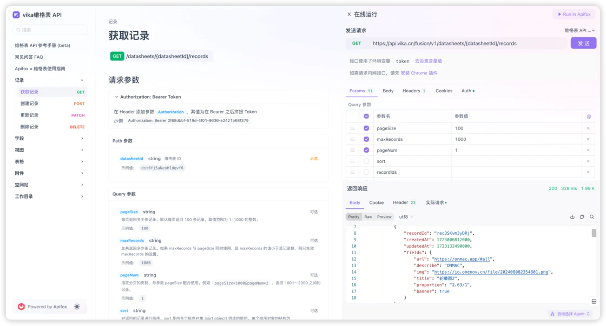

### **前端开发**

我们确定了技术栈使用 **VUE3+TypeScript** ，那么接下来需要确定使用什么**Web 框架**，根据使用习惯我更喜欢 [**NUXT3**](https://nuxt.com) ，可以创建高性能和生产级别的全栈 Web 应用和网站，主要是喜欢写 Vue 单文件组件，后期更方便维护和定位问题，在官网可以看到支持的功能和组件还是相当多的。

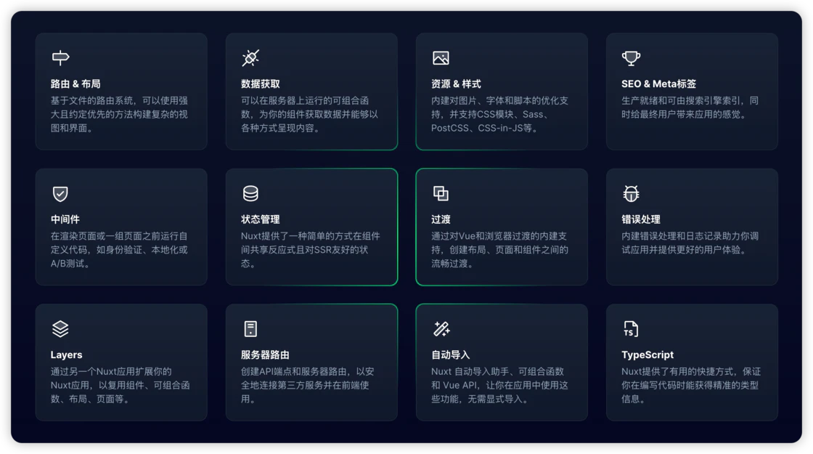

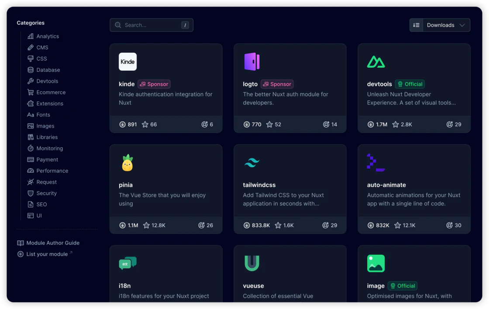

### **模板导入**

本着不重复造轮子的原则，我们直接找个[模板](https://nuxt.com/templates)上手，考虑到后面能尽量少些一些功能，就需要选择看起来就很全面的模板，比如我找到一个相当合适的 [**Docs Pro**](https://docs-template.nuxt.dev) ，页头页尾和路由、以及深色模式的内置。

接下来预装好开发环境（Nodejs Git Yarn 或者 PNPM），启动～

```shell
npx nuxi init -t github:nuxt-ui-pro/docs
OR
git clone https://github.com/nuxt-ui-pro/docs.git
cd nuxt-ui-pro
yarn install
yarn dev
```

很快啊，不出意外的话项目运行在 http://localhost:3000 端口了～

得益于 [**Nuxt UI Pro**](https://ui.nuxt.com/pro/getting-started) 这个 UI 框架，连 [**Tailwindcss**](https://tailwindcss.com) 都不需要手动引入，很好连 CSS 都不需要写了，看了一下开发文档，支持的组件还是很多的，也很好上手～

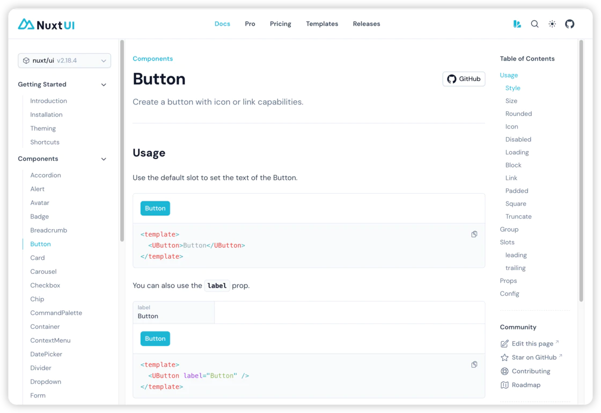

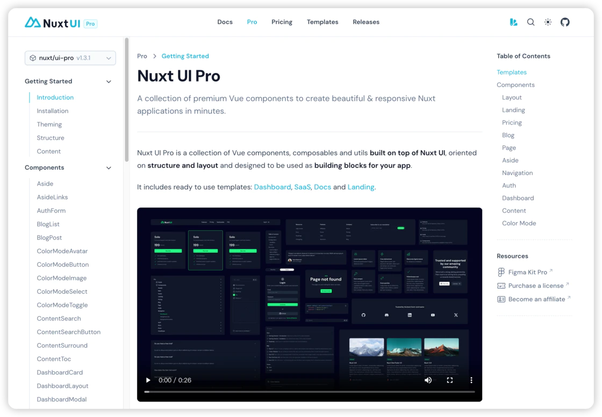

### **精简**

接下来我们需要删掉 Docs Pro 多余的页面、组件和内容，安装一下必要的一些模块（如 axios），修改 **nuxt.config.ts** 确保成为一个干净的项目。

```
# 去掉多余的页面
/content
/app/pages/[...slug].vue
/app/layouts/docs.vue
/app/components/OgImage/OgImageDocs.vue
/server/api/search.json.get.ts
```

考虑到可扩展性和模块化，我们需要用到 [**components**](https://nuxt.com/docs/guide/directory-structure/components) ，components/ 目录是你放置所有 Vue 组件的地方，Nuxt 自动导入此目录中的所有组件（以及您可能正在使用的任何模块注册的组件）

### **变量**

接下来还需要存储一些环境变量，如 vika 维格云的 **BearerToken、datasheetId（维格表 ID）及 API 地址**，并在 nuxt.config.ts 中导入变量，就像下面这样：

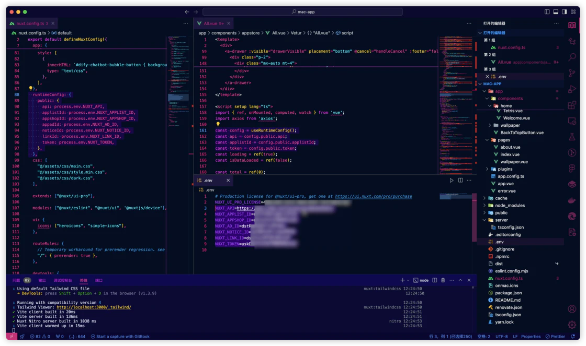

### **插件导入 UI 组件库**

考虑到组件不是很丰富，比如[抽屉 Drawer](https://arco.design/vue/component/drawer)、[对话框 Modal](https://arco.design/vue/component/modal)和[标签页 Tabs](https://arco.design/vue/component/tabs)可能不太符合国人的使用习惯（并且也不是很好看），本着不重复造轮子的原则，我们引入 [字节跳动的 ArcoDesign](https://arco.design/vue/docs/start) ，并全局注册 Arco Design 组件库（作为插件引入）。

使用 UI 组件库的好处在于不需要瞎折腾样式，配色，兼容性等等，通常移动端都已经完善了自适应。

```shell
yarn add --dev @arco-design/web-vue
```

```javascript
// app/plugins/arco-design.ts

import ArcoVue from '@arco-design/web-vue'
import '@arco-design/web-vue/dist/arco.css'
import ArcoVueIcon from '@arco-design/web-vue/es/icon'

export default defineNuxtPlugin((nuxtApp) => {
  nuxtApp.vueApp.use(ArcoVue)
  nuxtApp.vueApp.use(ArcoVueIcon)
})
```

然后就能全局使用 ArcoDesign 的 UI 组件库了，接下来我们需要把 NUXTUI 的深/浅色模式切换与 ArcoDesign 关联，根据[ArcoDesign](https://arco.design/vue/docs/dark)和[NUXTUI](https://ui.nuxt.com/getting-started/theming#dark-mode)的文档，我们只需要在改变系统颜色的时候同时改变组件库的颜色就 OK ～

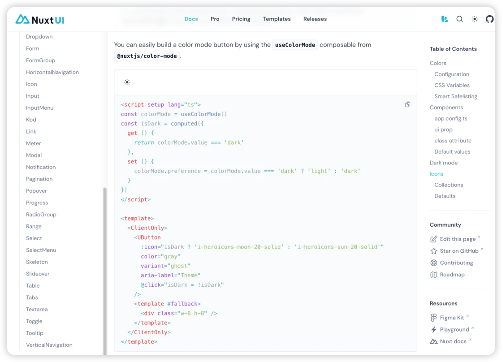

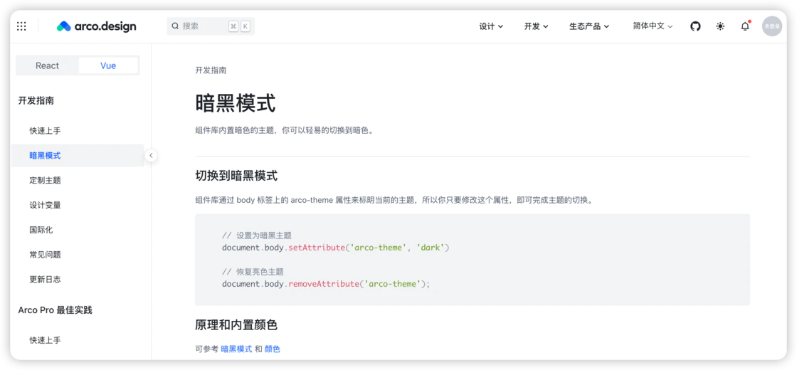

```javascript
// app/components/app/Theme.vue

<script lang="ts" setup>
import { ref, computed, onMounted } from 'vue';
const colorMode = useColorMode();
const isDark = computed({
  get() {
    return colorMode.value === "dark";
  },
  set(value: boolean) {
    colorMode.preference = value ? "dark" : "light";
    document.body.setAttribute('arco-theme', value ? 'dark' : 'light');
  },
});

onMounted(() => {
  document.body.setAttribute('arco-theme', colorMode.value === 'dark' ? 'dark' : 'light');
});
</script>

<template>
  <ClientOnly>
    <UButton :icon="isDark ? 'i-heroicons-moon-20-solid' : 'i-heroicons-sun-20-solid'" color="gray" variant="soft"
      aria-label="Theme" @click="isDark = !isDark" />
    <template #fallback>
      <USkeleton class="w-8 h-8 rounded-md" />
    </template>
  </ClientOnly>
</template>
```

### **主题色**

接下来出现了一个新的问题，ArcoDesign 的主题色和 NUXTUI 的主题色不一样，我们只需要确定 NUXTUI 使用什么[主题色（app/app.config.ts）](https://ui.nuxt.com/getting-started/theming):

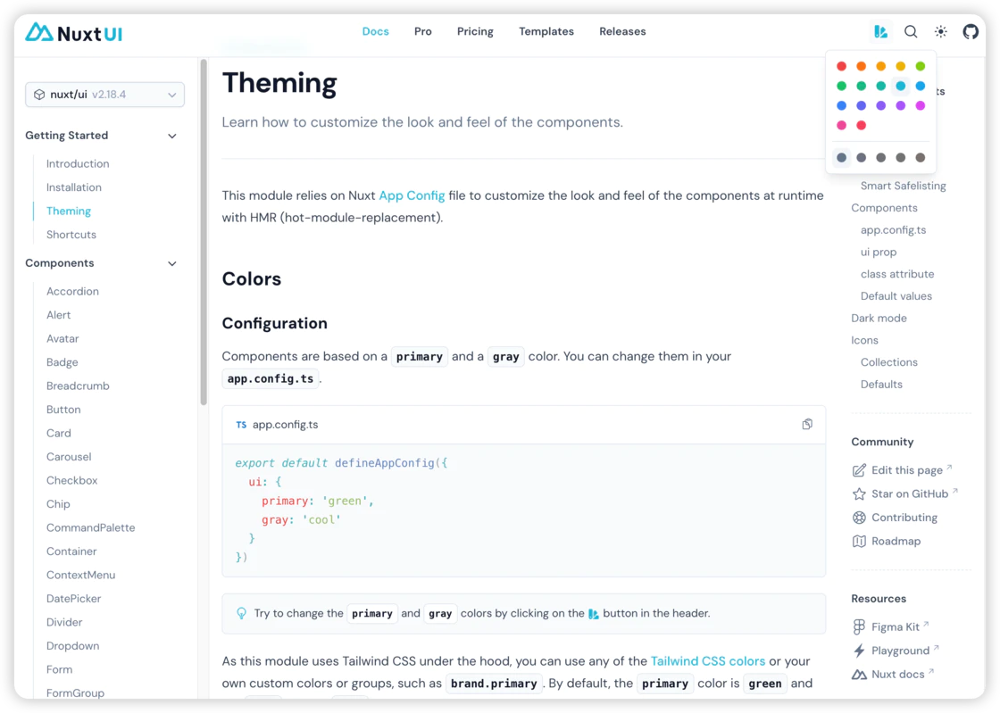

```javascript
// app/app.config.ts
export default defineAppConfig({
  ui: {
    primary: 'sky',
    gray: 'slate',
  },
})
```

然后改变 ArcoDesign 的主题色就行了，这里需要了解一下 [Arco Design Lab（主题商店）](https://arco.design/themes?currentPage=1&onlyPublished=false&pageSize=9&sortBy=starCount&tag=all)，可以看到里面有相当多的主题色配置，挑一个看起来差不多的，把 CSS 导入到 app/assets/css/main.css 即可（F12 查找元素很容易就看到在两个 body 中有了主题色，这里就不作为主题包导入，直接 css 后面添加 !important 提高优先级即可，同理深色模式一样的操作，在适量调整一下 --border-radius 圆角）。

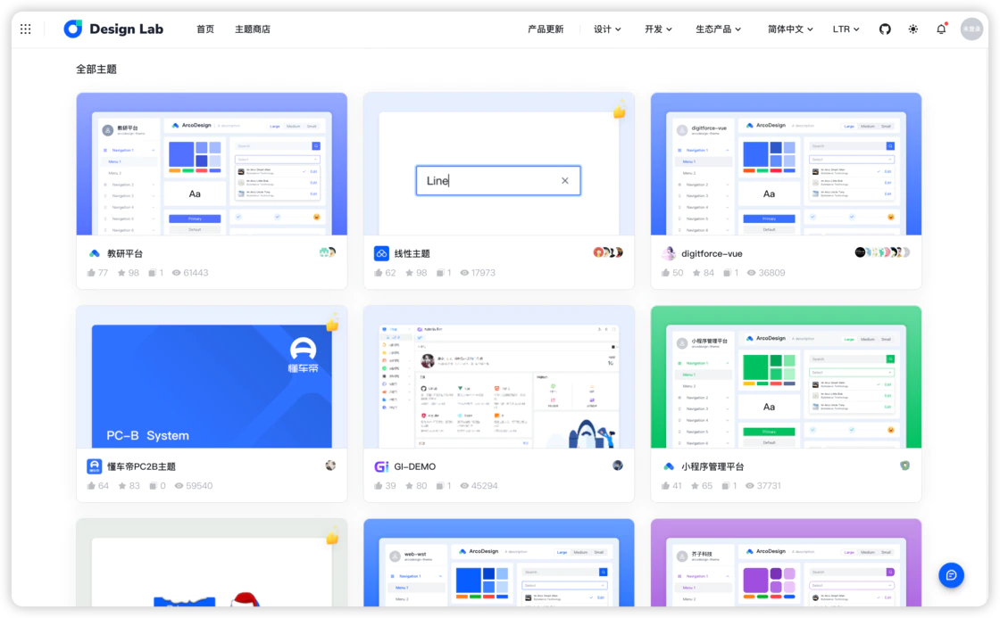

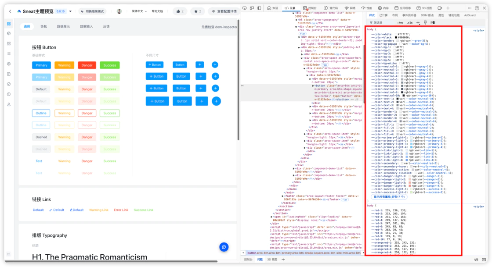

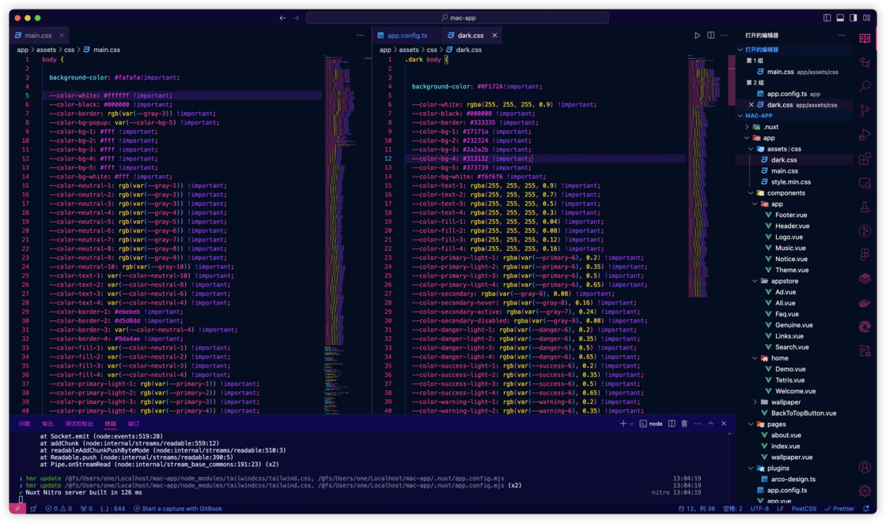

到目前为止，主题色和 UI 组件库就完事了，掌声～

接下来看看目前的目录树：

```
% tree
.
├── README.md
├── app
│   ├── app.config.ts //程序配置文件
│   ├── app.vue //布局页面
│   ├── assets
│   │   └── css
│   │       ├── dark.css //深色模式CSS
│   │       ├── main.css //浅色模式CSS
│   │       └── style.min.css //全局样式CSS
│   ├── components //Vue组件
│   │   ├── BackToTopButton.vue //返回顶部按钮
│   │   ├── app
│   │   │   ├── Footer.vue //页脚
│   │   │   ├── Header.vue //页头
│   │   │   ├── Logo.vue	 //LOGO
│   │   │   ├── Notice.vue //通知消息和弹窗
│   │   │   └── Theme.vue  //深色浅色切换按钮
│   │   ├── appstore
│   │   │   ├── Ad.vue			//轮播图
│   │   │   ├── All.vue			//所有应用
│   │   │   ├── Faq.vue			//常见问题
│   │   │   ├── Genuine.vue //正版应用
│   │   │   ├── Links.vue		//友链
│   │   │   └── Search.vue  //搜索框
│   │   ├── home
│   │   │   ├── Demo.vue  	//首页区块
│   │   │   ├── Tetris.vue  //掉落小方块动画
│   │   │   └── Welcome.vue //首页区块
│   │   └── wallpaper
│   │       └── Wallhaven.vue //壁纸专区
│   ├── error.vue //错误页面
│   ├── pages //Vue页面
│   │   ├── about.vue	//关于页面
│   │   ├── index.vue //首页
│   │   └── wallpaper.vue //壁纸专区
│   └── plugins
│       └── arco-design.ts
├── eslint.config.mjs
├── nuxt.config.ts //Nuxt配置文件
├── onmac.icns
├── package.json
├── public
│   ├── ad.png
│   ├── apple-touch-icon.png
│   ├── favicon.ico
│   ├── manifest.webmanifest //PWA表单
│   ├── onmac.icns
│   ├── pwa-192x192.png
│   ├── pwa-512x512.png
│   ├── pwa-maskable-192x192.png
│   ├── pwa-maskable-512x512.png
│   └── social-card.png
├── renovate.json
├── server
│   └── tsconfig.json
├── tsconfig.json
└── yarn.lock
```

### **布局**

接下来我们要确定逻辑和布局，由于这是一个单页页面，布局不需要很复杂，根据简洁至上的原则，应用详情可以通过抽屉打开，轮播图完全可以复用，那么只需要找到合适的组件直接使用就好，下面是原型图（其实是我现画的）。

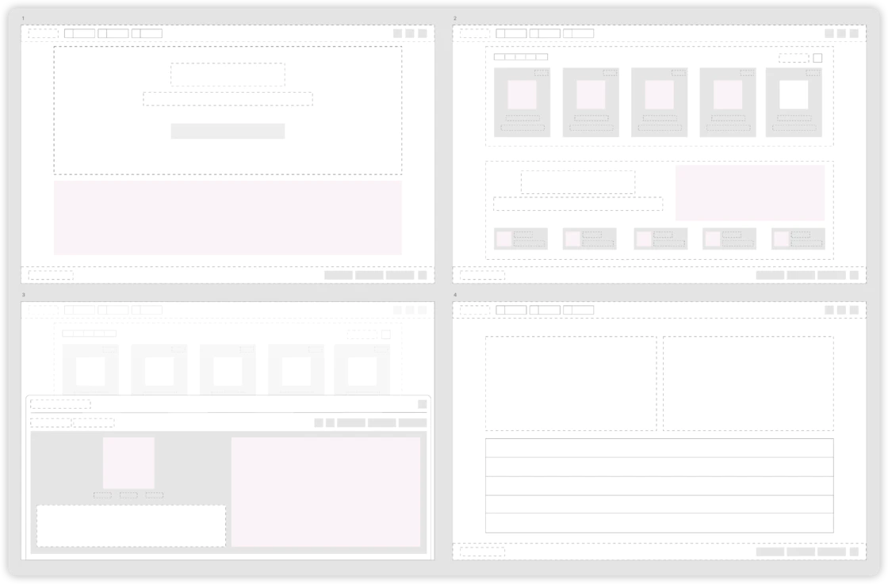

### **欢迎区**

浏览 NUXTUI 组件库，[**LandingHero**](https://ui.nuxt.com/pro/components/landing-hero) 组件看起来就很合适，后面我们只需要在 description 下面引入搜索框即可；

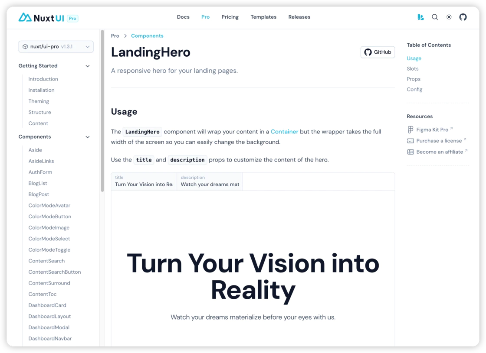

### **网站介绍**

这里我喜欢使用网格，将卡片显示为瀑布流布局，刚好 [**LandingGrid**](https://ui.nuxt.com/pro/components/landing-grid#usage) 组件就很合适，直接引入即可。

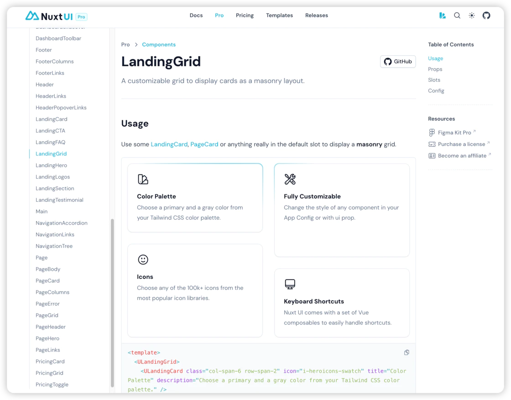

### **应用展示**

我很喜欢鼠标悬浮发光的效果，所以我们还是使用 [**LandingCard**](https://ui.nuxt.com/pro/components/landing-card) 组件，稍微调整一下布局，只需要自定义**icon、title、description**插槽即可，使用 Tailwindcss 的 [**Grid Template Rows**](https://tailwindcss.com/docs/grid-template-rows)（网格布局）实现列数，间距，边距等，至于展示应用类别我们可以使用 [**Absolute**](https://tailwindcss.com/docs/position#absolutely-positioning-elements) 绝对定位展示 [**UBadge**](https://ui.nuxt.com/components/badge) 。

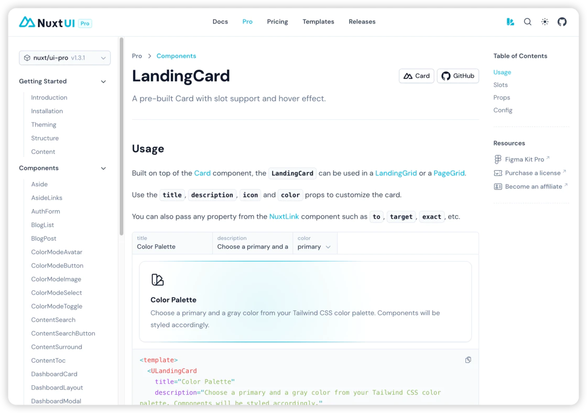

[LandingCard](https://ui.nuxt.com/pro/components/landing-card)

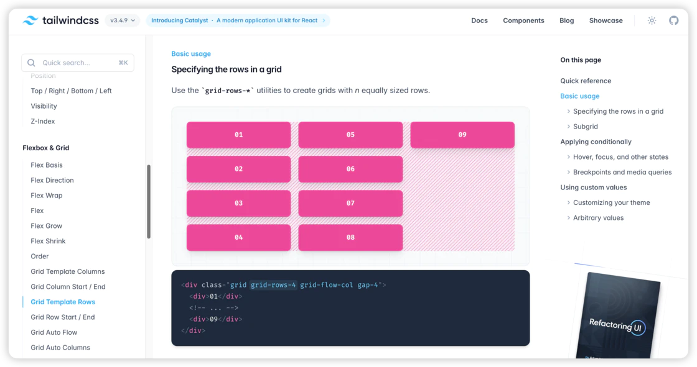

[Grid Template Rows](https://tailwindcss.com/docs/grid-template-rows)

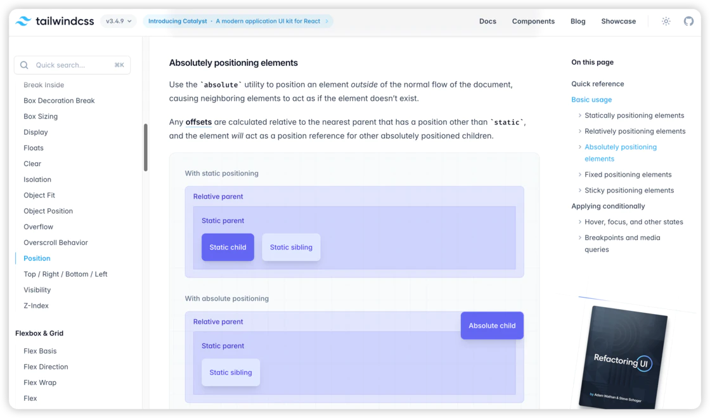

[Absolute](https://tailwindcss.com/docs/position#absolutely-positioning-elements)

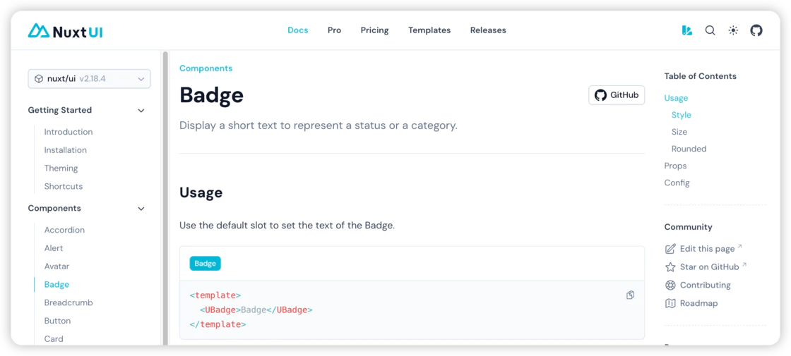

[UBadge](https://ui.nuxt.com/components/badge)

类别的展示使用 ArcoDesign 的 [**标签页 Tabs**](https://arco.design/vue/component/tabs) 组件，使用`v-for遍历数组和对象`，将 API 请求的数组提取值添加到对应的记录中。

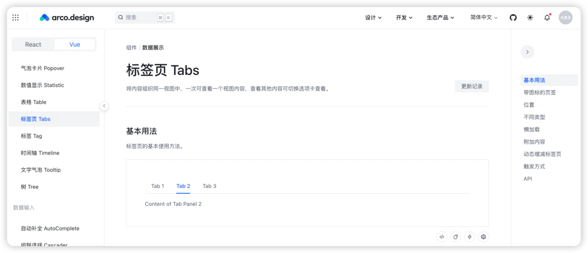

[标签页 Tabs](https://arco.design/vue/component/tabs)

我们还需要一个分页组件 [**分页 Pagination**](https://arco.design/vue/component/pagination) ，来实现页码跳转，需要一个 [**空状态 Empty**](https://arco.design/vue/component/empty) 来展示没有数据的情况。

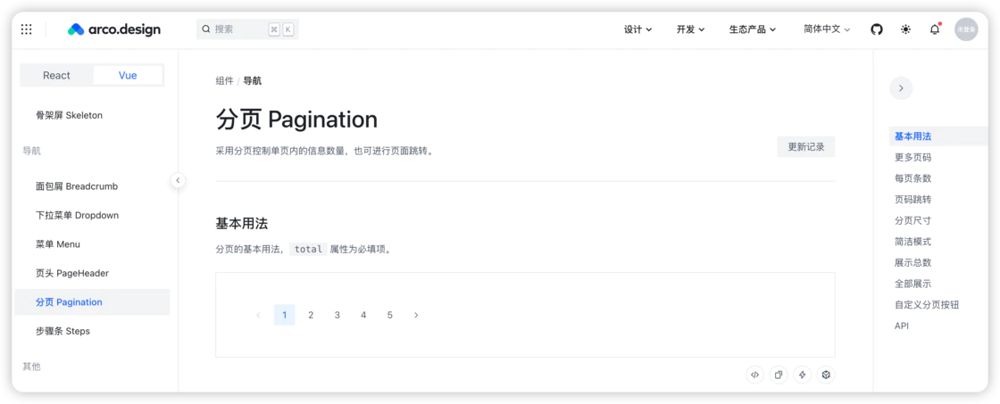

[分页 Pagination](https://arco.design/vue/component/pagination)

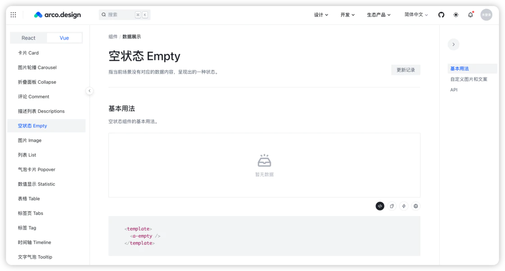

[空状态 Empty](https://arco.design/vue/component/empty)

#### **数据请求**

接下来划重点，构造 API 请求获取数据，考虑到作为一个资源下载站并不需要频繁的数据更新和请求，我们需要想个办法来持久性暂存数据（`localStorage`）。

然后可以这样，使用异步函数 `fetchData`，用于从 API 获取数据并缓存到浏览器的 `localStorage` 中，以提高后续访问的效率，减少网络请求次数。

#### **函数结构**

#### **1\. 获取当前时间戳**

```javascript
const now = new Date().getTime()
```

获取当前时间的时间戳（毫秒表示）。

#### **2\. 定义 12 小时的毫秒数**

```javascript
const twelveHoursInMillis = 12 * 60 * 60 * 1000
```

计算 12 小时的毫秒数，用于之后判断数据是否过期。

#### **3\. 读取** `localStorage` **中的数据**

```javascript
const storageKey = 'all_app'
const storedData = localStorage.getItem(storageKey)
```

从本地存储中读取名为 `all_app` 的数据。

#### **4\. 检查数据是否存在以及是否在 12 小时内**

```javascript
if (storedData) {
  const { data, timestamp } = JSON.parse(storedData)
  if (now - timestamp < twelveHoursInMillis) {
    total.value = data.total
    allRecords.value = data.records
    updateTabContent()
    loading.value = false
    isDataLoaded.value = true
    return
  }
}
```

- 如果 `localStorage` 中存在数据且数据的时间戳在 12 小时内：
  - 从本地存储中提取数据并解析。
  - 更新 `total` 和 `allRecords` 的值。
  - 调用 `updateTabContent` 函数更新显示内容。
  - 设置 `loading` 和 `isDataLoaded` 的值并返回，结束函数执行。

#### **5\. 设置加载状态**

```javascript
loading.value = true
```

设置 `loading` 为 `true`，表示正在加载数据。

#### **6\. 发起 API 请求获取数据**

```javascript
try {
  const response = await axios.get(`${api}/${applistId}/records`, {
    headers: {
      Authorization: `Bearer ${token}`,
    },
    params: {
      pageSize: 1000,
      maxRecords: 1000,
      pageNum: 1,
      cellFormat: 'json',
    },
  })

  if (response.data.success) {
    total.value = response.data.data.total
    const records = response.data.data.records.map((record) => {
      if (record.fields.screenshot) {
        record.fields.screenshot = record.fields.screenshot.split('\n')
      }
      return record
    })
    allRecords.value = records
    updateTabContent()

    // 存储数据到 localStorage
    const dataToStore = {
      data: {
        total: response.data.data.total,
        records: records,
      },
      timestamp: now,
    }
    localStorage.setItem(storageKey, JSON.stringify(dataToStore))
  }
} catch (error) {
  console.error('Error fetching data:', error)
} finally {
  useToast().add({
    icon: 'i-heroicons-check-circle-20-solid',
    title: '应用数据已成功获取！',
    color: 'emerald',
  })
  loading.value = false
  isDataLoaded.value = true
}
```

- 使用 `axios` 发起 GET 请求，URL 中包含 `api` 和 `applistId`，请求头中包含授权令牌 `token`。
- 请求参数包括 `pageSize`、`maxRecords`、`pageNum` 和 `cellFormat`。
- 如果响应成功且 `response.data.success` 为 `true`：
  - 更新 `total` 和 `allRecords` 的值。
  - 调用 `updateTabContent` 函数更新显示内容。
  - 将数据和当前时间戳存储到 `localStorage` 中。
- 如果发生错误，捕获并打印错误信息。
- 最后，无论请求是否成功，都添加一条通知，设置 `loading` 和 `isDataLoaded` 的值。

很好，一个完整的数据请求就成功了！

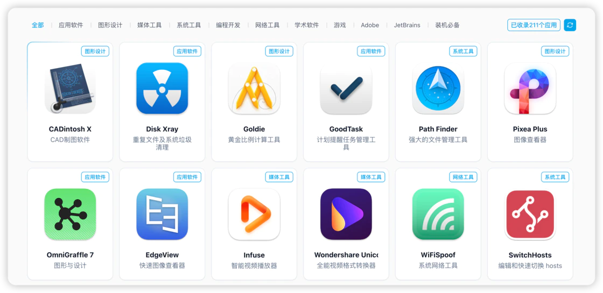

然后你可以根据需求将响应内容填充到模板中，接下来使用 [**抽屉 Drawer**](https://arco.design/vue/component/drawer) 组件来展示应用详情，先用`a-drawer` 构建一个抽屉

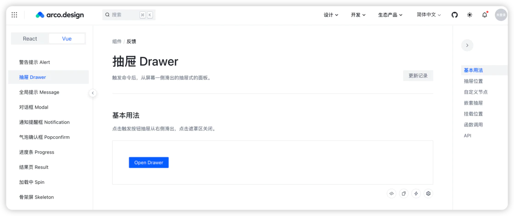

#### **模板部分 (`<template>`)**

1.  `<a-drawer>`：抽屉组件，`visible`属性控制其是否显示，`placement`属性定义抽屉从底部弹出，`@cancel`绑定取消显示的事件处理器，`footer`属性设置为`false`表示不显示底部。
    - `<template #title>`：嵌套的标题模板，显示应用详情及更新时间。
    - `<a-page-header>`：页面头部组件。
      - `<template #extra>`：额外的操作按钮，包括分享按钮、版本信息、大小信息和下载链接按钮。
    - `<div class="p-2">`：内容区域。
      - `<ULandingCard>`：自定义卡片组件，用于显示应用的描述、截图、类别和兼容性信息。
        - `<template #icon>`：卡片的图标部分。
        - `<template #description>`：卡片的描述部分，使用`v-html`指令以 HTML 方式显示格式化的描述。
      - **更新日志和帮助信息**：如果有更新日志和帮助信息，则显示相应的内容。
      - **广告**：页面底部显示广告。

#### **脚本部分 (`<script setup lang="ts">`)**

**引入模块**：

- `ref`、`computed`和`onMounted`是 Vue 中的 API，用于定义响应式变量、计算属性和生命周期钩子。
- `axios`用于发起 HTTP 请求。

**状态变量**：

- `drawerVisible`：控制抽屉的显示与隐藏。
- `selectedItem`：存储选中的应用项信息。

**函数**：

- `showDrawer`：显示抽屉，接收一个应用项作为参数，并将其赋值给`selectedItem`，然后将`drawerVisible`设置为`true`。
- `handleCancel`：取消并关闭抽屉，将`drawerVisible`设置为`false`。
- `formattedDescription`：计算属性，用于格式化应用描述字段，将换行符转换为 HTML 的`<br>`标签。
- `formattedChangelog`：计算属性，用于格式化更新日志字段，同样将换行符转换为 HTML 的`<br>`标签。
- `formattedUpdateTime`：计算属性，用于格式化更新时间，将日期对象转换为本地字符串表示。
- `generateShareLink`：生成应用的分享链接并复制到剪贴板。
- `navigateToUrl`：导航到指定的 URL，创建一个新的链接元素并触发点击事件。
- `formatLabel`：根据 URL 格式化按钮的标签文本。

**轮播图相关**：

- `carouselItems`：计算属性，根据选中的应用项获取截图信息，如果没有则返回默认图片。
- `defaultItems`：默认的图片数组，从本地存储中获取广告轮播图片。

**生命周期钩子**：

- `onMounted`：组件挂载时的生命周期钩子，用于设置轮播图的自动切换逻辑。

然后我们就构建完成了一个抽屉～

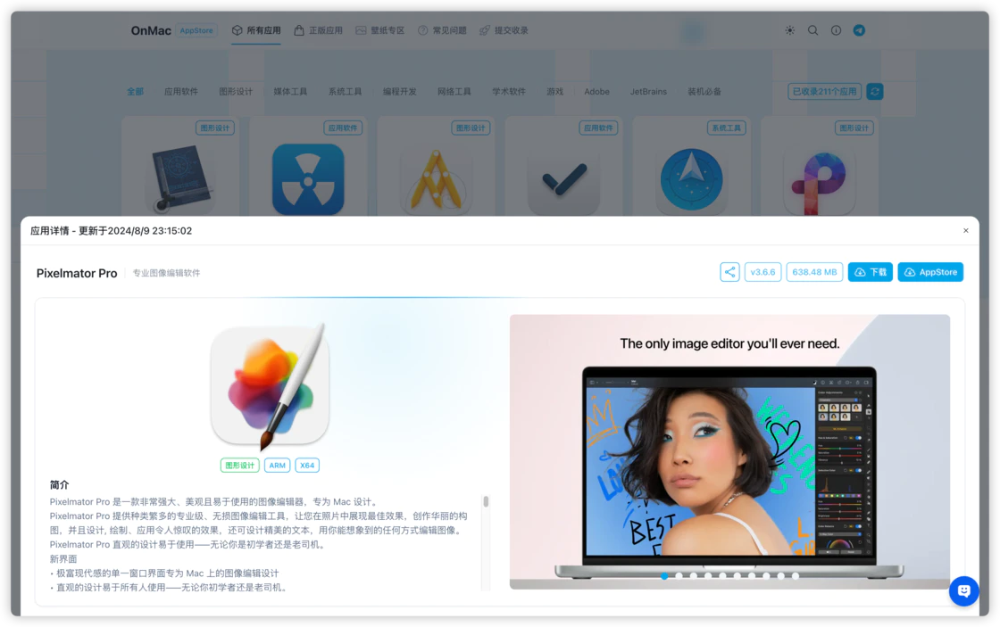

应用展示区块基本上这样，然后就可以复用到搜索和正版软件的展示区，你可以在 [**Gist Github**](https://gist.github.com/onenov/5b4804cd401a4c9cb930fafaa4c3a51b) 查看所有应用区块的完整代码。

### **轮播图**

轮播图相对就比较简单，我们使用 [**Carousel 轮播图**](https://ui.nuxt.com/components/carousel) 组件自定义 img 插槽，配合[**Aspect Ratio**](https://tailwindcss.com/docs/aspect-ratio) 锁定图片显示的长宽比例**，**然后只需要先这样再这样然后再那样就好了～

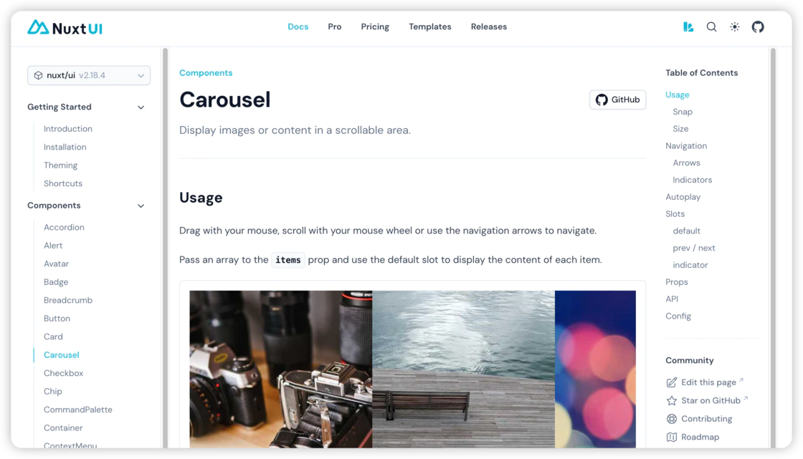

[Carousel 轮播图](https://ui.nuxt.com/components/carousel)

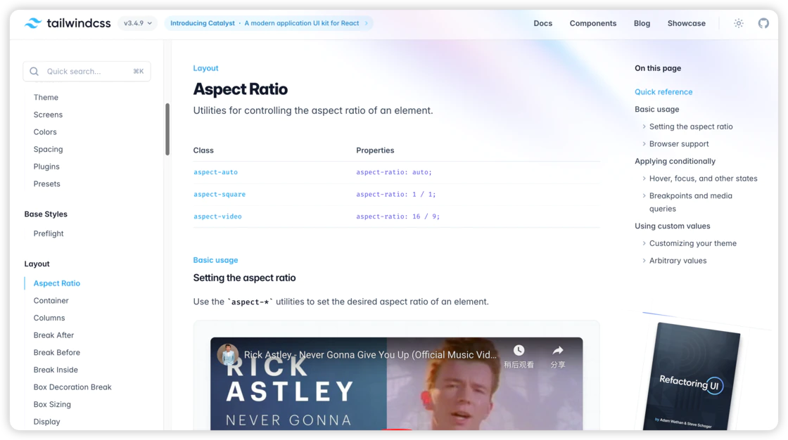

[Aspect Ratio](https://tailwindcss.com/docs/aspect-ratio)

`<UCarousel>` **组件：**

- 用于创建轮播组件。
- `v-if`：根据 `carouselType` 显示不同类型的轮播。
- `ref`：用于在 JavaScript 逻辑中引用该组件。
- `v-slot="{ item }"`：使用插槽绑定当前的轮播项。
- `:items`：绑定轮播项数组。
- `:ui="{ item: 'basis-full' }"`：设置轮播项的样式。
- `class="rounded-lg overflow-hidden"`：应用样式。
- `indicators`：显示轮播指示器。
- `<a :href="item.url" target="_blank">`：为每个轮播项添加链接。
- ``：显示轮播项图片，样式根据 `carouselType` 变化。

**引入模块和定义属性：**

- `import { ref, onMounted } from 'vue';`：从 Vue 中引入 `ref` 和 `onMounted`。
- `import axios from 'axios';`：引入 axios 用于 HTTP 请求。
- `const props = defineProps(...);`：定义组件接收的属性 `carouselType`，并验证其值。

**获取配置和定义响应式状态：**

- `const config = useRuntimeConfig();`：获取配置。
- `const api = config.public.api;`：API 地址。
- `const appadId = config.public.appadId;`：应用广告 ID。
- `const token = config.public.token;`：认证 Token。
- `const mainItems = ref([]);`：主轮播项的响应式状态。
- `const secondaryItems = ref([]);`：次轮播项的响应式状态。
- `const advertisingItems = ref([]);`：广告轮播项的响应式状态。
- `const linkadItems = ref([]);`：Linkad 轮播项的响应式状态。

**获取轮播数据：**

- `const fetchCarouselData = async () => { ... };`：定义异步函数获取轮播数据。
- 检查本地存储的数据是否在 12 小时内有效，如果有效则使用本地数据。
- 使用 axios 从 API 获取数据，并处理数据更新响应式状态。
- 将获取的数据存储到 `localStorage`。

**定义轮播组件的引用：**

- `const carouselRef = ref();`：主轮播组件的引用。
- `const carouselRef2 = ref();`：次轮播组件的引用。
- `const carouselRef3 = ref();`：广告轮播组件的引用。
- `const carouselRef4 = ref();`：Linkad 轮播组件的引用。

**组件挂载时执行操作：**

- `onMounted(() => { ... });`：在组件挂载时执行。
- 调用 `fetchCarouselData` 获取轮播数据。
- 设置 `setInterval` 定时器每 6 秒自动切换轮播项。

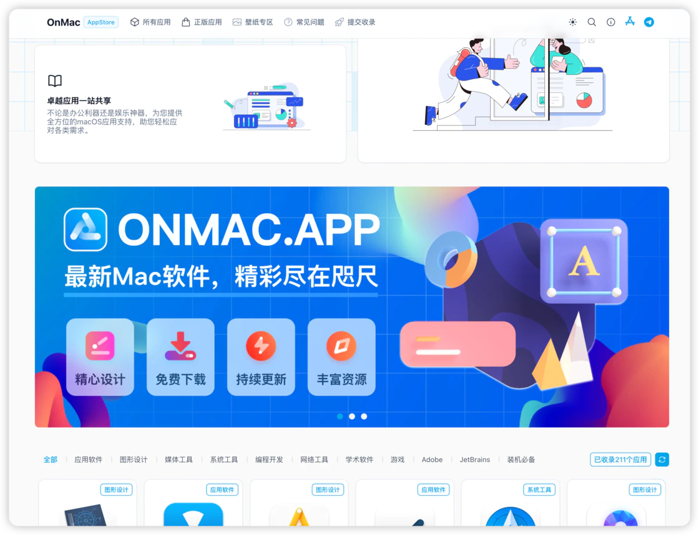

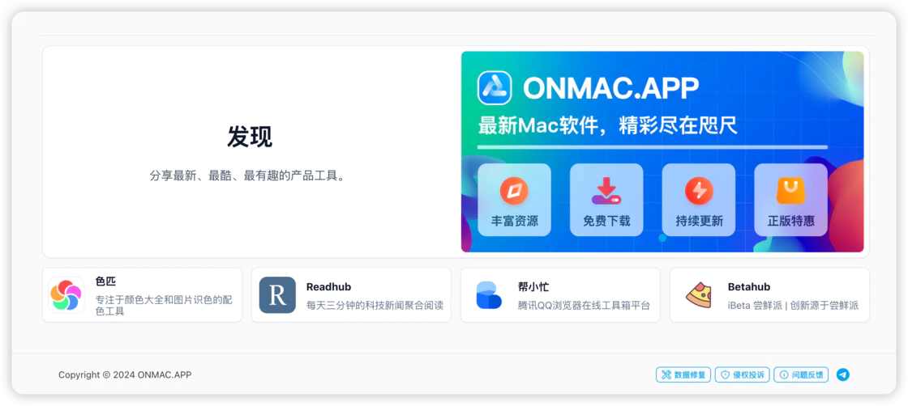

在其他页面按需引入轮播图也很简单，在上面定义了定义轮播组件的引用，在其他页面只需要添加`carouselType`即可，如：

```
 &lt;AppstoreAd carouselType="banners" /&gt;
 &lt;AppstoreAd carouselType="linkad" /&gt;
```

你可以在 [**Gist Github**](https://gist.github.com/onenov/cd01daf3d423ec66141bcc779b724231) 查看所有轮播图区块的完整代码。

### **通知**

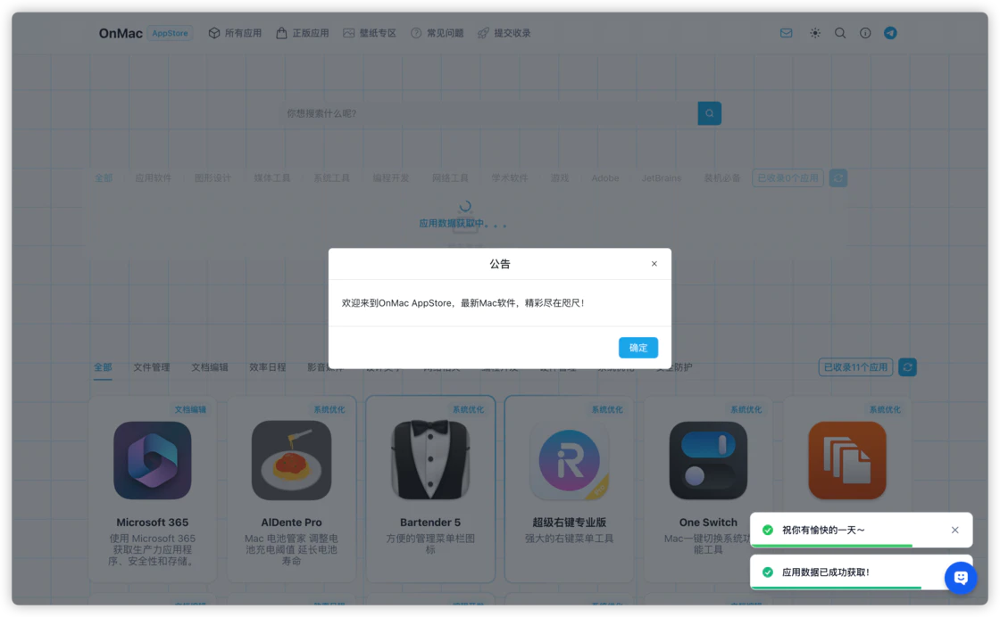

展示公告和通知我们需要用到 ArcoDesign 的 [**Modal 对话框**](https://arco.design/vue/component/modal) 组件和 NUXTUI 的 [**Notification**](https://ui.nuxt.com/components/notification) 组件，其实 [**通知提醒框 Notification**](https://arco.design/vue/component/notification) 组件也可以。

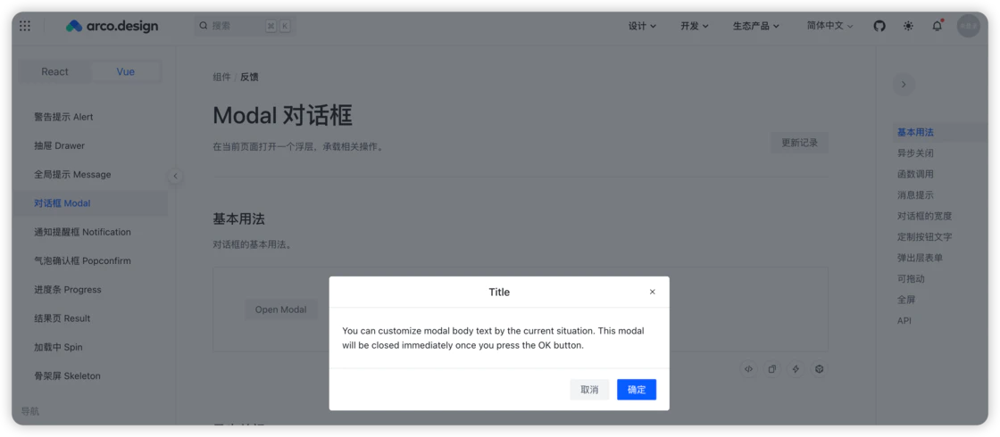

[Modal 对话框](https://arco.design/vue/component/modal)

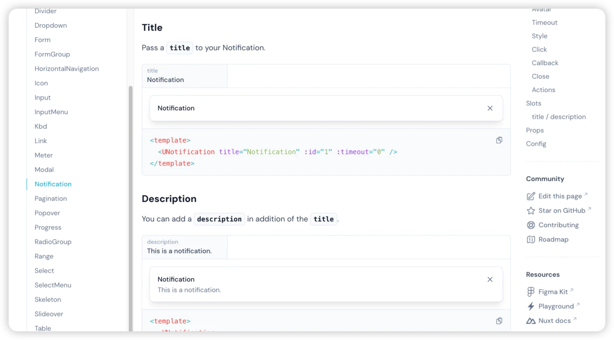

[Notification](https://ui.nuxt.com/components/notification)

先来看模板部分，如果有公告或通知，显示一个按钮，点击按钮可以显示所有公告的模态框。

`<template>`：

- Vue.js 模板标签，用于定义组件的结构和内容。

`<ClientOnly>`：

- Vue.js 中的一个特殊组件，用于确保其内部的内容仅在客户端渲染，而不会在服务器端渲染。这对于某些依赖于浏览器环境的组件非常有用。

`<UButton>`：

- 一个自定义的按钮组件。
- `v-if="announcements.length > 0 || notifications.length > 0"`：当公告或通知的长度大于 0 时，显示这个按钮。
- `icon="i-heroicons-envelope"`：按钮图标为信封图标。
- `size="sm"`：按钮的大小为小号。
- `color="primary"`：按钮的颜色为主色。
- `square`：按钮为方形。
- `variant="link"`：按钮的样式为链接样式。
- `@click="showAnnouncement"`：点击按钮时，调用`showAnnouncement`方法，显示所有公告弹窗。

`<div v-for="(announcement, index) in announcements" :key="index">`：

- 循环遍历`announcements`数组，生成一组`<div>`元素。
- `v-for`：Vue.js 的指令，用于循环遍历数组。
- `(announcement, index)`：当前循环项和索引。
- `:key="index"`：为每个`<div>`设置唯一的键，提升渲染性能。

`<a-modal>`：

- `a-modal`是从`@arco-design/web-vue`库中引入的模态框组件，用于显示公告内容。
- `v-model:visible="announcement.visible"`：绑定模态框的可见性到`announcement.visible`。
- `title="公告"`：模态框的标题为“公告”。
- `:hide-cancel="true"`：隐藏取消按钮，只显示确认按钮。
- `@ok="closeAnnouncement(index)"`：点击确认按钮时，调用`closeAnnouncement`方法，关闭当前模态框。

`<div v-html="announcement.content"></div>`：

- 使用`v-html`指令，将`announcement.content`中的 HTML 内容直接插入到`<div>`中进行渲染。

然后是脚本部分：

**Imports**：

- 引入 `ref` 和 `onMounted` 以使用 Vue 的响应式变量和生命周期钩子。
- 引入 `Modal` 和 `Notification` 用于显示公告和通知。
- 引入 `axios` 进行 HTTP 请求。
- 引入 `date-fns` 用于格式化日期。

**配置**：

- 从 `useRuntimeConfig` 获取 API 配置信息。

**接口定义**：

- 定义 `Announcement` 接口，描述公告和通知的结构。

**响应式变量**：

- `announcements` 和 `notifications` 用来存储公告和通知的列表。

**数据获取**：

- `fetchAnnouncements` 函数：从 API 获取公告数据，并根据当天日期和本地存储的数据决定是否更新公告。

**显示弹窗和通知**：

- `showModalAndToast` 函数：根据公告类型将数据添加到响应式变量中，并显示通知。

**关闭公告弹窗**：

- `closeAnnouncement` 函数：将指定索引的公告弹窗设置为不可见。

**显示所有公告弹窗**：

- `showAnnouncement` 函数：将所有公告弹窗设置为可见。

**生命周期钩子**：

- `onMounted`：在组件挂载时调用 `fetchAnnouncements` 函数，获取公告数据。

然后我们就搞定了通知和公告内容的展示，大功告成～

### **关于页面**

这个页面没什么技巧，硬写。

但是怎么可能硬写，我们需要去找个模板，好在收藏夹足够丰富，来看看这个：[**EasyFrontend | UI Component**](https://easyfrontend.com/)   提供了一系列使用 HTML、React、Bootstrap 和 Tailwind CSS 构建的 UI 组件、块和部分，拿来直接用就好！

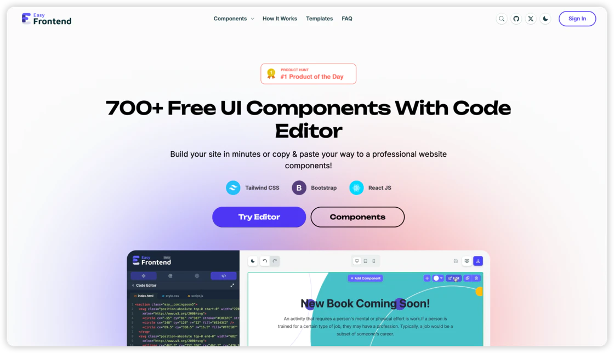

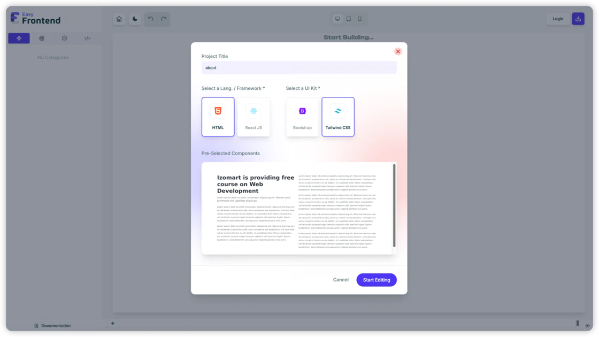

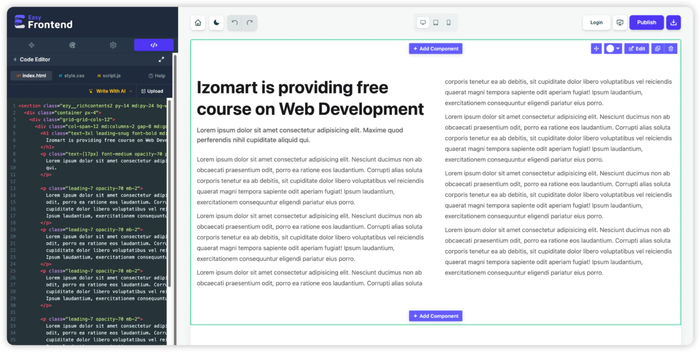


需要注意的是这里的常见问题我们使用了 [**LandingFAQ**](https://ui.nuxt.com/pro/components/landing-faq) 区块，在 about 页面 通过 `<AppstoreFaq />` 直接引入。

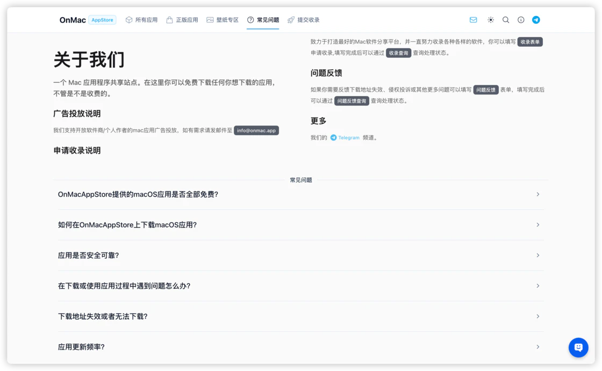

### **路由**

到目前为止只有两个页面，所以内部区块间的跳转可以通过**哈希路由（Hash Routing），**利用 URL 中的哈希片段（即`#`符号后面的部分）来进行页面导航的方法。使用这种方式进行导航时，页面并不会发生真正的刷新，而是通过 JavaScript 根据哈希值的变化来决定显示哪个页面或组件。

**哈希片段**：URL 中以`#`开头的部分，例如`#/store`。

**浏览器行为**：改变哈希片段不会导致页面刷新，而是会触发`hashchange`事件。

**用例**：通常用于单页应用（SPA）中，可以与前端路由库如 Vue Router 或 React Router 结合使用。

比如我们要跳转到所有应用区块可以这样写：

```javascript
// index.vue
<div class="mx-auto mt-8 max-w-7xl p-2">
  <div id="all" class="anchor-offset"></div>
  <AppstoreAll />
</div>

// app/components/app/Header.vue

<script setup lang="ts">
const route = useRoute()

const links = [{
  label: '所有应用',
  icon: 'i-heroicons-cube',
  to: '/#all',
  exactHash: true
}]
</script>

<template>
  <UHorizontalNavigation :links="links" class="border-b border-gray-200 dark:border-gray-800" />
</template>
```

这里默认使用的是 [**HorizontalNavigation （水平导航）**](https://ui.nuxt.com/components/horizontal-navigation) 组件，没有给 `<AppstoreAll />` 直接添加 `id` 的原因是，点击跳转会被顶部的页头覆盖，所以我们需要偏移一下，可以在 css 中这样写：

```css
.anchor-offset {
  display: block;
  position: relative;
  top: -80px; /* 根据你的header高度调整这个值 */
  visibility: hidden;
}
```

这样就有效的避免偏移被 Header 遮挡了！

到目前为止前端开发的逻辑基本上讲清楚了，接下来讲几个重点。

### [**useSeoMeta**](https://nuxt.com/docs/api/composables/use-seo-meta)

`useSeoMeta` 是一个方便的工具，可以帮助你为网站定义 SEO meta 标签。它支持 TypeScript，并且通过提供一个带有完整类型的平面对象来避免常见错误，比如使用`name`代替`property`以及拼写错误。

我们可以直接在 app/app.vue 中使用，也可以在每个单独的页面中使用：

```javascript
<script setup lang="ts">

const title: string = 'AppStore'
const description: string = '最新Mac软件、精彩尽在咫尺，精心设计，助你总有新发现。'

useSeoMeta({
  title,
  description,
  ogTitle: title,
  ogDescription: description,
  ogImage: 'https://onmac.app/social-card.png',
  twitterImage: 'https://onmac.app/social-card.png',
  twitterCard: 'summary_large_image'
})
</script>
```

### **manifest.webmanifest**

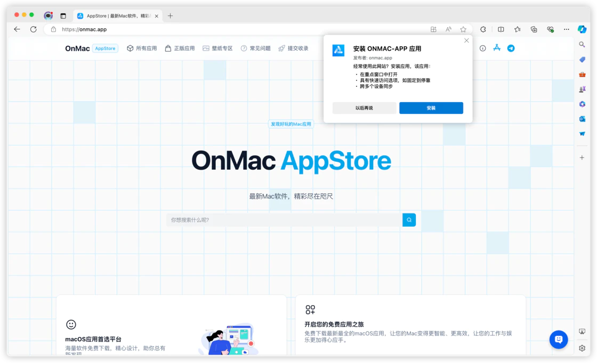
PWA

`manifest.webmanifest`文件是一个用于描述 Web 应用程序的清单文件。这种文件可以让开发者定义应用的名称、图标、启动 URL、主题颜色等信息，帮助 Web 应用在移动设备上更像一个原生应用（PWA），放在 `/public` 目录下，从 `nuxt.config.ts`导入，还可以通过 [**Favicon InBrowser.App**](https://favicon.inbrowser.app/tools/favicon-generator) 和 [**IconKitchen**](https://icon.kitchen/i/H4sIAAAAAAAAA01Nuw7DIBD7F88ZOvMPlTpkqzpcegdBgVwEpFUV8e%252BFTFksP2T7wIfCLhnmAFNaxlmiwFgKWQZYN%252F62JuEjOUE37pSXS%252F4gZr%252B6Xi%252B6wdwGJO%252FmcrJJS9F40iC2e7UOiMp76I9P0MpJPbdhr7nhV6aGkd5NveofWlEPJ5wAAAA%253D) 自动生成图标和清单。


```json
{
  "name": "ONMAC-APP",
  "short_name": "ONMAC APP",
  "description": "最新Mac软件，精彩尽在咫尺",
  "start_url": "/",
  "display": "standalone",
  "background_color": "#FFFFFF",
  "lang": "zh-CN",
  "scope": "/",
  "theme_color": "#FFFFFF",
  "icons": [
    {
      "src": "pwa-192x192.png",
      "sizes": "192x192",
      "type": "image/png",
      "purpose": "any"
    },
    {
      "src": "pwa-512x512.png",
      "sizes": "512x512",
      "type": "image/png",
      "purpose": "any"
    },
    {
      "src": "/pwa-maskable-192x192.png",
      "sizes": "192x192",
      "type": "image/png",
      "purpose": "maskable"
    },
    {
      "src": "/pwa-maskable-512x512.png",
      "sizes": "512x512",
      "type": "image/png",
      "purpose": "maskable"
    }
  ]
}
```

### [**nuxt.config.ts**](https://nuxt.com/docs/guide/directory-structure/nuxt-config)

可以简单的配置文件 `nuxt.config.ts`（或 `nuxt.config.js`）来进行项目设置。这个配置文件可以用于定义应用的各种参数，如路由、插件、中间件、模块等。也可以引入 CSS JS manifest.webmanifest ，或者直接编辑 SEO 等等。通过设置 `ssr=false` 禁用服务端渲染实现静态打包，设置 experimental: { appManifest: false }, 打包禁用应用程序清单的生成。

```javascript
// https://nuxt.com/docs/api/configuration/nuxt-config
export default defineNuxtConfig({
  ssr: false,
  experimental: {
    appManifest: false,
  },
  app: {
    head: {
      title: 'Home',
      titleTemplate: '%s | 最新Mac软件，精彩尽在咫尺',
      meta: [
        { charset: 'utf-8' },
        {
          name: 'viewport',
          content:
            'width=device-width, initial-scale=1.0, maximum-scale=1.0, user-scalable=no, viewport-fit=cover',
        },
        {
          name: 'description',
          content: '最新Mac软件、精彩尽在咫尺，精心设计，助你总有新发现。',
        },
        {
          name: 'keywords',
          content: 'ONMAC, MacAppStore, Mac破解软件',
        },
        { name: 'language', content: 'zh-CN' },
        { name: 'author', content: 'ONMAC' },
        {
          name: 'apple-mobile-web-app-capable',
          content: 'yes',
        },
        {
          name: 'apple-mobile-web-app-status-bar-style',
          content: 'black-translucent',
        },
      ],
      link: [
        { rel: 'icon', type: 'image/x-icon', href: '/favicon.ico' },
        {
          rel: 'manifest',
          href: '/manifest.webmanifest',
          type: 'application/manifest+json',
        },
        {
          rel: 'apple-touch-icon',
          href: '/apple-touch-icon.png',
          sizes: '180x180',
        },
      ],
    },
  },
  runtimeConfig: {
    public: {
      api: process.env.NUXT_API,
      applistId: process.env.NUXT_APPLIST_ID,
      appshopId: process.env.NUXT_APPSHOP_ID,
      appadId: process.env.NUXT_AD_ID,
      noticeId: process.env.NUXT_NOTICE_ID,
      linkId: process.env.NUXT_LINK_ID,
      token: process.env.NUXT_TOKEN,
    },
  },
  css: [
    '@/assets/css/main.css',
    '@/assets/css/style.min.css',
    '@/assets/css/dark.css',
  ],

  extends: ['@nuxt/ui-pro'],

  modules: ['@nuxt/eslint', '@nuxt/ui', '@nuxtjs/device'],

  ui: {
    icons: ['heroicons', 'simple-icons'],
  },

  routeRules: {
    // Temporary workaround for prerender regression. see https://github.com/nuxt/nuxt/issues/27490
    '/': { prerender: true },
  },

  devtools: {
    enabled: true,
  },

  future: {
    compatibilityVersion: 4,
  },

  eslint: {
    config: {
      stylistic: {
        commaDangle: 'never',
        braceStyle: '1tbs',
      },
    },
  },

  compatibilityDate: '2024-07-11',
})
```

> **到目前为止，一个完善的开发流程就完了，接下来是打包运行。**

## **打包运行**

在 `package.json` 中包括了项目的基本信息、脚本、依赖和开发依赖等内容。在`scripts`部分是脚本，这些脚本可以通过 `npm run <script-name>` 或 `yarn <script-name>` 来执行（PNPM 也可以）：

- **build**: 构建项目
- **dev**: 在开发模式下启动项目
- **generate**: 生成静态文件
- **preview**: 预览生成的静态文件
- **lint**: 使用 ESLint 进行代码检查
- **typecheck**: 进行类型检查

接下来我们只需要`yarn generate` 就能把整个项目编译为静态文件，并将编译后的内容输出到 `项目根目录的 **/dist** 文件夹` 内，只需要全选压缩上传解压到服务器或任意可以运行 WEB 项目的地方，恭喜你，你的项目在云端跑起来了～

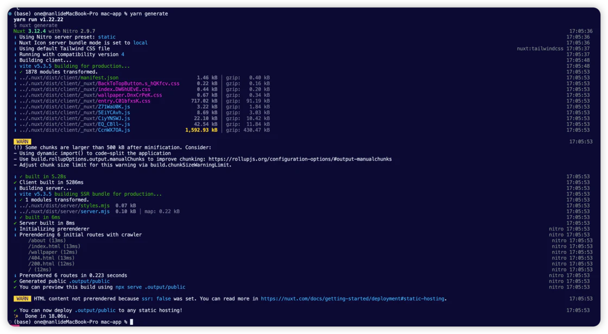

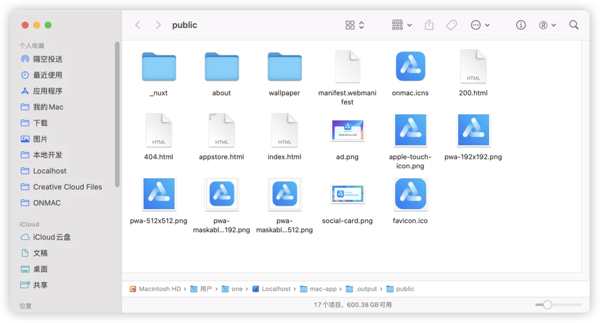

## **总结**

创建一个优雅的 Mac 软件资源下载站，像 OnMac AppStore 这样的项目，虽然听起来复杂，但通过合理使用现代前端技术栈与工具，我们可以在相对较短的时间内完成。整个过程中，我们从技术栈的选择到项目的具体实现，无论是 UI 组件的使用，数据的获取与缓存，还是 SEO 配置，都有一些思路与技巧可循。

这些技术和工具，包括但不限于 Vue3、TypeScript、Nuxt3、ArcoDesign、Vika 维格云、TailwindCSS 等，不但可以大幅度提升开发效率，还能确保项目的可维护性与扩展性。通过合理的模块化设计，复用现有的 UI 组件与模板，可以避免重复造轮子，提高开发效率。

希望这篇文章能为你提供一些参考和启发，如果你也有类似的想法，不妨大胆尝试，动手实现自己的创意。不试试怎么知道行不行，按着想法去做，说不定你会创造出一个令人惊艳的产品！

> **祝你开发愉快，期待看到你的作品上线！**

PS：由于这个小项目目前还在更新迭代中，暂时不打算开源，如果你有更好的意见或建议，欢迎一起沟通交流！

---


[**OnMac AppStore - 最新 Mac 软件，精彩尽在咫尺**](https://onmac.app/)
