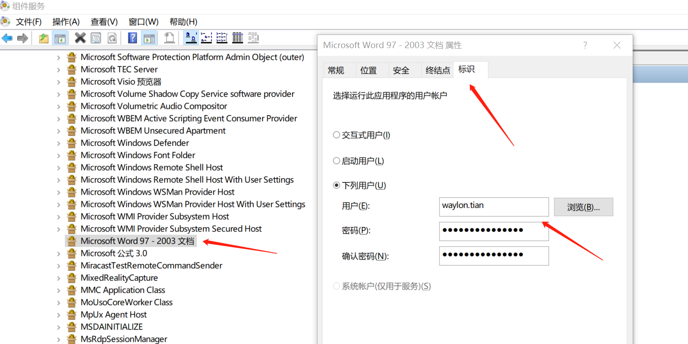
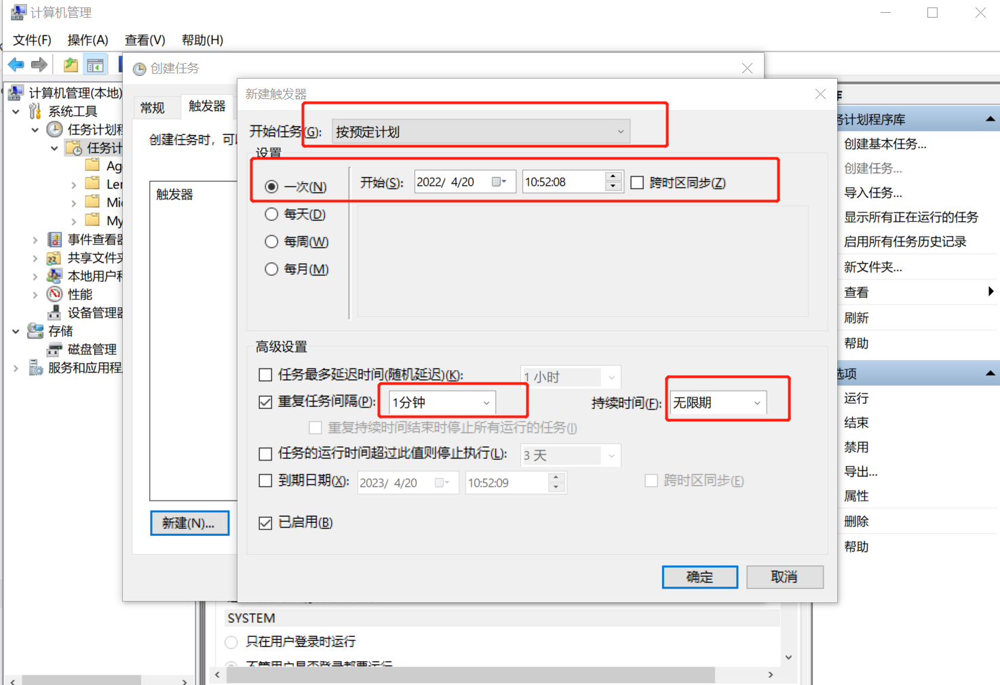
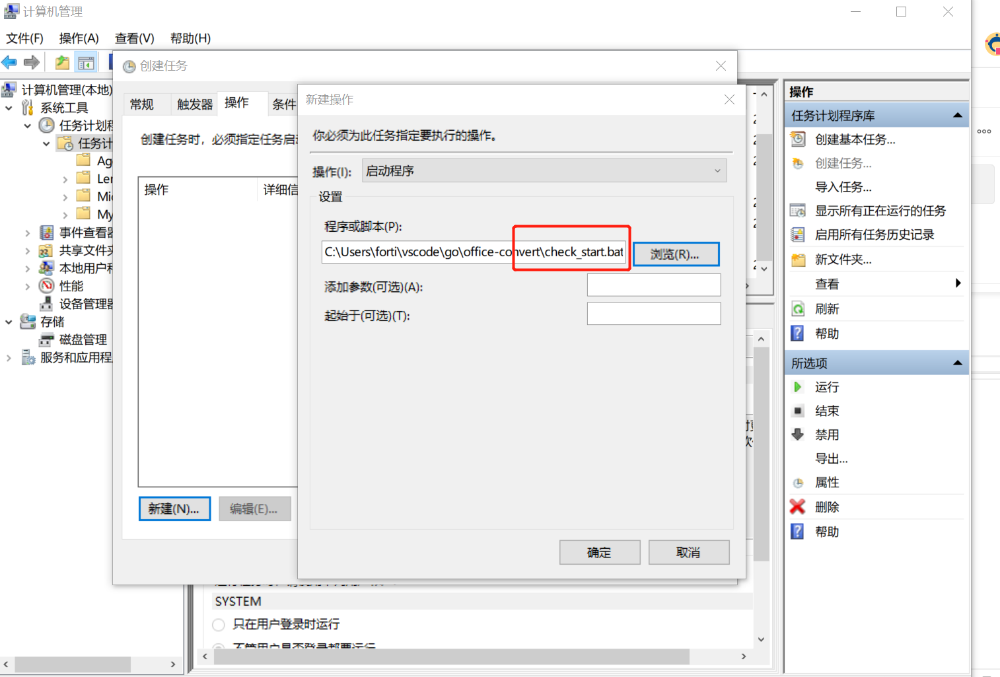
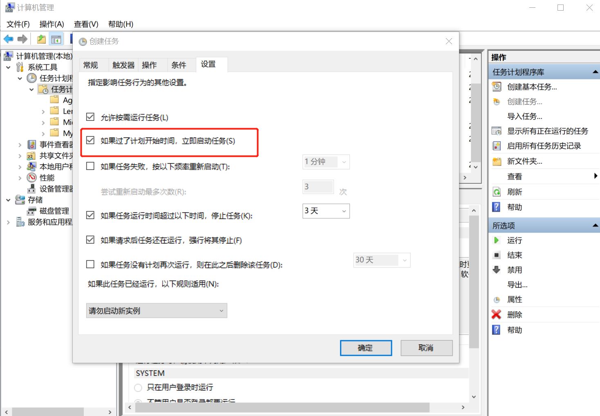

<font size=4 face='楷体'>

## Convert Office to PDF with Golang

### 原生 Windows Office Word

#### 需求

公司客户有需求，需要转换 doc 文件为 pdf 文件，并且保持格式完全不变。

工程师用各种 Java 类库，无论是 doc4j、POI 还是 Aspose.Doc、Libreoffice 组件还是各种线上 API 服务，转换结果都不甚满意。

#### 调研

其实，最符合客户需求的莫过于原生 Windows Office Word 的导出功能了。

需要能够操作 Windows 的 Office Word 程序，那么需要能够直接访问其系统组件，需要类似 COM/OLE 系统库，说干就干。

- 运维做弄了一个配置比较低的 EC2 机器，windows10 系统。
- 我这边找了一些库, python 的 comtypes.client,但是有点问题，单跑没问题，做成服务，在 web 线程中做这个事情，就有问题，具体找了下，应该还是线程问题，想了想，不做了（因为本身就不想用 python 写，😃 )
- 赶紧找了下 golang 中对应的 OLE 库，找到了一个，看了下文档，直接写了出来。

#### 实现

话不多说，直接上核心代码看看：

下面是基础的解析过程,其实就是模拟以下四个步骤：

- 打开 Office 对应的程序(Word/Excel/PPT)
- 导出为 PDF 文件
- 关闭文件
- 退出 Office 程序

#### 基础逻辑

```go
package office

import (
	ole "github.com/go-ole/go-ole"
	"github.com/go-ole/go-ole/oleutil"
	log "github.com/sirupsen/logrus"
)

/// 更多内容请参考官方COM文档 https://docs.microsoft.com/zh-cn/office/vba/api/word.application
type Operation struct {
	OpType    string
	Arguments []interface{}
}

/// 部分应用不允许隐藏 ，比如ppt，所以Visible需要设定下
type ConvertHandler struct {
	FileInPath      string
	FileOutPath     string
	ApplicationName string
	WorkspaceName   string
	Visible         bool
	DisplayAlerts   int
	OpenFileOp      Operation
	ExportOp        Operation
	CloseOp         Operation
	QuitOp          Operation
}

type DomConvertObject struct {
	Application *ole.IDispatch
	Workspace   *ole.IDispatch
	SingleFile  *ole.IDispatch
}

func (handler ConvertHandler) Convert() {
	ole.CoInitialize(0)
	defer ole.CoUninitialize()

	log.Println("handle open start")
	dom := handler.Open()
	log.Println("handle open end")
	log.Println("handler in file path is " + handler.FileInPath)
	log.Println("handler out file path is " + handler.FileOutPath)

	defer dom.Application.Release()
	defer dom.Workspace.Release()
	defer dom.SingleFile.Release()

	handler.Export(dom)
	log.Println("handle export end")

	handler.Close(dom)
	log.Println("handle close end")

	handler.Quit(dom)
	log.Println("handle quit end")

}
func (handler ConvertHandler) Open() DomConvertObject {
	var dom DomConvertObject
	unknown, err := oleutil.CreateObject(handler.ApplicationName)
	if err != nil {
		panic(err)
	}
	dom.Application = unknown.MustQueryInterface(ole.IID_IDispatch)

	oleutil.MustPutProperty(dom.Application, "Visible", handler.Visible)
	oleutil.MustPutProperty(dom.Application, "DisplayAlerts", handler.DisplayAlerts)

	dom.Workspace = oleutil.MustGetProperty(dom.Application, handler.WorkspaceName).ToIDispatch()

	dom.SingleFile = oleutil.MustCallMethod(dom.Workspace, handler.OpenFileOp.OpType, handler.OpenFileOp.Arguments...).ToIDispatch()
	return dom
}

func (handler ConvertHandler) Export(dom DomConvertObject) {
	oleutil.MustCallMethod(dom.SingleFile, handler.ExportOp.OpType, handler.ExportOp.Arguments...)

}

func (handler ConvertHandler) Close(dom DomConvertObject) {
	if handler.ApplicationName == "PowerPoint.Application" {
		oleutil.MustCallMethod(dom.SingleFile, handler.CloseOp.OpType, handler.CloseOp.Arguments...)
	} else {
		oleutil.MustCallMethod(dom.Workspace, handler.CloseOp.OpType, handler.CloseOp.Arguments...)
	}
}

func (handler ConvertHandler) Quit(dom DomConvertObject) {
	oleutil.MustCallMethod(dom.Application, handler.QuitOp.OpType, handler.QuitOp.Arguments...)

```

#### 不同格式的适配

```go
package office

func ConvertDoc2Pdf(fileInputPath string, fileOutputPath string) {

	openArgs := []interface{}{fileInputPath}

	/// https://docs.microsoft.com/zh-cn/office/vba/api/word.document.exportasfixedformat
	exportArgs := []interface{}{fileOutputPath, 17}

	closeArgs := []interface{}{}

	quitArgs := []interface{}{}

	convertHandler := ConvertHandler{
		FileInPath:      fileInputPath,
		FileOutPath:     fileOutputPath,
		ApplicationName: "Word.Application",
		WorkspaceName:   "Documents",
		Visible:         false,
		DisplayAlerts:   0,
		OpenFileOp: Operation{
			OpType:    "Open",
			Arguments: openArgs,
		},
		ExportOp: Operation{
			OpType:    "ExportAsFixedFormat",
			Arguments: exportArgs,
		},
		CloseOp: Operation{

			OpType:    "Close",
			Arguments: closeArgs,
		},
		QuitOp: Operation{

			OpType:    "Quit",
			Arguments: quitArgs,
		},
	}
	convertHandler.Convert()
}
```

#### 提供 web service 接口

```go
package web

import (
	"encoding/json"
	"fmt"
	"io"
	"io/ioutil"
	"net/http"
	"net/url"
	"office-convert/office"
	"os"
	"path"
	"path/filepath"
	"runtime/debug"
	"strconv"

	log "github.com/sirupsen/logrus"
)

const PORT = 10000
const SAVED_DIR = "files"

type ConvertRequestInfo struct {
	FileInUrl  string `json:"file_in_url"`
	SourceType string `json:"source_type"`
	TargetType string `json:"target_type"`
}

func logStackTrace(err ...interface{}) {
	log.Println(err)
	stack := string(debug.Stack())
	log.Println(stack)
}

func convertHandler(w http.ResponseWriter, r *http.Request) {
	defer func() {
		if r := recover(); r != nil {
			w.WriteHeader(503)
			fmt.Fprintln(w, r)
			logStackTrace(r)
		}
	}()
	if r.Method != "POST" {
		w.WriteHeader(400)
		fmt.Fprintf(w, "Method not support")
		return
	}

	var convertRequestInfo ConvertRequestInfo
	reqBody, err := ioutil.ReadAll(r.Body)
	if err != nil {
		log.Println(err)
	}
	json.Unmarshal(reqBody, &convertRequestInfo)

	log.Println(convertRequestInfo)
	log.Println(convertRequestInfo.FileInUrl)

	downloadFile(convertRequestInfo.FileInUrl)

	fileOutAbsPath := getFileOutAbsPath(convertRequestInfo.FileInUrl, convertRequestInfo.TargetType)
	convert(convertRequestInfo)

	w.WriteHeader(http.StatusOK)
	w.Header().Set("Content-Type", "application/octet-stream")
	//文件过大的话考虑使用io.Copy进行流式拷贝
	outFileBytes, err := ioutil.ReadFile(fileOutAbsPath)
	if err != nil {
		panic(err)
	}
	w.Write(outFileBytes)

}

func convert(convertRequestInfo ConvertRequestInfo) {

	fileOutAbsPath := getFileOutAbsPath(convertRequestInfo.FileInUrl, convertRequestInfo.TargetType)
	switch convertRequestInfo.SourceType {
	case "doc", "docx":
		office.ConvertDoc2Pdf(getFileInAbsPath(convertRequestInfo.FileInUrl), fileOutAbsPath)
		break
	case "xls", "xlsx":
		office.ConvertXsl2Pdf(getFileInAbsPath(convertRequestInfo.FileInUrl), fileOutAbsPath)
		break
	case "ppt", "pptx":
		office.ConvertPPT2Pdf(getFileInAbsPath(convertRequestInfo.FileInUrl), fileOutAbsPath)
		break
	}
}

func getNameFromUrl(inputUrl string) string {
	u, err := url.Parse(inputUrl)
	if err != nil {
		panic(err)
	}
	return path.Base(u.Path)
}

func getCurrentWorkDirectory() string {
	cwd, err := os.Getwd()
	if err != nil {
		panic(err)
	}
	return cwd
}

func getFileInAbsPath(url string) string {
	fileName := getNameFromUrl(url)
	currentWorkDirectory := getCurrentWorkDirectory()
	absPath := filepath.Join(currentWorkDirectory, SAVED_DIR, fileName)
	return absPath
}

func getFileOutAbsPath(fileInUrl string, targetType string) string {
	return getFileInAbsPath(fileInUrl) + "." + targetType
}

func downloadFile(url string) {
	log.Println("Start download file url :", url)
	resp, err := http.Get(url)
	if err != nil {
		panic(err)
	}
	defer resp.Body.Close()

	fileInAbsPath := getFileInAbsPath(url)
	dir := filepath.Dir(fileInAbsPath)
	// log.Println("dir is " + dir)
	if _, err := os.Stat(dir); os.IsNotExist(err) {
		log.Println("dir is not exists")
		os.MkdirAll(dir, 0644)
	}
	out, err := os.Create(fileInAbsPath)
	log.Println("save file to " + fileInAbsPath)
	if err != nil {
		panic(err)
	}

	defer out.Close()

	_, err = io.Copy(out, resp.Body)
	if err != nil {
		panic(err)
	}

	log.Println("Download file end url :", url)
}

func StartServer() {

	log.Println("start service ...")
	http.HandleFunc("/convert", convertHandler)
	http.ListenAndServe("127.0.0.1:"+strconv.Itoa(PORT), nil)
}
```

#### 编译 （可跳过）

如果要编译源码，得到 exe 文件，可以执行命令`go build -ldflags "-H windowsgui"` 生成 `office-convert.exe`

#### 运行

##### 普通运行

- 双击执行 `office-convert.exe` 即可,但是如果程序报错，或者电脑异常关机，不会重启

#### 后台运行（定时任务启动，可以自动恢复）

- 复制文件

  将`prebuilt`下两个文件复制到 `C:\Users\Administrator\OfficeConvert\` 目录下

- 修改 COM 访问权限

  当我们以服务、定时任务启动程序的时候，会报错，提示空指针错误。
  原因就是微软`限制`了 COM 组件在`非UI Session`的情况下使用（防止恶意病毒之类），如果要允许，需要做如下处理：
  [参考这里](https://superuser.com/questions/579900/why-cant-excel-open-a-file-when-run-from-task-scheduler)

- Open Component Services (Start -> Run, type in dcomcnfg)
- Drill down to Component Services -> Computers -> My Computer and click on DCOM Config
- Right-click on Microsoft Excel Application and choose Properties
- In the Identity tab select This User and enter the ID and password of an interactive user account (domain or local) and click Ok

  

注意，上图是演示，账号密码填写该机器的`Administrator`账号密码

- 定时任务

  创建 windows 定时任务，每 1 分钟调用`check_start.bat`文件，该文件自动检查`office-convert.exe`是否运行，没有就启动。

  
  
  **注意： 上图只是演示，具体位置填写 `C:\Users\Administrator\OfficeConvert\check_start.bat`**

  

#### Web 部署/请求/响应

- 部署

  使用 nginx 作为反向代理，具体位置在 `C:\Users\Administrator\nginx-1.20.2\nginx-1.20.2`下，修改`conf/nginx.conf`文件，代理 127.0.0.1:10000 即可，
  有公网 IP(比如 xxx.com)的话，配置 DNS 解析`convert-tools.xxx.com`到此机器 ip。

  ```conf
  server {
          listen       80;
          server_name  convert-tools.xxx.com;

          #charset koi8-r;

          #access_log  logs/host.access.log  main;

          location / {
              root   html;
              index  index.html index.htm;
              proxy_pass http://127.0.0.1:10000;
          }
          # ...其他设置
  }
  ```

- 请求

  已部署到 Windows 机器，访问 URL:
  http://127.0.0.1:10000 (如果上面配置了域名，则访问 http://convert-tools.xxx.com/convert)

  请求相关

  Method : POST

  Content-Type: application/json

  Body:

  ```json
  {
    "file_in_url": "https://your_docx_file_url",
    "source_type": "docx",
    "target_type": "pdf"
  }
  ```

  | 参数        | 是否必须 | 取值范围                            | 说明                           |
  | ----------- | -------- | ----------------------------------- | ------------------------------ |
  | file_in_url | 是       | 满足下面 source_type 的各类文档 url | 待转换的文档的网络连接         |
  | source_type | 是       | [doc,docx,xls,xlsx,ppt,pptx]        | 文档类型                       |
  | target_type | 是       | pdf                                 | 暂时只支持 PDF，后续会支持更多 |

- 响应

  根据 HTTP 状态码做判断

  200 : ok
  其他: 有错

  Body:
  转换的文件的二进制流

  如果 status_code 非 200，是对应的报错信息

### libreoffice

一个常见 word、excel 格式转换 pdf 的工具函数
使用的核心组件是 libreoffice

开发环境

- 系统：windows10
- 语言：Golang
- golang 版本：1.18

代码

```go
//
//  ConvertToPDF
//  @Description: 转换文件为pdf
//  @param filePath 需要转换的文件
//  @param outPath 转换后的PDF文件存放目录
//  @return string
//
func ConvertToPDF(filePath string, outPath string) bool {
    // 1、拼接执行转换的命令
    commandName := ""
    var params []string
    if runtime.GOOS == "windows" {
        commandName = "cmd"
        params = []string{"/c", "soffice", "--headless", "--invisible", "--convert-to", "pdf", filePath, "--outdir", outPath}
    } else if runtime.GOOS == "linux" {
        commandName = "libreoffice"
        params = []string{"--invisible", "--headless", "--convert-to", "pdf", filePath, "--outdir", outPath}
    }
    // 开始执行转换
    if _, ok := interactiveToexec(commandName, params); ok {
        return true
    } else {
        return false
    }
}

func PathExists(path string) (bool, error) {
    _, err := os.Stat(path)
    if err == nil {
        return true, nil
    }
    if os.IsNotExist(err) {
        return false, nil
    }
    return false, err
}

//
//  interactiveToexec
//  @Description: 执行指定命令
//  @param commandName 命令名称
//  @param params 命令参数
//  @return string 执行结果返回信息
//  @return bool 是否执行成功
//
func interactiveToexec(commandName string, params []string) (string, bool) {
    cmd := exec.Command(commandName, params...)
    buf, err := cmd.Output()
    w := bytes.NewBuffer(nil)
    cmd.Stderr = w
    if err != nil {
        log.Println("Error: <", err, "> when exec command read out buffer")
        return "", false
    } else {
        return string(buf), true
    }
}
```

### Reference

[用 golang 写一个 word/excel/ppt 转 pdf 的工具](http://fandou.wang/archives/yong-golang-xie-yi-ge-wordexcelppt-zhuan-pdf-de-gong-ju)
[office-convert](https://github.com/fortianwei/office-convert)
[一个常见 word、excel 转换 pdf 的工具函数](https://developer.aliyun.com/article/1080464)

**2023.01.18**
