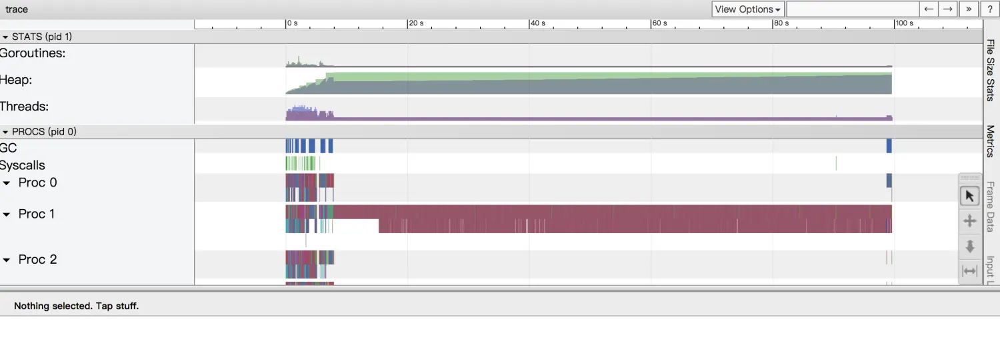
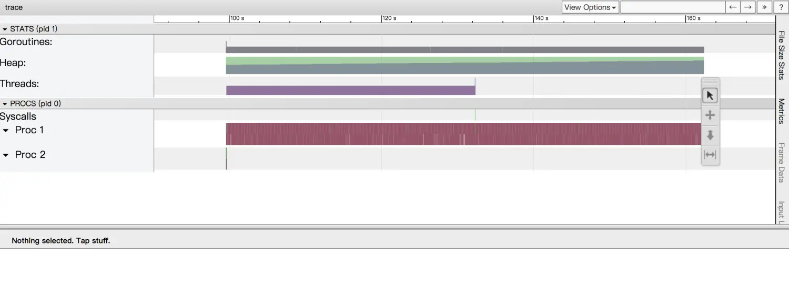
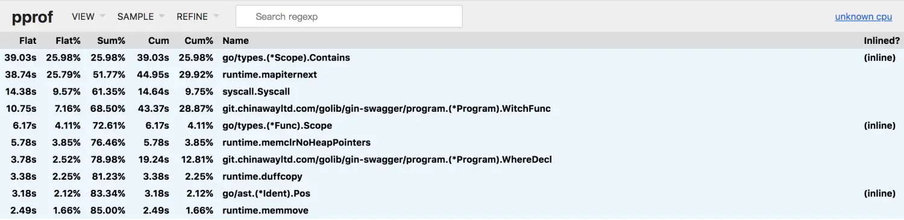
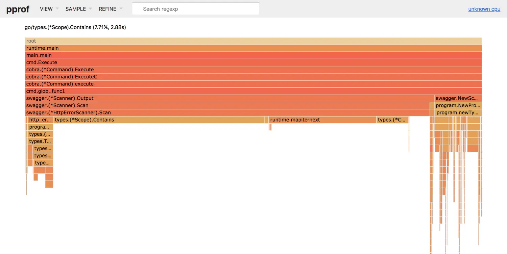

## golang 性能优化实战

### 调优基本思路

1.  对外接口协议不能改变
2.  了解需求和代码演进过程
3.  确定资源消耗类型
4.  控制运算数据输入量
5.  提高 CPU 利用率
6.  提高缓存命中率

### 项目概况

1.  gin-swagger 解析使用 [gin](https://github.com/gin-gonic/gin) 的代码，生成 swagger2.0 的文档，以保证文档和代码的一致性。
2.  使用 [loader](http://golang.org/x/tools/go/loader) 将源码解析成 `go/types` `go/ast` 相关结构化数据。
3.  通过遍历 package 找到目标代码块及其相关数据，构建 [go-openapi/spec](https://github.com/go-openapi/spec)，序列化成 JSON 格式，完成所有操作。

### 性能现状

以 **service-card** 项目为例：

```ruby
$ system_profiler SPHardwareDataType
Hardware:

    Hardware Overview:

      Model Name: MacBook Pro
      Model Identifier: MacBookPro12,1
      Processor Name: Intel Core i5
      Processor Speed: 2.7 GHz
      Number of Processors: 1
      Total Number of Cores: 2
      L2 Cache (per Core): 256 KB
      L3 Cache: 3 MB
      Memory: 8 GB
      Boot ROM Version: MBP121.0167.B17
      SMC Version (system): 2.28f7
      Serial Number (system): C02Q560DFVH5
      Hardware UUID: 9BAB7C1A-0C07-5567-808A-0694D7C2C1B6

$ cd $GOPATH/src/demo/service-card
$ time gin-swagger

gin-swagger-old -t  158.54s user 7.45s system 101% cpu 2:42.85 total
```

### 1\. debugger 工具分步调试，梳理业务流程

1.  IDE 如 Golang/VSCode 都有相关工具或插件
2.  命令行工具如 [delve](https://github.com/go-delve/delve)
3.  梳理出程序运行的主要步骤：
    1.  `loader.Load()`: 扫描 service-card 代码包括所有依赖
    2.  `HttpErrorScanner.Scan()`: 遍历所有 package 找到代码里定义的 HTTP 错误类型及其相关信息
    3.  `RoutesScanner.Scan()`: 遍历所有 package 找到用 gin 定义的 HTTP 路由及其相关信息
    4.  循环调用 `collectOperation()`: 找到请求和响应类型，构建 spec.Sawgger 的 Operation
    5.  将 spec.Swagger 序列化成 JSON 格式写入文件

### 使用 trace 梳理资源消耗概况

1.  标准库中的 `runtime/trace` 包，用于追踪程序运行各个阶段的指标，[官方使用范例](https://golang.google.cn/pkg/runtime/trace/#example_)
2.  查看结果：`$ go tool trace service-card.trace`





3.  初步分析：

    1.  大部分运行过程只使用了一个线程
    2.  内存开始阶段陡增，中后期增速较小
    3.  没有网络请求
    4.  同步等待、系统调用、runtime 调度的耗时操作都是 loader 库相关
    5.  资源消耗特点： CPU 密集、内存容量需求稳定。

4.  各主要步骤耗时情况：

    1.  `loader.Load()`: 7.8s
    2.  **`HttpErrorScanner.Scan()`: 7s**
    3.  `RoutesScanner.Scan()`: 0.5s
    4.  **`122 * collectOperation()`: 146.6s**
    5.  `json.Marshal()`: 0.1s

### pprof 查看各方法耗时

1.  标准库中的 `runtime/pprof` 包，用于整体统计运行过程，各个方法的总的资源消耗情况，[官方使用范例](https://golang.google.cn/pkg/runtime/pprof/#hdr-Profiling_a_Go_program)
2.  手动安装最新版本 pprof 工具：`$ go get -u github.com/google/pprof`
3.  用 web 方式查看 pprof CPU 分析结果：`$ pprof -http=":8091" ./cpu.prof`
4.  先看 Top

    

    1.  排名第一的 `go/types.(*Scope).Contains` 这个方法耗时占比近 25.98%，代码来自 go1.10.8 标准库 `go/types/scope.go:121`

    ```go
    // Contains returns true if pos is within the scope's extent.
    // The result is guaranteed to be valid only if the type-checked
    // AST has complete position information.
    func (s *Scope) Contains(pos token.Pos) bool {
      return s.pos <= pos && pos < s.end
    }
    ```

    就是简单的 int 比较，所以不是方法耗时多，而是调用次数多。

    2.  排名第二的 `runtime.mapiternext` 也是标准库遍历 map 的方法，耗时多的原因也是调用次数多
    3.  依次看下来，没有明显的耗时过高的业务方法

5.  初步判断：业务方法没有明显缺陷，业务层面需要调用的次数过多导致整体耗时高

### 优化第零步：持续 Diff

首先使用原始版本 gin-swagger 生成 swagger 文档，在优化的过程中每一次修改都要确保结果和原始版本一致。

### 优化第一步：提高 CPU 利用率

1.  从 trace 结果发现，122 次调用 `collectOperation()`，耗时占比 90%，却是单核执行，如果能利用多核，将有相当可观的性能提升。
2.  利用多核需要确保并发安全和兼容乱序，通过调试 collectOperation() 发现：
    1.  被竞争的资源是 `Swagger.Paths.Paths`和 `Swagger.Definitions`，都是插入操作
    2.  由于 `Swagger.Paths.Paths`和 `Swagger.Definitions`是 map 类型，所以没有乱序的问题
3.  给竞争资源上锁 sync.RWMutex，保证并发安全
4.  启多个 goroutine 执行 `collectOperation()`
5.  重新编译执行，文档结果没有 diff，耗时： **162.85s => 76s**
6.  trace 显示 collectOperation 阶段确实是启动了多个 Processor
7.  top 发生了变化，`program.Program.WithFunc`和 `program.Program.WhereDecl`两个方法耗达到 8.5%


### 优化第二步：提供缓存命中率

**分析 `WitchFunc`**

```go
func (program *Program) WitchFunc(pos token.Pos) *types.Func {
  for _, pkgInfo := range program.AllPackages {
    for _, obj := range pkgInfo.Defs {
      if tpeFunc, ok := obj.(*types.Func); ok {
        scope := tpeFunc.Scope()
        if scope != nil && scope.Contains(pos) {
          return tpeFunc
        }
      }
    }
  }
  return nil
}
```

1.  业务逻辑：遍历所有的 package，找到 pos 所在的 `*types.Func`
2.  看到熟悉身影：`scope.Contains(pos)`，确定是上文出现的 `go/types.(*Scope).Contains`
3.  结论：大量 WitchFunc 调用，导致过多 go/types.(\*Scope).Contains 调用，拖慢了执行速度
4.  分析业务逻辑，做缓存映射 pos => go/types.Func，即做一个 `go/types.Func` 数组，按照 pos 排序，`withFunc(pos token.Pos)` 逻辑转化为：二分搜索 pos，进而确定是哪个 `tyeps.Func`，时间复杂度：O(log2n)

    ```go
    type fn struct {
      pkg     *types.Package
      pkgInfo *loader.PackageInfo
      tfn     *types.Func
      pos     token.Pos
    }

    type fns []*fn

    func (f fns) Len() int           { return len(f) }
    func (f fns) Less(i, j int) bool { return f[i].pos < f[j].pos }
    func (f fns) Swap(i, j int)      { f[i], f[j] = f[j], f[i] }
    ```

5.  重新编译执行，文档结果没有 diff，耗时： **76s => 61s**
6.  使用相同的思路构建其他缓存 pos => ast.File, types.Func => ast.Expr
7.  重新编译执行，文档结果没有 diff，耗时缩短到 **61s => 20s**
8.  通过 trace 发现原来 `122 * collectOperation()` 步骤耗时已经缩短到 7.5s，但 `HttpErrorScanner.Scan()`步骤还是有 6.5s 的耗时，可见已有缓存对其影响不大

### 优化第三步：单步骤逻辑调优

针对 `HttpErrorScanner.Scan()` 我们来分析下其火焰图



可以看到耗时的大头依然是 `go/types.(*Scope).Contains` 和 `runtime.mapiternext`，看业务逻辑：

```go
 1  func (scanner *HttpErrorScanner) Scan(prog *program.Program) {
 2    // ... initialization
 3    for pkg, pkgInfo := range prog.AllPackages {
 4      for id, obj := range pkgInfo.Defs {
 5        // ... do something
 6          for pkgDefHttpError, httpErrorMap := range scanner.HttpErrors {
 7            if pkg == pkgDefHttpError || program.PkgContains(pkg.Imports(), pkgDefHttpError) {
 8              for id, obj := range pkgInfo.Uses {
 9                if tpeFunc.Scope() != nil && tpeFunc.Scope().Contains(id.Pos()) {
10                  if constObj, ok := obj.(*types.Const); ok {
11                    if http_error_code.IsHttpCode(obj.Type()) {
12                      code := constObj.Val().String()
13                      if httpErrorValue, ok := httpErrorMap[code]; ok {
14                        if scanner.ErrorType == nil {
15                          // ... do something
16                        }
17                        // ... do something
```

1.  第 9 行 `tpeFunc.Scope().Contains(id.Pos())` 上有四层 for 循环，估计调用次数很多
2.  第 9、10、11 行连续 3 个 if 判断，相互独立，显然可以调换顺序。
3.  Scan 方法为的是找到个别类型，且数量很少，推断第三个条件 `http_error_code.IsHttpCode(obj.Type())` 的范围最小，将第三个条件放到最前面，重新编译执行，**130s**，尴尬了，看来 `http_error_code.IsHttpCode(obj.Type())` 比 `tpeFunc.Scope().Contains(id.Pos())` 耗时要多得多。

**`http_error_code.IsHttpCode` 业务代码：**

```go
var HttpErrorVarName = "HttpErrorCode"
var StatusErrorVarName = "StatusErrorCode"

func IsHttpCode(tpe types.Type) bool {
  return program.IsTypeName(tpe, HttpErrorVarName) || program.IsTypeName(tpe, StatusErrorVarName)
}

// package program
func IsTypeName(tpe types.Type, typeName string) bool {
  pkgPaths := strings.Split(tpe.String(), ".")
  return pkgPaths[len(pkgPaths)-1] == typeName
}
```

1.  `IsTypeName` 的逻辑可以简化为

    ```go
    tpe.String() == typeName || strings.HasSuffix(tpe.String(), "."+typeName)
    ```

2.  `types.Type` 可以做缓存
3.  重新编译运行，27s，看来 `http_error_code.IsHttpCode(obj.Type())` 虽然过滤度高，但是消耗也大，看到三个 if 之一的第 10 行，只是一个类型判断，消耗不大，放在第一个试试。
4.  重新编译运行，**20s => 16s**

### 更多优化可能

1.  扫描中代码中，原则上讲，只需要参与 HTTP 接口定义的 package，目前的方案会对所有依赖库建缓存扫描。
