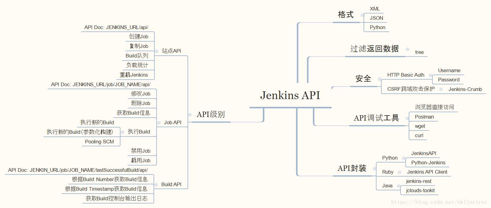
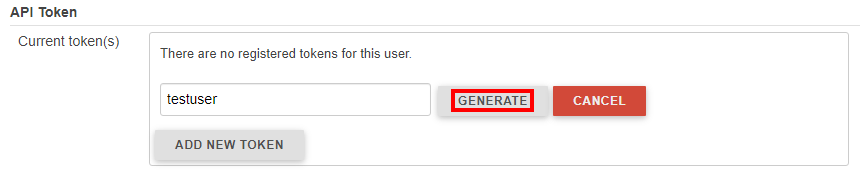
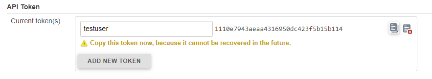
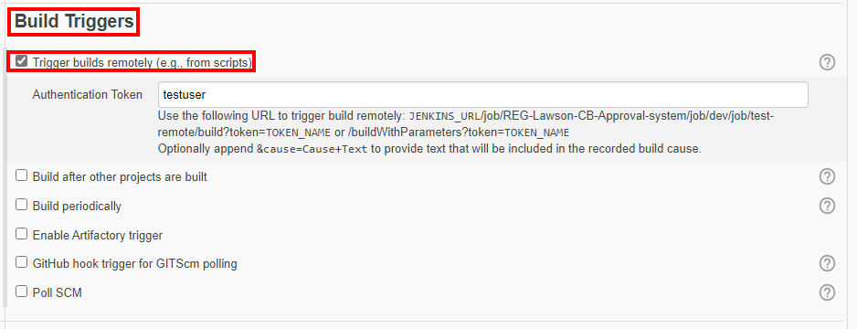
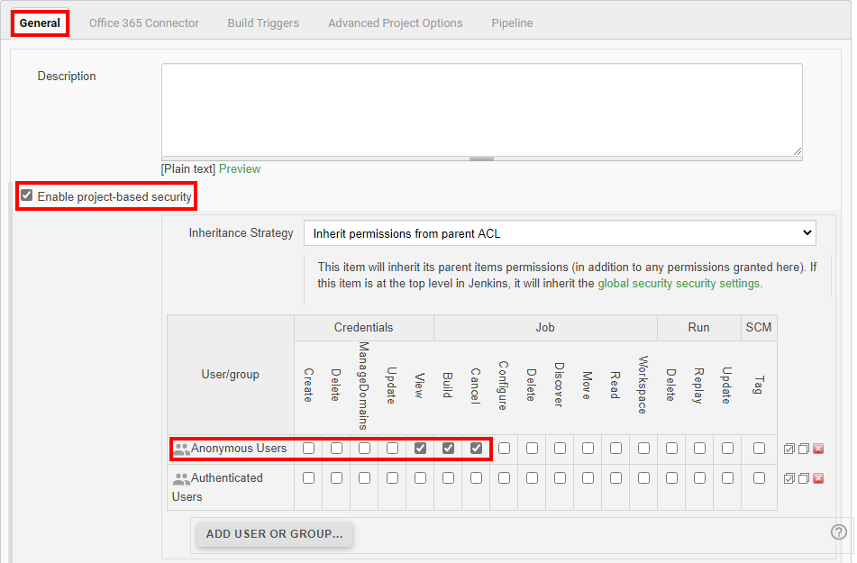
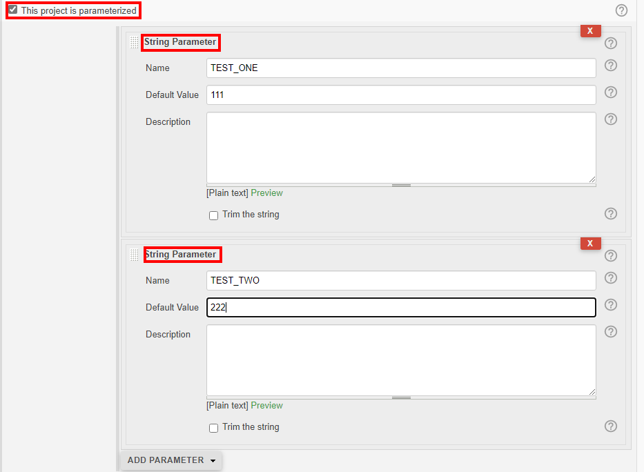
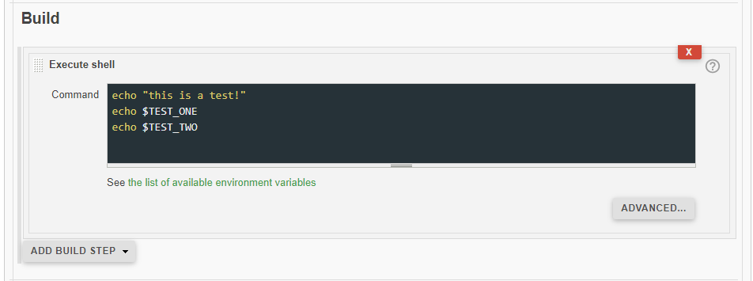
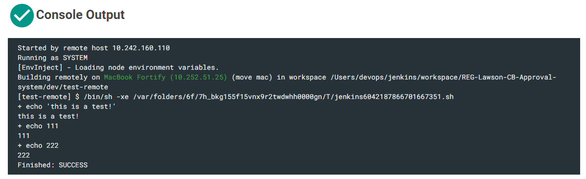
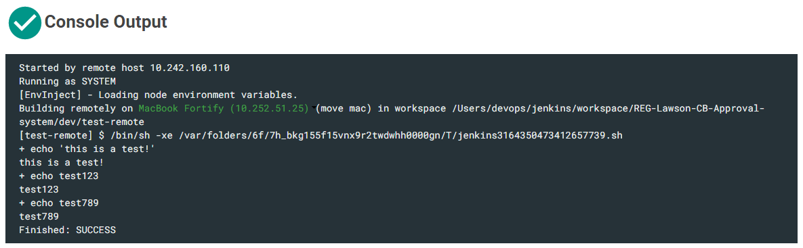

<font size=4 face='楷体'>

## Jenkins API

- [文档](https://www.jenkins.io/doc/book/using/remote-access-api/)
- [文档](https://wiki.jenkins.io/display/JENKINS/Remote+access+API)

Jenkins 本身支持丰富的 API 接口，通过调用接口，基本可以实现所有需要的功能，包括获取、触发、删除 Job 等。  
Jenkins 的 Remote API 以 REST-like 的形式进行提供，通过对特定的 API 执行相关请求即可。  
可以通过 curl、wget 和 postman 等工具模拟请求和调试。



### 查看 API 文档

Jenkins API 没有统一的入口，而是采用`…/api/`的 REST API 样式，其中”…” 表示 Jenkins 资源的 URL。  
常见的 Jenkins 资源包括：站点（实例）、Job 和 Build。  
也就是说，可以通过不同级别的 URL 地址查看到当前的 API 信息，例如`http://<IP:Port or URL>/api`查看当前站点所有相关的 API 说明。  
例如：

- 插件管理: `http://<Jenkins-Server-Address>/pluginManager/api/`
- 节点管理: `http://<Jenkins-Server-Address>/computer/api/`
- 认证管理: `http://<Jenkins-Server-Address>/credentials/api/`

一般情况下,都会支持如下三种访问 Jenkins API 的方式

- JSON API
- XML API
- Python API

```javascript
Many objects of Jenkins provide the remote access API. They are available at /blueocean/.../api/ where "..." portion is the object for which you'd like to access.

XML API
Access data exposed in HTML as XML for machine consumption. Schema is also available.
You can also specify optional XPath to control the fragment you'd like to obtain (but see below). For example, ../api/xml?xpath=/*/*[0].

For XPath that matches multiple nodes, you need to also specify the "wrapper" query parameter to specify the name of the root XML element to be create so that the resulting XML becomes well-formed.

Similarly exclude query parameter can be used to exclude nodes that match the given XPath from the result. This is useful for trimming down the amount of data you fetch (but again see below). This query parameter can be specified multiple times.

XPath filtering is powerful, and you can have it only return a very small data, but note that the server still has to build a full DOM of the raw data, which could cause a large memory spike. To avoid overloading the server, consider using the tree parameter, or use the xpath parameter in conjunction with the tree parameter. When used together, the result of the tree parameter filtering is built into DOM, then the XPath is applied to compute the final return value. In this way, you can often substantially reduce the size of DOM built in memory.

JSON API
Access the same data as JSON for JavaScript-based access. tree may be used.
Python API
Access the same data as Python for Python clients. This can be parsed into Python object as eval(urllib.urlopen("...").read()) and the resulting object tree is identical to that of JSON. However, when you do this, beware of the security implication. If you are connecting to a non-trusted Jenkins, the server can send you malicious Python programs.

In Python 2.6 or later you can safely parse this output using ast.literal_eval(urllib.urlopen("...").read())

For more information about remote API in Jenkins, see the documentation.
```

### 一些使用方法

- 站点 API

  ```
  - 站点支持的API： http://<Jenkins-Server-Address>/api
  - 查询到站点中所有的job信息（JSON格式）： http://<Jenkins-Server-Address>/api/json?pretty=true
  - 查询到站点中所有的job信息（XML格式）： http://<Jenkins-Server-Address>/api/xml
  - 通过tree进行过滤： http://<Jenkins-Server-Address>/api/json?pretty=true&tree=jobs[name[*]]
  - 重启站点： http://<Jenkins-Server-Address>/restart
  - 安全重启站点： http://<Jenkins-Server-Address>/safeRestart
  ```

- 获取 Job 相关信息

  ```
  - 当前的api说明： http://<Jenkins-Server-Address>/job/<Job-Name>/api/
  - JSON格式： http://<Jenkins-Server-Address>/job/<Job-Name>/api/json?pretty=true
  - XML格式： http://<Jenkins-Server-Address>/job/<Job-Name>/api/xml
  ```

- 获取 Job 的指定信息（JSON 格式）

  ```javascript
  - 获取Job的builds节点信息： http://<Jenkins-Server-Address>/job/<Job-Name>/api/json?pretty=true&tree=builds[*]
  - 获取Job的builds节点下displayName节点信息： http://<Jenkins-Server-Address>/job/<Job-Name>/api/json?pretty=true&tree=builds[displayName]
  - 获取Job的builds节点下指定displayName节点信息： http://<Jenkins-Server-Address>/job/<Job-Name>/api/json?pretty=true&tree=builds[displayName]{x,y}
  - 获取两个相关的节点信息，例如： http://<Jenkins-Server-Address>/job/<Job-Name>/api/json?pretty=true&tree=builds[displayName]{3,5},url[*]
  ```

- 获取指定 Build 相关信息

  ```javascript
  - JSON格式： http://<Jenkins-Server-Address>/job/<Job-Name>/<Build-Number>/api/json?pretty=true
  - XML格式： http://<Jenkins-Server-Address>/job/<Job-Name>/<Build-Number>/api/xml
  - 获取指定信息： http://<Jenkins-Server-Address>/job/<Job-Name>/<Build-Number>/api/json?pretty=true&&tree=<filter>
  ```

- 3.5 通过 curl 工具

  ```
  - 获取最近的buildNumber： `curl --silent http://<Jenkins-Server-Address>/job/<Job-Name>/lastBuild/buildNumber`
  - 获取最近稳定的buildNumber：`curl --silent http://<Jenkins-Server-Address>/job/<Job-Name>/lastStableBuild/buildNumber`
  - 获取最近成功的buildNumber：`curl --silent http://<Jenkins-Server-Address>/job/<Job-Name>/lastSuccessfulBuild/buildNumber`
  - 获取最近失败的buildNumber：`curl --silent http://<Jenkins-Server-Address>/job/<Job-Name>/lastFailedBuild/buildNumber`
  ```

- 对 Job 的一些操作

  ```javascript
  - 获取（get方法）和更新（post方法）Job的description信息： http://<Jenkins-Server-Address>/job/<Job-Name>/description
  - 获取（get方法）和更新（post方法）Job的详细配置信息： http://<Jenkins-Server-Address>/job/<Job-Name>/config.xml
  - 不带参数直接执行（post方法）： http://<Jenkins-Server-Address>/job/<Job-Name>/build
  - 带参数执行（post方法），例如： http://<Jenkins-Server-Address>/job/<Job-Name>/buildWithParameters?token=testuser\&AAA='test123'\&BBB='test789'
  - 禁用（post方法）指定的job： http://<Jenkins-Server-Address>/job/<Job-Name>/disable
  - 启用（post方法）指定的job： http://<Jenkins-Server-Address>/job/<Job-Name>/enable
  - 删除（post方法）指定的job： http://<Jenkins-Server-Address>/job/<Job-Name>/doDelete
  ```

### Python API wrappers

- jenkinsapi

  - [Pypi](https://pypi.org/project/jenkinsapi/)
  - [Github](https://github.com/salimfadhley/jenkinsapi)
  - [Docs](https://jenkinsapi.readthedocs.io/en/latest/)

- python-jenkins

  - [Pypi](https://pypi.org/project/python-jenkins/)
  - [HomePage](https://opendev.org/jjb/python-jenkins)
  - [Docs](https://python-jenkins.readthedocs.io/en/latest/)

### Sample

通过 API 远程触发 job

- 创建 API token

  在 user 的 configure 页面，创建 API token，然后记录下 token name 对应的密文，保存设置并退出。  
    
  

- 配置 job 的触发条件

  

- 配置权限

  Job 和所在 project 对匿名用户开放 build 权限  
  

- 配置测试参数

    
  

- 远程触发 job

  这里是通过 curl 命令

  ```javascript
  # 方式-1：cookie
  crumb=$(curl -c cookies.txt -s 'https://<JENKINS_USER_ID>:1110e7943aeaa4316950dc423f5b15b114@<JENKINS_SERVER_URL>/crumbIssuer/api/xml?xpath=concat(//crumbRequestField,":",//crumb)')
  curl --cookie cookies.txt --user "<JENKINS_USER_ID>:1110e7943aeaa4316950dc423f5b15b114" -H $crumb -X POST -s https://<JENKINS_JOB_URL>/buildWithParameters?token=testuser

  # 方式-2：https dns
  crumb=$(curl -k -u "<JENKINS_USER_ID>:1110e7943aeaa4316950dc423f5b15b114" 'https://<JENKINS_SERVER_URL>/crumbIssuer/api/xml?xpath=concat(//crumbRequestField,":",//crumb)')
  curl  -u "<JENKINS_USER_ID>:1110e7943aeaa4316950dc423f5b15b114" -H $crumb -X POST -s https://<JENKINS_JOB_URL>/buildWithParameters?token=testuser

  # 方式-3：https dns Parameters
  crumb=$(curl -k -u "<JENKINS_USER_ID>:1110e7943aeaa4316950dc423f5b15b114" 'https://<JENKINS_SERVER_URL>/crumbIssuer/api/xml?xpath=concat(//crumbRequestField,":",//crumb)')
  curl  -u "<JENKINS_USER_ID>:1110e7943aeaa4316950dc423f5b15b114" -H $crumb -X POST -s https://<JENKINS_JOB_URL>/buildWithParameters?token=testuser\&TEST_ONE='test123'\&TEST_TWO='test789'

  # 方式-4：http ip:port
  crumb=$(curl -k -u "<JENKINS_USER_ID>:1110e7943aeaa4316950dc423f5b15b114" 'http://<IP:PORT>/crumbIssuer/api/xml?xpath=concat(//crumbRequestField,":",//crumb)')
  curl  -u "<JENKINS_USER_ID>:1110e7943aeaa4316950dc423f5b15b114" -H $crumb -X POST -s http://<IP:PORT>/<JOB_PATH>/buildWithParameters?token=testuser
  ```

- 查看结果

  直接触发  
    
  带参数触发  
  

### 项目参考
- [felix](https://github.com/germaniumhq/felix)
  A build monitor for Jenkins.

## References

- [Jenkins - API 详解](https://www.cnblogs.com/anliven/p/13642675.html)
- [https://blog.csdn.net/nklinsirui/article/details/80832005](https://blog.csdn.net/nklinsirui/article/details/80832005)
- [https://segmentfault.com/a/1190000018939447](https://segmentfault.com/a/1190000018939447)
- [https://blog.csdn.net/liumiaocn/category_8598907.html](https://blog.csdn.net/liumiaocn/category_8598907.html)

**2022.07.07**
