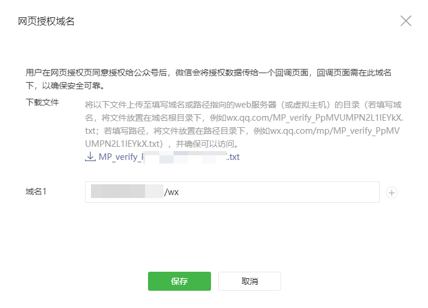

<font size=4 face='楷体'>

## Django 根目录中添加直接访问的文件

前阵子做对微信公众号对接微信支付服务，需要在服务器根目录放一个 txt 文件做验证。与放 robot 文件时一个道理，这里以 robot 为例



- 修改 urls, 将 robots.txt 放到 templates 目录

  ```python
  # urls.py
  from django.urls import path
  from django.views.generic import TemplateView

  urlpatterns = [
      path(
          'robot.txt',
          TemplateView.as_view(
              template_name='robot.txt', content_type='text/plain')),
  ]
  ```

- 修改 urls, 不需添加 robots.txt 文件
  这种方法是直接返回文本内容

  ```python
  # urls.py
  from django.http import HttpResponse

  urlpatterns = [
      path(
          'robot.txt', lambda r: HttpResponse(
              'User-agent: *\nDisallow: /admin', content_type='text/plain')),
  ]
  ```

- 使用 nginx

  - 参考 Django 官网所放位置：[github > djangoproject.com](https://github.com/django/djangoproject.com/tree/master/djangoproject/static)
  - 修改 nginx 配置
    ```nginx
    location  /robots.txt {
    alias  /path/to/static/robots.txt;
    ```

- 最后也可以在 view 中进行操作后返回

  在 url 中匹配

  ```python
  # urls.py
  from django.urls import path

  urlpatterns = [
      path('robot.txt', views.judge),
  ]
  ```

  ```python
  # views.py
  from django.views.decorators.csrf import csrf_exempt
  from django.views.generic import TemplateView

  @csrf_exempt
  def judge(request):
      """
      do something
      """

      return TemplateView.as_view(
          template_name='robot.txt',
          content_type='text/plain')
  ]
  ```

## Reference

[django 如何添加 robots.txt 文件?](https://www.jianshu.com/p/3e50e7138823)
[django 根目录放 txt 文件 url 直接访问和 xml 文件](https://www.cnblogs.com/wuyongcong/articles/10122225.html)

**2019.9.3**
