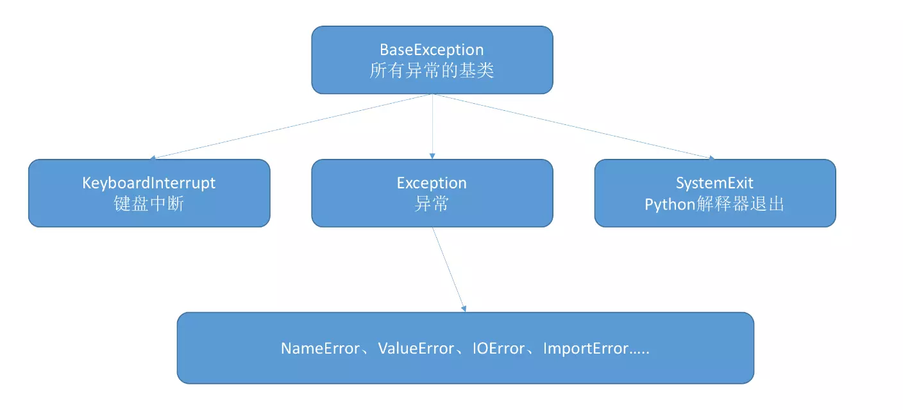

<font size=4 face='楷体'>

## Python 主动抛出异常和自定义异常

### 主动抛出异常

主动抛出异常终止程序
格式：

    raise 异常名称('异常描述')

```python
raise RuntimeError('testError')  # 主动抛出这个异常，并加以解释。
```

### 自定义异常

python 的异常分为两种。

- 内建异常，就是 python 自己定义的异常
- 不够用，用户自定义异常

首先看看 python 的异常继承树



我们可以看到 python 的异常有个大基类。然后继承的是 Exception。所以我们自定义类也必须继承 Exception  
在这里给一个简单的自定义异常类模版:

```python
class CustomError(Exception):
    def __init__(self, ErrorInfo):
        super().__init__(self)  #初始化父类
        self.errorinfo = ErrorInfo

    def __str__(self):
        return self.errorinfo
```

### Reference

[python 自定义异常和主动抛出异常（raise）](https://www.jianshu.com/p/24e6fb03d6d6)

**2019.12.19**
