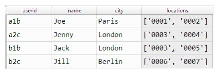
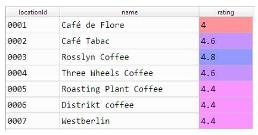
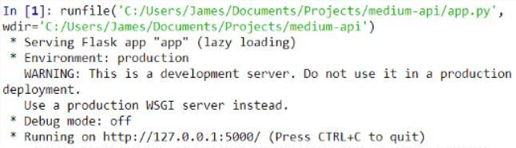
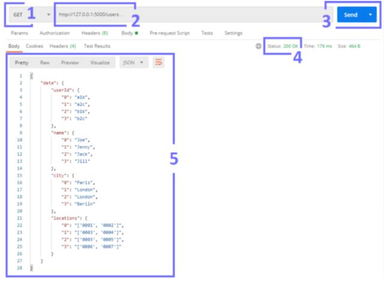
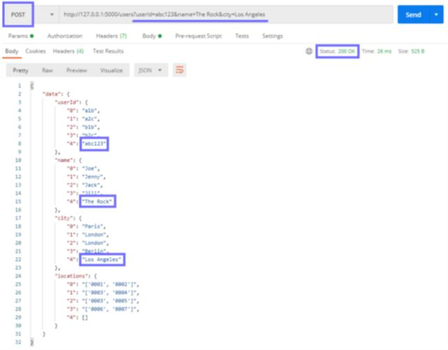
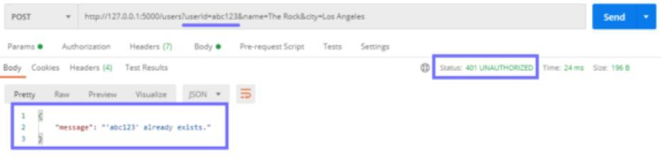
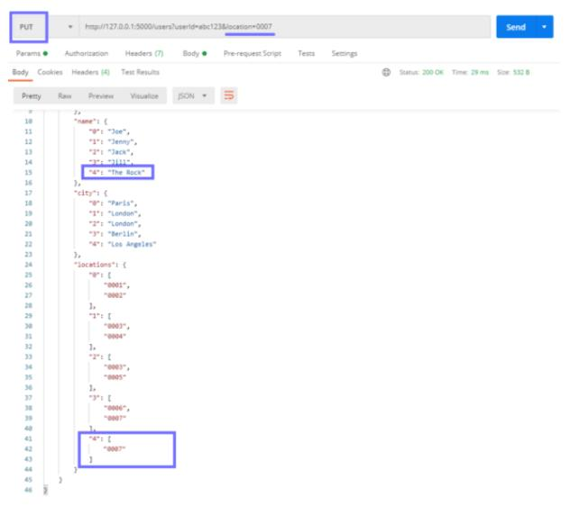
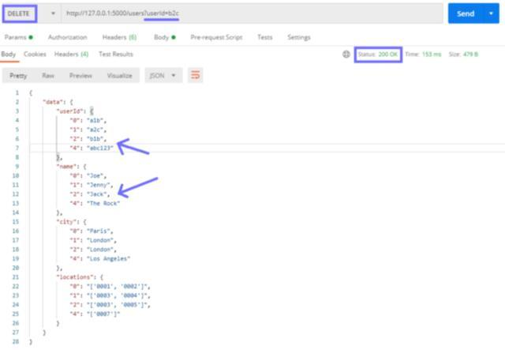

如何实现从一个软件与另一个软件的通信交互？就像我们的 APP，如何实现微信支付、苹果支付？

其实，我们只需要一个 API。

**API（应用程序编程接口）是一个简单的接口，它定义了可以发出的请求类型（需求/问题等）、请求的发出方式以及处理方式。**

在本文中，我们将构建一个 API，它允许我们向不同的端点发送一系列 GET/POST/PUT/PATCH/DELETE 等各种请求，并返回或修改与 API 连接的数据。

我们将使用 Flask 框架来创建我们的 API，并使用 Postman 来对其进行测试它。本文将涵盖以下内容：

**1.设置**

- 数据集
- 初始化 Flask API
- 端点
- 运行本地服务器
  **2.编写 API**

- GET
- POST
- 401 未经授权
- PUT
- DELETE
- 用户类（摘要）
  **3.总结**

---

## 设置

我们的 API 将包含两个端点：用户和位置。 前者将允许访问我们注册用户的详细信息，而后者将包括咖啡馆位置列表。

此处假设的用例是数百万个咖啡馆的书签应用程序，用户可以在其中打开该应用程序并为自己喜欢的咖啡馆添加书签，例如谷歌地图。

**1.数据集**

为了简单起见，我们将把这些数据存储在两个本地 CSV 文件中。

CSV 文件如下所示：



用户数据



位置数据

**users.csv：**[https://drive.google.com/file/d/12-nW-R6TEPbUzSVF8zsQtOm992TdZOqj/view?usp=sharing](https://link.zhihu.com/?target=https%3A//drive.google.com/file/d/12-nW-R6TEPbUzSVF8zsQtOm992TdZOqj/view%3Fusp%3Dsharing)

**locations.csv：**[https://drive.google.com/file/d/1ERGeiKZLNuD9K-MHd7a0Colqj_DqiMww/view?usp=sharing](https://link.zhihu.com/?target=https%3A//drive.google.com/file/d/1ERGeiKZLNuD9K-MHd7a0Colqj_DqiMww/view%3Fusp%3Dsharing)

**2.初始化 Flask API**

对于 Python 脚本，我们需要导入模块并初始化 API，如下所示：

```python
from flask import Flask
from flask_restful import Resource, Api, reqparse
import pandas as pd
import ast
app = Flask(__name__)
api = Api(app)
```

**3.端点**

正如上文提到的，我们的 API 有两个端点：**用户和位置。**

假设我们的 API 的结果位于[http://www.api.com](https://link.zhihu.com/?target=http%3A//www.api.com)网站，则将在[http://www.api.com/users](https://link.zhihu.com/?target=http%3A//www.api.com/users)提供与 Users 类的通信，并在[http://www.api.com/locations](https://link.zhihu.com/?target=http%3A//www.api.com/locations)提供 Locations。

为了创建端点，我们需要定义一个 Python 类，然后使用 api.add_resource 将其连接到所需的端点，如下所示：

```python
class Users(Resource):
    # 方法在这里
    pass

api.add_resource(Users, '/users')  # /users'是我们的切入点
```

- Flask 需要知道类是我们 API 的端点，因此我们将 Resource 与类定义一起传入。
- 在类内部，包含了我们的 HTTP 方法（GET，POST，DELETE 等）。
- 最后，我们使用 api.add_resource 将 Users 类与/ users 端点链接。
  因为我们需要两个端点，所以我们复制了逻辑：

```python
class Users(Resource):
    #方法
    pass

class Locations(Resource):
    #方法
    pass

api.add_resource(Users, '/users')  # '/users' 是我们进入用户的切入点
api.add_resource(Locations, '/locations')  #  '/ locations'是我们的位置的切入点
```

**4.运行本地服务器**

最后，在我们写出 API 时，还要对其进行测试！

为此，我们需要托管我们的 API，我们可以在本地通过将 app.run 添加到脚本末尾来进行本地化，如下所示：

```python
if __name__ == '__main__':
    app.run()  #运行 Flask app
```

当我们运行脚本时，我们会看到如下所示：



初始化本地主机服务器

设置好服务器后，如果您在使用 Postman 构建 API 的实际标准之前还没有使用过它，就可以对其进行测试。

## 编写 API

在每个类中，我们保留 HTTP 方法 GET，POST 和 DELETE。

要创建 GET 方法，我们使用 def get（self）。POST 和 DELETE 遵循相同的模式。

**1.GET**

GET 方法是最简单的。我们返回存储在字典中的 **users.csv** 中存储的所有数据，如下所示：

```python
class Users(Resources):
    def get(self):
        data = pd.read_csv('users.csv')  # 读取 CSV
        data = data.to_dict()  # 将数据帧转换为字典
        return {'data': data}, 200  # 返回数据和200 OK代码
```

然后，我们可以运行脚本来初始化我们的 API，打开 Postman 并将 GET 请求发送到我们的本地主机地址（通常为[http://127.0.0.1:5000](https://link.zhihu.com/?target=http%3A//127.0.0.1%3A5000)），这是我们的 API 入口点。



如何将 GET 请求发送到我们的 API

要将 GET 请求发送到 Postman 中的 API，我们：

1. 从下拉列表中选择 GET；
2. 输入我们的 API 实例+ / users 的入口点（端点）；
3. 点击发送；
4. 检查我们的 API 返回的状态码（我们应该看到 200 OK）；
5. 查看我们的 API 响应，即 JSON（如字典）格式的 users.csv。
   **2.POST**

POST 方法允许我们将记录添加到数据中。在这种情况下，我们将使用 usedId，name 和 city 的参数。

这些参数作为 URL 参数传递到我们的 API 端点，如下所示：

```python
http://127.0.0.1:5000/users?userId=abc123&name=The Rock&city=Los Angeles
```

我们可以指定所需的参数，然后使用 reqparse 解析提供的值，如下所示：

```python
parser = reqparse.RequestParser()  # 初始化

parser.add_argument('userId', required=True)  # 添加参数
parser.add_argument('name', required=True)
parser.add_argument('city', required=True)

args = parser.parse_args()  # 将参数解析为字典
```

让我们分解一下解析器代码：

- 使用.RequestParser（）初始化解析器。
- 使用.add_argument（\[arg_name\]，required）添加参数。请注意，required = True 表示请求中的参数是必需的。另外，我们可以添加带有 required = False 的可选参数。
- 使用.parse_args（）将参数及其值解析为 Python 字典。
  然后，我们可以访问传递给每个参数的值，就像我们通常在字典中使用键值对一样。

将代码进行合并，为 CSV 添加值：

```python
class Users(Resource):
    def post(self):
        parser = reqparse.RequestParser()  #初始化

        parser.add_argument('userId', required=True)  # 添加参数
        parser.add_argument('name', required=True)
        parser.add_argument('city', required=True)

        args = parser.parse_args()  #将参数解析为字典

        # 创建包含新值的新数据帧
        new_data = pd.DataFrame({
            'userId': args['userId'],
            'name': args['name'],
            'city': args['city'],
            'locations': [[]]
        })
        # 读取CSV
        data = pd.read_csv('users.csv')
        # 添加新提供的值
        data = data.append(new_data, ignore_index=True)
        # 保存并返回CSV
        data.to_csv('users.csv', index=False)
        return {'data': data.to_dict()}, 200  # 返回200 OK数据
```

看起来有点混乱，简单点，我们要做的就是：

- 从 URL 参数 args 创建一行新数据 new_data；
- 将其附加到预先存在的数据；
- 保存新合并的数据；
- 返回数据以及 200 OK 状态代码。
  

我们通过向/ user 端点发送包含 userId，名称和城市参数的 POST 请求来创建新用户。

现在，我们可以发送 POST 请求来创建新用户了，是不是很简单？！

**3.401 未经授权**

我们的代码处理 POST 请求，允许我们将新数据写入 users.csv ，但是如果该用户已经存在怎么办？

为此，我们需要添加一个检查操作。如果 userId 已经存在，我们将向用户返回 401 未经授权的代码。

```python
...

        # 读取 CSV
        data = pd.read_csv('users.csv')

        if args['userId'] in data['userId']:
            return {
                'message': f"'{args['userId']}' already exists."
            }, 401
        else:
            # 创建包含新值的新数据帧
            new_data = pd.DataFrame({
                'userId': args['userId'],
                'name': args['name'],
                'city': args['city'],
                'locations': [[]]
            })
            # 添加新提供的值
            data = data.append(new_data, ignore_index=True)
            data.to_csv('users.csv', index=False)  # 返回并保存CSV
            return {'data': data.to_dict()}, 200  # 返回200 OK的数据
```



如果我们尝试使用用户 ID“ abc123”再次发布，我们将返回以下 401 未经授权的状态代码和消息

回到 Postman，我们可以通过尝试两次添加同一用户来测试我们的 API 是否正常运行。这次，The Rock 收到 401 未经授权的响应。

**4.PUT**

如果我们想为用户添加咖啡馆怎么办？ 我们无法使用 POST，因为它会返回 401 未经授权的代码，这时候，我们就要用 PUT 了。

与 POST 类似，在提供的 userId 不存在的情况下，我们需要添加 if-else 逻辑。

```python
class Users(Resource):
    def put(self):
        parser = reqparse.RequestParser()  # 初始化
        parser.add_argument('userId', required=True)  # 添加参数
        parser.add_argument('location', required=True)
        args = parser.parse_args()  # 将参数解析为字典

        # 读取 CSV
        data = pd.read_csv('users.csv')

        if args['userId'] in list(data['userId']):
            #将列表字符串评估为列表
            data['locations'] = data['locations'].apply(
                lambda x: ast.literal_eval(x)
            )
            # 选取用户
            user_data = data[data['userId'] == args['userId']]

            # 更新用户的位置
            user_data['locations'] = user_data['locations'].values[0] \
                .append(args['location'])

            # 保存并返回CSV
            data.to_csv('users.csv', index=False)
            # 返回数据和200 OK
            return {'data': data.to_dict()}, 200

        else:
            # 否则userId不存在
            return {
                'message': f"'{args['userId']}' user not found."
            }, 404
```

除了对代码进行一些小调整之外，我们的 PUT 方法几乎与 POST 相同。



在这里，我们使用 PUT 方法将 ID 为 0007 的咖啡馆添加到 The Rock 的加标签的位置

回到 Postman，我们所需的输入参数已更改。 现在，我们只需要 userId 和一个位置即可添加到用户添加了书签的位置。

**5.DELETE**

我们还可以使用 DELETE 方法删除记录。

此方法非常简单，我们需要指定要删除的 userId，并在不存在 userId 的情况下添加一些 if-else 逻辑。

例如，如果用户 Jill 认为我们的 APP 没有用并且想离开，我们将发送包含她的 userId 的 DELETE 请求。



发送对 userId&amp;#39;b2c&amp;#39;的 DELETE 请求会从我们的用户数据中删除 Jill 的记录

我们可以在 Postman 中进行测试，并且可以预期的是，我们返回的数据没有 Jill 的记录。如果我们想删除不存在的用户怎么办？

**6.Users Class**

这就是构成 Users 类的所有部分，可以通过我们的 /users 端点进行访问。

之后，我们仍然需要将 Locations 类放在一起。这个其他类应允许我们获取、发布、修补（更新）和删除位置。

每个位置都有一个唯一的 ID，当用户为一个位置添加书签时，该唯一 ID 将通过 PUT / users 添加到其位置列表中。

这段代码与我们在 Users 类中编写的代码没有太大区别，在此，我们不再重复。

## 总结

使用 Flask 和 Python 设置 API 的方法非常简单。

通过学习上文，我们就有了一种易于使用的标准化方法，可以在不同接口之间进行通信交互。

在本文中，介绍了所有最常见的请求方法：**GET、POST、PUT 和 DELETE**。以及一些 HTTP 状态代码：**200、401 和 404**。

最后，我们还学习了如何在本地托管我们的 API 并通过 Postman 对其进行测试，从而让我们能够快速诊断问题并确保我们的 API 正常运行。

总而言之，API 开发对于开发人员来说，几乎是任何其他技术领域都是至关重要的技能。

**\--END--**

上文中的所有代码，都能在 GitHub 上找到：[https://gist.github.com/jamescalam/0b309d275999f9df26fa063602753f73](https://link.zhihu.com/?target=https%3A//gist.github.com/jamescalam/0b309d275999f9df26fa063602753f73)

如果你对人工智能感兴趣，那么一定要关注我们！

如果喜欢本文，欢迎转发、评论、收藏~

也可以关注我们的公众号：为 AI 呐喊（weainahan）

> 当前文档由 [markdown 文档下载插件](https://github.com/kscript/markdown-download) 下载, 原文链接: [Python 中的 API 构建指南：在 Flask 中进行 API 开发](https://zhuanlan.zhihu.com/p/242789088)
