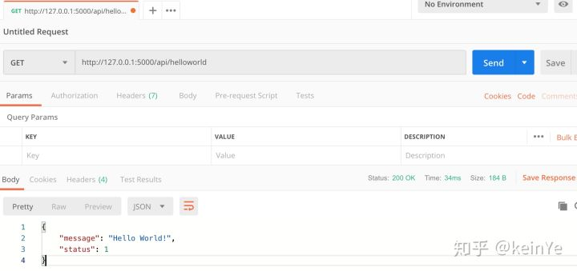

这篇文章的目标是实现一个通过 API 访问的服务端，主要实现以下功能：
  

* 使用 Flask 创建一个服务器
* 实现通过 RESTful API 访问
* 实现数据持久化存储
* 实现用户认证

## 使用 Flask 创建服务器
在开始之前首先使用 pip 安装 virtualenv。
  

```
pip install virtualenv
```

> virtualenv 为你的项目提供了一个独立的python 依赖库，这样既可以保证代码在不同平台上使用相同的依赖环境，同时也不会影响本地的 python 环境。
新建服务器目录，并设置虚拟环境
  

```
mkdir server
cd server
virtualenv -p /usr/local/bin/python3 .venv
```
在目录下新建依赖文件 requirements.txt，文件内容如下：
  

```
click>=6.7
Flask>=1.0.0
Flask-Cors>=3.0.7
Flask-HTTPAuth>=3.3.0
Flask-Login>=0.4
Flask-Migrate>=2.0.4
Flask-SQLAlchemy>=2.3.2
flask-restful>=0.3
itsdangerous>=0.24
Jinja2>=2.10
PyMySQL>=0.9.2
pluggy>=0.6.0
pytz>=2018.4
SQLAlchemy-Utils>=0.33.3
Werkzeug>=0.14.1
```
安装依赖文件中的所有依赖
  

```
source .venv/bin/active
pip inistall -r requirements.txt
```

> 注意在使用 python、pip 等命令前，先激活虚拟环境，文章中默认已激活虚拟环境。
依赖完成以后在 server 目录下在新建一个 server 目录作为项目的主目录，第一级 server 目录作为共用配置文件存储目录。
  
在第二级 server 目录下新建文件 [app.py](https://link.zhihu.com/?target=http%3A//app.py/) 和 \_\_init\_\_.py。
  
[app.py](https://link.zhihu.com/?target=http%3A//app.py/) 文件内容如下：
  

```
# -*- coding:utf-8 -*-

from flask import Flask
from flask.views import MethodView

class HelloWorld(MethodView):

    def get(self):
        return 'Hello World!'

def create_app(config=None):
    app = Flask(
        'server', instance_relative_config=True
    )

    app.add_url_rule('/', view_func=HelloWorld.as_view('HelloWorld'))

    return app
```
\_\_init\_\_.py 文件内容如下：
  

```
# -*- coding:utf-8 -*-

from .app import create_app
```
在第一级 server 目录下新建文件 [main.py](https://link.zhihu.com/?target=http%3A//main.py/)，文件内容如下：
  

```
from server import create_app

app = create_app()

if __name__ == '__main__':
    app.run()
```
此时在第一级 server 目录下执行 `python main.py` 命令，将看到以下信息：
  

```
(.venv) ➜  server python main.py
 * Serving Flask app "server" (lazy loading)
 * Environment: production
   WARNING: This is a development server. Do not use it in a production deployment.
   Use a production WSGI server instead.
 * Debug mode: off
 * Running on http://127.0.0.1:5000/ (Press CTRL+C to quit)
```
此时你的 Flask 应用已完全运行起来了，在浏览器中输入 `http://127.0.0.1:5000/` 将看到 Hello World！ 文本。
  
整个文件目录如下：
  

```
(.venv) ➜  python tree server
server
├── main.py
├── requirements.txt
└── server
    ├── __init__.py
    └── app.py
```

## 实现 RESTful API

> 符合REST设计风格的Web API称为RESTful API。它从以下三个方面资源进行定义：

* 直观简短的资源地址：URI，比如：[http://example.com/resources。](https://link.zhihu.com/?target=http%3A//example.com/resources%25E3%2580%2582)
* 传输的资源：Web服务接受与返回的互联网媒体类型，比如：JSON，XML，YAML等。
* 对资源的操作：Web服务在该资源上所支持的一系列请求方法（比如：POST，GET，PUT或DELETE）。
  
RESTful API 是一套成熟的互联网应用程序的 API 设计规范。主要用于客户端和服务器之间无状态、统一接口方式的通讯，我们经常访问的网页既是一个典型的客户端和服务器模型，我们在浏览器中所看到的网页是一个客户端，而为它提供内容的是服务器；另外我们手机中的 APP 也是一个客户端，我们在 APP 中看到的图片信息等都是通过服务器来提供的。
  
Flask-RESTful 为 Flask 提供了 RESTful API 的扩展，通过 Flask-RESTful 我们可以快速的为 Flask 应用增加 API 接口。
  
首先，需要新增文件 [module.py](https://link.zhihu.com/?target=http%3A//module.py/)，用于归集扩展模块的对象。
  

```
# -*- coding:utf-8 -*-

from flask_restful import Api

api = Api()
```
然后，在 [app.py](https://link.zhihu.com/?target=http%3A//app.py/) 文件中对 Flask-RESTful 进行初始化。
  

```
def create_app(config=None):
    app = Flask(
        'server', instance_relative_config=True
    )

    configure_module(app)

    app.add_url_rule('/', view_func=HelloWorld.as_view('HelloWorld'))

    return app

def configure_module(app):
    # 初始化 Flask-RESTful
    api.init_app(app)
```
最后，在第二层 server 目录中新建 api 目录，新建文件 [api.py](https://link.zhihu.com/?target=http%3A//api.py/) 和 \_\_init\_\_.py，内容分别如下:
  
\_\_init\_\_.py 文件内容
  

```
# -*- coding:utf-8 -*-

from server.api import api
```
[api.py](https://link.zhihu.com/?target=http%3A//api.py/) 文件内容
  

```
# -*- coding:utf-8 -*-
from flask_restful import Resource, reqparse
from server.module import api
from flask import jsonify

class HelloWorld(Resource):
    def get(self):
        return jsonify({
            'status': 1,
            'message': 'Hello World!'
        })

api.add_resource(HelloWorld, '/api/helloworld')
```
通过 curl 命令来访问 `/api/helloworld` 的过程如下：
  

```
➜  ~ curl http://127.0.0.1:5000/api/helloworld
{"message":"Hello World!","status":1}
```
通过 Postman 访问的结果如下图：
  

  
  
此时整个程序的目录如下：
  

```
server
├── main.py
├── requirements.txt
└── server
    ├── __init__.py
    ├── api
    │   ├── __init__.py
    │   └── api.py
    ├── app.py
    └── module.py
```

## 增加数据库支持
SQLAlchemy 是当前最流行的 Python 数据库 ORM「对象关系映射」 框架。提供了 Python 类到数据表的映射，将数据表的创建过程大大简化，对数据表的操作进行 python 函数式封装，提高了程序开发的进度及可读性。
  
Flask-SQLAlchemy 为 Flask 应用提供了 SQLAlchemy 的支持，它提供了大多数的默认值来简化各种操作，使用起来十分简单且有趣。
  
在 Flask 中添加 SQLAlchemy 的支持需要对现有代码进行一下修改：
  
首先，在 [module.py](https://link.zhihu.com/?target=http%3A//module.py/) 文件中增加 SQLAlchemy 的实例，并在 [app.py](https://link.zhihu.com/?target=http%3A//app.py/) 文件中初始化 SQLAlchemy：
  
[module.py](https://link.zhihu.com/?target=http%3A//module.py/) 文件中新增以下内容：
  

```
from flask_sqlalchemy import SQLAlchemy
from sqlalchemy import MetaData

metadata = MetaData(
    naming_convention={
        "ix": "ix_%(column_0_label)s",
        "uq": "uq_%(table_name)s_%(column_0_name)s",
        "fk": "fk_%(table_name)s_%(column_0_name)s_%(referred_table_name)s",
        "pk": "pk_%(table_name)s",
    }
)
db = SQLAlchemy(metadata=metadata)
```
[app.py](https://link.zhihu.com/?target=http%3A//app.py/) 文件中对 SQLAlchemy 进行初始化，新增代码如下：
  

```
def create_app(config=None):
    ...
    app.config.from_object("server.config.DefaultConfig")
    ...

def configure_module(app):
    # 初始化 Flask-RESTful
    api.init_app(app)

    db.init_app(app)
```
其次，增加配置文件完成对 SQLAlchemy 数据库的配置，在当前的程序中我们使用 sqlite 数据库来实现，配置文件内容如下：
  

```
# -*- coding:utf-8 -*-

import os

class DefaultConfig(object):
    basedir = os.path.join(os.path.abspath(os.path.dirname(
                               os.path.dirname(__file__))))

    DEBUG=True
    #Database
    # For SQLite:
    SQLALCHEMY_DATABASE_URI = 'sqlite:///' + basedir + '/' + \
                                  'test.sqlite'

    # This option will be removed as soon as Flask-SQLAlchemy removes it.
    # At the moment it is just used to suppress the super annoying warning
    SQLALCHEMY_TRACK_MODIFICATIONS = False
    # This will print all SQL statements
    SQLALCHEMY_ECHO = False

    SECRET_KEY = '1234567890098765d4321'
```

> 在 [app.py](https://link.zhihu.com/?target=http%3A//app.py/) 文件中新增的 `app.config.from_object("server.config.DefaultConfig")` 为 Flask 引入了配置文件的内容。
最后，增减用户类，以及在 [api.py](https://link.zhihu.com/?target=http%3A//api.py/) 文件中增加对数据中 user 表的访问。
  
新增用户类文件 [user.py](https://link.zhihu.com/?target=http%3A//user.py/) 的内容如下：
  

```
from server.module import db

class CRUDMixin(object):

    def __repr__(self):
        return "<{}>".format(self.__class__.__name__)

    @classmethod
    def create(cls, **kwargs):
        instance = cls(**kwargs)
        return instance.save()

    def save(self):
        """Saves the object to the database."""
        db.session.add(self)
        db.session.commit()
        return self

    def delete(self):
        """Delete the object from the database."""
        db.session.delete(self)
        db.session.commit()
        return self


class User(db.Model, CRUDMixin):
    __tablename__ = 'user'

    id = db.Column(db.Integer, primary_key=True, autoincrement=True)
    name = db.Column(db.String(200), unique=True, nullable=False)
    password = db.Column(db.String(200), nullable=False)

    def to_json(self):
        return {
            'id': self.id,
            'name': self.name,
            'password': self.name
        }
```
在 [api.py](https://link.zhihu.com/?target=http%3A//api.py/) 文件中新增 `http://127.0.0.1:5000/api/user` 接口，提供 GET 和 POST 方法，分别用来获取数据库中用户信息和向数据库中新增用户信息。新增 `http://127.0.0.1:5000/api/create` 接口，通过 GET 方法初始化 sqlite 数据库并新建 user 数据表。[api.py](https://link.zhihu.com/?target=http%3A//api.py/) 文件完成内容如下：
  

```
# -*- coding:utf-8 -*-
from flask_restful import Resource, reqparse
from server.module import api
from flask import jsonify, request
from sqlalchemy import func
from server.models.user import User
from server.module import db
from sqlalchemy_utils import database_exists, create_database

class HelloWorld(Resource):
    def get(self):
        return jsonify({
            'status': 1,
            'message': 'Hello World!'
        })

class Create(Resource):
    def get(self):
        if database_exists(db.engine.url):
            return jsonify({
                'messge': '数据库已存在！'
            })
        create_database(db.engine.url)
        db.create_all(bind=None)
        return jsonify({
            'messge': '数据库创建完成！'
        })

class UserList(Resource):

    def get(self):
        users = db.session.query(User).all()
        return jsonify({
            'users': [x.to_json() for x in users]
        })

    def post(self):
        json = request.get_json(force=True)
        username = json['name']
        password = json['password']
        user = User.query.filter_by(name=username).first()
        if user:
            return jsonify({
                'message': "用户: " + username + " 已存在！"
            })
        user = User()
        user.name = username
        user.password = password
        user.save()
        return jsonify({
            'message': "添加用户: " + username + " 完成！"
        })

api.add_resource(HelloWorld, '/api/helloworld')
api.add_resource(UserList, '/api/user')
api.add_resource(Create, '/api/create')
```
在命令行中启动 Flask 程序，通过 curl 命令访问各个 api 获取内容如下：
  

```
➜  ~ curl http://127.0.0.1:5000/api/create
{
  "messge": "The database is exists\uff01"
}
➜  ~ curl http://127.0.0.1:5000/api/create
{
  "messge": "The database is exists!"
}
➜  ~ curl http://127.0.0.1:5000/api/create
{
  "messge": "The database is ready!"
}
➜  ~ curl http://127.0.0.1:5000/api/user
{
  "users": []
}
➜  ~ curl -H "Accept: application/json" -H "Content-type: application/json" -X POST -d '{"name": "test","password": "test"}' http://127.0.0.1:5000/api/user
{
  "message": "Add User: test finish!"
}
➜  ~ curl http://127.0.0.1:5000/api/user
{
  "users": [
    {
      "id": 1,
      "name": "test",
      "password": "test"
    }
  ]
}
➜  ~ curl -H "Accept: application/json" -H "Content-type: application/json" -X POST -d '{"name": "1234","password": "1234"}' http://127.0.0.1:5000/api/user
{
  "message": "Add User: 1234 finish!"
}
➜  ~ curl http://127.0.0.1:5000/api/user
{
  "users": [
    {
      "id": 1,
      "name": "test",
      "password": "test"
    },
    {
      "id": 2,
      "name": "1234",
      "password": "1234"
    }
  ]
}
```
此时整个程序的目录如下：
  

```
├── main.py
├── requirements.txt
├── server
│   ├── __init__.py
│   ├── api
│   │   ├── __init__.py
│   │   └── api.py
│   ├── app.py
│   ├── config.py
│   ├── models
│   │   └── user.py
│   └── module.py
└── test.sqlite
```

## 增加用户认证
在 Flask 中用于用户认证的扩展主要有 Flask-Login 和 Flask-HTTPAuth。Flask-Login 提供了基于 Cookie 和 session 的用户管理，更多的用在可见视图的应用场景中。而我们所使用的 RESTful API 是无状态的，无法通过 Cookie 或 session 来进行用户认证，不过 Flask-HTTPAuth 提供基于 API 的认证方式。
  
Flask-HTTPAuth 支持一下认证方式：
  

* HTTPBasicAuth
* HTTPDigestAuth
* HTTPTokenAuth
* MultiAuth
本文主要针对 HTTPBasicAuth 认证方式进行介绍。
  
首先，在 [module.py](https://link.zhihu.com/?target=http%3A//module.py/) 文件中建立 HTTPBasicAuth 的实例：
  

```
auth = HTTPBasicAuth()
```
其次，在 [app.py](https://link.zhihu.com/?target=http%3A//app.py/) 文件中增加 HTTPBasicAuth 的密码校验回调函数
  

```
@auth.verify_password
def verify_password(username, password):
    g.current_user = None
    user = User.query.filter_by(name = username).first()
    if not user or not user.password == password:
        return False
    g.current_user = user
    return True
```
最后，在需要保护的路径上增加 login\_required 装饰器。我们在 user 和 create 路径上增加装饰器，保持 helloworld 可以正常访问。
  

```
class Create(Resource):
    decorators = [multi_auth.login_required]
    ...

class UserList(Resource):
    decorators = [multi_auth.login_required]
    ...
```
通过 curl 命令验证各 api 的增加认证后的访问方式：
  

```
➜  ~ curl http://127.0.0.1:5000/api/helloworld
{
  "message": "Hello World!",
  "status": 1
}
➜  ~ curl http://127.0.0.1:5000/api/create
Unauthorized Access%                                                            ➜  ~ curl --base -u test:test http://127.0.0.1:5000/api/create
curl: option --base: is unknown
curl: try 'curl --help' or 'curl --manual' for more information
➜  ~ curl --basic -u test:test http://127.0.0.1:5000/api/create
{
  "messge": "The database is exists!"
}
➜  ~ curl http://127.0.0.1:5000/api/user
Unauthorized Access%                                                            ➜  ~ curl --basic -u test:test http://127.0.0.1:5000/api/user
{
  "users": [
    {
      "id": 1,
      "name": "test",
      "password": "test"
    },
    {
      "id": 2,
      "name": "1234",
      "password": "1234"
    }
  ]
}
```
通过验证结果可以看出 user 和 create 路径在访问时需要携带登录用户信息，否则会提示 `Unauthorized Access`。
  
本文通过一 Flask 做框架，在使用 Flask-RESTful、Flask-SQLAlchemy 和 Flask-HTTPAuth 等扩展的情况下，实现一个支持数据库持久化存储和用户认证的 RESTful API 服务端，总体来说完成了预期所要完成的目标。

> 当前文档由 [markdown文档下载插件](https://github.com/kscript/markdown-download) 下载, 原文链接: [使用 Flask 创建 RESTful 服务](https://zhuanlan.zhihu.com/p/87899492)  