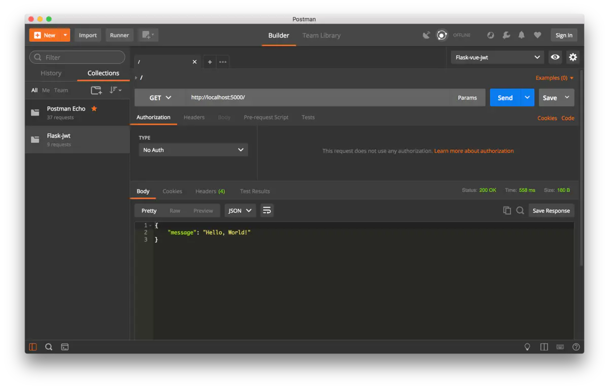
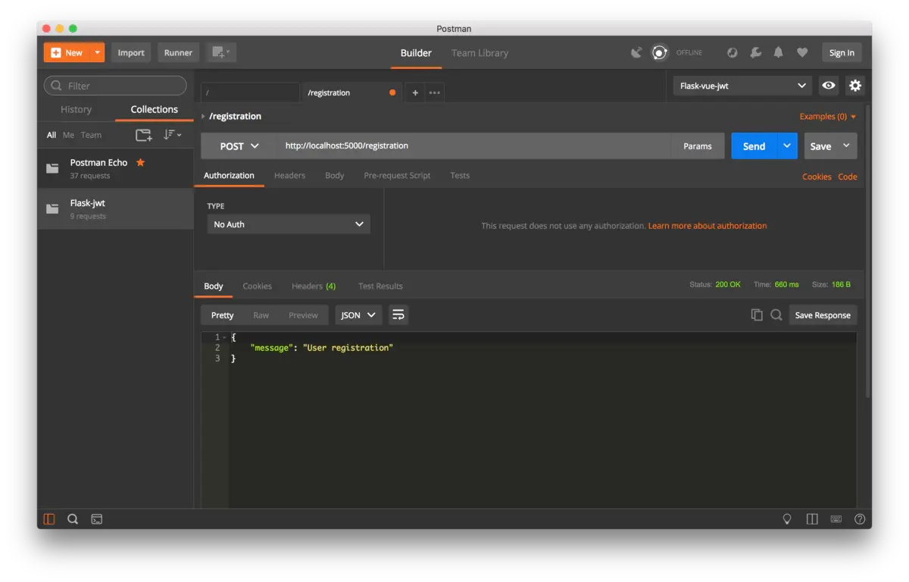
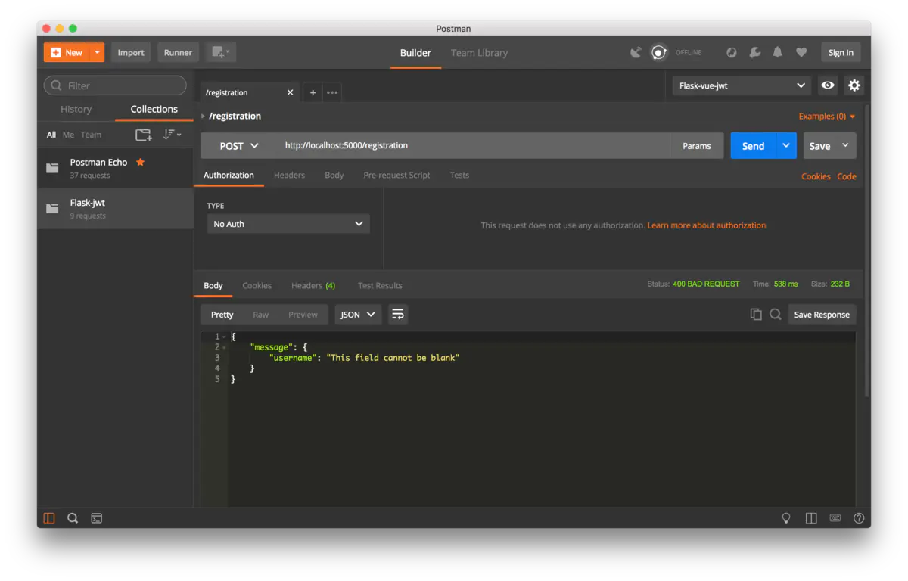
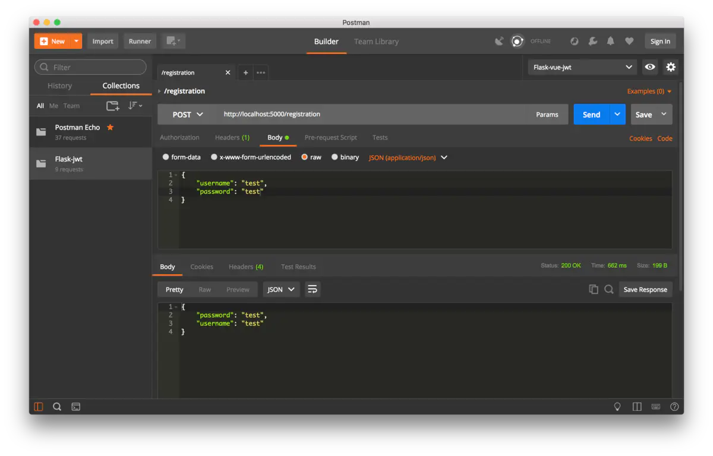
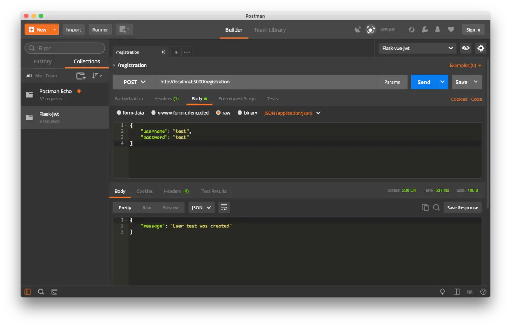

本文主要参考国外大佬的[文章](https://links.jianshu.com/go?to=https%3A%2F%2Fcodeburst.io%2Fjwt-authorization-in-flask-c63c1acf4eeb)教你如何使用JWT框架实现Flask API的身份认证。

JSON Web Token(JWT)是一个非常流行的WEB认证认证框架，JWT可以说是SPA和web服务器之间授权和通信的标准做法。在本文中，我们会构建一个具有JWT授权的Flask web服务器。

完整的代码从这里下载：[https://github.com/dickens88/flask-jwt-demo](https://links.jianshu.com/go?to=https%3A%2F%2Fgithub.com%2Fdickens88%2Fflask-jwt-demo)

## 步骤1 工程构建

本工程基于Python3.6或以上版本，先执行`pip`安装依赖包:

```
pip install flask flask-restful flask-jwt-extended passlib flask-sqlalchemy
```

新建一个Python工程(你可以选择pycharm作为开发IDE工具)，我们将会用到以下几个工具：

* [Flask-RESTful](https://links.jianshu.com/go?to=https%3A%2F%2Fflask-restful.readthedocs.io%2Fen%2Flatest%2Findex.html)— 创建API端点
* [Flask-JWT-Extended](https://links.jianshu.com/go?to=http%3A%2F%2Fflask-jwt-extended.readthedocs.io%2Fen%2Flatest%2F) — 生成和校验JWT
* [passlib](https://links.jianshu.com/go?to=http%3A%2F%2Fpasslib.readthedocs.io%2Fen%2Fstable%2Findex.html) — 生成密码的摘要值
* [Flask-SQLAlchemy](https://links.jianshu.com/go?to=http%3A%2F%2Fflask-sqlalchemy.pocoo.org%2F)— 数据库对象的ORM映射  
  为了简化这个例子，我们会将工程目录扁平化，工程一共有4个文件，结构如下：

```
flask-jwt
├── views.py     # views of the server
├── models.py    # database models
├── resources.py # API endpoints
└── run.py       # main script to start the server
```

让我们确认一下flask是否可以正常工作，在工程中新建`run.py`文件，加入如下代码：

```
from flask import Flask
app = Flask(__name__)
import views, models, resources
```

然后再`view.py`中加入：

```python
from run import app
from flask import jsonify
@app.route('/')
def index():
    return jsonify({'message': 'Hello, World!'})
```

这是一个简单的例子，`models.py`和`resources.py`文件目前还是空的，在命令行执行如下命令启动Flask应用

```
set FLASK_DEBUG=1
set FLASK_APP=run.py
flask run
```

你会看到类似如下语句回显：

```
* Serving Flask app “run”
* Forcing debug mode on
* Running on [http://127.0.0.1:5000/](http://127.0.0.1:5000/) (Press CTRL+C to quit)
* Restarting with stat
* Debugger is active!
```

用浏览器访问`localhost:5000`你将或看到一个JSON的`“Hello World”`响应。为了更好的测试我们的应用，建议使用 [Postman](https://links.jianshu.com/go?to=https%3A%2F%2Fwww.getpostman.com%2F)进行后续的测试。



image.png

## 步骤2 添加API接口

下一步将要构建API访问的接口，下面的代码先不实现具体的业务逻辑，而是先尝试理解整个应用的逻辑结构。  
在`resources.py`加入下面的代码：

```python
from flask_restful import Resource

class UserRegistration(Resource):
    def post(self):
        return {'message': 'User registration'}


class UserLogin(Resource):
    def post(self):
        return {'message': 'User login'}
      
      
class UserLogoutAccess(Resource):
    def post(self):
        return {'message': 'User logout'}
      
      
class UserLogoutRefresh(Resource):
    def post(self):
        return {'message': 'User logout'}
      
      
class TokenRefresh(Resource):
    def post(self):
        return {'message': 'Token refresh'}
      
      
class AllUsers(Resource):
    def get(self):
        return {'message': 'List of users'}

    def delete(self):
        return {'message': 'Delete all users'}
      
      
class SecretResource(Resource):
    def get(self):
        return {
            'answer': 42
        }
```

在最上面，我们从`Resource`包引入[Flask-RESTful](https://links.jianshu.com/go?to=https%3A%2F%2Fflask-restful.readthedocs.io%2Fen%2Flatest%2Findex.html)，这个包提供了一种更优雅的方式处理RESTful API，在RESTful API中每个接口都被称作`资源`，上面的代码中每个类都继承自`Resource`也就拥有了API端点的全部特性。  
这里我们创建了7个resource

* 用户注册和登录
* access token和refresh token的登出
* token 刷新
* 获取已注册用户列表 (仅用于测试目的)
* 获取数据接口 (用来测试access token)

除了最后2个接口以外其他接口都接受POST方法，`AllUsers`接受GET和DELETE，`Secret`只接受GET。如果你熟悉Flask API的话，你知道服务器所有返回内容都应该被`jsonify()`包装， 而`Flask-RESTful` 已经帮你实现了这个逻辑，所以你不需要显示调用jsonify。

下一步需要把我们的接口注册到应用，打开`run.py`添加代码:

```
from flask import Flask
from flask_restful import Api

app = Flask(__name__)
api = Api(app)

import views, models, resources

api.add_resource(resources.UserRegistration, '/registration')
api.add_resource(resources.UserLogin, '/login')
api.add_resource(resources.UserLogoutAccess, '/logout/access')
api.add_resource(resources.UserLogoutRefresh, '/logout/refresh')
api.add_resource(resources.TokenRefresh, '/token/refresh')
api.add_resource(resources.AllUsers, '/users')
api.add_resource(resources.SecretResource, '/secret')
```

这里我们引入flask-restful的Api类来初始化API接口，并给他们绑定一个uri路径。尝试使用POST请求发送到localhost:5000/registration，你将会收到一个 ‘User registration’回应。



image.png

接下来我们给POST添加参数解析逻辑，Flask-RESTful内建有参数解析器，添加如下代码到`resources.py`

```python
from flask_restful import Resource, reqparse

parser = reqparse.RequestParser()
parser.add_argument('username', help = 'This field cannot be blank', required = True)
parser.add_argument('password', help = 'This field cannot be blank', required = True)
```

我们从 `flask-restful`引入`reqparse`，我们首先用`reqparse.RequestParser()`初始化parser，然后给他添加参数`username` and `password`并制定这两个参数为必选([参考reqparse文档](https://links.jianshu.com/go?to=https%3A%2F%2Fflask-restful.readthedocs.io%2Fen%2Flatest%2Freqparse.html))

把parser加入到相关函数：

```python
class UserRegistration(Resource):
    def post(self):
        data = parser.parse_args()
        return data


class UserLogin(Resource):
    def post(self):
        data = parser.parse_args()
        return data
```

现在/registration和/login接口的所有调用都被要求提供那两个参数，你可以用postman尝试加参数域不加参数的变化。



没带参数



带参数

## 步骤3 注册和登录

这部分我们将添加数据库支持，并模拟用户注册和登录。我们用SQLAlchemy包提供的方法连接SQLite数据库(无需安装)，如果要迁移到MySQL或者其他实体数据库，代码需要做微调。  
在`run.py`中添加如下代码：

```python
from flask_sqlalchemy import SQLAlchemy

...

app.config['SQLALCHEMY_DATABASE_URI'] = 'sqlite:///app.db'
app.config['SQLALCHEMY_TRACK_MODIFICATIONS'] = False
app.config['SECRET_KEY'] = 'some-secret-string'

db = SQLAlchemy(app)

@app.before_first_request
def create_tables():
    db.create_all()
```

在最上面引入SQLAlchem包，在app初始化完成后，添加配置SQLAlchemy和创建数据库对象的逻辑，`db.create_all()`方法将自动创建所需的数据库表。接下来配置用户数据模型，在`models.py`中添加：

```python
from run import db

class UserModel(db.Model):
    __tablename__ = 'users'

    id = db.Column(db.Integer, primary_key = True)
    username = db.Column(db.String(120), unique = True, nullable = False)
    password = db.Column(db.String(120), nullable = False)
    
    def save_to_db(self):
        db.session.add(self)
        db.session.commit()
```

在最上面从数据库连接处添加db对象，然后声明UserModel类，这个类将会映射成数据库的表，这里我们制定id作为主键，其他成员有username和password，然后添加一个save\_to\_db()方法用来提交数据给数据库。  
打开`resource.py`修改UserRegistration

```
from models import UserModel


class UserRegistration(Resource):
    def post(self):
        data = parser.parse_args()
        new_user = UserModel(
            username = data['username'],
            password = data['password']
        )
        try:
            new_user.save_to_db()
            return {
                'message': 'User {} was created'.format( data['username'])
            }
        except:
            return {'message': 'Something went wrong'}, 500
```

首先我们引入UserModel，当我们收到一个请求时将会创建一个UserModel对象，然后尝试调save\_to\_db()保存用户信息到数据库，如果报错则返回500状态码。  
试试发一个请求给/registration接口：



image.png
  

同样的请求如何你再发一次，就会看到 ‘Something went wrong’的报错，这是因为数据库已经有一个相同的用户名，因此我们要加上用户名的判断逻辑，到`models.py`

```python
@classmethod
def find_by_username(cls, username):
   return cls.query.filter_by(username = username).first()
```

这个方法会根据用户名查找并返回用户信息，修改`resources.py`

```
class UserRegistration(Resource):
    def post(self):
      data = parser.parse_args()

      if UserModel.find_by_username(data['username']):
          return {'message': 'User {} already exists'. format(data['username'])}

      new_user = ...
```

这里我们会根据用户注册请求进行判断，如果数据库已经存在同名的用户，则会返回提示信息。  
接下来我们来实现`UserLogin`接口：

```
class UserLogin(Resource):
    def post(self):
        data = parser.parse_args()
        current_user = UserModel.find_by_username(data['username'])
        if not current_user:
            return {'message': 'User {} doesn\'t exist'.format(data['username'])}
        
        if data['password'] == current_user.password:
            return {'message': 'Logged in as {}'.format(current_user.username)}
        else:
            return {'message': 'Wrong credentials'}
```

这个接口做了这么几件事：

* 首先，解析请求参数
* 然后查看username
* 如果用户名不存在则返回错误信息
* 如果用户存在则检查密码
* 如果密码匹配则返回登录成功，否则失败

用Postman将之前注册的用户信息发送一个登录的POST请求给/login


image.png

之前添加的接口列表有一个方法叫AllUsers，我们可以用他测试一下user表里都有什么数据，在`resources.py`中:

```
class AllUsers(Resource):
    def get(self):
        return UserModel.return_all()
    
    def delete(self):
        return UserModel.delete_all()
```

当GET请求/users接口时，会返回所有已注册用户的列表，如果使用DELETE方法，则会清空表中的数据，修改`models.py`中return\_all()和delete\_all()方法

```python
@classmethod
def return_all(cls):
    def to_json(x):
        return {
            'username': x.username,
            'password': x.password
        }
    return {'users': list(map(lambda x: to_json(x), UserModel.query.all()))}

@classmethod
def delete_all(cls):
    try:
        num_rows_deleted = db.session.query(cls).delete()
        db.session.commit()
        return {'message': '{} row(s) deleted'.format(num_rows_deleted)}
    except:
        return {'message': 'Something went wrong'}
```


image.png

到这里注册和登录的逻辑基本上完成了，但是这里有一个问题-我们存储了用户的原始密码，如果有人未授权访问到这个用户表，那么用户的敏感信息将会泄露，所以遵循业界通用的方法，要对密码进行加密。修改`models.py`

```python
from passlib.hash import pbkdf2_sha256 as sha256
class UserModel(db.Model):
    ...
    @staticmethod
    def generate_hash(password):
        return sha256.hash(password)
    @staticmethod
    def verify_hash(password, hash):
        return sha256.verify(password, hash)
```

`generate_hash()`将会生成一个摘要值并存在数据库里，`verify_hash()` 用来校验给定的密码的hash。修改`resources.py`：

```
new_user = UserModel(
    username = data['username'],
    password = UserModel.generate_hash(data['password'])
)
```

在UserLogin里添加校验密码:

```css
if UserModel.verify_hash(data['password'], current_user.password):
    ...
else:
    ...
```

现在用户的密码将以hash的方式进行存储和校验。


image.png

## 步骤4 天机JWT

这个部分我们将添加JSON Web Token到应用中，修改`run.py`

```
from flask_jwt_extended import JWTManager
app.config['JWT_SECRET_KEY'] = 'jwt-secret-string'
jwt = JWTManager(app)
```

添加JWTManager的引用并初始化，然后修改`resources.py`:

```
from flask_jwt_extended import (create_access_token, create_refresh_token, jwt_required, get_jwt_identity, get_jwt)
```

先添加所有必须的引用，然后修改`UserRegistration`和`UserLogin`，当用户认证成功以后返回token:

```
class UserRegistration(Resource):
    def post(self):
        data = parser.parse_args()
        
        if UserModel.find_by_username(data['username']):
            return {'message': 'User {} already exists'.format(data['username'])}
        
        new_user = UserModel(
            username = data['username'],
            password = UserModel.generate_hash(data['password'])
        )
        
        try:
            new_user.save_to_db()
            access_token = create_access_token(identity = data['username'])
            refresh_token = create_refresh_token(identity = data['username'])
            return {
                'message': 'User {} was created'.format(data['username']),
                'access_token': access_token,
                'refresh_token': refresh_token
                }
        except:
            return {'message': 'Something went wrong'}, 500


class UserLogin(Resource):
    def post(self):
        data = parser.parse_args()
        current_user = UserModel.find_by_username(data['username'])

        if not current_user:
            return {'message': 'User {} doesn\'t exist'.format(data['username'])}
        
        if UserModel.verify_hash(data['password'], current_user.password):
            access_token = create_access_token(identity = data['username'])
            refresh_token = create_refresh_token(identity = data['username'])
            return {
                'message': 'Logged in as {}'.format(current_user.username),
                'access_token': access_token,
                'refresh_token': refresh_token
                }
        else:
            return {'message': 'Wrong credentials'}
```

所以，当用户成功注册或登录，我们会受到两个token: access token和 refresh token。 我们用`create_access_token()` 和 `create_refresh_token()`来生成token，这两个函数至少要提供`identity`参数，简单起见这里可以只将用户名作为`identity`但也可以使用更[复杂](https://links.jianshu.com/go?to=http%3A%2F%2Fflask-jwt-extended.readthedocs.io%2Fen%2Flatest%2Fadd_custom_data_claims.html)的设计。Access token用于访问被保护的敏感信息，Refresh token用户重新颁发过期的access token

创建一个被保护的资源，我们要用到`@jwt_required`装饰器:

```python
class SecretResource(Resource):
    @jwt_required()
    def get(self):
        return {
            'answer': 42
        }
```

现在，要访问这个资源你必须添加一个header到请求中，格式是Authorization: Bearer <JWT>. 再尝试调一次登录接口，复制access token，然后调用/secret接口，并岛上access token到请求头:


image.png

token需要有一个过期时间，默认情况下access token有15分钟的有效期，refresh tokens是30天，为了让用户不要太频繁的登录，你可以用refresh token来刷新access token，这通常要做一个额外的接口：

```python
class TokenRefresh(Resource):
    @jwt_required(refresh=True)
    def post(self):
        current_user = get_jwt_identity()
        access_token = create_access_token(identity=current_user)
        return {'access_token': access_token}
```

这个接口用 jwt\_required(refresh=True) 装饰器, 意味着你可以用refresh token来访问。为了确定用户身份，我们使用get\_jwt\_identity()从refresh token中抽取身份信息，然后使用这个身份生成新的access token并返回给用户。

到这里整个JWT的认证机制就讲完了。

## 步骤5 登出和注销

当用户要登出的时候，我们不能只删除客户端的token，因为在服务器上token依然有效(直到过期)，因此登出意味着我们要讲这个token加到黑名单里，然后每一个请求带的token我们都要和这个黑名单比对，如果匹配上了则不允许进入，下面是一个最简单的登录实现，在`models.py`中添加：

```python
class RevokedTokenModel(db.Model):
    __tablename__ = 'revoked_tokens'
    id = db.Column(db.Integer, primary_key=True)
    jti = db.Column(db.String(120))

    def add(self):
        db.session.add(self)
        db.session.commit()

    @classmethod
    def is_jti_blacklisted(cls, jti):
        query = cls.query.filter_by(jti=jti).first()
        return bool(query)
```

这个简单的模型只存储主键id和jti-token的唯一标识，s\_jti\_blacklisted() 检查这个token是否已被撤销。修改`run.py`

```python
app.config['JWT_BLOCKLIST_TOKEN_CHECKS'] = ['access', 'refresh']

@jwt.token_in_blocklist_loader
def check_if_token_in_blacklist(jwt_header, decrypted_token):
    jti = decrypted_token['jti']
    return models.RevokedTokenModel.is_jti_blacklisted(jti)
```

`token_in_blocklist_loader`装饰器是一个回调函数，每次客户端请求被保护的接口时都会调用这个函数，函数要根据token是否在blocklist返回True或False，修改`resources.py`:

```python
class UserLogoutAccess(Resource):
    @jwt_required()
    def post(self):
        jti = get_jwt()['jti']
        try:
            revoked_token = RevokedTokenModel(jti=jti)
            revoked_token.add()
            return {'message': 'Access token has been revoked'}
        except:
            return {'message': 'Something went wrong'}, 500


class UserLogoutRefresh(Resource):
    @jwt_required(refresh=True)
    def post(self):
        jti = get_jwt()['jti']
        try:
            revoked_token = RevokedTokenModel(jti=jti)
            revoked_token.add()
            return {'message': 'Refresh token has been revoked'}
        except:
            return {'message': 'Something went wrong'}, 500
```

结束！

> 当前文档由 [markdown文档下载插件](https://github.com/kscript/markdown-download) 下载, 原文链接: [手把手教你：基于JWT实现Flask API身份认证](https://www.jianshu.com/p/c155c2b7af42)  