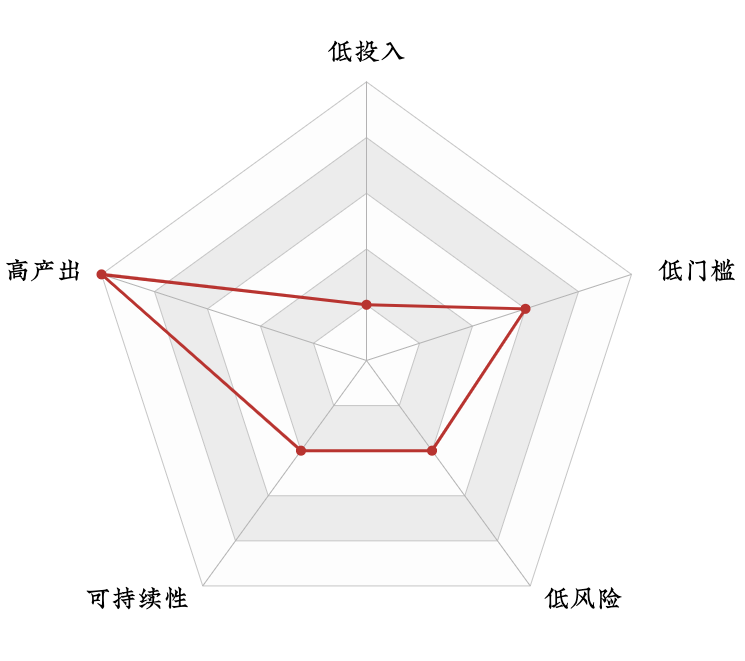

# 付费视频课

  
  

总体来讲，付费视频课是一个中等投入，然后产出极高的副业。

## 低投入 ★

前期需要做一些课程内容的准备；后期你需要对视频进行剪辑；录音还需要购买硬件。大部分的程序员并没有视频剪辑技能，所以这里有学习成本。硬件的话倒不算贵，便宜点的不到一千就能搞定。但是这是在我们赚到钱之前就要投入进去的。

## 高产出 ★★★★★

从产出上来讲，课程是一个非常好的品类。中国人有良好的为教育花钱的传统，大部分的用户都愿意为好的课程花钱。一些优质的、上百节的大课可以卖到几千甚至几万。相比其他的副业，它的产出是非常高的。

## 可持续性 ★★

我们是做技术类的课程。技术内容本身的变更是非常快的，除非我们做一些非常经典的基础课，比如说计算机原理、算法等等。

如果是跟语言、框架、实战相关的各种前沿课程，大概半年到一年就需要更新一次。如果我们使用屏幕录制方式来制作课程，在修改的时候，很可能需要重录相当部分，修改起来成本很高。

## 低风险 ★★

风险不低。如果做的课程比较长，比如几十上百集的大课，用业余时间来做可能会花上几个月甚至一两年，有时候做完技术都更新了。如果最终卖不出去的话，损失是很大的。

## 低门槛 ★★★

门槛不算高也不算低。如果经常在公司里面给团队做分享的话，那对你来讲这个门槛就很低。如果一直都是默默无闻地在做技术的话，可能就需要去练习一下怎么讲课。

因为我们最终是可以通过剪辑来进行调整的，所以也只是一个时间投入上的问题。讲得不好，你就多讲几遍；哪一句讲错了，就重新再讲。所以它本身的硬性门槛并不高。

关于风险和维护成本这两点，其实是有办法可以解决的，我们会在后续用专门的章节来讨论，这里就不展开了。

