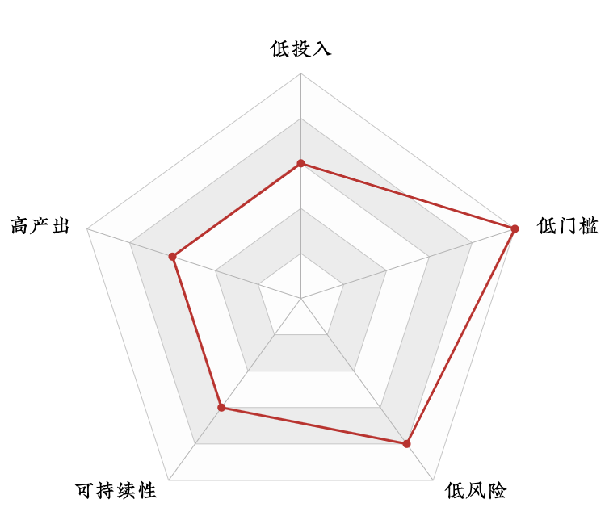
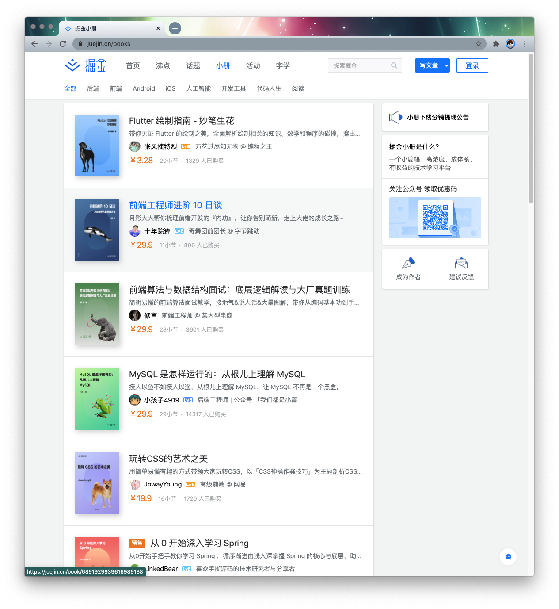

# 付费专栏

  

付费专栏就是付费的系列文章，绝大部分是技术教程，也有一些面向程序员的「心灵鸡汤」。我们可以简单地把它看成是传统出版的网络化。

对于技术内容来说，传统的纸书出版方式有一些明显的缺点。比如，不是彩页的话代码不能高亮，彩页的话书又特别贵。书里的代码也不能边看边调试。纸书的出品周期也较长，更新也慢，一些最新的技术会有一个较长的空白期。

而在线的付费专栏恰恰可以解决掉这些问题：它基于浏览器，自然可以通过 JS 来进行代码高亮；内容可以在线修改，几乎可以实时生效；做得细的技术专栏往往还内嵌了基于浏览器的调试环境，可以做到边学边练。

再加上原来技术博客的群众基础很好，于是技术平台和社区纷纷添加了付费专栏功能。这其中，做得比较好的应该算掘金的[小册](https://juejin.cn/books)。

  

下面我们来看一下付费专栏作为副业资产的各项评分。

## 低投入 ★★★

从投入上来讲，文字专栏比视频课程投入要低很多。但是技术内容比起其他文章的写作来讲，需要有技术实践作为基础，经常还要嵌入代码，调整格式，投入相对要高些。

## 高产出 ★★★
文字专栏的售价普遍比视频课程要低，像掘金小册的话，一般就在20~30块钱之间，还经常打折促销。

## 可持续性 ★★★

前面已经说过，技术内容一般更新频次高。但是图文专栏的更新成本很低，只需要编辑文字、加入新的内容就好，不需要像视频那样重新录制和剪辑。

## 低风险 ★★★★

文章的创作成本很低，而且我们可以通过发布短文来测试主题是否受欢迎，在确认后再开始系列文章的书写。

## 低门槛 ★★★★★

只要会写文章，就可以做付费专栏。

