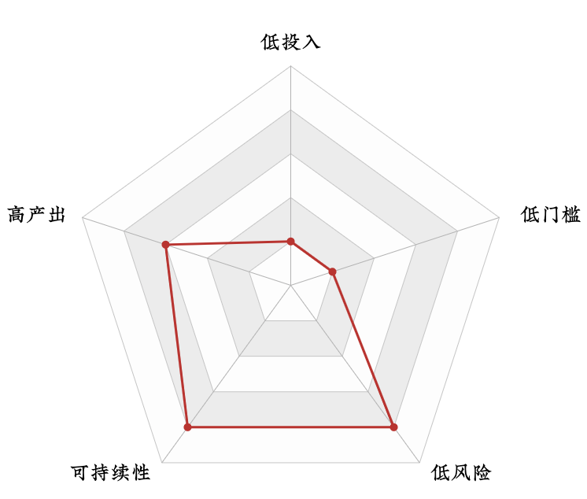

# 图书出版

  

如果把电子书也算进来，目前可以分发图书的方式大概有三类。

第一类是自己独立撰写图书，并生成 PDF 等电子书格式通过自己的渠道进行销售。这种更类似于数字商品售卖，所以并不包含在本节图书出版中。

第二类是通过出版商单独发行电子版。因为电子书不需要印刷，所以比起纸版图书门槛更低一些。我之前用 [BookDNA](http://bookdna.cn/) 出版过电子书，只需要将书提交给他们，就可以上架到亚马逊、苹果、京东、多看等多个平台。收入他们会代收，按分成结算回来。

第三类就是通过出版社出纸书，有时候也会同时把电子书版权签下来。一般纸版的门槛会高一些，需要有一定的影响力或者完成度已经较高的书稿作为参考。

## 低投入 ★

图书出版的投入非常大。一般至少需要花费3到6个月来编写初稿，加上审校印刷等环节，最后出版可能还需要花上半年，整个周期很长。

基于现有的内容，比如课程、文章整理创作书稿投入会相对较低，但仍有大量的工作要做。

## 高产出 ★★★

产出要把物质回报和非物质回报分开来看。

通过 BookDNA 等出版社专门出版电子书，可以按图书销售收入获得分成，大概在 70% ，还算不错。如果是纸版书，一般版税就只有 8%~15%，整体收入相当有限。

但纸版书对个人品牌提升的效果明显，而且可以通过线下书店等渠道获得读者，所以在非物质回报上比较高。

## 可持续性 ★★★★

图书的更新频次都很低，一般只有销售得不错，才会在再版时进行修订。所以我们可以认为它的可持续性还算不错。

## 低风险 ★★★★ 

主要还是时间投入，没有太多额外的风险。因为我们主要是出版技术书籍，内容方面的风险也非常小。

## 低门槛 ★

不管是电子版还是纸版，都要经过图书编辑审核，通过以后才能出版。尤其是纸书，要考虑至少收回印刷成本，所以门槛还是很高的。

如果在 GitHub 或者其他地方有发布电子书，且有较好的反馈，那么纸版的出版谈起来门槛就会低很多。