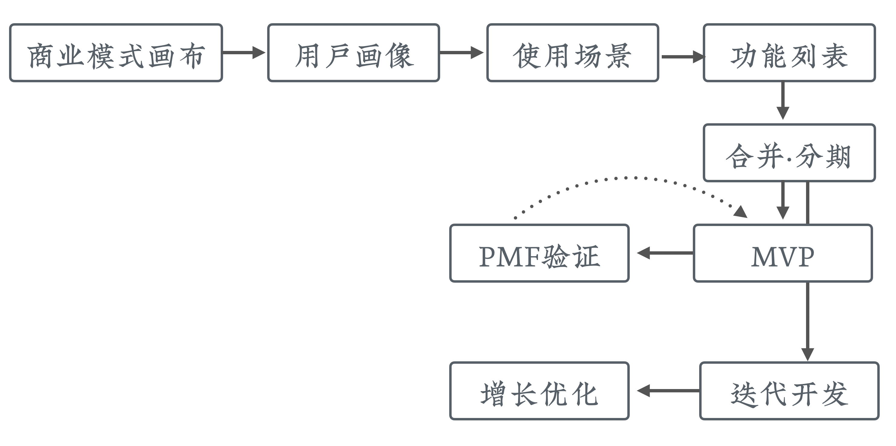

# 独立开发的精益流程

  

前面我们了解了精益创业的一些核心理念，接下来我们就在「独立开发」这个更为具体的副业活动中来看看如何应用精益流程。

这个流程和很多硅谷公司的产品流程很像，但是针对副业做了一些调整和优化。经过三年多时间的使用，我们自己用起来已经很顺手。

1. 首先定义价值主张，然后围绕着价值来设计商业模式画布。
1. 完成画布以后，我们把画布里的「客户细分」部分拿出来，做成「用户画像」。这是一个将细分客户具体化、变得有血有肉的工具
1. 有了画像，再据此还原用户使用产品的各个场景，他们是用电脑还是用手机、是在家里还是在车上使用等等。
1. 想象为了在上述场景下向用户传递价值，我们需要什么样的功能，这样就会得到一个功能列表
1. 功能列表会很长，不同功能的优先级也不同。所以我们会对功能进行分期，其中最重要也是最靠前的一个功能分期，就是用来开发「最小可行产品」的分期。
1. 当「最小可行产品」开发完成后，进行「产品市场契合」的验证，如果达不到设定的验证目标，就需要调整功能，甚至重新设计价值主张。
1. 当通过「产品市场契合」后，我们就可以按照分期迭代开发产品的其他功能了。
1. 在迭代过程中，我们会持续对新上线的部分功能进行增长优化，保证每一部分功能达到预定的目标。

以上就是我们为独立开发优化的精益流程，虽然讲起来比较多，但实际操作起来还是比较简单的。而且我们其实省略了不少大公司流程中的环节，比如用户访谈、焦点小组等。

下一节开始，我们将用一个具体的例子来讲解。