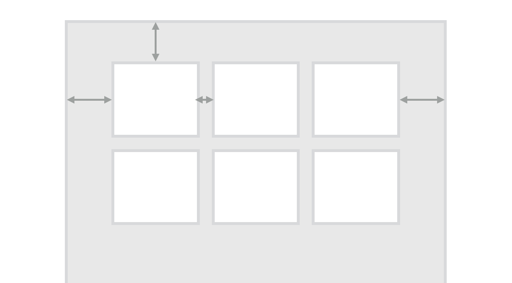
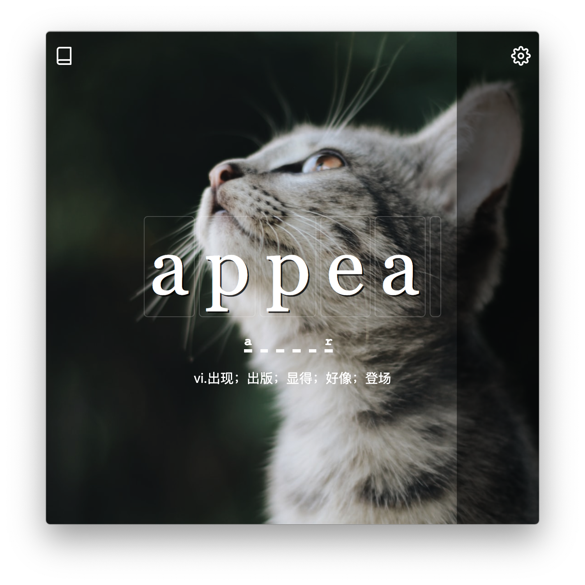

# 人人能用的四大原则

界面设计是很多尝试自己开发完整产品的程序员非常痛苦的事情。很多时候，如果我们去问设计师，很多人虽然会设计，却讲不出背后的道理。只会说，「这样做感觉上更好一些」，「这就是经验/灵感」。

我以前也是这么认为的，直到读了一本书才明白，原来界面设计背后一样是有规律的。

界面的表层结构展现的正是它内部的逻辑。

一个界面上应该摆放哪些控件，哪几个应该离得近，哪几个应该离得远，哪些应该用同样的风格，哪些又应该区别开来，这些都源于它背后严密的逻辑关系，而不是因为设计师的一时兴起。

那本书就是《写给大家看的设计书》。在书里，作者提出了界面排版的四个基本原则，通过活用这四个原则，我们就能够把界面设计得美观大方。

这四个原则分别是「重复」，「对比」，「对齐」和「亲密性」。

- 「重复」原则强调「一致性」，它说的是「在逻辑上一致的物件，在视觉上也应该一致」。
- 「对比」原则强调「层次感]，它说的是「逻辑上不同的物件，在视觉上也应该不同」。所以我们要想办法拉出距离来。
- 「对齐」原则强调的是「安定感」。均匀的留白能够营造出一种稳定的感觉。这正是产品质感的一种潜意识渗透。对齐虽然是很小的细节，但是如果处理不好，很容易会破坏产品整体质感，而且会给有强迫症的朋友带来莫大的压力。
- 「亲密性」原则，强调区块的关系，它说的是「逻辑上存在很近的关系，那么这个关系也应该表现在视觉上」。相关的项应该彼此靠近，不相关的项应该彼此远离。

书里有非常详尽的介绍和让人顿悟的例子，建议大家都去阅读下原书。

  

四大原则回答了常见的一些界面问题。比如说，上图中，白色方块之间的间距为什么不能比第一个方块和页面边界的距离大。

如果从纯感性的角度来讲，可能会说「这样放不好看」。但是如果通过亲密性原则来思考的话，我们会发现在逻辑上，相对于页面边框，白色方块是一个整体。一个白色方块和另一个方块的关系，显然比它和页面边框近。所以这种深层关系表现在视觉上，就是它们之间的边距差异。

如果视觉关系和逻辑关系不一致，我们就会觉得「别扭」、「不直观」。这些原则为我们通过逻辑理解设计推开了一扇门，让之前仅存于「感觉」和「经验」的设计技巧变得有章可循。熟悉它们以后，只要多加练习，再配合上一些简洁、清爽风格的设计细节，我们就可以在大部分场景下做出七十到八十分的界面来。

  
