# 软件思维和软件的分类

## 软件思维

首先，我们要和大家讲讲软件思维。很多同学学会了语法，但就是写不出来软件。这往往是因为软件思维没有建立起来。

这里和大家讲讲我所理解的软件和软件思维。

注意这是个人的理解，主要是帮助大家学习，并不是官方的定义。

程序员这个职业和大部分其他职业是很不一样的。
比如说，我们很多行业的杰出工作者，往往具备勤劳、谦逊、耐心之类的美德。

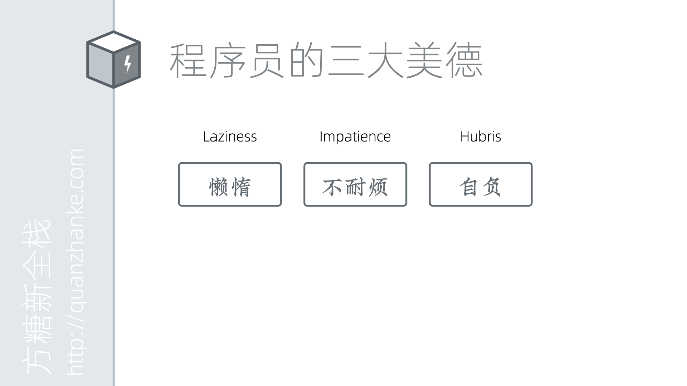
而程序员的三大美德是这样的：懒惰、不耐烦和自负。

这话是 Perl 语言的作者 Larry Wall 说的。他解释说。
懒惰让你花大力气去避免消耗过多的精力。所以你会写出节省体力的程序，同时让别人也能利用它们。为了少回答别人的问题，你也会写出完善的文档。
不耐烦是当你发现计算机在偷懒时的愤怒。它让你写的代码不但能解决当前的需求，还富有预见性。或者至少尝试着有预见性。
自负让你有信心编写或者维护出没有缺点的程序。

这些话得到了广泛的传播，原因可能在于它有一半是开玩笑的，而另一半却又过于真实。

软件行业之所以特殊，是因为它既不是和真正的人类做生意，也不是和完全没有智能的物品打交道。
机器不需要吃饭，也不需要休息，更不需要人权。只要接上电，它们就会小时的工作。
同时，机器又是有一定智能的。它们可以按照我们制定的规则，高效的进行重复劳动。

我经常开玩笑的说，程序员主要从事的是机器人养殖业。

每当发现一种需求，我们就生产一种机器人，然后让机器人去干活。
我们自己就又可以休息了。人类的本质是复读机，而机器能更好的进行重复。所以它们其实是更好的产业工人。
以前它们藏在电脑里工作，在人工智能和物联网起来以后，它们会慢慢的走到现实世界。这一点也会表现得更明显。

所以你看，软件思维的第一点就是，程序员本身并不直接工作，他们只生产和维护机器人，让机器人代替自己工作。

但是懒是无止境的。当需求多起来，程序员们就觉得，这个生产机器人也是挺累的啊。然后他们发现，要生产的机器人都有某种程度的类似。
于是他们生产了一堆机器人配件。这样要做新机器人的时候就不用从头开始做，只需要拼接几下就好了。

这就是软件思维的第二点，要尽可能重用，避免重复自己。也就是DRY，Don't Repeat Yourself 原则。

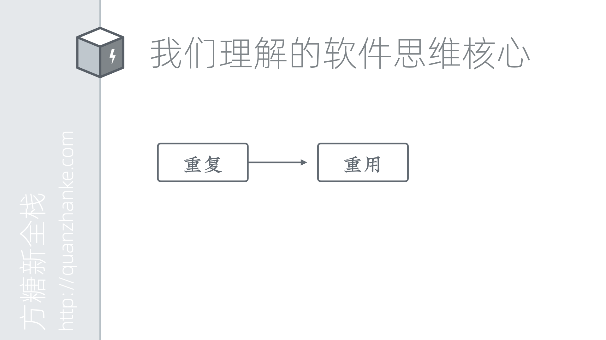
所以，软件思维的核心，就是一个从「重复」到「重用」的过程。
注意这是一个「过程」，而不是一个「结果」。它是从「具体」慢慢的走到「抽象」的。
还有很多同学既知道「重复」、也知道「重用」，但是就是没法从复杂一点的需求中抽象出规则和算法来。
这是因为他们想跳过前者，直接得到后者。这对于入门不久的同学来说，还是有难度的。

我们来看一个具体例子。用微信扫描图上的二维码，就可以动态的看到这个对话。

小方同学每隔十分钟就会问一次一加一的问题。这是重复。而小君老师从这个重复的过程中发现了规律，于是他在小方第三次问之前就给出了答案。

如果小方同学的智商和记忆力如此稳定，那么小君老师就可以开始让程序，也就是机器人出场了。
这个机器人每隔十分钟，就会给小方同学发送「2」这个消息。

这就是重复。重复是很脆弱的，它建立在需求从不变动的情况下。在现实世界中，需求总是会变动的。而且在互联网行业里，还有一个岗位专门负责修改需求，那个岗位叫做「产品经理」。

于是当小方同学有了成长，开始问二加二等于几时，我们之前的机器人就不够用了。我们需要做一个专门发送「4」的机器人。随着小方同学的问题越来越多，我们要做的机器人也越来越多。

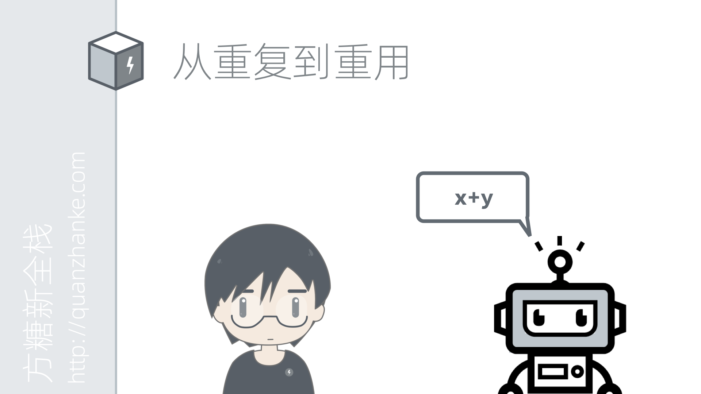
最后，我们终于忍不住了，为了偷懒，我们做了一个加法机器人。只要小方同学问的是加法问题，这个机器人都能处理。它会自己从问题中抽取加数、被加数，然后发送结果。它也不再定时发送，而是实时响应问题。这就是重用。

但是重用是没有尽头的。因为明天小方同学可能还会问乘法问题、四则运算问题、甚至物理问题。我们也需要根据需求的不断升级，不同的抽象出更高阶的规则。

做好了这些，每个程序员都能沉淀下来一些基础库、一些工具链，用来处理之前没有抽象到的新需求。

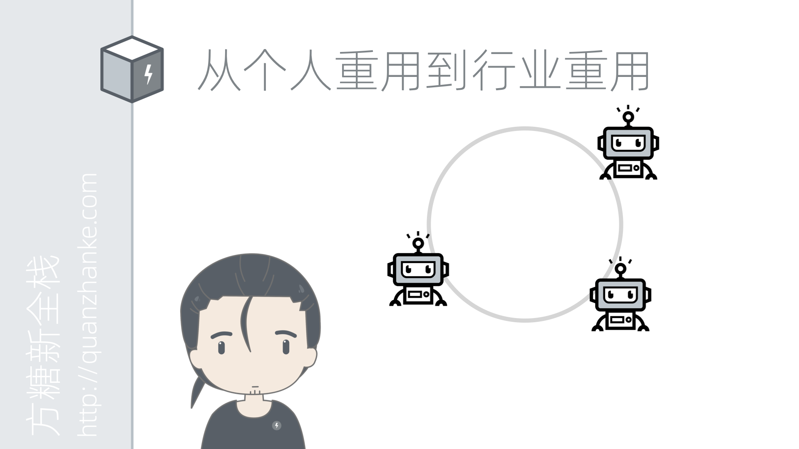
但是，再重复一遍，好的程序员是很懒的。所以他们把自己的代码，也就是前边我们说的机器人，放到的网络上分享给其他人。还发起了声势浩大、又影响深远的开源运动。我们几乎找不到第二个行业能如此开放、如此毫无保留和如此大规模的共享行业知识和成果。

正是得益于前辈们栽下的参天大树，今天的我们有了大量可以使用的、成熟的开源基础库。让我们可以在其基础上，更快的构建出更强大的应用程序。这才是真·祖师爷赏饭。

所以，并不是你拿着键盘开始写代码时才产生了软件思维。当你觉得自己工作太多，想要分出去的时候，你的软件思维已经萌芽。那些把工作分给别人的人，成为了企业家；把工作分给机器的人，成为了程序员；把工作分给其他程序员的人，成为了世界首富。

但不管你想成为哪种人，不停的进行从「重复」到「重用」的思维练习都会让你受益匪浅。

## 软件的分类

我们这节课来讲讲软件的分类，建立对整个软件开发的整体视角。

软件分类的方法有很多种，我们这里主要从运行模式上进行分类。
首先，我们把不需要网络就能完整运行的软件叫做单机软件。
把需要网络才能工作的软件叫做联机软件。
玩游戏的同学应该很清楚，这就是单机游戏和网络游戏的区别。

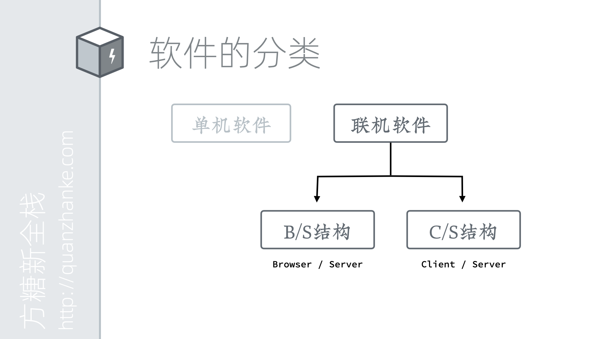
由于网络的大规模普及，我们现在使用的大部分软件都是联机软件。
联机软件又分为结构和 结构。
B代表的是Browser，也就是浏览器；C代表的是Client，也就是客户端。
一般来讲，B/S结构的联机软件就是我们常说的网站。
而C/S结构的软件就是电脑客户端和手机APP。
B/S和C/S模式最容易区别的特征是，B/S不需要额外安装，打开浏览器即可使用；而C/S需要先安装一个客户端才能使用。

不过，随着以微信小程序为代表的更轻的C/S结构的兴起、以及基于Web技术的客户端开发工具链的成熟，这两种模式之间的界线正变得越来越模糊。

我们电脑上的计算器是一个典型的单机软件，它不需要联网就可以很好的工作。

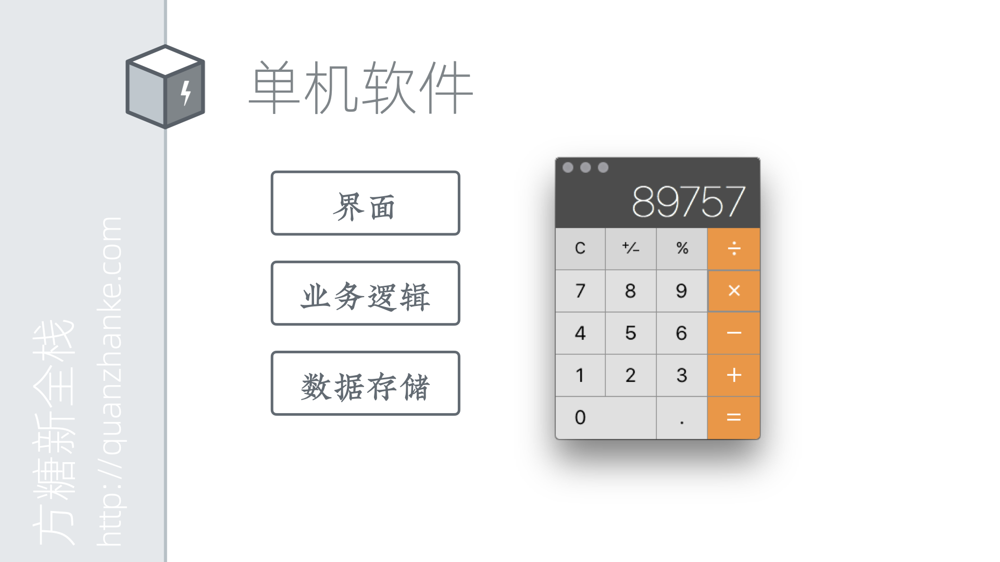
如果我们仔细观察，就会发现，单机软件通常包括界面、业务逻辑和数据存储三个部分。
界面用来获取用户输入的数据，可能是通过鼠标点击、也可能是使用键盘输入。
在移动设备上，语音和视频作为输入也很常见。
获取数据以后我们会调用业务逻辑来进行运算，以得到用户想要的最终数据。
而最终数据也是通过界面展示给用户的。

如果我们希望下次启动软件时，还能获得上次的数据，我们就需要在软件退出之前将数据存储下来。

于是，界面、业务逻辑和数据存储就构成了绝大部分软件的基本结构。

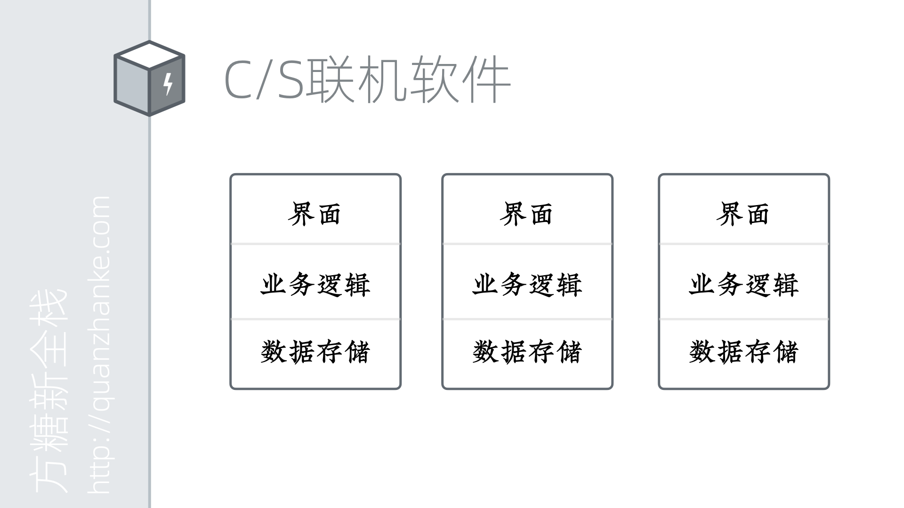
单机软件结构在单人单机使用时，是很OK的。
但是当一个用户需要在多台电脑上运行软件时，比如白天在公司的电脑办公，晚上在家里的电脑加班，就会遇到数据存储的问题。
因为每台电脑上存储的数据是不同的。只能用U盘拷来拷去。
我们就想，既然有了网络，那么能不能把数据存储放到网上去呢

于是就出现了C/S结构。它把数据存储放到了网络上，这样在不同的机器上就可以使用同一份数据了。
当然，「放到网络上」其实有很多实现方式，你可以所有的数据操作都实时从服务器上读写。也可以启动软件时从服务器上拉取数据、运行时读写本地数据、关闭软件时把数据上传到服务器。

但C/S软件用多了，大家又觉得每台机器都要来装个客户端挺麻烦的。能不能连客户端也不要装呢。于是基于浏览器的B/S结构就应运而生了。它把数据存储和业务逻辑都放到服务器上，原来的客户端用浏览器替代，通过HTML来构建界面。

在互联网早期这样就够用了。但随着需求的增加，我们发现光有界面还是不够用，还是需要一些前端逻辑的，比如把用户输入的日期转换下格式什么的。慢慢又发现有些临时数据可能需要存到浏览器里边，比如文章的草稿。这样保存文章正好遇到网络出问题，本地还能找出文章的备份来。于是前端逻辑和数据存储又被加回了浏览器里边。

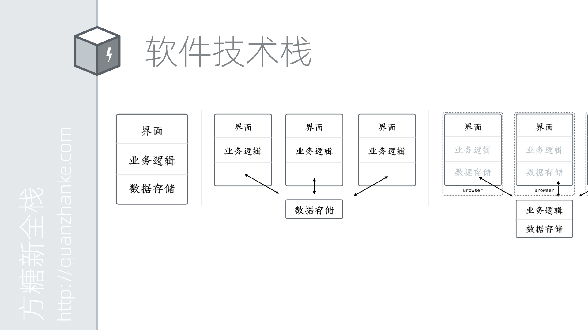
所以呢，绝大部分软件的架构也就是我们上边提到的单机、C/S结构和B/S结构这样三种。同时覆盖了这三种模式的技术栈，就可以开发出绝大多数的软件。但是这个技术栈并不简单。因为不同的系统、不同的结构需要的语言是不同的。我们来简单看一下。

我们之所以能在操作系统上构建出软件界面，主要是使用该系统支持的二进制文件格式调用了系统提供的API。所以本质上来讲，只要能编译出这些二进制文件，用什么语言开发都可以。但是现实中的软件往往更为复杂，还会涉及到各种库、组件重用、甚至硬件驱动的问题。

所以最优先的是使用该系统的主流语言来编写。Mac系统就是Object C和Swift。Windows系统就是。Java和写成的软件可以在多个系统运行，但是往往在性能和界面上会有一些不足。

这是电脑系统的情况。

如果要在手机上开发软件，我们需要至少兼顾 iOS 和 Android。iOS 依然采用苹果的Object C和Swift，Android主要使用Java和Kotlin。

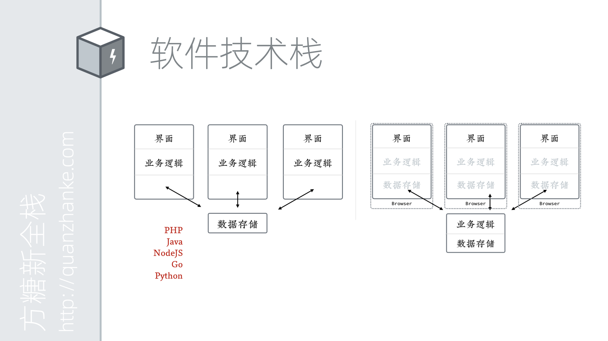
前边说的是单机软件的情况，联机软件因为多出来了服务器端，所以更为复杂一些。因为目前主流的商用服务器都是采用类Linux系统，所以主要用在开源社群流行的语言来编写，比如 PHP、Python、Java。最近两年 和Go增长也很快。

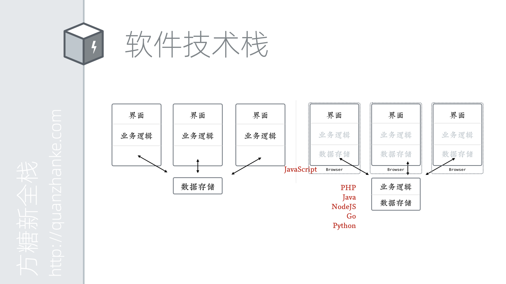
而在浏览器里边，我们主要通过JavaScript来编写前端逻辑。

说到这里，大家应该发现，要想覆盖常用软件的场景，至少需要学两门到三门语言。其中最有潜力的是 Java，因为它除了浏览器的前端逻辑，其他都能开发。

但如果我们先不看单机和C/S结构的Client部分的话，就会发现其实JavaScript也是全覆盖。因为NodeJS也是JavaScript。

你可能会问，为啥不看单机，这不是作弊么？这是因为我们的确有一种类似作弊的方法来解决这个问题，那就是混合应用。

这种应用的思路其实很简单，就是我们直接把浏览器打包成Client，这样B/S结构就变成C/S结构了。这种方法看起来简单粗暴，但随着电脑和手机性能的提升，越来越好用。

很多知名软件，比如微软的和网易云音乐的电脑版都是采用这种混合技术来做的。

所以按照这个思路，我们就可以使用「JavaScript/HTML/CSS加混合应用框架」这个单一技术栈覆盖掉绝大部分的软件开发需求。这个就是我们方糖全栈路线图选择的技术栈。

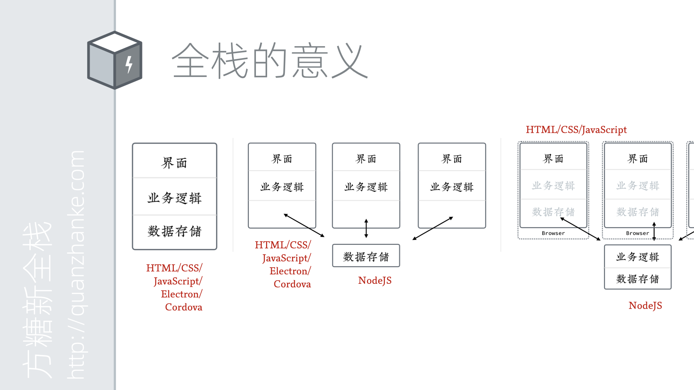
可能会有同学问，我有必要做这么多吗？大公司不是每个人只需要负责一小部分内容就够了？这个说法是没有错，但是很不划算。因为一旦你掌握了完整的技能，就可以独立生产出价值。假设每一部分的价值是1，那么五个部分组合起来的完整价值不是5，而是100。这就是零件和整机的价值差。当然，我也非常明白要同时学习前端、后端和客户端是非常大的工作量，但是通过我们精心设计的技术栈，只需要额外付出20%的投入，就能带来200%的回报，这简直太值了。

可能也有同学会疑惑，既然这个技术栈这么好，那么之前为什么没人学呢。这是因为使用Web技术构建客户端的时候，会有一定程度上的性能损失。最近几年大家电脑和手机的性能上来了，所以这些技术才真正变得实用。另一方面是，使用 JavaScript 技术栈的原生UI方案也得到了长足的发展。比如 React Native 和 Flutter ，它们可以开发出性能媲美原生应用的混合应用。

全栈带来了「完整价值」、「独立性」和「全局视角」，让你看得见大局，干得好小事。即使以后你在公司里只担任前端或者后端岗位，思考方式和视野也更为深远。所以呢，我是非常建议大家去学习全栈或者将自己现有的技术栈补充为全栈的。

