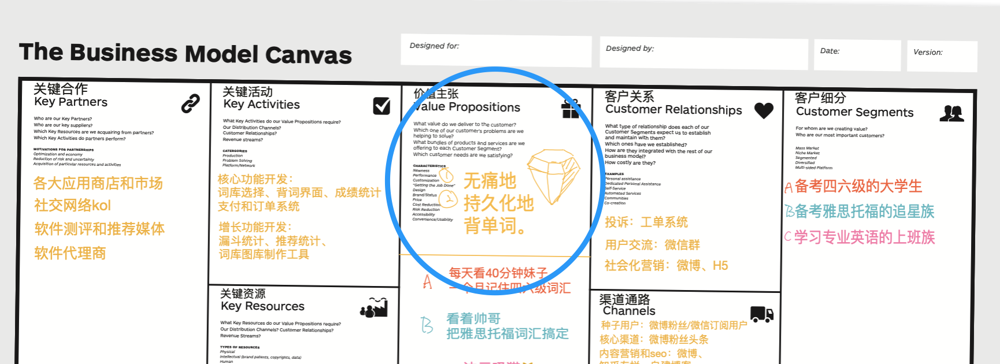
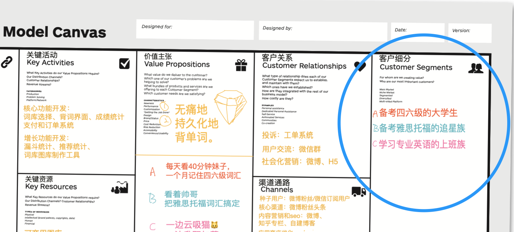
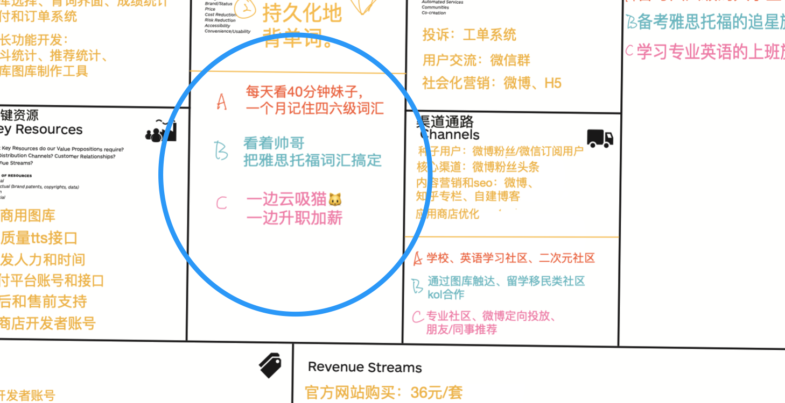
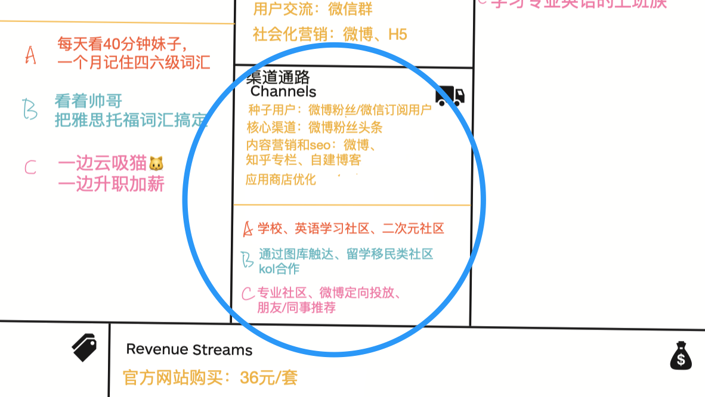
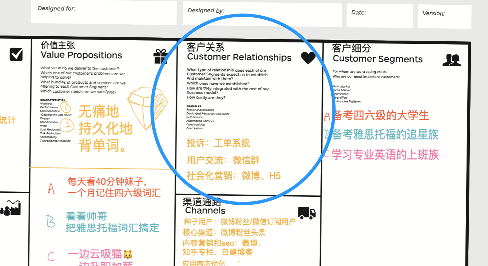
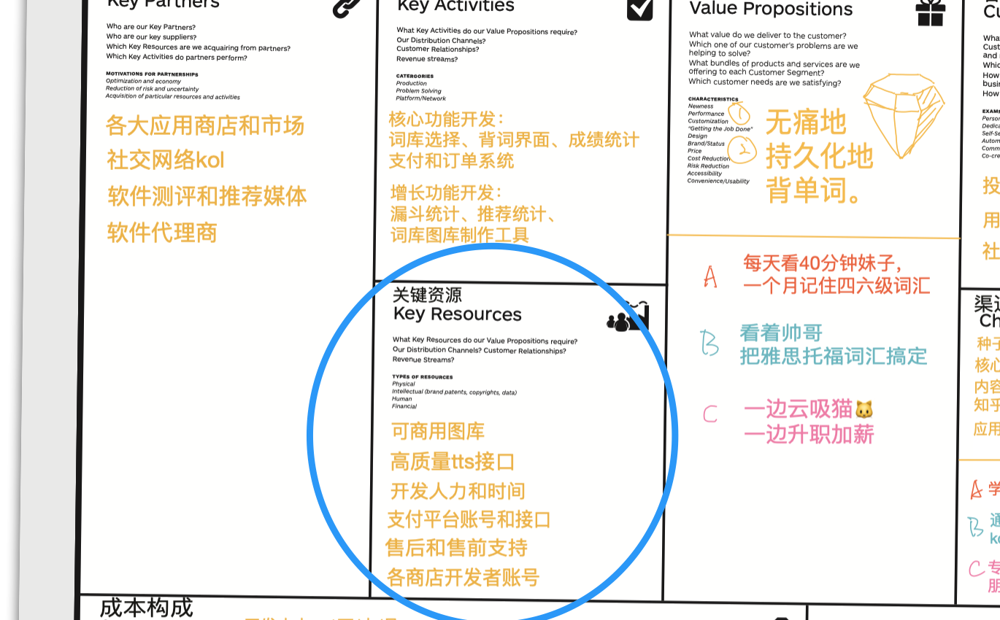

# 福利单词的商业模式画布

前边我们已经讲解过商业模式画布，今天我们就以「福利单词」为例，来看看怎么使用。

## 价值主张

  

首先来看一下价值主张。它的核心价值就是，让那些觉得学习起来很痛苦的人不那么痛苦，给一点糖，让其可以持续地、无痛地学习下去。它试图给学习过程添加一些乐趣来综合不是那么爱学习的人的痛苦，从而把一个短暂的、难以忍受的学习行为变成一个可以持续忍受、甚至通过习惯驱动可以持久化的行为。

所以我们在「价值主张」这一栏上写上两个关键字，一个叫「无痛学习」，一个叫「持久化的学习」，这是这个产品最核心的两个「价值主张」。

有了这个价值，我们就能帮助客户完成很多以前想学、但是因为各种原因没有办法学下去的东西，从而实现其个人成长和提升。

## 客户细分

  

如果要具体化价值主张，就要来看客户细分。

因为是单词学习软件，所以客户群体往往还是跟学习英文需求相关的。具体划分下来，我觉得可以分成三大类。

1. 第一类是在学校要考英语四级或者六级的大学生。
1. 第二类是有留学或者移民需求，需要考雅思、托福的群体。
1. 第三类是需要专业英语来提升自己在职场的业务能力的上班族。

前两类群体是要备考应试的，后一类则更注重实用能力的提升。从学习的内容上来讲，只是题库的不同。所以如果我们的软件支持了「词库切换」或者「自定义词库」功能，就可以比较容易地覆盖他们的学习需求了。

## 价值主张的细化

  

光是「有词库，你来背」这个主张和其他背单词软件并没有什么不同，所以我们需要在「价值主张」里再加上「糖」。

但是，对于不同的群体来讲，「糖」是不一样的。如果只是放一些二次元的萌妹子，只有喜欢动漫的人会觉得这是他们的「糖」，可以吸引着他们，每天都来看一看。对于其他一些二次元无感的人群来讲，这些图就毫无吸引力，于是我们需要增加「糖」的种类。

比方说有的妹子就喜欢看帅哥、有的粉丝就喜欢看偶像、有的铲屎官就喜欢看猫猫狗狗、有的吃货就喜欢看肉和甜点。这一部分，我们可以用多图库的方式来满足。

于是，针对不同的客户细分，我们提出三个更为细化的价值主张：

1. 「每天看40分钟妹子，一个月记住四六级词汇」
2. 「看着帅哥，把雅思托福词汇搞定」
3. 「一边云吸猫一边升职加薪」

现在听起来是不是就有吸引力多了？

## 渠道通路

  

在「渠道通路」的这个方格里面呢，我们的种子用户主要由微博带过来的流量构成。

通过种子用户进行测试，一旦转化率达标，我们就可以开始对外去做一些合作，以及以微博为起点投放广告，观察广告投放的成本和其带来的流量的关系，以此判断下一步操作。

## 客户关系

  

在「客户关系」这里，我们会通过腾讯提供的「兔小巢」这个产品来提供售后支持。它是类似于反馈板的免费工具。用户在上面提交问题，我们会收到微信或者QQ的通知，可以通过网页在电脑上或者手机上进行答复。

## 关键活动

  

接下来我们来看一下「关键活动」。

用来验证需求的最小可行产品（MVP），是一个简单网页，只包含 100 个单词、100 张图片和简单的输入文字切换图片功能即可。我们还需要一个统计数据，看看每一个访客到底背了多少个单词。这关系到我们价值主张里的「无痛」和「持久」。

当这个价值被验证后，就可以进入第一期开发。

虽然是一个全平台应用，我们第一期却只做网页版。具体业务包括：背单词的界面，以及选择词库的界面。这是最核心的业务功能。如果我们第一期想要有收入，那么就需要支付和订单系统。

为了对转化过程进行分析、更好地挣钱，我们还需要开发一个2A3R漏斗的统计，让用户从获客层顺利滑入付费层。如果需要通过分享裂变获取更多流量，我们也需要统计发起分享的用户数据。如果要允许用户自定义词库，我们就要提供对应的制作工具。

以上这些，构成了我们的关键活动。关键活动可以采用不同颜色的文字来标记不同的分期，也可以一期一期追加。

## 关键资源

  

在关键资源上，除了需要具备人、钱和时间以外，我们这个项目还有特有的资源需要考虑，那就是背单词所用的图片，这是一个非常值得注意的问题。

在最小可用产品中，因为不涉及到收费，我们可以使用的图片很多。一旦开始收费，如果还是不加识别地从网上下载各种版权不明的图片，放到自己软件里并以收费的方式进行售卖，很可能会出现侵权。

所以，我们就需要思考图片资源的解决方案。粗略分析后，有以下几种思路：

1. 作者授权
1. 换用无版权图片
1. 用户自行提供图片

### 作者授权

直接找作者把图片买下来，然后作为付费词库卖给用户，这是最直接的方式。但有问题，那就是价格，光是大一点的词库就有超过一万个单词，也就是说我们要买一万多张图。如果按一张图 50 元计算，需要 50 万的投入。

在一分钱都还没挣之前就做出这么大的投入，风险还是很高的。这种方式更适合我们挣到钱以后，在扩大规模时使用。

### 换用无版权图片

当然，我们也可以寻找无版权的图片来做图库。这样即使我们打包在软件里进行商业销售也不会有任何问题。互联网上已经有比较庞大的无版权高清图库了，比如 [Unsplash](https://unsplash.com/) 等。不过这些图库主要是风景和动物，人物类非常少。

### 用户自行提供图片

本质而言，我们卖的是「看图背词」的工具，而不是图片本身。现在之所以在版权上有风险，是因为打包导致的。所以我们可以尝试着将付费的服务和免费的图片分离开。

比如我们可以给用户提供自定义图库的制作工具，让他们把自己收藏的图片导入进去。这样既能达到目的，又没有版权上的风险。

类似需要考虑的，还有背单词时用到的音频。最简单粗暴的方式是使用云平台的TTS（文字转语音）接口直接生成。

## 成本收益

  

在填好这几个格子以后，我们就可以开始对成本和收益进行相应的预估，算出预期利润区间。

由于我们开发的项目相对比较小，用到的资源也不是特别的多，所以商业模式画布做得还不算细致。不过通常来讲，第一版的商业模式，画布本身也不会特别细。它是随着项目的进展不断被细化的。

最后我们来看看完整的商业模式画布：

  
