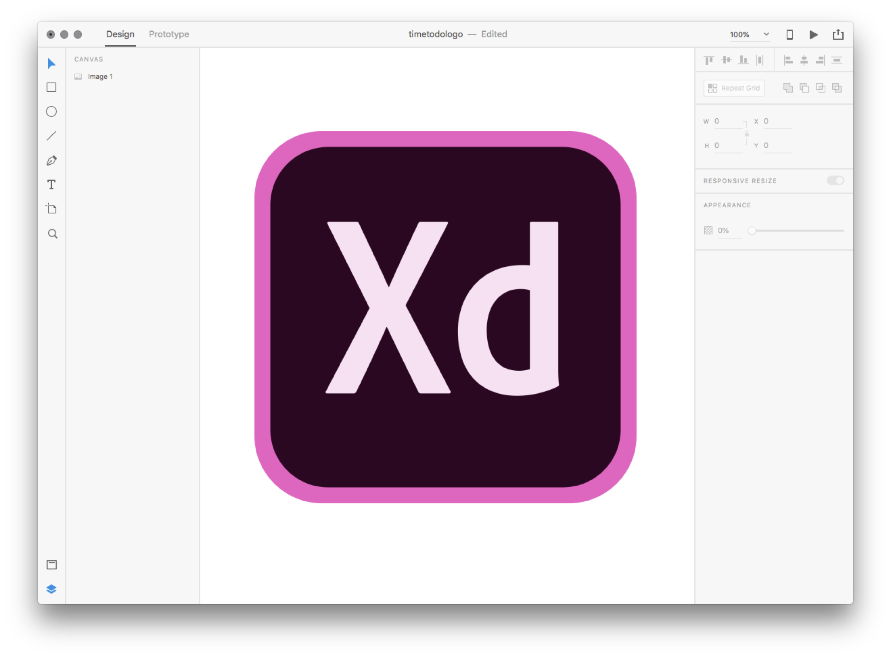
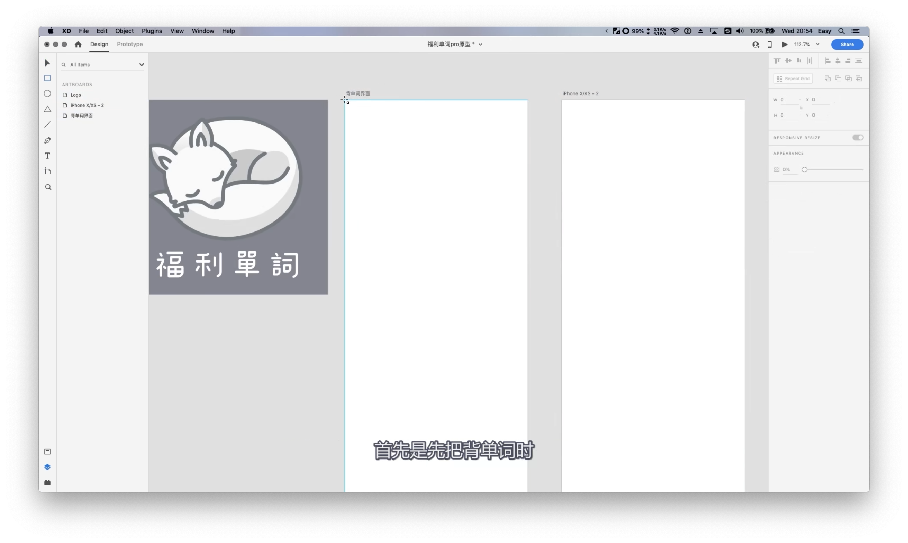
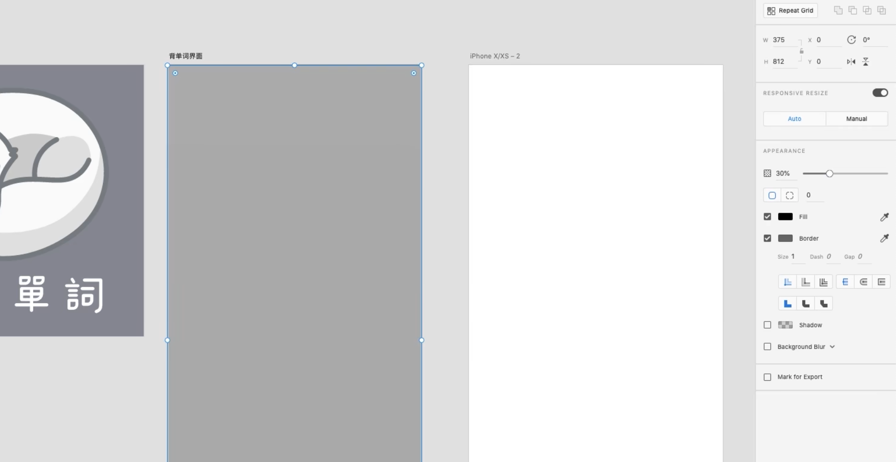
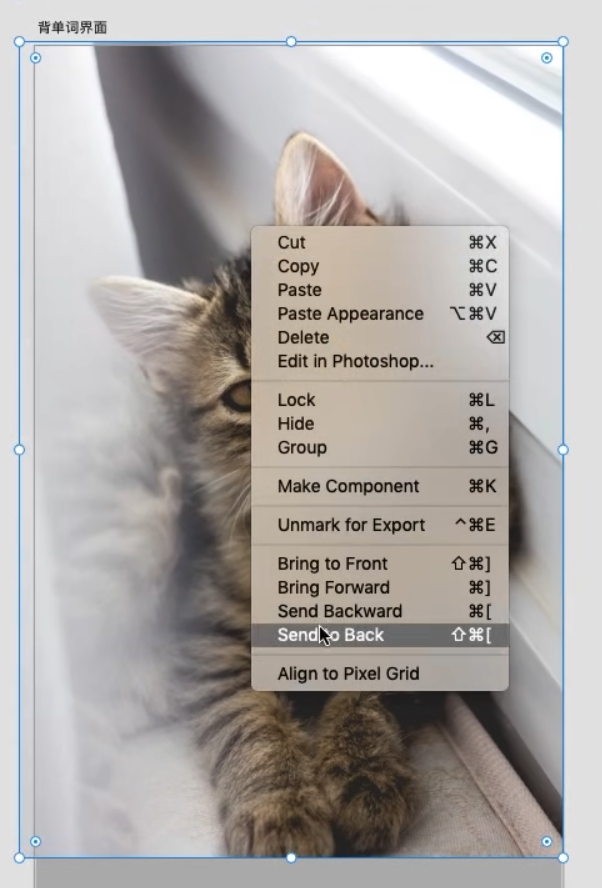
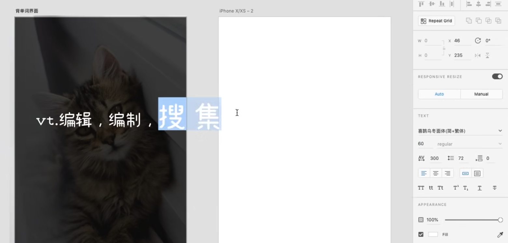
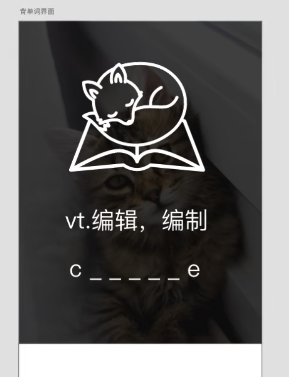
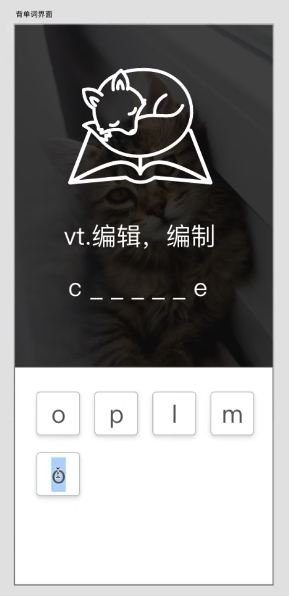
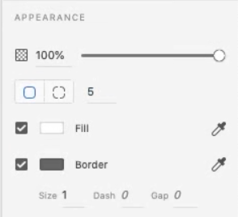
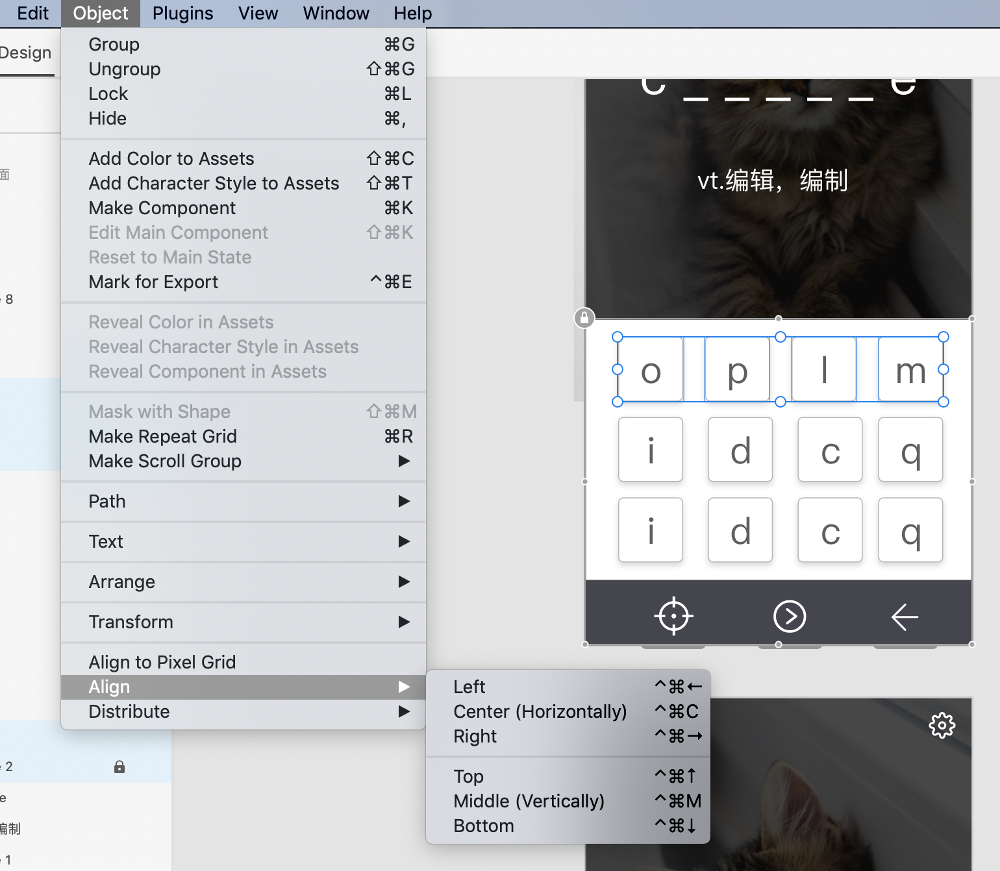
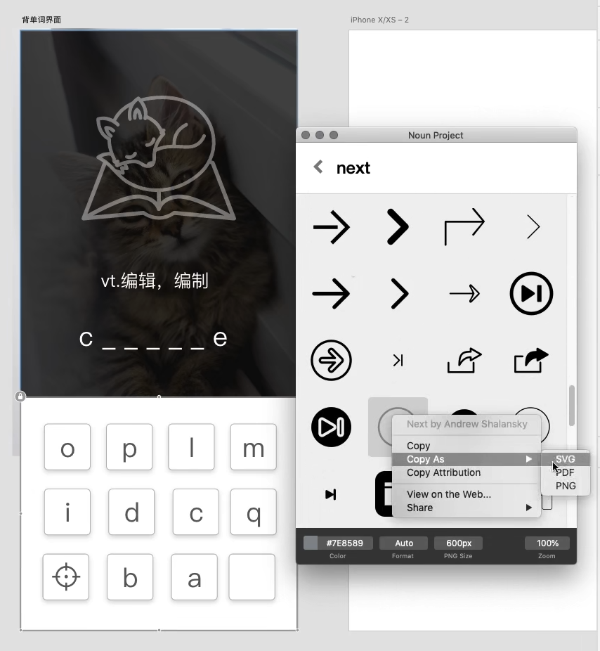

# 使用AdobeXd设计界面

## 什么是 Adobe XD

  

Adobe XD是由 Adobe 开发的矢量设计工具，它和 Sketch 类似，既可以用来绘制矢量界面，又包含原型设计功能，还可以在手机上预览设计好的界面。XD 支持 Windows 和 Mac，是 Adobe 为数不多的可以免费使用的软件（当然你可以付费升级 pro 版本）。

> 最近因为 Adobe 收购了 Figma，可能投入到 XD 的资源会调整，不过暂时还能用。如果你想避免这种因为商业收购导致的工具不可用，可以考虑使用 Penpot，它是一个开源的矢量工具。

## 使用 Adobe XD 设计简单界面

软件的使用主要还是靠大家勤学多练，这里我们和大家粗略介绍下如何用它来设计背单词界面。

### 理解画板

首先，我们在 XD 里新建一个画板（art board）。

画板是什么？它相当于 Word 里边的页面。一般的纯设计工具没有画板这个概念，但 XD 也包含了原型功能，有时候我们需要在多个界面之间来回切换，而一个画板往往就是一个界面。

点击左侧的菜单里面倒数第2个画板的按钮   
 ，这时候在屏幕最右边就会出来一系列预置的画板尺寸。

  

它已经帮我们准备好了常用的规格，比如苹果的iPhone、iPad，谷歌的安卓机型，以及网页常见的尺寸。

我们只要从里边选择对应的尺寸就好了，当然也可以不选择它给你预置的，直接手工拖拽来画或者在属性里面调整画板的宽和高。那我们就新建一个iPhone Xs尺寸的画板好了。

然后按住 CTRL或者CMD + D，就可以直接复制画板。我们把第一个画板叫做背单词界面，然后开始设计。

  

### 遮罩的制作

先来制作背单词时，字母没有输入完时显示的遮罩效果。选择左侧工具栏中的矩形   
工具，画出一个覆盖全部画板的长方形。然后调节填充颜色为黑色，透明度为 30%。

  

然后我们到 unsplash.com 这个无版权网站上，找一只猫的图片，把它也放进来。

  

这时候猫是在遮罩上方的，所以它挡住了遮罩。

  

点击右键，选择「Send to back」将它放到遮罩后，我们就可以看到被半透明遮罩挡住的猫了。

### 单词释义和输入框 

接下来，在遮罩上边，我们来放上单词释义和输入框。点击最左侧工具栏中的   
图标，切换到文字工具。

然后输入文字释义。

  

在右侧的属性面板里，我们可以调节文字的字体、大小、颜色和对齐。

然后我们放上之前设计好的 Logo，加上单词输入框。

  

注意这个输入框不一定非要是「框」，比如我们这里也可以把它做成下划线。

### 虚拟键盘

  

虚拟键盘的制作在 XD 中也很简单，直接用矩形工具绘制就行。需要注意的是圆角的做法。

  

其实很简单，在右侧的属性设置里边，把圆角从0 改为 5 就可以了。在做好一个按钮后，我们可以按住 Shift 同时选中按钮和上边的文字，在右键菜单中将其编组（Group）；然后按 CTRL或者CMD + D 就可以复制按钮。

  

当按钮多起来之后，要对齐它们还挺费事的。其实选中多个按钮后，可以在菜单 Object → Align 中来自动对齐；也可以在 Object → Distribute 中让它们自动均匀分布。

### 矢量图标

再下来，我们需要在界面中引入图标。既然是矢量界面，当然是矢量图标最好。前边我们已经介绍过 thenounproject.com 了，它还为 pro 用户提供了一个客户端。在这个客户端里边可以非常方便的复制图标。

  

当我们通过关键字搜索到图标后，可以通过下载并将其拖拽到 XD 的方式引入；也可以直接在客户端中右键选择 Copy as SVG，然后直接粘贴。因为是 SVG 格式，调整完大小后可以很方便地更换颜色。

最后我们再微调一下输入框和单词释义的位置，背单词界面就做完了。其他界面的制作非常类似，就不在这里累述了。