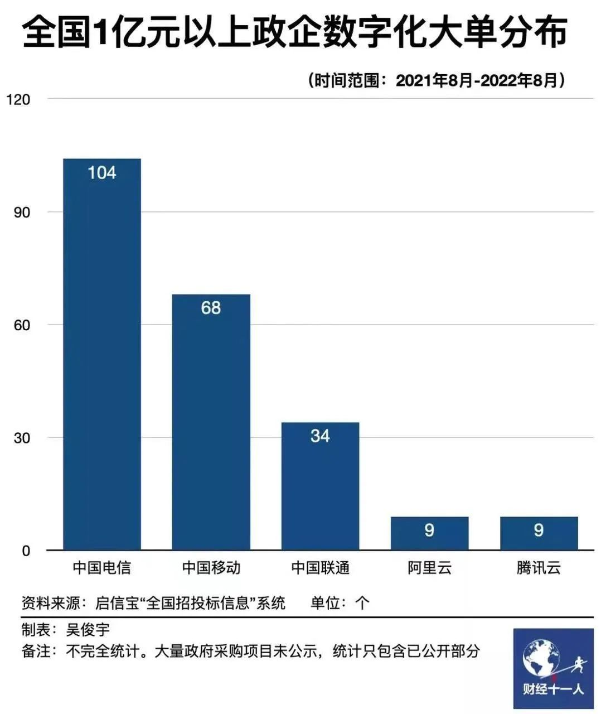
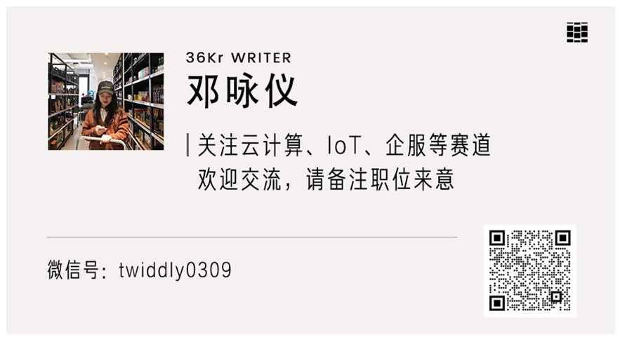
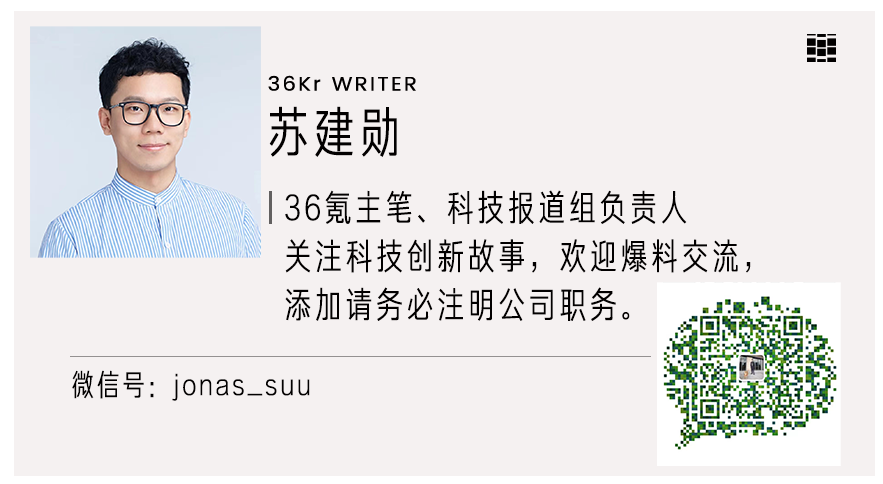

 这三年，阿里云在政企市场跌跌撞撞、如莽撞少年。少年何时长大？  

  

文｜邓咏仪

编辑｜杨轩 苏建勋

来源｜36氪pro（ID：krkrpro）

封面来源｜ 视觉中国

“看邮件了吗？！”2022年倒数第二个工作日，阿里云空荡荡的办公室传来一声大喊。

事情太过突然。阿里集团一号位张勇（逍遥子）发出全员邮件，虽然宣布的是每年例行的组织架构调整，但此次，雷声雨点，俱在阿里云：阿里云总裁张建锋（行癫）卸任——行癫是阿里声名赫赫的合伙人。

更罕见的是，阿里集团一号位张勇（逍遥子）亲自披甲挂帅，兼任阿里云CEO一职。一位接近阿里云高层的人士对36氪表示，“知道要换人，但真没想到是老逍（逍遥子）亲自带。”

“该变了，阿里云再等下去，就要垮了。”有前阿里云员工以激烈口吻，如此评价。

对于此次调整原因，多位业内人士对36氪分析，这与半月前阿里云香港地区发生的宕机重大事故相关。但这充其量只是一个导火索，当前阿里云所遇到的增长难关——尤其体现在越来越重要，却总显得跌跌撞撞、不得要领的政企市场——需要一场彻底的变革。

阿里云到底怎么了？

失意这三年

2022年夏，一位阿里云8年老员工在临“被毕业”前，发出一篇万字长帖谏言，在阿里云内外激起轩然大波。

句句灵魂拷问，剥开阿里云过去失意三年中，使人难以释怀的桩桩件件。

“《出师表》既视感。”阿里云人在帖子下如此评价，“少年阿里人”、“拳拳赤子心”。

“阿里云发展遇到瓶颈了吗？”帖子一开篇，就直击痛点。

瓶颈是显而易见的。

2018年末，行癫接手一路高歌猛进的阿里云，信心满满——内有已牢牢占据第一的公有云市场，外有广袤的政企市场尚未开拓、待其驰骋——遂定下三年年营收过千亿元的目标。

而事不遂人愿，原以为手到擒来的新市场，却险阻重重。虽然宣称近一个财年收入破千亿，“不过是把阿里集团的用量加上去，对三年前的目标有个交代而已。”一位阿里云销售对36氪表示。

2022财年，阿里云的营收目标（不含阿里集团服务）一降再降，最终只完成了约745亿元。

“我们的销售组织形态适合当今市场吗？”贴中再问。答案显然是否定的。

在激战最酣的政府、央国企战场，销售们过去四年里接连丢单。华为、腾讯、百度近几年陆续杀入，华为尤其凶猛。一位阿里云销售对36氪表示，去年他手上几个政府客户，单子都快谈好了，客户转头就给了华为云。阿里云内部，甚至出现了“逢华（为）必败”的说法。

“阿里云还是一家高科技公司吗？”贴中又问。

这个问题最为扎心。

“高科技”，本是阿里云人最引以为傲的关键词。

在中国云计算荒漠一片时，阿里云完成了近乎不可能的任务：从零开始，自研云计算操作系统——难度相当于自建一个云上的Windows系统。

在淘宝业务爆炸式增长、计算资源濒临耗尽的最后关头，阿里云的“飞天系统”扛住压力，最后真的替换掉了三大基础软件“IOE”（IBM、Oracle、EMC）。

啃下硬骨头的阿里云，碰上移动互联网爆发，吃尽红利。从2015年-2019年，阿里云年营收从30亿元飞涨至400亿元，“市场份额是第2-9名之和”一度被写进其广告语中。

近几年，即便把各种不够“高科技”的业务——短信、硬件——打包一起卖给大客户，销售想尽办法计入收入、不惜动作变形，也难达到“千亿”目标。

高科技还是高科技，但技术带来的增长无法达成千亿目标也是事实。

由于新市场开拓不力，最近几年，阿里云增速从2018年的超过80%，此后一路跌至最新季度的不足4%，创历史最低点。

 图说：数据源于阿里财报，由36氪制图

2021年前，阿里云连续六年拿了集团最高绩效“3.75”分；到2021年，阿里云被打了“3.5-”分。

在阿里，这仅比最差的打分高一档。当时业内一度传言，行癫可能卸任。最终，主管销售的阿里云中国区总裁任庚提出辞职。

自豪与失落，是阿里云人交替翻涌的心绪。

在内网，一位阿里云老员工怀念起一句话——“不是任何一朵云都能撑住阿里双十一的流量。中国有两朵云，一朵是阿里云，一朵叫其他云。”

这番豪情壮志，过去几年间已经少有人提起。而阿里云，也正在走入一个越来越陌生的时代。

陌生新时代

阿里云架构师田秋依旧记得三年前的情景。“每天耳边传来的，都是‘喜报’：营收今年又轻轻松松翻倍了，IDC又给阿里云颁了个奖。”他对36氪回忆道。

杭州的办公室又小又破，但穿上那件印着飞天代码的文化衫，田秋感到很骄傲。

好时代的滋味，让人实在难忘。阿里云销售周芳经历过这种目眩神迷的增长，他的一个游戏客户，第一个月的云用量消费不过百万元，下一个月做出了爆款游戏，云支出一下翻了10倍。“像中奖一样，基本就是躺着赚钱。”他对36氪追忆。

所以，听到新总裁行癫宣布三年营收千亿的挑战性目标，虽然只是一个“小兵”，但田秋心想，这有什么不可实现的呢？

但隐忧已经出现。

“互联网世界的用电量涨不动了。”周芳发现，从2017年开始，客户底层云用量就是不太增长了。

他隐约感到，互联网这波浪潮就要过去，这个发现甚至比王兴喊出“互联网下半场”更早。“就像工厂业务有多大，就会用多少电，云的用量永远都骗不了人。”

据赛迪咨询数据，2020年中国云计算市场，互联网行业的贡献度，相比2018年少了16%。

底层世界的逻辑，以及钱，都在走向政府和央企、国企的那一端。

政府项目动辄数千万到过亿，客单价比任何一个细分行业都高。更重要的是，这个市场在不断增大——2018年，中国信通研究院曾预测，2021年的国内云计算市场中，仅政务云一个细分领域，占比就会超过40%。

图说：垂直行业云市场规模，大约2倍于互联网市场。来源：前瞻产业研究院

踏出舒适圈、进入政企市场，势在必行。

行癫“三年千亿”的超高增长目标——2019财年阿里云营收247亿，意味三年涨近5倍——成败关键就在于拿下全属增量的政企市场。

行癫技术出身，带销售非他所长，但立刻在销售一侧提拔大将：委任华为出身的任庚为中国区总裁，位列四大销售高管之一——华为做政企市场起家，堪称To B市场的“黄埔军校”。

在政企销售第一线，许多IBM、甲骨文、华为的销售被阿里云的光环吸引，都在2018年前后纷纷跳槽到阿里云。

许宏就是其中之一，“阿里云那时红红火火的，总得转一圈看看吧。”

最初，整个市场都对阿里云很买单，许宏的日子很舒心。比如，阿里云拿下了不少一线城市的“城市大脑”等项目，连“12306”“春晚”这种大项目都拿下了，“客户认阿里的牌子。”

据36氪了解，2018年时，阿里云来自非互联网客户的收入占比约两成左右。

而在云市场领跑数年，阿里云人甚至有种“无所不能”的感觉。

一位阿里云多年的服务商告诉36氪，阿里云人大都对自己的产品和技术非常骄傲。他的一位朋友在地方政府，曾对他吐槽：“阿里派个P8过来和政府谈合作，看着像来视察工作，指着我们的系统说，这不如阿里，那不如阿里。”

但在政企客户面前展露骄傲，却可能付出代价。

当许宏听说，一位阿里云高层公开表达了类似“阿里最牛，谁不选阿里有问题”的观点时，他心中警铃大作：对大客户说话这么狂，好吗？

不详预感很快变成现实。

影响是潜移默化的。许宏上个月谈得差不多的项目，下个月客户会突然变卦。一些战略级客户甚至决定走向多云策略，“技术上避免被阿里云特色产品绑定”。这些大客户原本全都只用阿里云，但现在要分成好几个厂商采购，阿里云能分到的蛋糕势必缩小。

另一侧，政企市场的炮火已经打响，腾讯百度华为云业务成长速度极快——尤其是华为云。华为2017年成立Cloud BU，宣布“三年进入世界前五”的目标。

华为云还大挖阿里云的技术人才，架构师田秋就接到过好几次猎头电话，猎头单刀直入：“三倍工资，在阿里云做什么，过来做一样的就可以。”

这已经不是阿里云一骑绝尘、四下全无对手的时代。

当简洁明了，遇到复杂庞大

阿里云销售周芳刚从运营商跳到阿里云时，觉得有些格格不入。

周芳觉得，那些做互联网客户的销售都是些“小年轻”，虽然“每年轻轻松松做几千万的大有人在”，最意气风发，但“远谈不上有销售能力和技巧”：客户自己就能在官网自助买云，他们就是坐在办公室里，偶尔电话关怀一下大客户就好。

而“互联网小年轻”们，对周芳密集拜访客户的行为也很不解：这显得如此低效、没有必要。

本质上，这源于互联网市场和政企市场的巨大不同。

互联网行业对云很“刚需”，因为他们对算力需求是弹性的——到了大促等业务高峰，算力必须扛得住；闲时又能减下来省钱。公有云卖起来也很简单，如同标准化的水电，随买随用。

但给政企客户卖云并不简单。他们对云既不刚需，也不追求技术领先。

“比如机场，根本没有多少互联网要素，或是弹性计算的需要，自己机房跑跑系统够用了，还不允许数据跑出去（上公有云）。”一位航空业IT人士对36氪解释，客户需要的是你深入理解行业，做针对性的软件定制开发。

政企市场要的是“堆人头”提供定制服务。这全然不在阿里云的舒适圈，却是华为等传统厂商的强项。

一次，周芳和同事去客户现场做前期POC（原型测试），看到华为云拉了三十个人过来，气势就压倒众人。“我们才三个人，你想象下客户的感受。”周芳只能硬着头皮强调自家的技术有多成熟，但最后还是以华为中标告终。

做惯了互联网生意、还要顾及财报表现的阿里，注定不可能做到这样的巨量投入。

而华为服务政府、运营商等大企业数十年，已经建立起了一套完全和中国大客户精准耦合的组织体系。

一位华为云早期员工告诉36氪，华为内部甚至有专门的“组织部”，为了一个大型客户，能专门成立一个数十人甚至百人的公司，工作就是把客户上下架构、业务情况摸得清清楚楚，每个项目环节都有成熟打法指导。

更可怕的是，华为有办法摊薄获客成本。一位华为云员工对36氪表示，在华为，每个政府或部委都有专门的接口人，长期对接一个客户。“就算项目因为产品或者价格丢了，没关系，聊其他项目。华为还有那么多其他IT产品，总有项目给我的。”

政企项目都是复杂工程，需要跟业界伙伴组团打单。但在与业界伙伴的关系上，阿里云也与华为不在一个水平线上。

2019年，许宏参与到某政府标杆项目中，阿里、腾讯、华为、百度齐聚一堂，摩拳擦掌。

许宏最忌惮华为，决定亏本也要拿下。他找好硬件厂商和服务商，把投标价格往下压了近20% —— 一个十拿九稳能中标的地板价。

最终投标，要由有资质的集成商来——相当于“包工头”。许宏没有想到的是，谈好的三个集成商都临阵倒戈——其中两个转投向友商阵营；还有一个大集成商A，给出的价格甚至比底线价还贵了。

第二天开标，华为以微弱价格优势取胜。

许宏愤怒透顶，去质问集成商A，得到的答案是，A怕和阿里一起用低价中标，“赢了项目也没有合理利润，还得罪整个行业”。

“我们太高估自己了。”他狠狠明白一个道理：阿里云在政企市场没有朋友。

在他看来，阿里云的逻辑还是跟To C业务一样——补贴、压价、烧钱、抢市场，但这不是政企市场常态。

“厂商都知道，和阿里合作赚不到钱，跟阿里合作就要亏钱投入。”许宏曾经介绍过一位朋友，和阿里云谈合作，对方上来就问：“你们准备投入多少，能亏几年？”朋友没讲几句就把电话挂断，觉得匪夷所思。

而华为云从成立开始，就喊出要做“黑土地”，意思是让利合作伙伴，让其在华为云上生长。

一个对比是，2020年，通过生态伙伴分销出去的收入，占华为云收入的60%。而在2022财年，阿里云的这一数字仅占25%。

对客户贴身服务、跟伙伴合纵连横的华为模式，更适应政企市场。“政企市场项目经常是这样的：阿里云的销售运作100个项目，华为能抢50个；但华为自己孵化100个，能成99个。”许宏打了个比方。

新旧冲撞，惯性巨大

每个组织都有惯性。越是成功的组织，惯性越是强大。

许宏入职被阿里云的周会文化震惊：时任掌门人孙权（胡晓明）带着各个销售部门，高喊“杀杀杀”。每个队伍都要想出自己的口号，喊得不够大声还要重来几遍，还有队伍叫“战狼团”。看到此情此景，许宏的心情却是：“这是幼儿园吗？”

“不知道为什么搞得这么幼稚，真的。”许宏在大企业工作多年，从没见过这样的管理方式。“互联网搞地推可能是信这套，但政企市场的老兵谁能受得了。”

但那时“杀杀杀”的口号简单直接，对业务很奏效。对很多阿里云老人而言，这甚至是最美好的记忆，这代表着阿里云的黄金时代。

阿里云的内部组织架构相当扁平，内部对此是自豪的——当时的阿里云一号位孙权在内部有一句名言：阿里云是“一片乱哄哄的欣欣向荣”。

当有人试图扭转这种惯性时，可能遭遇旧人的强烈不满和冲撞。

2022财年内部述职会上，原阿里云中国区销售总裁任庚遇到一个尖锐问题：“现在阿里云国内对你的评价很负面，你的很多管理方法也是非常不人性化的，你怎么看？”

任庚引入了诸如“红蓝对抗大练兵”、打卡等华为管理方法，并大刀阔斧调整组织架构——此后阿里云销售队伍几乎每年一次大调整，长期处于动荡之中。但同时，业绩不见起色，这让许多老人心生不满。

“最搞笑的是让销售打卡。以前不打卡，我业绩不也照样有吗？”一位阿里云老员工说。除了打卡，在外面奔忙一天后，他晚上还要赶回公司开会学习，观看高层讲话视频。“这些管理方法毫无价值。”

从高层意志上，阿里云展示出学习华为的坚定决心：2022年3月，原华为企业BG中国区总裁蔡英华加入阿里云，统管销售业务，原本的四大销售负责人都向他汇报。而一度辞职的任庚，又被挽留回阿里云。

私下，却有老员工调侃，阿里云这么处处学华为，不如改名“华为阿里云分部”。

要转变思维惯性、行为习惯，已经很难。

做政企客户前期，有些阿里云员工甚至都不理解，为什么国企客户动不动就喊人过去讲方案，写报告。“在阿里，谁有时间给你写报告，那不是你自己的事吗？”一位前阿里云销售告诉36氪。

许宏总是和内部产品、技术同学吵得不可开交。他不理解，自己在前方打下大客户，后方怎么却总是没有足够支持？怎么还得求着产品和架构师去客户那讲产品和方案？

“阿里云的文化还是比较纯粹的。”一位前阿里云员工对36氪描述，云的很多技术员工都是归国工程师。他在职时，无论领导还是业务方，从上到下都不爱社交。一位领导连团建都不组织吃饭，宁愿买票让员工自己去看电影。这难免缺了些和客户“打成一片”的气质。

一些老流程，也不再适合新情况。

早期，阿里云在公有云市场里没有对手，是个强势乙方。周芳回忆，中小型客户要用云，只能去阿里云官网生成线上合同。“客户说内部流程跑不通，要线下合同，找我们帮忙，那和我们没关系，让客户自己改内部规则去。”

考核机制上，直到现在，阿里云销售还是沿用每季度考核一次销售额的做法——但大客户成单周期动辄以年计算，销售如果做大客户，可能在季度考核时业绩会很难看。这导致，去年阿里云甚至出现过Super级大客户，在内部没有销售愿意跟进的情况。

如果冲突涉及阿里最核心的价值观，阿里云该如何自处？

廉洁就是阿里价值观的一条红线。以招待为例，阿里云的规定是一顿饭人均200元，内网常有请客超标通报批评的公告。

但在许宏看来，做政企市场，吃饭招待太难避免了。“阿里云老是把我们当电商小二一样在管理。”许宏对36氪抱怨。

对比华为，阿里云销售既羡慕也苦涩。“华为送自家出品的手机、配件，给客户领导、项目接口人试用体验一下，很正常吧。我们呢？经过申请审批的200元以下礼品，可能连高档一点儿的淘公仔都买不到吧。”阿里内网里，一位员工说。

另一位离职的阿里云销售对36氪表示，请国企领导吃饭，开瓶好酒可能就得上千了。他只能每月都用自己的工资补贴，直到再也补贴不下去，最后选择跳槽去华为云。

但阿里以强调价值观著称。2016年，几位程序员因写代码抢月饼被开除；2020年，钉钉对一名P9员工代考做扣除年终奖和股票处罚，引发大讨论……这样的事例不胜枚举。

面对极度传统、复杂的政企市场，阿里云还能“很傻很天真”吗？

2022年，在一个3.9亿元部委大单中，华为云中标后，阿里云把甲方告了。

这无疑是彻底和客户闹掰了。在公众号“云头条”里，一位从业者在这则新闻下方评论：“这哪止是头铁，简直是突破天际”。一位华为云员工转发了这则新闻，评论道：“你这么调皮，谁还敢和你玩啊。”

阿里云莽撞、幼稚到甚至有一点可怜。

迷失在千亿目标下

在政企市场中节节失利，但头顶上又高悬着千亿目标，阿里云人怎么办？

上任后，行癫曾力推“被集成”战略——“被集成”是往后退，只卖自己的产品。这样简单、雷少，拿到手都是扎扎实实的收入。

但事与愿违，实际情况正好相反。2020年-2021年间，“集成”模式反而在阿里达到一个顶峰——在项目里往前冲，做“包工头”，除了自己的部分，还要大包大揽、统筹整个项目。

有些销售连项目现场的桌椅板凳，都想算进项目里。周芳表示：“一千万的单子，自研产品比例只要到15%，PM（项目管理）就能给立项。”毕竟，营收目标如同高悬在所有人头上的剑，大家只能睁一只眼闭一只眼。

之所以争当包工头，好处在于，能把整个项目的营收算在阿里云头上，“过一道手”，短时间做大营收规模。

销售额立竿见影——2020年，单在政务云市场，阿里云份额从前几年的个位数增加至23%，和华为的32%仅有些许差距。

但刷出一个充满水分的数字，一些骄傲的阿里云人内心难以认同。

“在外界的眼里，阿里云是中国科技进步的旗帜。但在我们基层民工眼里，阿里云是一家大型销售公司。”内网的万字谏言帖中，作者负气说道。他不满于“客户有预算买什么，销售同学就要想办法卖什么，计算到收入中。”

而且，无论集成还是总包，都是雷点重重。

政企项目是个大杂烩。“千奇百怪的需求太多了，云厂商根本预料不到。”一位腾讯云项目经理对36氪表示。他曾好不容易把自家的软件交付完，因为统筹不善，负责总集的项目严重延期，等到验收交付，发现硬件设施已经过保。

但凡总包项目上出现问题，客户就会指责说，“你们阿里做的东西也就这样”——那是架构师田秋最难受的时刻。他不禁怀疑，自己干的是真正的“云计算”吗？

他想起入职第一天拿到、上面印着“飞天”系统第一行代码的那件文化衫，颇为苦涩。“飞天”是阿里云经历磨难研发出来的云操作系统，象征着他们最引以为豪的技术先进性。

但现在，田秋终日困于国企冗长的审批、统筹流程中。一个项目开始，都还没怎么打开电脑，田秋就被客户四次拉去外地听会、参加启动仪式。

一度同样追求销售额、大做集成总包的腾讯，已经做出决断。

2022年末的内部大会，马化腾公开反对过去腾讯云做总包集成、追求大数字营收的冲量做法。“不要被人家奚落两句，说你们是不是被华为给超过了，你才老三了（你就忍不住），”他在现场表态：“无所谓！我们不着急，千万不要上当。”

艰难的决定，往往需要有足够威望的人拍板。

十年前，马化腾称“谈云计算还太早”，李彦宏称云计算是“新瓶装旧酒”，只有马云对在内部饱受质疑的阿里云表示：“每年投入十个亿，投入十年再说”，这是王坚时代能顶住压力、做技术拓荒的大前提。

如今，谁是阿里云的“马云”、“马化腾”？

破局之难

“老逍（逍遥子）带就一定比行癫强吗？”

“应该临时代管吧？阿里云接班人没找到。”

“为什么没让华为那哥们来管？”

……

阿里云人事巨变消息一出，在离职群里，老阿里云人们议论纷纷。

许多人依然怀念2014年-2018年的孙权时代。“怀念权哥时代，真正让大家品到业务增长、个体获利。”

“时势造英雄。首先那是一个好时代。”也有人理性评价。

走过王坚时代攻坚技术的千难万险，再到孙权时代迅猛地把技术化为收入，本质上，是阿里云早期拓荒、披荆斩棘，叠加互联网大发展红利，获得的馈赏。

但逍遥子披甲上阵时，时代背景是阿里核心电商业务增长乏力、阿里云被集团寄予增长厚望。而阿里云此时局面亦分外复杂难解。

底层市场结构上，互联网在过去三年遭遇多重打击。另一侧，央国企占中国GDP的比例已经超过60%。

“所有基础性行业，像能源、化工、金融，都以国有企业为主导，付费能力还更高。”一位资深传统IT从业者对36氪分析。仅是国家电网，2021年的电力信息化投资规模就达到270亿元。

政治正确，是政企客户必须考量的因素。马云在蚂蚁上市前夜的讲话，使阿里陷入立场危机。放眼整体风向，“互联网思维”不再被追捧，在有些时候甚至有成为“实体经济”对立面的尴尬。

“根正苗红”的新势力浮出水面——三大电信运营商狂奔猛进，2022年上半年的云业务总和，已经是两个阿里云的体量。他们俨然有成为政企市场主力军的雄心——据财经杂志统计，中国电信近1年来获得的政企数字化大单就已有104个，阿里同期只有9个。

 来源：财经杂志

在内部，或许比拯救业绩更重要的，是厘清新旧冲突，并重新凝聚人心。

“‘客户第一’的价值观，从来都不是高高挂在公司墙上的标语。”12月29日，逍遥子以云CEO的名义发送全员内部信，提及“客户”的次数超过20次，语气堪称严厉。

但当“客户”从互联网企业，转为政企大客户时，是否意味着做事方式、乃至价值观要随之而变？如果这个价值观跟过去的很多做法都不一致呢？

“阿里这帮人不止为钱工作，还有一种强烈的使命感。有士气的时候，即使战略看起来很傻，也有可能因为大家的勇气而突破。”一位阿里云合作伙伴依然对其抱有期待。

此时阿里云需要的，也许是一个盖世英雄，也许是一场深入水下的变革，或是一股让万物复苏的春风。

（本文许宏、周芳、田秋为化名，实习生张婧怡对本文亦有贡献）

  

36氪旗下公众号  

👇🏻 真诚推荐你关注👇🏻

  [][imgae_4fdedcb9.png_20http_localhost_9999_images_imgae_4fdedcb9.png]  来个“分享 、点赞 、在看”👇  阿里云，迷航深水区 

[imgae_4fdedcb9.png_20http_localhost_9999_images_imgae_4fdedcb9.png]: http://mp.weixin.qq.com/s?__biz=MzI2NDk5NzA0Mw==&mid=2248201026&idx=1&sn=236c093dc86585c1689a226a2c254a3d&chksm=e950629ede27eb88c5672f091cec19074d2f66e90b7f75c13727226bb29aa25c0119bf4064d9&scene=21#wechat_redirect